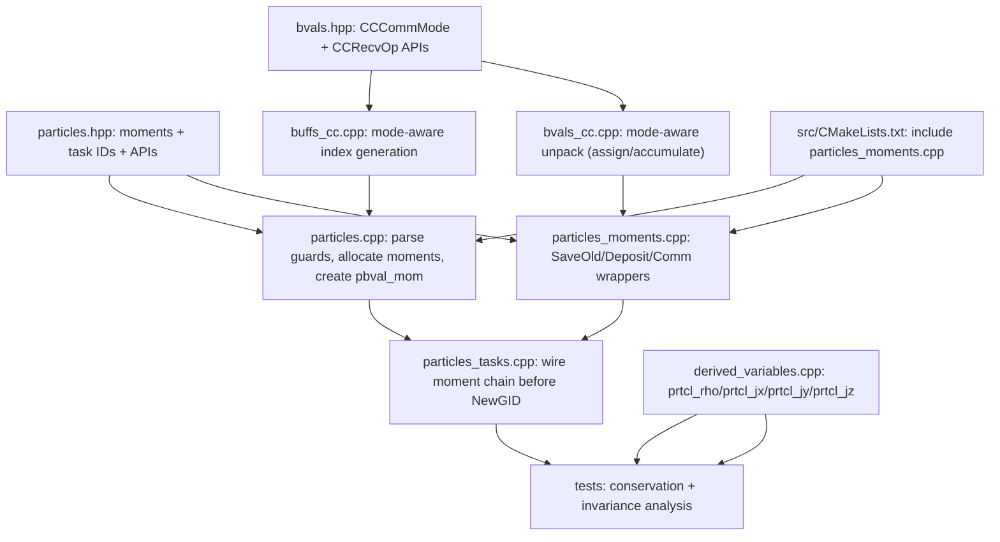

# AthenaK MHD-PIC Agent Handoff (AGENTS-Grounded)

This document is the working implementation contract for evolving AthenaK's
existing cosmic-ray particles into a PIC-capable particle-grid subsystem,
using `entity` as the reference implementation for charge/current deposition
and synchronization semantics.

## 1. Provenance and Scope

- Date: 2026-02-07
- AthenaK workspace: `/Users/dbf75/Work/Research/AthenaK/athenak-DF`
- Active branch context: `dev/PIC`
- Reference codebase: `/Users/dbf75/Work/Research/AthenaK/entity`
- Inputs reviewed for this revision:
  - All 26 AthenaK `AGENTS.md` files.
  - All 15 `entity` `AGENTS.md` files.
- This revision supersedes earlier drafts by explicitly encoding AGENTS-level
  constraints (task ordering, container/communication invariants, and test
  expectations) into the PIC migration plan.
- Companion implementation-style guide:
  `/Users/dbf75/Work/Research/AthenaK/athenak-DF/AGENT_PIC_IMPLEMENTATION_GUIDE.md`
  (copy/adapt-first workflow; root `AGENTS.md` still authoritative).

## 2. Non-Negotiable Constraints from AGENTS.md

### 2.1 AthenaK constraints that shape PIC work

1. Runtime ordering and ownership
- Driver order is fixed: `before_timeintegrator` -> per-stage
  `before_stagen/stagen/after_stagen` -> `after_timeintegrator`.
- `MeshBlockPack::AddCoordinates` must run before `AddPhysics`.
- Physics modules are created via input blocks in `MeshBlockPack::AddPhysics`.

2. Task system constraints
- `TaskList::InsertTask` has non-trivial dependency rewriting semantics.
- `NUMBER_TASKID_BITS = 64`; task-count growth must stay below this bound.
- Any complex reordering is safer with explicit dependency IDs than repeated
  late inserts.

3. Particle data and communication reality today
- Particles are stored as `(var, particle)` arrays in `prtcl_rdata` and
  `prtcl_idata`.
- `nidata` is fixed at 3 (`PGID`, `PTAG`, species/SN slot).
- Current CR pusher path is B-only Boris (`E=0`).
- Particle boundary communication is separate from cell-centered field
  communication and uses `PGID` + neighbor mapping.

4. Boundary-value subsystem constraints
- CC exchange index generation lives in `buffs_cc.cpp`; unpack behavior in
  `bvals_cc.cpp`.
- Existing CC exchange semantics are ghost-fill oriented by default.
- Any additive current synchronization mode must update both indexing and
  unpack operations, not just `+=` in unpack.

5. Mesh/AMR and physics coupling constraints
- AMR/refinement invariants are enforced at mesh level and by physics module
  post-refinement hooks.
- Shearing-box is incompatible with refinement and has custom boundary logic.
- Radiation has its own strict constraints (GR-only, no AMR).
- `punit` may be null if `<units>` is absent; any physical scaling path must
  guard this explicitly.

6. Test harness and I/O constraints
- Inputs used by regression scripts are expected under `inputs/`.
- New outputs/diagnostics must be wired through `src/outputs` conventions.

### 2.2 Entity constraints that define PIC parity targets

1. Engine ordering invariants
- SRPIC step order is explicit and must remain coherent:
  field comm/BC -> push -> deposit -> synchronize/communicate/filter current ->
  field update -> particle comm/injection.
- `entity` explicitly warns against moving particle communication ahead of
  deposition/filtering.

2. Deposit path invariants
- Current arrays are zeroed before deposit.
- Deposit uses old/new particle state and shape kernels.
- Scatter-add semantics are explicit (`ScatterView` + contribute).

3. Communication semantics
- `SynchronizeFields(J)` is additive and distinct from normal copy-like halo
  exchange modes.
- Additive vs non-additive field exchanges must preserve slice/index contracts.

4. Container invariants
- Particle capacity invariant: `npart <= maxnpart`.
- Particle tag/sortedness semantics are coupled to comm and cleanup logic.
- Field containers always include current/buffer components in PIC paths.

5. Compile/runtime guard expectations
- Deposition algorithm parameters and shape-order constraints are enforced.
- Feature guards (`MPI_ENABLED`, `OUTPUT_ENABLED`, etc.) must keep both branches
  buildable.

## 3. AthenaK <-> Entity PIC Mapping (Revised)

1. Step orchestration
- Entity engine pipeline maps to AthenaK task lists.
- Transitional placement for PR1 can remain in particle pre-stage lists, but
  final parity target is stage-level coupling around MHD update tasks.

2. Particle state needed for charge-conserving deposition
- Entity-style deposition depends on previous and current particle trajectory.
- AthenaK must add per-step old-position scratch storage in `particles::Particles`.

3. Grid moment ownership
- Entity `cur`/`buff` concept maps to AthenaK particle-owned moment arrays
  (`rho`, `jx`, `jy`, `jz`) plus optional coarse mirrors for future AMR support.

4. Current synchronization
- Entity additive synchronization maps to an AthenaK CC communication mode that
  is explicitly additive and uses synchronization-appropriate slices.

5. Field coupling
- Entity current source coupling maps to AthenaK `MHD::EFieldSrc` integration.

6. Particle migration
- Entity particle communication stage maps to AthenaK existing
  `ParticlesBoundaryValues` path and must remain after deposition in PIC mode.

## 4. Critical Gaps to Address Before Full PIC Coupling

1. Additive CC unpack alone is insufficient
- Without synchronize-mode index selection in `buffs_cc.cpp`, additive unpack
  can still be wrong for accumulated moments.

2. Charge/weight normalization policy is undefined for CR deposition
- Existing CR payload stores `q/m` (`IPM`) but deposition needs explicit charge
  weighting semantics.

3. AMR-safe moment handling is absent
- Restrict/prolong/sync behavior for deposited moments is not yet implemented.

4. Non-periodic boundary policy for deposited moments is undefined
- Physical BC behavior for `rho/J` must be defined before enabling broad use.

5. Restart coverage for particles/moments remains incomplete
- PIC-capable runs need restart fidelity for particles and deposited state.

6. Pre-existing defect worth fixing early
- `MeshRefinement::RefineParticles` appears to have a `PGID` update bug
  (`gids + m` vs expected `newm` usage in current branch context).

## 5. Phased Implementation Plan

### Phase 0 (PR1): deposition infrastructure, no MHD feedback

Goal:
- Add robust particle-to-cell deposition and additive synchronization
  infrastructure.
- Do not yet modify MHD evolution equations.

Runtime scope guard for first merge:
- `deposit_moments=true`
- `particle_type=cosmic_ray`
- strictly periodic boundaries only
- `multilevel=false`
- `adaptive=false`
- no shearing-box mode

Fail fast with clear error messages outside this envelope.

Phase-0 hard requirements:
1. Communication mode must be explicit
- Add a CC communication mode split (`ghost_fill` vs `synchronize`) at
  `MeshBoundaryValuesCC` construction time.
- Synchronize mode must drive index generation in `buffs_cc.cpp` and unpack
  behavior in `bvals_cc.cpp`.
- Existing hydro/mhd/radiation/z4c call sites must remain on default
  `ghost_fill` mode.

2. Receive operation must be explicit
- Add CC recv operation split (`assign` vs `accumulate`) and use
  `accumulate` for particle moments only.

3. Charge policy must be explicit for PR1
- Keep `IPM` as pusher `q/m`.
- For deposition, define `q_macro` from species charge and an explicit scalar:
  `q_macro = deposit_qscale * species_charge(PSP)`.
- Use `q_macro` in both `rho` and `J` deposition paths so tests are physically
  self-consistent.

4. Task chain must preserve current non-blocking communication pattern
- Keep clear order as `ClearRecv -> ClearSend` (matching existing particles
  communication ordering and avoiding request reuse ambiguity).

5. Observability must be deterministic
- Add dedicated derived-variable outputs for deposited moments:
  `prtcl_rho`, `prtcl_jx`, `prtcl_jy`, `prtcl_jz`.
- Tests must validate against these fields directly.

Deliverables:
1. Particle data model extensions
- Old-position scratch arrays (private to `particles::Particles`).
- Moment arrays for `rho/jx/jy/jz` (+ coarse mirror handle gated out by
  phase-0 runtime guard).

2. Moment task chain (post-push, pre-migration)
- `SaveOldPositions -> ZeroMoments -> InitRecvMoments -> DepositMoments ->
  SendMoments -> RecvMoments(accumulate) -> ClearRecvMoments ->
  ClearSendMoments`, then existing `NewGID` and particle migration chain.

3. Boundary communication extension
- Add explicit CC recv operation mode (`assign` vs `accumulate`).
- Add CC communication slice/index mode needed for synchronization semantics.
- Use a dedicated particle-moment CC boundary object configured for
  synchronize mode.

4. Deterministic observability
- Expose deposited moments via derived variables wired into mesh outputs.

5. Regression tests
- Serial conservation sanity test.
- MPI conservation sanity test.
- Domain-decomposition invariance test.
- Unsupported-mode guard tests.

### Phase 1 (PR2): couple deposited current into MHD update

Goal:
- Use deposited current in MHD update path while preserving phase-0 tests.

Deliverables:
1. Couple `J` into `MHD::EFieldSrc` (or equivalent stage-level source task).
2. Decide and implement momentum/energy feedback split point.
3. Move deposition scheduling from pre-integrator transitional path toward
   stage-level parity with MHD task flow.
4. Extend tests for coupled field evolution behavior.

### Phase 2 (PR3): robustness split into three small PRs

Goal:
- Remove phase-0 guardrails and support production configurations.

Deliverables:
1. PR3a: restart fidelity for coupled moment/edge-current state.
2. PR3b: AMR/multilevel-safe deposited-moment handling.
3. PR3c: non-periodic boundary policy for deposited moments/currents.
4. Keep each PR mergeable and correctness-gated on its own; do not combine
   these scopes into one patch.

## 6. File-Level Edit Plan (Phase 0)

1. `/Users/dbf75/Work/Research/AthenaK/athenak-DF/src/particles/particles.hpp`
- Add:
  - phase-0 knobs: `deposit_moments`, `deposit_order`, `deposit_qscale`
  - `ParticlesTaskIDs` extension for moment-task IDs
  - local moment component constants: `rho/jx/jy/jz`
  - moment storage (`DvceArray5D<Real>`) and old-position scratch arrays
  - dedicated CC boundary helper pointer for moments
  - task IDs and method declarations for moment workflow

2. `/Users/dbf75/Work/Research/AthenaK/athenak-DF/src/particles/particles.cpp`
- Parse deposition options and enforce phase-0 scope guard.
- Allocate/deallocate moment and scratch storage.
- Allocate/deallocate moment boundary helper in synchronize mode and initialize
  buffers with `nvar=4`.

3. `/Users/dbf75/Work/Research/AthenaK/athenak-DF/src/particles/particles_tasks.cpp`
- Wire the moment task chain between `Push` and `NewGID`.
- Preserve clear ordering as `ClearRecvMoments` then `ClearSendMoments`.

4. `/Users/dbf75/Work/Research/AthenaK/athenak-DF/src/particles/particles_moments.cpp` (new)
- Implement:
  - save-old wrappers
  - zero moments
  - local race-safe deposition (atomics or `ScatterView`)
  - moment communication wrappers (`InitRecv/Send/Recv/ClearRecv/ClearSend`)

5. `/Users/dbf75/Work/Research/AthenaK/athenak-DF/src/bvals/bvals.hpp`
- Add CC communication mode and recv op enums.
- Extend `MeshBoundaryValuesCC` constructor and recv API.

6. `/Users/dbf75/Work/Research/AthenaK/athenak-DF/src/bvals/bvals_cc.cpp`
- Store and use CC communication mode on object construction.
- Implement mode-dependent unpack (`assign`/`accumulate`).

7. `/Users/dbf75/Work/Research/AthenaK/athenak-DF/src/bvals/buffs_cc.cpp`
- Add synchronize-mode index generation for additive moment exchange.
- Ensure index/data-size consistency with `MeshBoundaryValues::InitRecv`.

8. `/Users/dbf75/Work/Research/AthenaK/athenak-DF/src/CMakeLists.txt`
- Register new particle moments source file.

9. `/Users/dbf75/Work/Research/AthenaK/athenak-DF/src/outputs/outputs.hpp`
- Add output choices: `prtcl_rho`, `prtcl_jx`, `prtcl_jy`, `prtcl_jz`.
- Update `NOUTPUT_CHOICES` accordingly.

10. `/Users/dbf75/Work/Research/AthenaK/athenak-DF/src/outputs/basetype_output.cpp`
- Register the four new derived output variables in `BaseTypeOutput`.
- Enforce runtime guard: these variables require `deposit_moments=true`.

11. `/Users/dbf75/Work/Research/AthenaK/athenak-DF/src/outputs/derived_variables.cpp`
- Add derived-variable compute paths for `prtcl_rho`, `prtcl_jx`, `prtcl_jy`,
  `prtcl_jz`, mapped to deposited moment arrays.

12. `/Users/dbf75/Work/Research/AthenaK/athenak-DF/inputs/tests/pic_deposit_conservation.athinput` (new)
- Minimal periodic input deck enabling deposited moment outputs.

13. `/Users/dbf75/Work/Research/AthenaK/athenak-DF/tst/scripts/particles/__init__.py` (new)
- Enable test discovery in particles test namespace.

14. `/Users/dbf75/Work/Research/AthenaK/athenak-DF/tst/scripts/particles/pic_deposit_conservation.py` (new)
- Validate global deposited charge/current invariants.

15. `/Users/dbf75/Work/Research/AthenaK/athenak-DF/tst/scripts/particles/pic_deposit_decomp_invariance.py` (new)
- Validate decomposition/rank invariance.

### 6.1 Concrete Method Signatures for PR1

`/Users/dbf75/Work/Research/AthenaK/athenak-DF/src/particles/particles.hpp`

```cpp
// Extend existing ParticlesTaskIDs struct (same location as push/newgid/etc.)
struct ParticlesTaskIDs {
  TaskID push, newgid, count, irecv, sendp, recvp, csend, crecv;
  TaskID save_old, zero_mom, irecv_mom, dep_mom, send_mom, recv_mom;
  TaskID crecv_mom, csend_mom;
};

// New/extended state
bool deposit_moments = false;
int deposit_order = 1;
Real deposit_qscale = 1.0;
static constexpr int NMOM = 4;
static constexpr int IMOM_RHO = 0;
static constexpr int IMOM_JX  = 1;
static constexpr int IMOM_JY  = 2;
static constexpr int IMOM_JZ  = 3;
DvceArray5D<Real> moments;
DvceArray5D<Real> coarse_moments;
DvceArray1D<Real> x1_old, x2_old, x3_old;
MeshBoundaryValuesCC *pbval_mom = nullptr;

TaskStatus SaveOldPositions(Driver *pdriver, int stage);
TaskStatus ZeroMoments(Driver *pdriver, int stage);
TaskStatus InitRecvMoments(Driver *pdriver, int stage);
TaskStatus DepositMoments(Driver *pdriver, int stage);
TaskStatus SendMoments(Driver *pdriver, int stage);
TaskStatus RecvMoments(Driver *pdriver, int stage);
TaskStatus ClearRecvMoments(Driver *pdriver, int stage);
TaskStatus ClearSendMoments(Driver *pdriver, int stage);
```

`/Users/dbf75/Work/Research/AthenaK/athenak-DF/src/bvals/bvals.hpp`

```cpp
enum class CCCommMode {ghost_fill, synchronize};
enum class CCRecvOp {assign, accumulate};

class MeshBoundaryValuesCC : public MeshBoundaryValues {
 public:
  MeshBoundaryValuesCC(MeshBlockPack *ppack, ParameterInput *pin, bool z4c,
                       CCCommMode mode = CCCommMode::ghost_fill);
  TaskStatus PackAndSendCC(DvceArray5D<Real> &a, DvceArray5D<Real> &ca);
  TaskStatus RecvAndUnpackCC(DvceArray5D<Real> &a, DvceArray5D<Real> &ca,
                             CCRecvOp op = CCRecvOp::assign);

 private:
  CCCommMode comm_mode_;
};
```

### 6.2 PR1 Dependency Graph



### 6.3 PR1 Task Ordering Graph


## 7. Acceptance Criteria and Test Matrix

Phase-0 must pass all of the following:

1. Serial periodic conservation
- Integrate `prtcl_rho` over volume and compare against
  `sum(q_macro)` within tolerance.

2. MPI periodic conservation
- Same charge invariant under rank-boundary crossings.
- Integrate `prtcl_jx/prtcl_jy/prtcl_jz` and compare against
  `sum(q_macro * v)` component-wise.

3. Decomposition invariance
- Same IC with different meshblock/rank decomposition yields matching global
  `rho/J` integrals to tolerance (not bitwise equality).

4. Crossing stress test
- High-velocity crossing of many boundaries preserves global charge/current.

5. Guard behavior
- Invalid configurations (`non-periodic`, `AMR`, `multilevel`, shearing-box)
  fail early with explicit messages when deposition is enabled.
- Invalid deposition config (`deposit_order` not supported in PR1) fails early.

Recommended validation commands:
- Build: `cmake -B build && cmake --build build -j8`
- Regression: `cd tst && python run_tests.py`
- C++ style: `cd tst/scripts/style && bash check_athena_cpp_style.sh`
- Python style: `flake8 tst/ vis/`

## 8. Immediate Execution Order for Coding Sessions

1. Implement CC communication extension first:
   `bvals.hpp` -> `buffs_cc.cpp` -> `bvals_cc.cpp`.
2. Add particles data model and boundary helper wiring:
   `particles.hpp` -> `particles.cpp`.
3. Implement deposition and wrappers in `particles_moments.cpp`.
4. Wire task DAG in `particles_tasks.cpp` with recv-before-send clear ordering.
5. Add output observability in output stack:
   `outputs.hpp` -> `basetype_output.cpp` -> `derived_variables.cpp`.
6. Add tests (`inputs/tests` + `tst/scripts/particles`) and verify guard paths.
7. Only then begin PR2 coupling into MHD source tasks.

## 9. Serial Continuation Plan (Current Mode)

Parallel worktrees/branches were retired. PR1 work now proceeds serially on:

- branch: `dev/PIC`
- path: `/Users/dbf75/Work/Research/AthenaK/athenak-DF`

Current merged state:

1. Interface freeze merged.
2. `WS-A` merged (CC synchronize communication core).
3. `WS-B` merged (particle scaffolding and runtime guards).
4. `WS-C` merged (deposition kernel/task DAG wiring).
5. `WS-D` merged (deposited-moment output observability).
6. `WS-E` merged (deterministic PIC regression tests and inputs).
7. `WS-F` merged (PR1 closeout validation hardening).

### 9.1 Step C (WS-C): Completed

Goal:
- implement deposition kernels and task DAG wiring, using A/B infrastructure.

Files for Step C:

1. `/Users/dbf75/Work/Research/AthenaK/athenak-DF/src/particles/particles_moments.cpp` (new)
2. `/Users/dbf75/Work/Research/AthenaK/athenak-DF/src/particles/particles_tasks.cpp`
3. `/Users/dbf75/Work/Research/AthenaK/athenak-DF/src/CMakeLists.txt`

Step C implementation checklist:

1. Add `particles_moments.cpp` with all methods declared in
   `/Users/dbf75/Work/Research/AthenaK/athenak-DF/src/particles/particles.hpp`:
   `SaveOldPositions`, `ZeroMoments`, `InitRecvMoments`, `DepositMoments`,
   `SendMoments`, `RecvMoments`, `ClearRecvMoments`, `ClearSendMoments`.

2. In `SaveOldPositions`, snapshot `IPX/IPY/IPZ` into `x1_old/x2_old/x3_old`
   for all active particles in `nprtcl_thispack`.

3. In `ZeroMoments`, zero all `NMOM` components of `moments` with Kokkos kernel.

4. In `DepositMoments`, implement race-safe local deposition:
   - adapt from AthenaK atomic accumulation pattern used by `prtcl_d` in
     `/Users/dbf75/Work/Research/AthenaK/athenak-DF/src/outputs/derived_variables.cpp`
   - mirror Entity old/new trajectory semantics as much as PR1 scope allows
   - use explicit `q_macro = deposit_qscale * species_charge(PSP)`
   - write to local moment component indices (`IMOM_RHO`, `IMOM_JX`, `IMOM_JY`,
     `IMOM_JZ`).

5. In moment communication wrappers:
   - `InitRecvMoments` -> `pbval_mom->InitRecv(NMOM)`
   - `SendMoments` -> `pbval_mom->PackAndSendCC(moments, coarse_moments)`
   - `RecvMoments` -> `pbval_mom->RecvAndUnpackCC(moments, coarse_moments,
     CCRecvOp::accumulate)`
   - `ClearRecvMoments` -> `pbval_mom->ClearRecv()`
   - `ClearSendMoments` -> `pbval_mom->ClearSend()`

6. In `particles_tasks.cpp`, insert moment chain between `Push` and `NewGID`:
   `SaveOldPositions -> Push -> ZeroMoments -> InitRecvMoments -> DepositMoments
   -> SendMoments -> RecvMoments -> ClearRecvMoments -> ClearSendMoments -> NewGID`.

7. In `src/CMakeLists.txt`, register new source:
   `/Users/dbf75/Work/Research/AthenaK/athenak-DF/src/particles/particles_moments.cpp`.

8. Keep defaults unchanged when `deposit_moments=false`.

### 9.2 Step C Validation Commands

Run after Step C edits:

1. `cmake -S /Users/dbf75/Work/Research/AthenaK/athenak-DF -B /Users/dbf75/Work/Research/AthenaK/athenak-DF/build`
2. `cmake --build /Users/dbf75/Work/Research/AthenaK/athenak-DF/build -j8`

### 9.3 Step D (WS-D): Execute Next

Goal:
- expose deposited particle moments as deterministic mesh output variables:
  `prtcl_rho`, `prtcl_jx`, `prtcl_jy`, `prtcl_jz`.

Files for Step D:

1. `/Users/dbf75/Work/Research/AthenaK/athenak-DF/src/outputs/outputs.hpp`
2. `/Users/dbf75/Work/Research/AthenaK/athenak-DF/src/outputs/basetype_output.cpp`
3. `/Users/dbf75/Work/Research/AthenaK/athenak-DF/src/outputs/derived_variables.cpp`

Step D implementation checklist:

1. In `outputs.hpp`, append four new choices in `var_choice`:
   `prtcl_rho`, `prtcl_jx`, `prtcl_jy`, `prtcl_jz`.
2. Increase `NOUTPUT_CHOICES` by 4 to match the expanded list.
3. In `basetype_output.cpp`, add registration blocks mirroring `prtcl_d`:
   each of the four names must set `contains_derived=true`, increment
   `n_derived` by 1, and append one `outvars.emplace_back(...)`.
4. Use stable labels in `outvars` matching variable semantics:
   `prtcl_rho`, `prtcl_jx`, `prtcl_jy`, `prtcl_jz`.
5. Add constructor-time guard in `basetype_output.cpp`:
   if one of these four variables is requested and
   `pm->pmb_pack->ppart->deposit_moments == false`, fail with explicit message.
6. In `derived_variables.cpp`, add four compute branches in
   `ComputeDerivedVariable()` that map each name to one component of
   `pm->pmb_pack->ppart->moments`:
   `Particles::IMOM_RHO`, `Particles::IMOM_JX`, `Particles::IMOM_JY`,
   `Particles::IMOM_JZ`.
7. Match existing AthenaK derived-variable pattern:
   - ensure `derived_var` capacity
   - write active zones only (`ks:ke`, `js:je`, `is:ie`)
   - increment `i_dv` once per scalar output.
8. Do not modify existing `prtcl_d` behavior; keep it as particle-count binning.
9. Keep all non-particle outputs behavior-identical.

### 9.4 Step D Validation Commands

Run after Step D edits:

1. `cmake -S /Users/dbf75/Work/Research/AthenaK/athenak-DF -B /Users/dbf75/Work/Research/AthenaK/athenak-DF/build`
2. `cmake --build /Users/dbf75/Work/Research/AthenaK/athenak-DF/build -j8`
3. Parse-only check for new variable acceptance:
   `/Users/dbf75/Work/Research/AthenaK/athenak-DF/build/src/athena -n -i /Users/dbf75/Work/Research/AthenaK/athenak-DF/inputs/tests/linear_wave_hydro.athinput output1/file_type=vtk output1/variable=prtcl_rho`
4. Runtime guard check (`deposit_moments=false` + `prtcl_rho`) should fail
   with clear message.
5. Runtime smoke (`deposit_moments=true` + `prtcl_rho`/`prtcl_j*`) should run.

### 9.5 Step E (WS-E): Execute Next

Goal:
- add deterministic regression coverage and a stable input deck for PR1
  deposited-moment observability and invariants.

Files for Step E:

1. `/Users/dbf75/Work/Research/AthenaK/athenak-DF/inputs/tests/pic_deposit_conservation.athinput` (new)
2. `/Users/dbf75/Work/Research/AthenaK/athenak-DF/tst/scripts/particles/__init__.py` (new)
3. `/Users/dbf75/Work/Research/AthenaK/athenak-DF/tst/scripts/particles/pic_deposit_conservation.py` (new)
4. `/Users/dbf75/Work/Research/AthenaK/athenak-DF/tst/scripts/particles/pic_decomp_invariance.py` (new)

Step E implementation checklist:

1. Input deck must stay inside PR1 runtime envelope:
   - `particle_type=cosmic_ray`
   - `deposit_moments=true`
   - `deposit_order=1`
   - strictly periodic boundaries
   - no AMR/multilevel/shearing-box
2. Use a built-in problem generator (`pgen_name=linear_wave`) so tests do not
   depend on user-problem compile flags.
3. Configure mesh output variables needed for analysis:
   `prtcl_rho`, `prtcl_jx`, `prtcl_jy`, `prtcl_jz`, and `prtcl_d`.
4. Prefer `file_type=bin` for test observability and parse outputs with
   `/Users/dbf75/Work/Research/AthenaK/athenak-DF/vis/python/bin_convert_new.py`
   in the analysis scripts.
5. In `pic_deposit_conservation.py`, run:
   - a serial case (`nproc=1`)
   - an MPI case (`nproc=2`) for true communication-path coverage
6. In `pic_deposit_conservation.py` analysis, compute global volume integrals:
   - `Q = \int prtcl_rho dV`
   - `Jx/Jy/Jz = \int prtcl_j* dV`
   and compare against expected deposited totals from the configured particle
   charge and velocity initialization.
7. In `pic_decomp_invariance.py`, run at least two decomposition variants for
   the same physics setup and compare global `Q/J` integrals within tolerance.
8. Include explicit negative checks for guard behavior:
   - `deposit_moments=false` + `prtcl_rho` output request fails
   - unsupported deposition order fails
   - non-periodic boundaries with deposition fail
9. Keep pass/fail criteria strict and deterministic:
   - all checks are scalar integral comparisons
   - log measured values and absolute/relative errors in analysis output
10. Keep Step E scope to tests and test inputs only (no PR2 coupling edits).

### 9.6 Step E Validation Commands

Run after Step E edits:

1. MPI-enabled targeted conservation test:
   `cd /Users/dbf75/Work/Research/AthenaK/athenak-DF/tst && python run_tests.py particles/pic_deposit_conservation --cmake=-DAthena_ENABLE_MPI=ON --cmake=-DCMAKE_CXX_COMPILER=/opt/homebrew/bin/mpicxx`
2. MPI-enabled decomposition invariance test:
   `cd /Users/dbf75/Work/Research/AthenaK/athenak-DF/tst && python run_tests.py particles/pic_decomp_invariance --cmake=-DAthena_ENABLE_MPI=ON --cmake=-DCMAKE_CXX_COMPILER=/opt/homebrew/bin/mpicxx`
3. Package-level particle regression run:
   `cd /Users/dbf75/Work/Research/AthenaK/athenak-DF/tst && python run_tests.py particles --cmake=-DAthena_ENABLE_MPI=ON --cmake=-DCMAKE_CXX_COMPILER=/opt/homebrew/bin/mpicxx`
4. Full PR1 matrix/stability pass:
   `cd /Users/dbf75/Work/Research/AthenaK/athenak-DF/tst && python run_tests.py --cmake=-DAthena_ENABLE_MPI=ON --cmake=-DCMAKE_CXX_COMPILER=/opt/homebrew/bin/mpicxx`

### 9.7 Step F (WS-F): PR1 Closeout and Merge Readiness

Goal:
- finalize PR1 with reproducible validation evidence from A/B/C/D/E, without
  expanding runtime scope or introducing PR2 coupling.

Step F implementation checklist:

1. Re-run WS-E targeted regression scripts on an MPI-enabled build to confirm
   deterministic conservation/decomposition behavior still passes.
2. Re-run the full `particles` regression package with MPI enabled.
3. Re-run one non-MPI sanity check for deposited-moment observability and guard
   behavior so serial-only environments still have clear pass/fail semantics.
4. Run changed-file style/lint gates so PR1 is not blocked by unrelated
   repository-wide style debt, and fix only issues introduced by PIC PR1:
   - `tst/scripts/style/check_athena_cpp_style_changed.sh`
   - `tst/scripts/style/check_python_style_changed.sh`
5. Capture key diagnostics for closeout:
   - measured global `Q/Jx/Jy/Jz` values from conservation analysis
   - absolute/relative error metrics used for pass/fail
   - explicit evidence that negative guard checks still fail as intended
6. Verify scope lock:
   - no edits to MHD source-coupling paths
   - no AMR/restart/non-periodic extension work folded into PR1
7. Prepare the PR1 closeout summary:
   - completed steps A/B/C/D/E/F
   - commands executed and outcomes
   - known residual risks carried into PR2/PR3.

### 9.8 Step F Validation Commands

Run after Step F edits (or during Step F revalidation):

1. MPI-enabled targeted conservation test:
   `cd /Users/dbf75/Work/Research/AthenaK/athenak-DF/tst && python run_tests.py particles/pic_deposit_conservation --cmake=-DAthena_ENABLE_MPI=ON --cmake=-DCMAKE_CXX_COMPILER=/opt/homebrew/bin/mpicxx`
2. MPI-enabled decomposition invariance test:
   `cd /Users/dbf75/Work/Research/AthenaK/athenak-DF/tst && python run_tests.py particles/pic_decomp_invariance --cmake=-DAthena_ENABLE_MPI=ON --cmake=-DCMAKE_CXX_COMPILER=/opt/homebrew/bin/mpicxx`
3. Package-level particle regression run:
   `cd /Users/dbf75/Work/Research/AthenaK/athenak-DF/tst && python run_tests.py particles --cmake=-DAthena_ENABLE_MPI=ON --cmake=-DCMAKE_CXX_COMPILER=/opt/homebrew/bin/mpicxx`
4. Non-MPI guard/observability sanity run:
   `cd /Users/dbf75/Work/Research/AthenaK/athenak-DF/tst && python run_tests.py particles/pic_deposit_conservation`
5. C++ style gate (changed-file scope):
   `cd /Users/dbf75/Work/Research/AthenaK/athenak-DF && bash tst/scripts/style/check_athena_cpp_style_changed.sh`
6. Python style gate (changed-file scope):
   `cd /Users/dbf75/Work/Research/AthenaK/athenak-DF && bash tst/scripts/style/check_python_style_changed.sh`

### 9.9 Step G (WS-G, PR2): Execute Next

Goal:
- implement Phase-1 coupling by feeding deposited particle current into the MHD
  edge-centered electric-field source path, while preserving PR1 defaults and
  tests.

Files for Step G:

1. `/Users/dbf75/Work/Research/AthenaK/athenak-DF/src/particles/particles.hpp`
2. `/Users/dbf75/Work/Research/AthenaK/athenak-DF/src/particles/particles.cpp`
3. `/Users/dbf75/Work/Research/AthenaK/athenak-DF/src/particles/particles_tasks.cpp`
4. `/Users/dbf75/Work/Research/AthenaK/athenak-DF/src/particles/particles_moments.cpp`
5. `/Users/dbf75/Work/Research/AthenaK/athenak-DF/src/mhd/mhd_tasks.cpp`
6. `/Users/dbf75/Work/Research/AthenaK/athenak-DF/inputs/tests/pic_mhd_current_coupling.athinput` (new)
7. `/Users/dbf75/Work/Research/AthenaK/athenak-DF/tst/scripts/particles/pic_mhd_current_coupling.py` (new)
8. `/Users/dbf75/Work/Research/AthenaK/athenak-DF/tst/scripts/particles/pic_mhd_coupling_decomp.py` (new)

Step G implementation checklist:

1. Add explicit runtime knob `particles/couple_moments_to_mhd` (default `false`)
   so PR1 behavior remains unchanged unless coupling is requested.
2. Guard coupling mode strictly:
   - require `deposit_moments=true`
   - require `<mhd>` active
   - fail fast for unsupported composed paths in PR2 scope
     (notably radiation+MHD and ion-neutral paths).
3. Add deterministic CR velocity initialization knobs for tests:
   `particles/cr_vx0`, `particles/cr_vy0`, `particles/cr_vz0`
   (defaults `0.0`) so PR1 observability tests remain unchanged by default.
4. Keep particle push/migration semantics unchanged in
   `before_timeintegrator`; do not alter existing communication clear ordering.
5. Move moment deposition scheduling toward stage parity when coupling is
   enabled:
   - insert moment workflow tasks into `stagen` immediately before
     `MHD::EFieldSrc` using existing `TaskList::InsertTask` pattern
   - preserve deterministic execution by running deposited-moment wrappers on
     stage 1 only in PR2.
6. In `MHD::EFieldSrc`, add particle-current contribution from
   `ppart->moments(IMOM_JX/IMOM_JY/IMOM_JZ)` to `efld`, following existing
   edge-field additive conventions (same style as Ohmic addition).
7. Preserve existing shearing-box source behavior in `EFieldSrc`; particle
   coupling must be additive and not replace existing terms.
8. Keep PR2 split explicit:
   - include only E-field coupling in Step G
   - do not add fluid momentum/energy feedback source updates yet.
9. Add PR2 coupling tests/inputs:
   - one deterministic conservation/coupling-effect test covering serial + MPI
   - one decomposition-invariance test with MPI coverage.
10. Extend negative checks for coupling guard paths:
    - coupling requested with `deposit_moments=false` fails clearly
    - coupling requested in unsupported module composition fails clearly.
11. Keep Step G scope locked to PR2 current-to-E coupling and tests only.
    Do not include PR3 AMR/restart/non-periodic expansion work.

### 9.10 Step G Validation Commands

Run after Step G edits:

1. MPI-enabled PR2 coupling test:
   `cd /Users/dbf75/Work/Research/AthenaK/athenak-DF/tst && python run_tests.py particles/pic_mhd_current_coupling --cmake=-DAthena_ENABLE_MPI=ON --cmake=-DCMAKE_CXX_COMPILER=/opt/homebrew/bin/mpicxx`
2. MPI-enabled PR2 decomposition invariance test:
   `cd /Users/dbf75/Work/Research/AthenaK/athenak-DF/tst && python run_tests.py particles/pic_mhd_coupling_decomp --cmake=-DAthena_ENABLE_MPI=ON --cmake=-DCMAKE_CXX_COMPILER=/opt/homebrew/bin/mpicxx`
3. Re-run existing PR1 particle package with MPI enabled:
   `cd /Users/dbf75/Work/Research/AthenaK/athenak-DF/tst && python run_tests.py particles --cmake=-DAthena_ENABLE_MPI=ON --cmake=-DCMAKE_CXX_COMPILER=/opt/homebrew/bin/mpicxx`
4. Non-MPI sanity path for PR2 coupling test:
   `cd /Users/dbf75/Work/Research/AthenaK/athenak-DF/tst && python run_tests.py particles/pic_mhd_current_coupling`
5. C++ style gate (changed-file scope):
   `cd /Users/dbf75/Work/Research/AthenaK/athenak-DF && bash tst/scripts/style/check_athena_cpp_style_changed.sh`
6. Python style gate (changed-file scope):
   `cd /Users/dbf75/Work/Research/AthenaK/athenak-DF && bash tst/scripts/style/check_python_style_changed.sh`

### 9.11 Next Serial Step After G

1. If Step G passes cleanly, proceed to PR2 Step H for momentum/energy feedback
   split-point implementation and coupled-fluid regression extensions.

### 9.12 WS-G Post-Review Decision Record (2026-02-06)

This section records unresolved WS-G technical debt and the selected direction
for follow-up work. It is intentionally explicit so later agents do not need to
reconstruct context.

Open findings with exact references:

1. Coupling coefficient/normalization is currently implicit unit coupling.
- AthenaK currently applies raw deposited current directly into `efld`:
  `/Users/dbf75/Work/Research/AthenaK/athenak-DF/src/mhd/mhd_tasks.cpp:374`
  through
  `/Users/dbf75/Work/Research/AthenaK/athenak-DF/src/mhd/mhd_tasks.cpp:415`.
- No explicit WS-G current-to-E coefficient exists in particles runtime knobs:
  `/Users/dbf75/Work/Research/AthenaK/athenak-DF/src/particles/particles.hpp:90`
  through
  `/Users/dbf75/Work/Research/AthenaK/athenak-DF/src/particles/particles.hpp:96`,
  and
  `/Users/dbf75/Work/Research/AthenaK/athenak-DF/src/particles/particles.cpp:168`
  through
  `/Users/dbf75/Work/Research/AthenaK/athenak-DF/src/particles/particles.cpp:176`.
- Entity reference path applies explicit coefficient/normalization in current
  Ampere coupling:
  `/Users/dbf75/Work/Research/AthenaK/entity/src/engines/srpic.hpp:563`
  through
  `/Users/dbf75/Work/Research/AthenaK/entity/src/engines/srpic.hpp:612`,
  and
  `/Users/dbf75/Work/Research/AthenaK/entity/src/kernels/ampere_sr.hpp:132`
  through
  `/Users/dbf75/Work/Research/AthenaK/entity/src/kernels/ampere_sr.hpp:203`.

2. PR2 ordering is a transitional divergence from Entity pipeline ordering.
- AthenaK keeps particle migration in `before_timeintegrator`:
  `/Users/dbf75/Work/Research/AthenaK/athenak-DF/src/particles/particles_tasks.cpp:33`
  through
  `/Users/dbf75/Work/Research/AthenaK/athenak-DF/src/particles/particles_tasks.cpp:58`.
- Coupled deposition wrappers are additionally inserted in `stagen` before
  `MHD::EFieldSrc`:
  `/Users/dbf75/Work/Research/AthenaK/athenak-DF/src/particles/particles_tasks.cpp:82`
  through
  `/Users/dbf75/Work/Research/AthenaK/athenak-DF/src/particles/particles_tasks.cpp:97`,
  with stage gating in
  `/Users/dbf75/Work/Research/AthenaK/athenak-DF/src/particles/particles_moments.cpp:17`
  through
  `/Users/dbf75/Work/Research/AthenaK/athenak-DF/src/particles/particles_moments.cpp:24`.
- Entity ordering requirement keeps particle comm after deposit/filter:
  `/Users/dbf75/Work/Research/AthenaK/entity/src/engines/srpic.hpp:114`
  through
  `/Users/dbf75/Work/Research/AthenaK/entity/src/engines/srpic.hpp:133`,
  and guidance:
  `/Users/dbf75/Work/Research/AthenaK/entity/src/engines/AGENTS.md:210`
  through
  `/Users/dbf75/Work/Research/AthenaK/entity/src/engines/AGENTS.md:213`.

3. `InsertTask` chain checks are not per-insertion.
- WS-G chain validates first insertion and final state, but not each inserted
  task:
  `/Users/dbf75/Work/Research/AthenaK/athenak-DF/src/particles/particles_tasks.cpp:82`
  through
  `/Users/dbf75/Work/Research/AthenaK/athenak-DF/src/particles/particles_tasks.cpp:103`.
- `TaskList::InsertTask` explicitly returns `TaskID(0)` on failure:
  `/Users/dbf75/Work/Research/AthenaK/athenak-DF/src/tasklist/task_list.hpp:199`
  through
  `/Users/dbf75/Work/Research/AthenaK/athenak-DF/src/tasklist/task_list.hpp:220`.

4. WS-G guard tests do not cover all new fatal branches.
- Guard branches exist for `radiation`, `ion-neutral/hydro`, and `adm/z4c`:
  `/Users/dbf75/Work/Research/AthenaK/athenak-DF/src/particles/particles.cpp:235`
  through
  `/Users/dbf75/Work/Research/AthenaK/athenak-DF/src/particles/particles.cpp:255`.
- Existing WS-G negative tests only exercise `deposit_moments=false` and missing
  `<mhd>`:
  `/Users/dbf75/Work/Research/AthenaK/athenak-DF/tst/scripts/particles/pic_mhd_current_coupling.py:243`
  through
  `/Users/dbf75/Work/Research/AthenaK/athenak-DF/tst/scripts/particles/pic_mhd_current_coupling.py:260`.

Selected decisions:

1. Add an explicit current-to-E coupling coefficient now (default `1.0`).
- Rationale: closest to Entity’s explicit coefficient path, while preserving
  existing WS-G behavior with default settings.

2. Keep WS-G transitional ordering in PR2, and defer full ordering parity.
- Rationale: aligns with current PR2 scope lock (current-to-E only) and avoids
  broad particle-communication pipeline rework in this patch set.

3. Require expanded negative and determinism tests in the next WS-G follow-up.
- Rationale: keeps runtime guards trustworthy and makes ordering/scaling changes
  safe to iterate.

### 9.13 WS-G Remediation Plan (Detailed, Deferred Patch Queue)

Execution order is mandatory; each step is scoped to one logical change group.

1. Step G.1: explicit coupling coefficient in runtime/config plumbing.
- Files:
  `/Users/dbf75/Work/Research/AthenaK/athenak-DF/src/particles/particles.hpp`,
  `/Users/dbf75/Work/Research/AthenaK/athenak-DF/src/particles/particles.cpp`,
  `/Users/dbf75/Work/Research/AthenaK/athenak-DF/src/mhd/mhd_tasks.cpp`.
- Add `particles/couple_j_to_efield_coeff` (or equivalent explicit name),
  default `1.0`.
- Apply multiplicatively in `MHD::EFieldSrc` only when
  `couple_moments_to_mhd=true`.
- Preserve additive shearing-box behavior and all PR1 defaults.
- Validation:
  confirm existing WS-G tests still pass unchanged with coefficient `1.0`.

2. Step G.2: harden `InsertTask` chain failure handling.
- File:
  `/Users/dbf75/Work/Research/AthenaK/athenak-DF/src/particles/particles_tasks.cpp`.
- After every `InsertTask` in the WS-G inserted chain, fail immediately with a
  precise task name in the error message if returned ID is `TaskID(0)`.
- Validation:
  build-only sanity plus WS-G test run to ensure no DAG regressions.

3. Step G.3: complete WS-G negative guard coverage.
- File:
  `/Users/dbf75/Work/Research/AthenaK/athenak-DF/tst/scripts/particles/pic_mhd_current_coupling.py`.
- Add explicit negative cases for:
  `radiation+MHD`, `adm/z4c`, and `ion-neutral/hydro` unsupported paths.
- Use deterministic `time/nlim=0` guard probes and assert specific fatal
  message substrings from each branch.
- Validation:
  WS-G coupling test must report all expected negative checks and exact count.

4. Step G.4: add determinism/linearity tests that should have been in WS-G.
- New files:
  `/Users/dbf75/Work/Research/AthenaK/athenak-DF/tst/scripts/particles/pic_mhd_coupling_linearity.py`
  (or equivalent), plus optional dedicated input if needed.
- Minimum checks:
  coupled=true with `cr_v*=0` yields no measurable B-field delta vs uncoupled;
  doubling `cr_v*` doubles measured integrated `J*` and increases field response
  consistently; optional `deposit_qscale` sweep enforces same linear trend.
- Validation:
  run serial and MPI variants with strict scalar tolerances.

5. Step G.5: integrator coverage sanity for coupled mode.
- Reuse
  `/Users/dbf75/Work/Research/AthenaK/athenak-DF/inputs/tests/pic_mhd_current_coupling.athinput`
  with runtime overrides for `time/integrator={rk1,rk2,rk3}`.
- Validate no crash, deterministic `Q/J` invariants, and non-zero coupled-field
  delta for non-zero `cr_v*`.
- This is intended as regression hardening, not a physics-accuracy claim.

6. Step H candidate (deferred): ordering parity with Entity.
- Move particle migration communication so coupled pipeline respects:
  push -> deposit -> synchronize/filter -> field update -> particle comm.
- This is explicitly deferred until PR2 Step H because it touches scheduling
  beyond WS-G current-to-E coupling.
- Precondition: G.1 through G.5 merged and stable.

Definition of done for the remediation queue:

1. All WS-G and PR1 particle tests pass in serial and MPI.
2. New negative tests cover every WS-G fatal-guard branch.
3. Coupling coefficient defaults preserve current behavior.
4. Documentation and error messages explicitly describe remaining deferred
   ordering parity work.

### 9.14 WS-G Partial-Address Notes (Historical, Post-Patch)

This section is a concise state snapshot after implementing the WS-G follow-up
items from Section 9.13.

1. Fully addressed in this patch set:
- explicit `particles/couple_j_to_efield_coeff` runtime knob (default `1.0`)
  was added and applied multiplicatively in `MHD::EFieldSrc`
- stage insertion chain now checks every `InsertTask` return value with
  task-specific fatal messages
- WS-G tests now include explicit negative checks for radiation+MHD and
  numerical-relativity compositions
- WS-G tests now include zero-current invariance, linearity, and integrator
  coverage checks.

2. Intentionally partial/deferred at WS-G time:
- Entity staggered-current representation/conversion parity is still not fully
  implemented in AthenaK WS-G; PR2 currently uses cell-centered deposited `J`
  mapped additively into edge `E` with an explicit coefficient.
- Full Entity ordering parity (deposit/filter before particle communication) is
  still deferred to Step H as documented in Section 9.13 item 6.

3. Historical note:
- This section records WS-G state only. Current as-built status after WS-H/WS-I
  is captured in Section 9.17.

### 9.15 WS-H Status Snapshot (Historical, PR2 Step H)

This section captures WS-H scope implemented after WS-G lock-ins.

1. Added opt-in fluid feedback split controls:
- `particles/couple_moments_momentum_to_mhd` (default `false`)
- `particles/couple_moments_energy_to_mhd` (default `false`)
- `particles/couple_moments_momentum_coeff` (default `1.0`)
- `particles/couple_moments_energy_coeff` (default `1.0`)

2. Coupled ordering moved toward Entity without changing defaults:
- For coupled mode only, particle migration/communication now runs in
  `after_timeintegrator` so it executes after stage-level field updates.
- Uncoupled/default task ordering is unchanged.

3. Added fluid source feedback path in MHD:
- Momentum feedback uses deposited current and `bcc0` (`JxB` form) and is
  applied in `MHD::MHDSrcTerms` when momentum feedback is enabled.
- Energy feedback is independently opt-in and applied in the same source path.

4. Added WS-H guardrails:
- fluid feedback requires `couple_moments_to_mhd=true`
- energy feedback requires ideal MHD EOS
- fluid feedback path is guarded to non-relativistic MHD composition in PR2.

5. Still deferred after WS-H:
- full Entity staggered-current representation/conversion parity
- PR3 scope (AMR/restart/non-periodic deposition support).

### 9.16 PR2 Step I Lock-In (Staggered Representation Parity Slice)

Scope lock for this step:

1. Runtime compatibility contract
- New behavior is opt-in only through
  `<particles>/couple_j_to_efield_representation`.
- Default remains `cell_centered`; existing WS-G/WS-H defaults are unchanged.
- `edge_staggered` only affects coupled E-field source updates and does not alter
  uncoupled/default runs.

2. Implementation boundary
- No PR3 expansion in this step (no AMR, restart, or non-periodic support work).
- No rework of existing fluid momentum/energy feedback split semantics.
- Keep current PR2 coefficient path (`couple_j_to_efield_coeff`) unchanged.

3. Parity goal for this step
- Add deterministic cell-centered to edge-current conversion for coupled mode.
- Wire conversion immediately before `MHD::EFieldSrc`.
- Keep full Entity charge-conserving staggered deposition as deferred follow-up.

### 9.17 PR2 As-Built Audit (2026-02-07, commit `cdcac9e5`)

This section audits actual code state and test coverage after WS-G/WS-H/WS-I.

1. Runtime coupling controls and guardrails are in place.
- `couple_moments_to_mhd`, `couple_j_to_efield_coeff`,
  `couple_j_to_efield_representation`, `couple_fluid_feedback_order`,
  momentum/energy feedback knobs, and deterministic CR init knobs:
  `/Users/dbf75/Work/Research/AthenaK/athenak-DF/src/particles/particles.cpp:168`
  through
  `/Users/dbf75/Work/Research/AthenaK/athenak-DF/src/particles/particles.cpp:216`.
- PR1+PR2 composition/runtime guards:
  `/Users/dbf75/Work/Research/AthenaK/athenak-DF/src/particles/particles.cpp:218`
  through
  `/Users/dbf75/Work/Research/AthenaK/athenak-DF/src/particles/particles.cpp:332`.
- Edge-current arrays allocated only when needed:
  `/Users/dbf75/Work/Research/AthenaK/athenak-DF/src/particles/particles.cpp:355`
  through
  `/Users/dbf75/Work/Research/AthenaK/athenak-DF/src/particles/particles.cpp:364`.

2. Coupled ordering and insertion are implemented with deterministic dependencies.
- Coupled particle migration moves to `after_timeintegrator`:
  `/Users/dbf75/Work/Research/AthenaK/athenak-DF/src/particles/particles_tasks.cpp:52`
  through
  `/Users/dbf75/Work/Research/AthenaK/athenak-DF/src/particles/particles_tasks.cpp:63`.
- Insertion anchor follows fluid-feedback order:
  `/Users/dbf75/Work/Research/AthenaK/athenak-DF/src/particles/particles_tasks.cpp:76`
  through
  `/Users/dbf75/Work/Research/AthenaK/athenak-DF/src/particles/particles_tasks.cpp:85`.
- Full `InsertTask` chain has per-step failure checks:
  `/Users/dbf75/Work/Research/AthenaK/athenak-DF/src/particles/particles_tasks.cpp:93`
  through
  `/Users/dbf75/Work/Research/AthenaK/athenak-DF/src/particles/particles_tasks.cpp:156`.
- Edge conversion is inserted before `EFieldSrc` and depends on both
  `CornerE` and wrapper completion:
  `/Users/dbf75/Work/Research/AthenaK/athenak-DF/src/particles/particles_tasks.cpp:158`
  through
  `/Users/dbf75/Work/Research/AthenaK/athenak-DF/src/particles/particles_tasks.cpp:180`.

3. Stage gating and conversion kernels are implemented.
- Stage gating rule (`stage==1` when coupled):
  `/Users/dbf75/Work/Research/AthenaK/athenak-DF/src/particles/particles_moments.cpp:16`
  through
  `/Users/dbf75/Work/Research/AthenaK/athenak-DF/src/particles/particles_moments.cpp:25`.
- Edge-current zeroing follows moment zero lifecycle:
  `/Users/dbf75/Work/Research/AthenaK/athenak-DF/src/particles/particles_moments.cpp:73`
  through
  `/Users/dbf75/Work/Research/AthenaK/athenak-DF/src/particles/particles_moments.cpp:83`.
- Deterministic CC->edge conversion is present in 1D/2D/3D paths:
  `/Users/dbf75/Work/Research/AthenaK/athenak-DF/src/particles/particles_moments.cpp:239`
  through
  `/Users/dbf75/Work/Research/AthenaK/athenak-DF/src/particles/particles_moments.cpp:329`.

4. MHD coupling paths are implemented and split by runtime order.
- Momentum/energy feedback in `MHDSrcTerms` when order is `mhd_src_terms`:
  `/Users/dbf75/Work/Research/AthenaK/athenak-DF/src/mhd/mhd_tasks.cpp:275`
  through
  `/Users/dbf75/Work/Research/AthenaK/athenak-DF/src/mhd/mhd_tasks.cpp:326`.
- E-field source coupling with representation branch and coefficient:
  `/Users/dbf75/Work/Research/AthenaK/athenak-DF/src/mhd/mhd_tasks.cpp:427`
  through
  `/Users/dbf75/Work/Research/AthenaK/athenak-DF/src/mhd/mhd_tasks.cpp:513`.
- Feedback execution in `EFieldSrc` when order is `efield_src`:
  `/Users/dbf75/Work/Research/AthenaK/athenak-DF/src/mhd/mhd_tasks.cpp:515`
  through
  `/Users/dbf75/Work/Research/AthenaK/athenak-DF/src/mhd/mhd_tasks.cpp:566`.

5. PR2 regression coverage is broad and deterministic.
- Main coupled regression spans default/opt-in, both representations,
  momentum/energy toggles, both feedback orders, guard negatives, and
  linearity/integrator checks:
  `/Users/dbf75/Work/Research/AthenaK/athenak-DF/tst/scripts/particles/pic_mhd_current_coupling.py:235`
  through
  `/Users/dbf75/Work/Research/AthenaK/athenak-DF/tst/scripts/particles/pic_mhd_current_coupling.py:760`.
- Decomposition invariance sweeps both representation and order:
  `/Users/dbf75/Work/Research/AthenaK/athenak-DF/tst/scripts/particles/pic_mhd_coupling_decomp.py:245`
  through
  `/Users/dbf75/Work/Research/AthenaK/athenak-DF/tst/scripts/particles/pic_mhd_coupling_decomp.py:364`.
- Base input defaults preserve uncoupled behavior:
  `/Users/dbf75/Work/Research/AthenaK/athenak-DF/inputs/tests/pic_mhd_current_coupling.athinput:57`
  through
  `/Users/dbf75/Work/Research/AthenaK/athenak-DF/inputs/tests/pic_mhd_current_coupling.athinput:67`.

6. Entity parity audit outcome.
- Ordering invariant reference:
  `/Users/dbf75/Work/Research/AthenaK/entity/src/engines/AGENTS.md:99`
  through
  `/Users/dbf75/Work/Research/AthenaK/entity/src/engines/AGENTS.md:124`.
- Entity current-coupling coefficient path:
  `/Users/dbf75/Work/Research/AthenaK/entity/src/engines/srpic.hpp:563`
  through
  `/Users/dbf75/Work/Research/AthenaK/entity/src/engines/srpic.hpp:612`
  and
  `/Users/dbf75/Work/Research/AthenaK/entity/src/kernels/ampere_mink.hpp:142`
  through
  `/Users/dbf75/Work/Research/AthenaK/entity/src/kernels/ampere_mink.hpp:205`.
- Conclusion: no unplanned divergence was found in ordering/coefficient control.
  Remaining differences are intentional and documented in deferred items.

### 9.18 Current Status After PR3c Review

1. PR3a/PR3b/PR3c status
- PR3a (restart fidelity), PR3b (multilevel handling), and PR3c
  (non-periodic boundary policy) are implemented in this working tree.
- PR3c code path is active in:
  - `/Users/dbf75/Work/Research/AthenaK/athenak-DF/src/particles/particles.cpp:28`
    through
    `/Users/dbf75/Work/Research/AthenaK/athenak-DF/src/particles/particles.cpp:96`
    and
    `/Users/dbf75/Work/Research/AthenaK/athenak-DF/src/particles/particles.cpp:308`
  - `/Users/dbf75/Work/Research/AthenaK/athenak-DF/src/particles/particles_moments.cpp:253`
    through
    `/Users/dbf75/Work/Research/AthenaK/athenak-DF/src/particles/particles_moments.cpp:265`
  - `/Users/dbf75/Work/Research/AthenaK/athenak-DF/src/particles/particles_tasks.cpp:56`
    through
    `/Users/dbf75/Work/Research/AthenaK/athenak-DF/src/particles/particles_tasks.cpp:59`
    and
    `/Users/dbf75/Work/Research/AthenaK/athenak-DF/src/particles/particles_tasks.cpp:175`
    through
    `/Users/dbf75/Work/Research/AthenaK/athenak-DF/src/particles/particles_tasks.cpp:183`.

2. PR3c boundary policy
- Supported BC classes for deposited moments are:
  - `periodic`
  - `outflow`
  - `reflect`
- Unsupported classes fail fast with explicit face/flag diagnostics (for example
  `mesh/ix1_bc=diode`).

3. PR3c regression coverage
- New decks/scripts:
  - `/Users/dbf75/Work/Research/AthenaK/athenak-DF/inputs/tests/pic_mhd_coupling_nonperiodic.athinput`
  - `/Users/dbf75/Work/Research/AthenaK/athenak-DF/inputs/tests/pic_mhd_coupling_guard_nonperiodic_unsupported.athinput`
  - `/Users/dbf75/Work/Research/AthenaK/athenak-DF/tst/scripts/particles/pic_mhd_coupling_nonperiodic.py`
- Updated guard scripts:
  - `/Users/dbf75/Work/Research/AthenaK/athenak-DF/tst/scripts/particles/pic_mhd_current_coupling.py`
  - `/Users/dbf75/Work/Research/AthenaK/athenak-DF/tst/scripts/particles/pic_deposit_conservation.py`

4. PR3c focused re-validation (2026-02-07)
- `python run_tests.py particles/pic_mhd_current_coupling --cmake=-DAthena_ENABLE_MPI=ON --cmake=-DCMAKE_CXX_COMPILER=/opt/homebrew/bin/mpicxx`
  passed.
- `python run_tests.py particles/pic_mhd_coupling_nonperiodic --cmake=-DAthena_ENABLE_MPI=ON --cmake=-DCMAKE_CXX_COMPILER=/opt/homebrew/bin/mpicxx`
  passed.

5. Entity alignment status
- No unplanned divergence found in PR3c ordering semantics. AthenaK path keeps:
  deposit -> synchronize/communicate -> boundary handling -> field source use.
- Reference invariants:
  - `/Users/dbf75/Work/Research/AthenaK/entity/src/engines/AGENTS.md:210`
    through
    `/Users/dbf75/Work/Research/AthenaK/entity/src/engines/AGENTS.md:219`
  - `/Users/dbf75/Work/Research/AthenaK/entity/src/engines/srpic.hpp:114`
    through
    `/Users/dbf75/Work/Research/AthenaK/entity/src/engines/srpic.hpp:127`.

6. PR4 as-built status (2026-02-07)
- PR4a selector/guards are implemented:
  - runtime enum and default:
    `/Users/dbf75/Work/Research/AthenaK/athenak-DF/src/particles/particles.hpp:40`
    and
    `/Users/dbf75/Work/Research/AthenaK/athenak-DF/src/particles/particles.hpp:111`
  - input parsing for `couple_j_deposition_mode`:
    `/Users/dbf75/Work/Research/AthenaK/athenak-DF/src/particles/particles.cpp:265`
    through
    `/Users/dbf75/Work/Research/AthenaK/athenak-DF/src/particles/particles.cpp:277`
  - direct-mode guard requires edge representation:
    `/Users/dbf75/Work/Research/AthenaK/athenak-DF/src/particles/particles.cpp:384`
    through
    `/Users/dbf75/Work/Research/AthenaK/athenak-DF/src/particles/particles.cpp:392`
  - PR5-B removes the strict-periodic constructor guard and applies explicit
    direct edge-current BCs before `MHD::EFieldSrc`:
    `/Users/dbf75/Work/Research/AthenaK/athenak-DF/src/particles/particles_tasks.cpp:267`
    and
    `/Users/dbf75/Work/Research/AthenaK/athenak-DF/src/particles/particles_moments.cpp:1181`.
- PR4b particle dataflow wiring is implemented:
  - edge-current comm object declaration:
    `/Users/dbf75/Work/Research/AthenaK/athenak-DF/src/particles/particles.hpp:145`
  - edge-current comm task IDs:
    `/Users/dbf75/Work/Research/AthenaK/athenak-DF/src/particles/particles.hpp:67`
    through
    `/Users/dbf75/Work/Research/AthenaK/athenak-DF/src/particles/particles.hpp:71`
  - `pbval_jedge` allocation/destruction:
    `/Users/dbf75/Work/Research/AthenaK/athenak-DF/src/particles/particles.cpp:460`
    through
    `/Users/dbf75/Work/Research/AthenaK/athenak-DF/src/particles/particles.cpp:463`
    and
    `/Users/dbf75/Work/Research/AthenaK/athenak-DF/src/particles/particles.cpp:483`
    through
    `/Users/dbf75/Work/Research/AthenaK/athenak-DF/src/particles/particles.cpp:484`
  - direct-mode old-position stage gate:
    `/Users/dbf75/Work/Research/AthenaK/athenak-DF/src/particles/particles_moments.cpp:82`
    through
    `/Users/dbf75/Work/Research/AthenaK/athenak-DF/src/particles/particles_moments.cpp:92`
    and call site
    `/Users/dbf75/Work/Research/AthenaK/athenak-DF/src/particles/particles_moments.cpp:102`.
- PR4c direct deposition kernel is implemented:
  - direct trajectory deposit kernel launch:
    `/Users/dbf75/Work/Research/AthenaK/athenak-DF/src/particles/particles_moments.cpp:263`
  - first-order zig-zag style `x_old -> x_new` weighting and atomic edge-current
    accumulation in 1D/2D/3D:
    `/Users/dbf75/Work/Research/AthenaK/athenak-DF/src/particles/particles_moments.cpp:300`
    through
    `/Users/dbf75/Work/Research/AthenaK/athenak-DF/src/particles/particles_moments.cpp:588`.
- PR4d coupling integration is implemented:
  - direct edge-current sync inserted immediately before `MHD::EFieldSrc`:
    `/Users/dbf75/Work/Research/AthenaK/athenak-DF/src/particles/particles_tasks.cpp:198`
    through
    `/Users/dbf75/Work/Research/AthenaK/athenak-DF/src/particles/particles_tasks.cpp:265`
  - edge-current recv path uses additive `SumBoundaryFluxes` (same-level +
    multilevel) without averaging:
    `/Users/dbf75/Work/Research/AthenaK/athenak-DF/src/particles/particles_moments.cpp:748`
    through
    `/Users/dbf75/Work/Research/AthenaK/athenak-DF/src/particles/particles_moments.cpp:751`
  - CC->edge conversion path remains available and is explicitly gated to
    `cc_convert`:
    `/Users/dbf75/Work/Research/AthenaK/athenak-DF/src/particles/particles_tasks.cpp:267`
    through
    `/Users/dbf75/Work/Research/AthenaK/athenak-DF/src/particles/particles_tasks.cpp:291`
    and
    `/Users/dbf75/Work/Research/AthenaK/athenak-DF/src/particles/particles_moments.cpp:799`
    through
    `/Users/dbf75/Work/Research/AthenaK/athenak-DF/src/particles/particles_moments.cpp:800`
  - `MHD::EFieldSrc` edge-branch consumption remains the coupling consumer:
    `/Users/dbf75/Work/Research/AthenaK/athenak-DF/src/mhd/mhd_tasks.cpp:437`
    through
    `/Users/dbf75/Work/Research/AthenaK/athenak-DF/src/mhd/mhd_tasks.cpp:476`.
- PR4 test coverage now includes direct mode:
  - coupled serial/MPI direct cases + guards + parity checks:
    `/Users/dbf75/Work/Research/AthenaK/athenak-DF/tst/scripts/particles/pic_mhd_current_coupling.py:392`,
    `/Users/dbf75/Work/Research/AthenaK/athenak-DF/tst/scripts/particles/pic_mhd_current_coupling.py:585`,
    `/Users/dbf75/Work/Research/AthenaK/athenak-DF/tst/scripts/particles/pic_mhd_current_coupling.py:761`,
    `/Users/dbf75/Work/Research/AthenaK/athenak-DF/tst/scripts/particles/pic_mhd_current_coupling.py:774`,
    `/Users/dbf75/Work/Research/AthenaK/athenak-DF/tst/scripts/particles/pic_mhd_current_coupling.py:868`,
    `/Users/dbf75/Work/Research/AthenaK/athenak-DF/tst/scripts/particles/pic_mhd_current_coupling.py:1141`
  - decomposition matrix includes `edge_direct`:
    `/Users/dbf75/Work/Research/AthenaK/athenak-DF/tst/scripts/particles/pic_mhd_coupling_decomp.py:23`,
    `/Users/dbf75/Work/Research/AthenaK/athenak-DF/tst/scripts/particles/pic_mhd_coupling_decomp.py:26`,
    `/Users/dbf75/Work/Research/AthenaK/athenak-DF/tst/scripts/particles/pic_mhd_coupling_decomp.py:362`,
    `/Users/dbf75/Work/Research/AthenaK/athenak-DF/tst/scripts/particles/pic_mhd_coupling_decomp.py:512`,
    `/Users/dbf75/Work/Research/AthenaK/athenak-DF/tst/scripts/particles/pic_mhd_coupling_decomp.py:526`
  - multilevel matrix includes `edge_direct`:
    `/Users/dbf75/Work/Research/AthenaK/athenak-DF/tst/scripts/particles/pic_mhd_coupling_multilevel.py:21`,
    `/Users/dbf75/Work/Research/AthenaK/athenak-DF/tst/scripts/particles/pic_mhd_coupling_multilevel.py:148`,
    `/Users/dbf75/Work/Research/AthenaK/athenak-DF/tst/scripts/particles/pic_mhd_coupling_multilevel.py:231`,
    `/Users/dbf75/Work/Research/AthenaK/athenak-DF/tst/scripts/particles/pic_mhd_coupling_multilevel.py:266`,
    `/Users/dbf75/Work/Research/AthenaK/athenak-DF/tst/scripts/particles/pic_mhd_coupling_multilevel.py:306`
  - restart fidelity matrix includes `edge_direct`:
    `/Users/dbf75/Work/Research/AthenaK/athenak-DF/tst/scripts/particles/pic_mhd_restart_fidelity.py:19`,
    `/Users/dbf75/Work/Research/AthenaK/athenak-DF/tst/scripts/particles/pic_mhd_restart_fidelity.py:176`,
    `/Users/dbf75/Work/Research/AthenaK/athenak-DF/tst/scripts/particles/pic_mhd_restart_fidelity.py:207`,
    `/Users/dbf75/Work/Research/AthenaK/athenak-DF/tst/scripts/particles/pic_mhd_restart_fidelity.py:272`,
    `/Users/dbf75/Work/Research/AthenaK/athenak-DF/tst/scripts/particles/pic_mhd_restart_fidelity.py:288`
  - input decks now expose the new deposition knob for command-line overrides:
    `/Users/dbf75/Work/Research/AthenaK/athenak-DF/inputs/tests/pic_mhd_restart_fidelity.athinput:60`
    and
    `/Users/dbf75/Work/Research/AthenaK/athenak-DF/inputs/tests/pic_mhd_coupling_multilevel.athinput:72`.
  - continuity-residual oracle (`d(rho)/dt + div(J)`) is implemented in
    coupled and decomposition suites, including duplicate-final-output-safe
    time-delta selection:
    `/Users/dbf75/Work/Research/AthenaK/athenak-DF/tst/scripts/particles/pic_mhd_current_coupling.py:28`,
    `/Users/dbf75/Work/Research/AthenaK/athenak-DF/tst/scripts/particles/pic_mhd_current_coupling.py:165`,
    `/Users/dbf75/Work/Research/AthenaK/athenak-DF/tst/scripts/particles/pic_mhd_current_coupling.py:176`,
    `/Users/dbf75/Work/Research/AthenaK/athenak-DF/tst/scripts/particles/pic_mhd_current_coupling.py:605`,
    `/Users/dbf75/Work/Research/AthenaK/athenak-DF/tst/scripts/particles/pic_mhd_current_coupling.py:872`,
    `/Users/dbf75/Work/Research/AthenaK/athenak-DF/tst/scripts/particles/pic_mhd_current_coupling.py:1172`,
    `/Users/dbf75/Work/Research/AthenaK/athenak-DF/tst/scripts/particles/pic_mhd_coupling_decomp.py:18`,
    `/Users/dbf75/Work/Research/AthenaK/athenak-DF/tst/scripts/particles/pic_mhd_coupling_decomp.py:164`,
    `/Users/dbf75/Work/Research/AthenaK/athenak-DF/tst/scripts/particles/pic_mhd_coupling_decomp.py:388`,
    `/Users/dbf75/Work/Research/AthenaK/athenak-DF/tst/scripts/particles/pic_mhd_coupling_decomp.py:543`,
    `/Users/dbf75/Work/Research/AthenaK/athenak-DF/tst/scripts/particles/pic_mhd_coupling_decomp.py:590`.

7. Remaining deferred items after PR4a-PR4d + PR4e/PR4f hardening
- Compatibility-policy decision is now explicit:
  retain `cc_convert` as the default compatibility/debug workflow and keep
  `direct_staggered` opt-in.
- PR5-B expands direct mode to the supported non-periodic boundary policy
  (`periodic/outflow/reflect`) with explicit edge-current physical-BC handling
  before `MHD::EFieldSrc`.
- Higher-order Entity-style shape-order direct current deposition (beyond current
  first-order path) remains deferred.

### 9.19 PR4e Closeout Plan (Remaining Work)

#### 9.19.1 Objective
Close PR4 with quantitative correctness gates and explicit compatibility-policy
outcome documentation.

#### 9.19.2 Entity Alignment Baseline for Closeout
1. Ordering invariants:
- `/Users/dbf75/Work/Research/AthenaK/entity/src/engines/AGENTS.md:210`
  through
  `/Users/dbf75/Work/Research/AthenaK/entity/src/engines/AGENTS.md:219`
- `/Users/dbf75/Work/Research/AthenaK/entity/src/engines/srpic.hpp:114`
  through
  `/Users/dbf75/Work/Research/AthenaK/entity/src/engines/srpic.hpp:132`.
2. Direct trajectory deposition semantics:
- `/Users/dbf75/Work/Research/AthenaK/entity/src/engines/srpic.hpp:521`
  through
  `/Users/dbf75/Work/Research/AthenaK/entity/src/engines/srpic.hpp:560`
- `/Users/dbf75/Work/Research/AthenaK/entity/src/kernels/currents_deposit.hpp:170`
  through
  `/Users/dbf75/Work/Research/AthenaK/entity/src/kernels/currents_deposit.hpp:404`
  (first-order path) and
  `/Users/dbf75/Work/Research/AthenaK/entity/src/kernels/currents_deposit.hpp:406`
  through
  `/Users/dbf75/Work/Research/AthenaK/entity/src/kernels/currents_deposit.hpp:560`
  (higher-order deferred reference).

#### 9.19.3 Implementation Steps
1. Completed: add continuity residual analysis to direct-mode tests.
- As-built anchors:
  `/Users/dbf75/Work/Research/AthenaK/athenak-DF/tst/scripts/particles/pic_mhd_current_coupling.py:28`,
  `/Users/dbf75/Work/Research/AthenaK/athenak-DF/tst/scripts/particles/pic_mhd_current_coupling.py:165`,
  `/Users/dbf75/Work/Research/AthenaK/athenak-DF/tst/scripts/particles/pic_mhd_current_coupling.py:605`,
  `/Users/dbf75/Work/Research/AthenaK/athenak-DF/tst/scripts/particles/pic_mhd_current_coupling.py:872`,
  `/Users/dbf75/Work/Research/AthenaK/athenak-DF/tst/scripts/particles/pic_mhd_current_coupling.py:1172`,
  `/Users/dbf75/Work/Research/AthenaK/athenak-DF/tst/scripts/particles/pic_mhd_coupling_decomp.py:18`,
  `/Users/dbf75/Work/Research/AthenaK/athenak-DF/tst/scripts/particles/pic_mhd_coupling_decomp.py:164`,
  `/Users/dbf75/Work/Research/AthenaK/athenak-DF/tst/scripts/particles/pic_mhd_coupling_decomp.py:388`,
  `/Users/dbf75/Work/Research/AthenaK/athenak-DF/tst/scripts/particles/pic_mhd_coupling_decomp.py:543`,
  `/Users/dbf75/Work/Research/AthenaK/athenak-DF/tst/scripts/particles/pic_mhd_coupling_decomp.py:590`.
- Duplicate terminal-output guard for robust `dt` extraction:
  `/Users/dbf75/Work/Research/AthenaK/athenak-DF/tst/scripts/particles/pic_mhd_current_coupling.py:176`
  and
  `/Users/dbf75/Work/Research/AthenaK/athenak-DF/tst/scripts/particles/pic_mhd_coupling_decomp.py:175`.
2. Completed: add explicit direct-vs-conversion closeout checks on multilevel +
   restart suites.
- As-built anchors:
  `/Users/dbf75/Work/Research/AthenaK/athenak-DF/tst/scripts/particles/pic_mhd_coupling_multilevel.py:266`,
  `/Users/dbf75/Work/Research/AthenaK/athenak-DF/tst/scripts/particles/pic_mhd_coupling_multilevel.py:306`,
  `/Users/dbf75/Work/Research/AthenaK/athenak-DF/tst/scripts/particles/pic_mhd_restart_fidelity.py:272`,
  `/Users/dbf75/Work/Research/AthenaK/athenak-DF/tst/scripts/particles/pic_mhd_restart_fidelity.py:288`.
3. Completed: compatibility policy is codified.
- `cc_convert` remains the default compatibility/debug mode.
- `direct_staggered` remains runtime opt-in.
- PR5-B removes the strict-periodic-only limitation and supports
  `periodic/outflow/reflect` with explicit direct edge-current BC handling.

#### 9.19.4 Merge Gates for PR4e
1. All of the following pass with MPI build:
- `particles/pic_mhd_current_coupling`
- `particles/pic_mhd_coupling_decomp`
- `particles/pic_mhd_restart_fidelity`
- `particles/pic_mhd_coupling_multilevel`
- `particles/pic_mhd_coupling_nonperiodic`.
2. Changed-file style gates pass:
- `bash tst/scripts/style/check_athena_cpp_style_changed.sh`
- `bash tst/scripts/style/check_python_style_changed.sh`.
3. Final docs state:
- exact as-built source/test anchors
- explicit default behavior
- explicit compatibility-mode decision.

### 9.20 PR5 Entity-Parity Plan (Tracked Checklist)

#### 9.20.1 Objective and Contract
PR5 extends direct edge-current deposition beyond first-order and follows the
Entity approach as closely as AthenaK architecture allows.

Entity-parity contract for PR5:
- Preserve Entity ordering semantics, trajectory-deposition semantics, and
  coupling semantics unless divergence is explicitly documented and justified.
- Prefer direct reuse/port of Entity logic over AthenaK-specific reinvention.
- Keep any temporary divergence behind runtime guards and tracked checklist
  items below.

Primary Entity references for PR5:
- ordering and integration context:
  `/Users/dbf75/Work/Research/AthenaK/entity/src/engines/srpic.hpp:114`
  through
  `/Users/dbf75/Work/Research/AthenaK/entity/src/engines/srpic.hpp:132`
- direct trajectory deposition core:
  `/Users/dbf75/Work/Research/AthenaK/entity/src/engines/srpic.hpp:521`
  through
  `/Users/dbf75/Work/Research/AthenaK/entity/src/engines/srpic.hpp:560`
- first-order reference (already implemented in PR4):
  `/Users/dbf75/Work/Research/AthenaK/entity/src/kernels/currents_deposit.hpp:170`
  through
  `/Users/dbf75/Work/Research/AthenaK/entity/src/kernels/currents_deposit.hpp:404`
- higher-order target surface for PR5:
  `/Users/dbf75/Work/Research/AthenaK/entity/src/kernels/currents_deposit.hpp:406`
  through
  `/Users/dbf75/Work/Research/AthenaK/entity/src/kernels/currents_deposit.hpp:560`
  and
  `/Users/dbf75/Work/Research/AthenaK/entity/src/kernels/particle_shapes.hpp:906`
  through
  `/Users/dbf75/Work/Research/AthenaK/entity/src/kernels/particle_shapes.hpp:997`

#### 9.20.2 Tracked PR5 Checklist

PR5-A: higher-order direct deposition kernel parity (periodic baseline)
- [x] Port higher-order Entity-style trajectory deposition into AthenaK direct
  path (do not alter PR4 first-order behavior).
  - Status (2026-02-08, commit `56244bc9`): periodic baseline now supports
    `direct_staggered` with `deposit_order=2`.
- [x] Keep direct order-1 path as explicit regression baseline and parity oracle.
  - Status (2026-02-08, commit `56244bc9`): order-1 direct kernel path is
    retained unchanged; order-2 is a separate branch.
- [x] Add runtime deposition-order support for direct mode beyond order-1, with
  clear fatal guards for unsupported combinations.
  - Status (2026-02-08, commit `56244bc9`): constructor/runtime guards allow
    `deposit_order={1,2}` only for coupled `direct_staggered`; unsupported
    orders remain fatal.
- [x] Document exact AthenaK vs Entity mapping for each kernel primitive used
  in the port (weights, trajectory split, current accumulation).
  - Status (2026-02-08, baseline `4d2236be`):
    mapping table completed in Section 9.20.3.3.

PR5-B: boundary-policy expansion for direct mode
- [x] Implement boundary-safe direct trajectory handling for supported
  non-periodic policies (`reflect`, `outflow`) without violating conservation.
- [x] Add explicit boundary communication/physical-BC handling for direct
  edge-current state where needed.
- [x] Remove the strict-periodic direct-mode guard after PR5-B validation.
  - Status (2026-02-08, commit `f8d2642d`):
    - strict-periodic guard removed from constructor/runtime coupling guards:
      `/Users/dbf75/Work/Research/AthenaK/athenak-DF/src/particles/particles.cpp`
    - new direct edge-current physical-BC task:
      `/Users/dbf75/Work/Research/AthenaK/athenak-DF/src/particles/particles_moments.cpp:1181`
    - stage insertion before `MHD::EFieldSrc`:
      `/Users/dbf75/Work/Research/AthenaK/athenak-DF/src/particles/particles_tasks.cpp:267`
    - non-periodic direct coverage added:
      `/Users/dbf75/Work/Research/AthenaK/athenak-DF/tst/scripts/particles/pic_mhd_coupling_nonperiodic.py:227`
      and
      `/Users/dbf75/Work/Research/AthenaK/athenak-DF/tst/scripts/particles/pic_mhd_coupling_nonperiodic.py:370`
    - obsolete periodic-only guard check removed:
      `/Users/dbf75/Work/Research/AthenaK/athenak-DF/tst/scripts/particles/pic_mhd_current_coupling.py:827`
    - validated MPI matrix commands (all pass):
      - `python run_tests.py particles/pic_mhd_current_coupling --cmake=-DAthena_ENABLE_MPI=ON --cmake=-DCMAKE_CXX_COMPILER=/opt/homebrew/bin/mpicxx`
      - `python run_tests.py particles/pic_mhd_coupling_nonperiodic --cmake=-DAthena_ENABLE_MPI=ON --cmake=-DCMAKE_CXX_COMPILER=/opt/homebrew/bin/mpicxx`
      - `python run_tests.py particles/pic_mhd_coupling_decomp --cmake=-DAthena_ENABLE_MPI=ON --cmake=-DCMAKE_CXX_COMPILER=/opt/homebrew/bin/mpicxx`
      - `python run_tests.py particles/pic_mhd_restart_fidelity --cmake=-DAthena_ENABLE_MPI=ON --cmake=-DCMAKE_CXX_COMPILER=/opt/homebrew/bin/mpicxx`
      - `python run_tests.py particles/pic_mhd_coupling_multilevel --cmake=-DAthena_ENABLE_MPI=ON --cmake=-DCMAKE_CXX_COMPILER=/opt/homebrew/bin/mpicxx`
    - refreshed matrix log (decomp + restart + multilevel):
      `/tmp/pr5c_matrix_20260207_203447.log`

PR5-C: test and parity hardening
- [x] Extend direct-mode coverage to include higher-order and non-periodic
  cases in:
  `pic_mhd_current_coupling.py`, `pic_mhd_coupling_decomp.py`,
  `pic_mhd_coupling_multilevel.py`, `pic_mhd_restart_fidelity.py`,
  `pic_mhd_coupling_nonperiodic.py`.
- [x] Keep continuity-residual oracle (`d(rho)/dt + div(J)`) as a required gate
  for new direct modes.
- [x] Add explicit Entity-parity checks that classify each axis as aligned,
  intentional divergence, or unplanned divergence.
  - Status (2026-02-08, commit `f8d2642d`): classification matrix recorded in
    Section 9.20.3.
- [x] Record baseline numeric envelopes for decomposition invariance, restart
  fidelity, multilevel behavior, and direct-vs-conversion deltas.
  - Status (2026-02-08, commit `f8d2642d`): envelope values recorded in
    Section 9.20.3.

PR5-D: default-mode decision gate
- [x] Evaluate whether `direct_staggered` should replace `cc_convert` as the
  default only after PR5-A/B/C are green.
  - Status (2026-02-08, baseline `4d2236be`):
    - context-aware default policy implemented in
      `/Users/dbf75/Work/Research/AthenaK/athenak-DF/src/particles/particles.cpp:265`
      through
      `/Users/dbf75/Work/Research/AthenaK/athenak-DF/src/particles/particles.cpp:274`
    - edge-staggered runs default to `direct_staggered`
    - cell-centered runs default to `cc_convert` to preserve coupled
      compatibility when users do not set deposition mode explicitly.
- [x] Default switch criteria (all required):
  - no blocking parity divergences vs Entity
  - full MPI matrix green for direct higher-order + non-periodic modes
  - stable restart/multilevel/decomposition behavior
  - acceptable performance/regression profile
  - Evidence:
    - matrix log:
      `/tmp/pr5_closeout_matrix_20260207_212254.log`
    - key checks captured in matrix log:
      continuity residuals, direct-vs-convert deltas, non-periodic boundary
      guard failures, and per-rank restart behavior probe.
    - quick runtime sanity (serial micro-runs): no material regression between
      `cc_convert`, `direct_staggered`, and `direct_staggered+deposit_order=2`.
- [x] If any criterion fails, keep `cc_convert` default and retain
  `direct_staggered` as opt-in with documented rationale.
  - Decision outcome: full global default replacement was rejected for
    `cell_centered` compatibility; adopted context-aware default
    (`edge_staggered -> direct_staggered`, `cell_centered -> cc_convert`).

#### 9.20.3 PR5-C Parity Matrix and Numeric Envelopes

##### 9.20.3.1 Entity-Parity Matrix (baseline `4d2236be`)

| Axis | Classification | AthenaK Evidence | Entity Evidence | Notes |
| --- | --- | --- | --- | --- |
| Stage ordering for current deposition and synchronization before field update | aligned | `/Users/dbf75/Work/Research/AthenaK/athenak-DF/src/particles/particles_tasks.cpp:225` through `/Users/dbf75/Work/Research/AthenaK/athenak-DF/src/particles/particles_tasks.cpp:303` | `/Users/dbf75/Work/Research/AthenaK/entity/src/engines/srpic.hpp:114` through `/Users/dbf75/Work/Research/AthenaK/entity/src/engines/srpic.hpp:123` | Both paths place current deposit+comm before field update that consumes J. |
| First-order trajectory current deposition kernel | aligned | `/Users/dbf75/Work/Research/AthenaK/athenak-DF/src/particles/particles_moments.cpp:359` through `/Users/dbf75/Work/Research/AthenaK/athenak-DF/src/particles/particles_moments.cpp:687` | `/Users/dbf75/Work/Research/AthenaK/entity/src/kernels/currents_deposit.hpp:170` through `/Users/dbf75/Work/Research/AthenaK/entity/src/kernels/currents_deposit.hpp:404` | Same Esirkepov-style split and prefix accumulation structure. |
| Higher-order trajectory deposition with moving stencil | aligned | `/Users/dbf75/Work/Research/AthenaK/athenak-DF/src/particles/particles_moments.cpp:689` through `/Users/dbf75/Work/Research/AthenaK/athenak-DF/src/particles/particles_moments.cpp:979`; `/Users/dbf75/Work/Research/AthenaK/athenak-DF/src/particles/particles_moments.cpp:116` through `/Users/dbf75/Work/Research/AthenaK/athenak-DF/src/particles/particles_moments.cpp:152` | `/Users/dbf75/Work/Research/AthenaK/entity/src/kernels/currents_deposit.hpp:406` through `/Users/dbf75/Work/Research/AthenaK/entity/src/kernels/currents_deposit.hpp:570`; `/Users/dbf75/Work/Research/AthenaK/entity/src/kernels/particle_shapes.hpp:906` through `/Users/dbf75/Work/Research/AthenaK/entity/src/kernels/particle_shapes.hpp:997` | AthenaK O2 formulas mirror Entity O>=1 machinery with fixed O=2 support. |
| Additive inter-block edge-current communication | aligned | `/Users/dbf75/Work/Research/AthenaK/athenak-DF/src/particles/particles_moments.cpp:1125` through `/Users/dbf75/Work/Research/AthenaK/athenak-DF/src/particles/particles_moments.cpp:1146` | `/Users/dbf75/Work/Research/AthenaK/entity/src/engines/srpic.hpp:121` through `/Users/dbf75/Work/Research/AthenaK/entity/src/engines/srpic.hpp:123` | Both use post-deposit synchronization/communication semantics for J; API shape differs by framework. |
| Non-periodic direct-edge boundary handling (`reflect`, `outflow`) | intentional divergence | `/Users/dbf75/Work/Research/AthenaK/athenak-DF/src/particles/particles_moments.cpp:1181` through `/Users/dbf75/Work/Research/AthenaK/athenak-DF/src/particles/particles_moments.cpp:1573` | `/Users/dbf75/Work/Research/AthenaK/entity/src/engines/srpic.hpp:114` through `/Users/dbf75/Work/Research/AthenaK/entity/src/engines/srpic.hpp:123` | AthenaK adds explicit edge-current physical BC task before `MHD::EFieldSrc`. |
| Boundary policy guardrail for unsupported flags | intentional divergence | `/Users/dbf75/Work/Research/AthenaK/athenak-DF/src/particles/particles.cpp:72` through `/Users/dbf75/Work/Research/AthenaK/athenak-DF/src/particles/particles.cpp:95` | `/Users/dbf75/Work/Research/AthenaK/entity/src/engines/srpic.hpp:114` through `/Users/dbf75/Work/Research/AthenaK/entity/src/engines/srpic.hpp:123` | AthenaK keeps PR3c safety envelope: `periodic/outflow/reflect` only. |
| Per-rank restart restore for coupled PIC data | watch item (supported in baseline) | `/Users/dbf75/Work/Research/AthenaK/athenak-DF/src/pgen/pgen.cpp:72` through `/Users/dbf75/Work/Research/AthenaK/athenak-DF/src/pgen/pgen.cpp:350`; `/Users/dbf75/Work/Research/AthenaK/athenak-DF/tst/scripts/particles/pic_mhd_restart_fidelity.py`; `/Users/dbf75/Work/Research/AthenaK/athenak-DF/tst/scripts/particles/pic_restart_safety_guards.py` | N/A in PR5 current-deposition anchors | MPI `np=2` per-rank restart probe is green in current baseline. Keep watch item for broader coupled topologies/workflows and future restore-message regressions. |

No unplanned parity divergence was found in the audited PR5 axes above.

##### 9.20.3.2 Baseline Numeric Envelopes (baseline `4d2236be`)

- Decomposition invariance (`particles/pic_mhd_coupling_decomp`, MPI enabled):
  - All serial-vs-MPI2/MPI4 checks passed at script tolerances (`rtol=1e-6`,
    `atol=1e-8`) for `Q/Jx/Jy/Jz/npart/bcc*/mom*/ener`.
  - Continuity residual baseline:
    `cc_l2=1.03691849e+02`, `edge_l2=3.88844452e+01`,
    `direct_l2=5.66258698e+01`; all `rel=1.0`.
- Restart fidelity (`particles/pic_mhd_restart_fidelity`, MPI enabled):
  - direct-vs-convert ratio baseline (full and restart match):
    `bcc1=1.00761627`, `bcc2=1.01282933`, `bcc3=1.04716454`,
    `mom1=2.00000000`, `ener=1.05235981`.
  - Per-rank restart probe is supported in current baseline (`np=2` direct-edge
    cases pass full-vs-restart parity).
- Restart/safety matrix (`particles/pic_restart_safety_guards`, MPI enabled):
  - restart A/B parity is exact at script tolerances for
    `no_mhd`, `passive_mhd`, and `coupled_edge_direct` in `np=1,2`.
  - deterministic negative-guard reason strings are validated for unsupported
    runtime combinations.
  - per-rank restart probe status is currently `supported`; watch item retained.
- Multilevel behavior (`particles/pic_mhd_coupling_multilevel`, MPI enabled):
  - direct-vs-convert coupled response ratio baseline:
    `field_ratio_mhd=5.00677983`, `field_ratio_efield=5.00668588`.
  - Momentum response ratio remains near unity:
    `mom_ratio_mhd=9.99999813e-01`, `mom_ratio_efield=9.99933228e-01`.
  - Energy response ratio baseline:
    `ener_ratio_mhd=6.10976165`, `ener_ratio_efield=6.11285356`.
- Direct-vs-conversion and nonperiodic deltas:
  - `particles/pic_mhd_current_coupling`:
    `direct_field_delta_max=2.41390419e+00`,
    `continuity_l2_direct=5.60143051e+01`,
    `continuity_l2_direct_o2=2.90964584e+01`,
    `default_edge_mode_delta_vs_cc_convert=8.64877701e-01`.
  - `particles/pic_mhd_coupling_nonperiodic`:
    `delta_cc=2.56842422e+00`, `delta_edge=1.53726768e+00`,
    `delta_direct=2.29066086e+00`, `delta_direct_o2=1.17373657e+00`,
    `default_edge_mode_delta_vs_cc=7.53393173e-01`.

##### 9.20.3.3 AthenaK vs Entity Primitive Mapping (baseline `4d2236be`)

| Primitive | AthenaK Evidence | Entity Evidence | Classification | Notes |
| --- | --- | --- | --- | --- |
| Trajectory state split (old/new positions) used by deposit | `/Users/dbf75/Work/Research/AthenaK/athenak-DF/src/particles/particles_moments.cpp:175` through `/Users/dbf75/Work/Research/AthenaK/athenak-DF/src/particles/particles_moments.cpp:223`; `/Users/dbf75/Work/Research/AthenaK/athenak-DF/src/particles/particles_moments.cpp:380` through `/Users/dbf75/Work/Research/AthenaK/athenak-DF/src/particles/particles_moments.cpp:387` | `/Users/dbf75/Work/Research/AthenaK/entity/src/kernels/currents_deposit.hpp:175` through `/Users/dbf75/Work/Research/AthenaK/entity/src/kernels/currents_deposit.hpp:193`; `/Users/dbf75/Work/Research/AthenaK/entity/src/kernels/currents_deposit.hpp:414` through `/Users/dbf75/Work/Research/AthenaK/entity/src/kernels/currents_deposit.hpp:421` | aligned | Both compute current from previous and current trajectory endpoints. |
| Shape stencil window for moving particle | `/Users/dbf75/Work/Research/AthenaK/athenak-DF/src/particles/particles_moments.cpp:114` through `/Users/dbf75/Work/Research/AthenaK/athenak-DF/src/particles/particles_moments.cpp:152` | `/Users/dbf75/Work/Research/AthenaK/entity/src/kernels/particle_shapes.hpp:906` through `/Users/dbf75/Work/Research/AthenaK/entity/src/kernels/particle_shapes.hpp:995` | aligned | Same asymmetric window logic with `O+2` shape arrays and zero-padded endpoint. |
| Charge/current coefficient policy (`q*dt^{-1}` and `q*v`) | `/Users/dbf75/Work/Research/AthenaK/athenak-DF/src/particles/particles_moments.cpp:368` through `/Users/dbf75/Work/Research/AthenaK/athenak-DF/src/particles/particles_moments.cpp:370`; `/Users/dbf75/Work/Research/AthenaK/athenak-DF/src/particles/particles_moments.cpp:698` through `/Users/dbf75/Work/Research/AthenaK/athenak-DF/src/particles/particles_moments.cpp:700` | `/Users/dbf75/Work/Research/AthenaK/entity/src/kernels/currents_deposit.hpp:168`; `/Users/dbf75/Work/Research/AthenaK/entity/src/kernels/currents_deposit.hpp:440` through `/Users/dbf75/Work/Research/AthenaK/entity/src/kernels/currents_deposit.hpp:443` | aligned | AthenaK `q_macro*inv_dt` and `q_macro*v` match Entity coefficient structure. |
| 2D higher-order weight tensors (`Wx1/Wx2/Wx3`) | `/Users/dbf75/Work/Research/AthenaK/athenak-DF/src/particles/particles_moments.cpp:777` through `/Users/dbf75/Work/Research/AthenaK/athenak-DF/src/particles/particles_moments.cpp:784` | `/Users/dbf75/Work/Research/AthenaK/entity/src/kernels/currents_deposit.hpp:503` through `/Users/dbf75/Work/Research/AthenaK/entity/src/kernels/currents_deposit.hpp:509` | aligned | Same Esirkepov-form weight construction for O>=1 in 2D. |
| 3D higher-order weight tensors (`Wx1/Wx2/Wx3`) | `/Users/dbf75/Work/Research/AthenaK/athenak-DF/src/particles/particles_moments.cpp:864` through `/Users/dbf75/Work/Research/AthenaK/athenak-DF/src/particles/particles_moments.cpp:879` | `/Users/dbf75/Work/Research/AthenaK/entity/src/kernels/currents_deposit.hpp:625` through `/Users/dbf75/Work/Research/AthenaK/entity/src/kernels/currents_deposit.hpp:636` | aligned | AthenaK O2 formulas are a direct specialization of Entity O>=1 formulas. |
| Prefix accumulation for edge current contributions | `/Users/dbf75/Work/Research/AthenaK/athenak-DF/src/particles/particles_moments.cpp:745` through `/Users/dbf75/Work/Research/AthenaK/athenak-DF/src/particles/particles_moments.cpp:748`; `/Users/dbf75/Work/Research/AthenaK/athenak-DF/src/particles/particles_moments.cpp:794` through `/Users/dbf75/Work/Research/AthenaK/athenak-DF/src/particles/particles_moments.cpp:808`; `/Users/dbf75/Work/Research/AthenaK/athenak-DF/src/particles/particles_moments.cpp:892` through `/Users/dbf75/Work/Research/AthenaK/athenak-DF/src/particles/particles_moments.cpp:928` | `/Users/dbf75/Work/Research/AthenaK/entity/src/kernels/currents_deposit.hpp:445` through `/Users/dbf75/Work/Research/AthenaK/entity/src/kernels/currents_deposit.hpp:449`; `/Users/dbf75/Work/Research/AthenaK/entity/src/kernels/currents_deposit.hpp:525` through `/Users/dbf75/Work/Research/AthenaK/entity/src/kernels/currents_deposit.hpp:547`; `/Users/dbf75/Work/Research/AthenaK/entity/src/kernels/currents_deposit.hpp:657` through `/Users/dbf75/Work/Research/AthenaK/entity/src/kernels/currents_deposit.hpp:708` | aligned | Both use cumulative prefix updates along each dimension before scatter/update. |
| Stencil update extents for `Jx/Jy/Jz` | `/Users/dbf75/Work/Research/AthenaK/athenak-DF/src/particles/particles_moments.cpp:816` through `/Users/dbf75/Work/Research/AthenaK/athenak-DF/src/particles/particles_moments.cpp:847`; `/Users/dbf75/Work/Research/AthenaK/athenak-DF/src/particles/particles_moments.cpp:936` through `/Users/dbf75/Work/Research/AthenaK/athenak-DF/src/particles/particles_moments.cpp:974` | `/Users/dbf75/Work/Research/AthenaK/entity/src/kernels/currents_deposit.hpp:565` through `/Users/dbf75/Work/Research/AthenaK/entity/src/kernels/currents_deposit.hpp:580`; `/Users/dbf75/Work/Research/AthenaK/entity/src/kernels/currents_deposit.hpp:730` through `/Users/dbf75/Work/Research/AthenaK/entity/src/kernels/currents_deposit.hpp:749` | aligned | Loop bounds and component-specific stencil extents match Entity update rules. |
| Parallel accumulation primitive | `/Users/dbf75/Work/Research/AthenaK/athenak-DF/src/particles/particles_moments.cpp:414` through `/Users/dbf75/Work/Research/AthenaK/athenak-DF/src/particles/particles_moments.cpp:684`; `/Users/dbf75/Work/Research/AthenaK/athenak-DF/src/particles/particles_moments.cpp:823` through `/Users/dbf75/Work/Research/AthenaK/athenak-DF/src/particles/particles_moments.cpp:974` | `/Users/dbf75/Work/Research/AthenaK/entity/src/kernels/currents_deposit.hpp:461` through `/Users/dbf75/Work/Research/AthenaK/entity/src/kernels/currents_deposit.hpp:580`; `/Users/dbf75/Work/Research/AthenaK/entity/src/kernels/currents_deposit.hpp:728` through `/Users/dbf75/Work/Research/AthenaK/entity/src/kernels/currents_deposit.hpp:749` | intentional divergence | AthenaK uses explicit `Kokkos::atomic_add` on edge views; Entity uses its scatter-access abstraction. Numerical intent is the same. |
| Supported direct higher-order surface | `/Users/dbf75/Work/Research/AthenaK/athenak-DF/src/particles/particles_moments.cpp:689` through `/Users/dbf75/Work/Research/AthenaK/athenak-DF/src/particles/particles_moments.cpp:985` | `/Users/dbf75/Work/Research/AthenaK/entity/src/kernels/currents_deposit.hpp:406` through `/Users/dbf75/Work/Research/AthenaK/entity/src/kernels/currents_deposit.hpp:760` | intentional divergence | AthenaK currently supports O={1,2}; Entity templated path supports O=0..11. PR5 requires O2 parity and keeps higher O as future scope. |

#### 9.20.4 PR5 Merge Gates
1. Required MPI tests pass (existing five, plus any new higher-order/direct
   non-periodic additions):
- `particles/pic_mhd_current_coupling`
- `particles/pic_mhd_coupling_decomp`
- `particles/pic_mhd_restart_fidelity`
- `particles/pic_restart_safety_guards`
- `particles/pic_mhd_coupling_multilevel`
- `particles/pic_mhd_coupling_nonperiodic`
2. Changed-file style checks pass:
- `bash tst/scripts/style/check_athena_cpp_style_changed.sh`
- `bash tst/scripts/style/check_python_style_changed.sh`
3. PR5 closeout docs include:
- completed checklist state for each item above
- explicit Entity-parity matrix
- explicit default-mode decision outcome with evidence
- latest matrix evidence log reference
  (`/tmp/pr5_closeout_matrix_20260207_212254.log`)

## 10. AGENTS Review Index

### 10.1 AthenaK AGENTS.md files reviewed

```
/Users/dbf75/Work/Research/AthenaK/athenak-DF/AGENTS.md
/Users/dbf75/Work/Research/AthenaK/athenak-DF/inputs/AGENTS.md
/Users/dbf75/Work/Research/AthenaK/athenak-DF/src/AGENTS.md
/Users/dbf75/Work/Research/AthenaK/athenak-DF/src/bvals/AGENTS.md
/Users/dbf75/Work/Research/AthenaK/athenak-DF/src/coordinates/AGENTS.md
/Users/dbf75/Work/Research/AthenaK/athenak-DF/src/diffusion/AGENTS.md
/Users/dbf75/Work/Research/AthenaK/athenak-DF/src/driver/AGENTS.md
/Users/dbf75/Work/Research/AthenaK/athenak-DF/src/dyn_grmhd/AGENTS.md
/Users/dbf75/Work/Research/AthenaK/athenak-DF/src/eos/AGENTS.md
/Users/dbf75/Work/Research/AthenaK/athenak-DF/src/geodesic-grid/AGENTS.md
/Users/dbf75/Work/Research/AthenaK/athenak-DF/src/hydro/AGENTS.md
/Users/dbf75/Work/Research/AthenaK/athenak-DF/src/ion-neutral/AGENTS.md
/Users/dbf75/Work/Research/AthenaK/athenak-DF/src/mesh/AGENTS.md
/Users/dbf75/Work/Research/AthenaK/athenak-DF/src/mhd/AGENTS.md
/Users/dbf75/Work/Research/AthenaK/athenak-DF/src/outputs/AGENTS.md
/Users/dbf75/Work/Research/AthenaK/athenak-DF/src/particles/AGENTS.md
/Users/dbf75/Work/Research/AthenaK/athenak-DF/src/pgen/AGENTS.md
/Users/dbf75/Work/Research/AthenaK/athenak-DF/src/radiation/AGENTS.md
/Users/dbf75/Work/Research/AthenaK/athenak-DF/src/reconstruct/AGENTS.md
/Users/dbf75/Work/Research/AthenaK/athenak-DF/src/shearing_box/AGENTS.md
/Users/dbf75/Work/Research/AthenaK/athenak-DF/src/srcterms/AGENTS.md
/Users/dbf75/Work/Research/AthenaK/athenak-DF/src/tasklist/AGENTS.md
/Users/dbf75/Work/Research/AthenaK/athenak-DF/src/units/AGENTS.md
/Users/dbf75/Work/Research/AthenaK/athenak-DF/src/utils/AGENTS.md
/Users/dbf75/Work/Research/AthenaK/athenak-DF/src/z4c/AGENTS.md
/Users/dbf75/Work/Research/AthenaK/athenak-DF/vis/python/AGENTS.md
```

### 10.2 Entity AGENTS.md files reviewed

```
/Users/dbf75/Work/Research/AthenaK/entity/AGENTS.md
/Users/dbf75/Work/Research/AthenaK/entity/cmake/AGENTS.md
/Users/dbf75/Work/Research/AthenaK/entity/dev/AGENTS.md
/Users/dbf75/Work/Research/AthenaK/entity/minimal/AGENTS.md
/Users/dbf75/Work/Research/AthenaK/entity/pgens/AGENTS.md
/Users/dbf75/Work/Research/AthenaK/entity/src/AGENTS.md
/Users/dbf75/Work/Research/AthenaK/entity/src/archetypes/AGENTS.md
/Users/dbf75/Work/Research/AthenaK/entity/src/engines/AGENTS.md
/Users/dbf75/Work/Research/AthenaK/entity/src/framework/AGENTS.md
/Users/dbf75/Work/Research/AthenaK/entity/src/framework/containers/AGENTS.md
/Users/dbf75/Work/Research/AthenaK/entity/src/framework/domain/AGENTS.md
/Users/dbf75/Work/Research/AthenaK/entity/src/global/AGENTS.md
/Users/dbf75/Work/Research/AthenaK/entity/src/kernels/AGENTS.md
/Users/dbf75/Work/Research/AthenaK/entity/src/metrics/AGENTS.md
/Users/dbf75/Work/Research/AthenaK/entity/src/output/AGENTS.md
```
