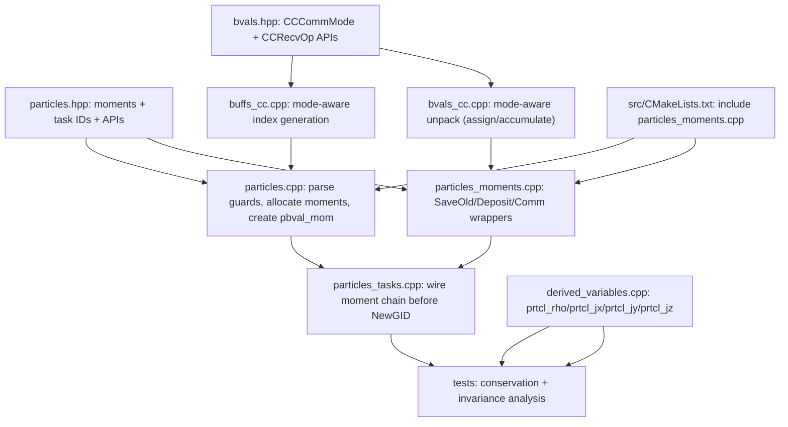

# AthenaK MHD-PIC Agent Handoff (AGENTS-Grounded)

This document is the working implementation contract for evolving AthenaK's
existing cosmic-ray particles into a PIC-capable particle-grid subsystem,
using `entity` as the reference implementation for charge/current deposition
and synchronization semantics.

## 1. Provenance and Scope

- Date: 2026-02-05
- AthenaK workspace: `/Users/dbf75/Work/Research/AthenaK/athenak-DF`
- Active branch context: `codex/dev/PIC`
- Reference codebase: `/Users/dbf75/Work/Research/AthenaK/entity`
- Inputs reviewed for this revision:
  - All 26 AthenaK `AGENTS.md` files.
  - All 15 `entity` `AGENTS.md` files.
- This revision supersedes earlier drafts by explicitly encoding AGENTS-level
  constraints (task ordering, container/communication invariants, and test
  expectations) into the PIC migration plan.
- Companion implementation-style guide:
  `/Users/dbf75/Work/Research/AthenaK/athenak-DF/AGENT_PIC_IMPLEMENTATION_GUIDE.md`
  (copy/adapt-first workflow; root `AGENTS.md` still authoritative).

## 2. Non-Negotiable Constraints from AGENTS.md

### 2.1 AthenaK constraints that shape PIC work

1. Runtime ordering and ownership
- Driver order is fixed: `before_timeintegrator` -> per-stage
  `before_stagen/stagen/after_stagen` -> `after_timeintegrator`.
- `MeshBlockPack::AddCoordinates` must run before `AddPhysics`.
- Physics modules are created via input blocks in `MeshBlockPack::AddPhysics`.

2. Task system constraints
- `TaskList::InsertTask` has non-trivial dependency rewriting semantics.
- `NUMBER_TASKID_BITS = 64`; task-count growth must stay below this bound.
- Any complex reordering is safer with explicit dependency IDs than repeated
  late inserts.

3. Particle data and communication reality today
- Particles are stored as `(var, particle)` arrays in `prtcl_rdata` and
  `prtcl_idata`.
- `nidata` is fixed at 3 (`PGID`, `PTAG`, species/SN slot).
- Current CR pusher path is B-only Boris (`E=0`).
- Particle boundary communication is separate from cell-centered field
  communication and uses `PGID` + neighbor mapping.

4. Boundary-value subsystem constraints
- CC exchange index generation lives in `buffs_cc.cpp`; unpack behavior in
  `bvals_cc.cpp`.
- Existing CC exchange semantics are ghost-fill oriented by default.
- Any additive current synchronization mode must update both indexing and
  unpack operations, not just `+=` in unpack.

5. Mesh/AMR and physics coupling constraints
- AMR/refinement invariants are enforced at mesh level and by physics module
  post-refinement hooks.
- Shearing-box is incompatible with refinement and has custom boundary logic.
- Radiation has its own strict constraints (GR-only, no AMR).
- `punit` may be null if `<units>` is absent; any physical scaling path must
  guard this explicitly.

6. Test harness and I/O constraints
- Inputs used by regression scripts are expected under `inputs/`.
- New outputs/diagnostics must be wired through `src/outputs` conventions.

### 2.2 Entity constraints that define PIC parity targets

1. Engine ordering invariants
- SRPIC step order is explicit and must remain coherent:
  field comm/BC -> push -> deposit -> synchronize/communicate/filter current ->
  field update -> particle comm/injection.
- `entity` explicitly warns against moving particle communication ahead of
  deposition/filtering.

2. Deposit path invariants
- Current arrays are zeroed before deposit.
- Deposit uses old/new particle state and shape kernels.
- Scatter-add semantics are explicit (`ScatterView` + contribute).

3. Communication semantics
- `SynchronizeFields(J)` is additive and distinct from normal copy-like halo
  exchange modes.
- Additive vs non-additive field exchanges must preserve slice/index contracts.

4. Container invariants
- Particle capacity invariant: `npart <= maxnpart`.
- Particle tag/sortedness semantics are coupled to comm and cleanup logic.
- Field containers always include current/buffer components in PIC paths.

5. Compile/runtime guard expectations
- Deposition algorithm parameters and shape-order constraints are enforced.
- Feature guards (`MPI_ENABLED`, `OUTPUT_ENABLED`, etc.) must keep both branches
  buildable.

## 3. AthenaK <-> Entity PIC Mapping (Revised)

1. Step orchestration
- Entity engine pipeline maps to AthenaK task lists.
- Transitional placement for PR1 can remain in particle pre-stage lists, but
  final parity target is stage-level coupling around MHD update tasks.

2. Particle state needed for charge-conserving deposition
- Entity-style deposition depends on previous and current particle trajectory.
- AthenaK must add per-step old-position scratch storage in `particles::Particles`.

3. Grid moment ownership
- Entity `cur`/`buff` concept maps to AthenaK particle-owned moment arrays
  (`rho`, `jx`, `jy`, `jz`) plus optional coarse mirrors for future AMR support.

4. Current synchronization
- Entity additive synchronization maps to an AthenaK CC communication mode that
  is explicitly additive and uses synchronization-appropriate slices.

5. Field coupling
- Entity current source coupling maps to AthenaK `MHD::EFieldSrc` integration.

6. Particle migration
- Entity particle communication stage maps to AthenaK existing
  `ParticlesBoundaryValues` path and must remain after deposition in PIC mode.

## 4. Critical Gaps to Address Before Full PIC Coupling

1. Additive CC unpack alone is insufficient
- Without synchronize-mode index selection in `buffs_cc.cpp`, additive unpack
  can still be wrong for accumulated moments.

2. Charge/weight normalization policy is undefined for CR deposition
- Existing CR payload stores `q/m` (`IPM`) but deposition needs explicit charge
  weighting semantics.

3. AMR-safe moment handling is absent
- Restrict/prolong/sync behavior for deposited moments is not yet implemented.

4. Non-periodic boundary policy for deposited moments is undefined
- Physical BC behavior for `rho/J` must be defined before enabling broad use.

5. Restart coverage for particles/moments remains incomplete
- PIC-capable runs need restart fidelity for particles and deposited state.

6. Pre-existing defect worth fixing early
- `MeshRefinement::RefineParticles` appears to have a `PGID` update bug
  (`gids + m` vs expected `newm` usage in current branch context).

## 5. Phased Implementation Plan

### Phase 0 (PR1): deposition infrastructure, no MHD feedback

Goal:
- Add robust particle-to-cell deposition and additive synchronization
  infrastructure.
- Do not yet modify MHD evolution equations.

Runtime scope guard for first merge:
- `deposit_moments=true`
- `particle_type=cosmic_ray`
- strictly periodic boundaries only
- `multilevel=false`
- `adaptive=false`
- no shearing-box mode

Fail fast with clear error messages outside this envelope.

Phase-0 hard requirements:
1. Communication mode must be explicit
- Add a CC communication mode split (`ghost_fill` vs `synchronize`) at
  `MeshBoundaryValuesCC` construction time.
- Synchronize mode must drive index generation in `buffs_cc.cpp` and unpack
  behavior in `bvals_cc.cpp`.
- Existing hydro/mhd/radiation/z4c call sites must remain on default
  `ghost_fill` mode.

2. Receive operation must be explicit
- Add CC recv operation split (`assign` vs `accumulate`) and use
  `accumulate` for particle moments only.

3. Charge policy must be explicit for PR1
- Keep `IPM` as pusher `q/m`.
- For deposition, define `q_macro` from species charge and an explicit scalar:
  `q_macro = deposit_qscale * species_charge(PSP)`.
- Use `q_macro` in both `rho` and `J` deposition paths so tests are physically
  self-consistent.

4. Task chain must preserve current non-blocking communication pattern
- Keep clear order as `ClearRecv -> ClearSend` (matching existing particles
  communication ordering and avoiding request reuse ambiguity).

5. Observability must be deterministic
- Add dedicated derived-variable outputs for deposited moments:
  `prtcl_rho`, `prtcl_jx`, `prtcl_jy`, `prtcl_jz`.
- Tests must validate against these fields directly.

Deliverables:
1. Particle data model extensions
- Old-position scratch arrays (private to `particles::Particles`).
- Moment arrays for `rho/jx/jy/jz` (+ coarse mirror handle gated out by
  phase-0 runtime guard).

2. Moment task chain (post-push, pre-migration)
- `SaveOldPositions -> ZeroMoments -> InitRecvMoments -> DepositMoments ->
  SendMoments -> RecvMoments(accumulate) -> ClearRecvMoments ->
  ClearSendMoments`, then existing `NewGID` and particle migration chain.

3. Boundary communication extension
- Add explicit CC recv operation mode (`assign` vs `accumulate`).
- Add CC communication slice/index mode needed for synchronization semantics.
- Use a dedicated particle-moment CC boundary object configured for
  synchronize mode.

4. Deterministic observability
- Expose deposited moments via derived variables wired into mesh outputs.

5. Regression tests
- Serial conservation sanity test.
- MPI conservation sanity test.
- Domain-decomposition invariance test.
- Unsupported-mode guard tests.

### Phase 1 (PR2): couple deposited current into MHD update

Goal:
- Use deposited current in MHD update path while preserving phase-0 tests.

Deliverables:
1. Couple `J` into `MHD::EFieldSrc` (or equivalent stage-level source task).
2. Decide and implement momentum/energy feedback split point.
3. Move deposition scheduling from pre-integrator transitional path toward
   stage-level parity with MHD task flow.
4. Extend tests for coupled field evolution behavior.

### Phase 2 (PR3): robustness and feature expansion

Goal:
- Remove phase-0 guardrails and support production configurations.

Deliverables:
1. AMR-safe deposited moments (restrict/prolong/sync policy).
2. Restart serialization of particles + PIC moments.
3. Boundary policy for non-periodic runs.
4. Optional filtering/performance improvements (atomics vs scatter strategy,
   profiling-based tuning).

## 6. File-Level Edit Plan (Phase 0)

1. `/Users/dbf75/Work/Research/AthenaK/athenak-DF/src/particles/particles.hpp`
- Add:
  - phase-0 knobs: `deposit_moments`, `deposit_order`, `deposit_qscale`
  - `ParticlesTaskIDs` extension for moment-task IDs
  - local moment component constants: `rho/jx/jy/jz`
  - moment storage (`DvceArray5D<Real>`) and old-position scratch arrays
  - dedicated CC boundary helper pointer for moments
  - task IDs and method declarations for moment workflow

2. `/Users/dbf75/Work/Research/AthenaK/athenak-DF/src/particles/particles.cpp`
- Parse deposition options and enforce phase-0 scope guard.
- Allocate/deallocate moment and scratch storage.
- Allocate/deallocate moment boundary helper in synchronize mode and initialize
  buffers with `nvar=4`.

3. `/Users/dbf75/Work/Research/AthenaK/athenak-DF/src/particles/particles_tasks.cpp`
- Wire the moment task chain between `Push` and `NewGID`.
- Preserve clear ordering as `ClearRecvMoments` then `ClearSendMoments`.

4. `/Users/dbf75/Work/Research/AthenaK/athenak-DF/src/particles/particles_moments.cpp` (new)
- Implement:
  - save-old wrappers
  - zero moments
  - local race-safe deposition (atomics or `ScatterView`)
  - moment communication wrappers (`InitRecv/Send/Recv/ClearRecv/ClearSend`)

5. `/Users/dbf75/Work/Research/AthenaK/athenak-DF/src/bvals/bvals.hpp`
- Add CC communication mode and recv op enums.
- Extend `MeshBoundaryValuesCC` constructor and recv API.

6. `/Users/dbf75/Work/Research/AthenaK/athenak-DF/src/bvals/bvals_cc.cpp`
- Store and use CC communication mode on object construction.
- Implement mode-dependent unpack (`assign`/`accumulate`).

7. `/Users/dbf75/Work/Research/AthenaK/athenak-DF/src/bvals/buffs_cc.cpp`
- Add synchronize-mode index generation for additive moment exchange.
- Ensure index/data-size consistency with `MeshBoundaryValues::InitRecv`.

8. `/Users/dbf75/Work/Research/AthenaK/athenak-DF/src/CMakeLists.txt`
- Register new particle moments source file.

9. `/Users/dbf75/Work/Research/AthenaK/athenak-DF/src/outputs/outputs.hpp`
- Add output choices: `prtcl_rho`, `prtcl_jx`, `prtcl_jy`, `prtcl_jz`.
- Update `NOUTPUT_CHOICES` accordingly.

10. `/Users/dbf75/Work/Research/AthenaK/athenak-DF/src/outputs/basetype_output.cpp`
- Register the four new derived output variables in `BaseTypeOutput`.
- Enforce runtime guard: these variables require `deposit_moments=true`.

11. `/Users/dbf75/Work/Research/AthenaK/athenak-DF/src/outputs/derived_variables.cpp`
- Add derived-variable compute paths for `prtcl_rho`, `prtcl_jx`, `prtcl_jy`,
  `prtcl_jz`, mapped to deposited moment arrays.

12. `/Users/dbf75/Work/Research/AthenaK/athenak-DF/inputs/tests/pic_deposit_conservation.athinput` (new)
- Minimal periodic input deck enabling deposited moment outputs.

13. `/Users/dbf75/Work/Research/AthenaK/athenak-DF/tst/scripts/particles/__init__.py` (new)
- Enable test discovery in particles test namespace.

14. `/Users/dbf75/Work/Research/AthenaK/athenak-DF/tst/scripts/particles/pic_deposit_conservation.py` (new)
- Validate global deposited charge/current invariants.

15. `/Users/dbf75/Work/Research/AthenaK/athenak-DF/tst/scripts/particles/pic_deposit_decomp_invariance.py` (new)
- Validate decomposition/rank invariance.

### 6.1 Concrete Method Signatures for PR1

`/Users/dbf75/Work/Research/AthenaK/athenak-DF/src/particles/particles.hpp`

```cpp
// Extend existing ParticlesTaskIDs struct (same location as push/newgid/etc.)
struct ParticlesTaskIDs {
  TaskID push, newgid, count, irecv, sendp, recvp, csend, crecv;
  TaskID save_old, zero_mom, irecv_mom, dep_mom, send_mom, recv_mom;
  TaskID crecv_mom, csend_mom;
};

// New/extended state
bool deposit_moments = false;
int deposit_order = 1;
Real deposit_qscale = 1.0;
static constexpr int NMOM = 4;
static constexpr int IMOM_RHO = 0;
static constexpr int IMOM_JX  = 1;
static constexpr int IMOM_JY  = 2;
static constexpr int IMOM_JZ  = 3;
DvceArray5D<Real> moments;
DvceArray5D<Real> coarse_moments;
DvceArray1D<Real> x1_old, x2_old, x3_old;
MeshBoundaryValuesCC *pbval_mom = nullptr;

TaskStatus SaveOldPositions(Driver *pdriver, int stage);
TaskStatus ZeroMoments(Driver *pdriver, int stage);
TaskStatus InitRecvMoments(Driver *pdriver, int stage);
TaskStatus DepositMoments(Driver *pdriver, int stage);
TaskStatus SendMoments(Driver *pdriver, int stage);
TaskStatus RecvMoments(Driver *pdriver, int stage);
TaskStatus ClearRecvMoments(Driver *pdriver, int stage);
TaskStatus ClearSendMoments(Driver *pdriver, int stage);
```

`/Users/dbf75/Work/Research/AthenaK/athenak-DF/src/bvals/bvals.hpp`

```cpp
enum class CCCommMode {ghost_fill, synchronize};
enum class CCRecvOp {assign, accumulate};

class MeshBoundaryValuesCC : public MeshBoundaryValues {
 public:
  MeshBoundaryValuesCC(MeshBlockPack *ppack, ParameterInput *pin, bool z4c,
                       CCCommMode mode = CCCommMode::ghost_fill);
  TaskStatus PackAndSendCC(DvceArray5D<Real> &a, DvceArray5D<Real> &ca);
  TaskStatus RecvAndUnpackCC(DvceArray5D<Real> &a, DvceArray5D<Real> &ca,
                             CCRecvOp op = CCRecvOp::assign);

 private:
  CCCommMode comm_mode_;
};
```

### 6.2 PR1 Dependency Graph



### 6.3 PR1 Task Ordering Graph


## 7. Acceptance Criteria and Test Matrix

Phase-0 must pass all of the following:

1. Serial periodic conservation
- Integrate `prtcl_rho` over volume and compare against
  `sum(q_macro)` within tolerance.

2. MPI periodic conservation
- Same charge invariant under rank-boundary crossings.
- Integrate `prtcl_jx/prtcl_jy/prtcl_jz` and compare against
  `sum(q_macro * v)` component-wise.

3. Decomposition invariance
- Same IC with different meshblock/rank decomposition yields matching global
  `rho/J` integrals to tolerance (not bitwise equality).

4. Crossing stress test
- High-velocity crossing of many boundaries preserves global charge/current.

5. Guard behavior
- Invalid configurations (`non-periodic`, `AMR`, `multilevel`, shearing-box)
  fail early with explicit messages when deposition is enabled.
- Invalid deposition config (`deposit_order` not supported in PR1) fails early.

Recommended validation commands:
- Build: `cmake -B build && cmake --build build -j8`
- Regression: `cd tst && python run_tests.py`
- C++ style: `cd tst/scripts/style && bash check_athena_cpp_style.sh`
- Python style: `flake8 tst/ vis/`

## 8. Immediate Execution Order for Coding Sessions

1. Implement CC communication extension first:
   `bvals.hpp` -> `buffs_cc.cpp` -> `bvals_cc.cpp`.
2. Add particles data model and boundary helper wiring:
   `particles.hpp` -> `particles.cpp`.
3. Implement deposition and wrappers in `particles_moments.cpp`.
4. Wire task DAG in `particles_tasks.cpp` with recv-before-send clear ordering.
5. Add output observability in output stack:
   `outputs.hpp` -> `basetype_output.cpp` -> `derived_variables.cpp`.
6. Add tests (`inputs/tests` + `tst/scripts/particles`) and verify guard paths.
7. Only then begin PR2 coupling into MHD source tasks.

## 9. Serial Continuation Plan (Current Mode)

Parallel worktrees/branches were retired. PR1 work now proceeds serially on:

- branch: `codex/dev/PIC`
- path: `/Users/dbf75/Work/Research/AthenaK/athenak-DF`

Current merged state:

1. Interface freeze merged.
2. `WS-A` merged (CC synchronize communication core).
3. `WS-B` merged (particle scaffolding and runtime guards).
4. `WS-C` merged (deposition kernel/task DAG wiring).

### 9.1 Step C (WS-C): Completed

Goal:
- implement deposition kernels and task DAG wiring, using A/B infrastructure.

Files for Step C:

1. `/Users/dbf75/Work/Research/AthenaK/athenak-DF/src/particles/particles_moments.cpp` (new)
2. `/Users/dbf75/Work/Research/AthenaK/athenak-DF/src/particles/particles_tasks.cpp`
3. `/Users/dbf75/Work/Research/AthenaK/athenak-DF/src/CMakeLists.txt`

Step C implementation checklist:

1. Add `particles_moments.cpp` with all methods declared in
   `/Users/dbf75/Work/Research/AthenaK/athenak-DF/src/particles/particles.hpp`:
   `SaveOldPositions`, `ZeroMoments`, `InitRecvMoments`, `DepositMoments`,
   `SendMoments`, `RecvMoments`, `ClearRecvMoments`, `ClearSendMoments`.

2. In `SaveOldPositions`, snapshot `IPX/IPY/IPZ` into `x1_old/x2_old/x3_old`
   for all active particles in `nprtcl_thispack`.

3. In `ZeroMoments`, zero all `NMOM` components of `moments` with Kokkos kernel.

4. In `DepositMoments`, implement race-safe local deposition:
   - adapt from AthenaK atomic accumulation pattern used by `prtcl_d` in
     `/Users/dbf75/Work/Research/AthenaK/athenak-DF/src/outputs/derived_variables.cpp`
   - mirror Entity old/new trajectory semantics as much as PR1 scope allows
   - use explicit `q_macro = deposit_qscale * species_charge(PSP)`
   - write to local moment component indices (`IMOM_RHO`, `IMOM_JX`, `IMOM_JY`,
     `IMOM_JZ`).

5. In moment communication wrappers:
   - `InitRecvMoments` -> `pbval_mom->InitRecv(NMOM)`
   - `SendMoments` -> `pbval_mom->PackAndSendCC(moments, coarse_moments)`
   - `RecvMoments` -> `pbval_mom->RecvAndUnpackCC(moments, coarse_moments,
     CCRecvOp::accumulate)`
   - `ClearRecvMoments` -> `pbval_mom->ClearRecv()`
   - `ClearSendMoments` -> `pbval_mom->ClearSend()`

6. In `particles_tasks.cpp`, insert moment chain between `Push` and `NewGID`:
   `SaveOldPositions -> Push -> ZeroMoments -> InitRecvMoments -> DepositMoments
   -> SendMoments -> RecvMoments -> ClearRecvMoments -> ClearSendMoments -> NewGID`.

7. In `src/CMakeLists.txt`, register new source:
   `/Users/dbf75/Work/Research/AthenaK/athenak-DF/src/particles/particles_moments.cpp`.

8. Keep defaults unchanged when `deposit_moments=false`.

### 9.2 Step C Validation Commands

Run after Step C edits:

1. `cmake -S /Users/dbf75/Work/Research/AthenaK/athenak-DF -B /Users/dbf75/Work/Research/AthenaK/athenak-DF/build`
2. `cmake --build /Users/dbf75/Work/Research/AthenaK/athenak-DF/build -j8`

### 9.3 Step D (WS-D): Execute Next

Goal:
- expose deposited particle moments as deterministic mesh output variables:
  `prtcl_rho`, `prtcl_jx`, `prtcl_jy`, `prtcl_jz`.

Files for Step D:

1. `/Users/dbf75/Work/Research/AthenaK/athenak-DF/src/outputs/outputs.hpp`
2. `/Users/dbf75/Work/Research/AthenaK/athenak-DF/src/outputs/basetype_output.cpp`
3. `/Users/dbf75/Work/Research/AthenaK/athenak-DF/src/outputs/derived_variables.cpp`

Step D implementation checklist:

1. In `outputs.hpp`, append four new choices in `var_choice`:
   `prtcl_rho`, `prtcl_jx`, `prtcl_jy`, `prtcl_jz`.
2. Increase `NOUTPUT_CHOICES` by 4 to match the expanded list.
3. In `basetype_output.cpp`, add registration blocks mirroring `prtcl_d`:
   each of the four names must set `contains_derived=true`, increment
   `n_derived` by 1, and append one `outvars.emplace_back(...)`.
4. Use stable labels in `outvars` matching variable semantics:
   `prtcl_rho`, `prtcl_jx`, `prtcl_jy`, `prtcl_jz`.
5. Add constructor-time guard in `basetype_output.cpp`:
   if one of these four variables is requested and
   `pm->pmb_pack->ppart->deposit_moments == false`, fail with explicit message.
6. In `derived_variables.cpp`, add four compute branches in
   `ComputeDerivedVariable()` that map each name to one component of
   `pm->pmb_pack->ppart->moments`:
   `Particles::IMOM_RHO`, `Particles::IMOM_JX`, `Particles::IMOM_JY`,
   `Particles::IMOM_JZ`.
7. Match existing AthenaK derived-variable pattern:
   - ensure `derived_var` capacity
   - write active zones only (`ks:ke`, `js:je`, `is:ie`)
   - increment `i_dv` once per scalar output.
8. Do not modify existing `prtcl_d` behavior; keep it as particle-count binning.
9. Keep all non-particle outputs behavior-identical.

### 9.4 Step D Validation Commands

Run after Step D edits:

1. `cmake -S /Users/dbf75/Work/Research/AthenaK/athenak-DF -B /Users/dbf75/Work/Research/AthenaK/athenak-DF/build`
2. `cmake --build /Users/dbf75/Work/Research/AthenaK/athenak-DF/build -j8`
3. Parse-only check for new variable acceptance:
   `/Users/dbf75/Work/Research/AthenaK/athenak-DF/build/src/athena -n -i /Users/dbf75/Work/Research/AthenaK/athenak-DF/inputs/tests/linear_wave_hydro.athinput output1/file_type=vtk output1/variable=prtcl_rho`
4. Runtime guard check (`deposit_moments=false` + `prtcl_rho`) should fail
   with clear message.
5. Runtime smoke (`deposit_moments=true` + `prtcl_rho`/`prtcl_j*`) should run.

### 9.5 Step E (WS-E): Execute Next

Goal:
- add deterministic regression coverage and a stable input deck for PR1
  deposited-moment observability and invariants.

Files for Step E:

1. `/Users/dbf75/Work/Research/AthenaK/athenak-DF/inputs/tests/pic_deposit_conservation.athinput` (new)
2. `/Users/dbf75/Work/Research/AthenaK/athenak-DF/tst/scripts/particles/__init__.py` (new)
3. `/Users/dbf75/Work/Research/AthenaK/athenak-DF/tst/scripts/particles/pic_deposit_conservation.py` (new)
4. `/Users/dbf75/Work/Research/AthenaK/athenak-DF/tst/scripts/particles/pic_decomp_invariance.py` (new)

Step E implementation checklist:

1. Input deck must stay inside PR1 runtime envelope:
   - `particle_type=cosmic_ray`
   - `deposit_moments=true`
   - `deposit_order=1`
   - strictly periodic boundaries
   - no AMR/multilevel/shearing-box
2. Use a built-in problem generator (`pgen_name=linear_wave`) so tests do not
   depend on user-problem compile flags.
3. Configure mesh output variables needed for analysis:
   `prtcl_rho`, `prtcl_jx`, `prtcl_jy`, `prtcl_jz`, and `prtcl_d`.
4. Prefer `file_type=bin` for test observability and parse outputs with
   `/Users/dbf75/Work/Research/AthenaK/athenak-DF/vis/python/bin_convert_new.py`
   in the analysis scripts.
5. In `pic_deposit_conservation.py`, run:
   - a serial case (`nproc=1`)
   - an MPI case (`nproc=2`) for true communication-path coverage
6. In `pic_deposit_conservation.py` analysis, compute global volume integrals:
   - `Q = \int prtcl_rho dV`
   - `Jx/Jy/Jz = \int prtcl_j* dV`
   and compare against expected deposited totals from the configured particle
   charge and velocity initialization.
7. In `pic_decomp_invariance.py`, run at least two decomposition variants for
   the same physics setup and compare global `Q/J` integrals within tolerance.
8. Include explicit negative checks for guard behavior:
   - `deposit_moments=false` + `prtcl_rho` output request fails
   - unsupported deposition order fails
   - non-periodic boundaries with deposition fail
9. Keep pass/fail criteria strict and deterministic:
   - all checks are scalar integral comparisons
   - log measured values and absolute/relative errors in analysis output
10. Keep Step E scope to tests and test inputs only (no PR2 coupling edits).

### 9.6 Step E Validation Commands

Run after Step E edits:

1. MPI-enabled targeted conservation test:
   `cd /Users/dbf75/Work/Research/AthenaK/athenak-DF/tst && python run_tests.py particles/pic_deposit_conservation --cmake=-DAthena_ENABLE_MPI=ON --cmake=-DCMAKE_CXX_COMPILER=/opt/homebrew/bin/mpicxx`
2. MPI-enabled decomposition invariance test:
   `cd /Users/dbf75/Work/Research/AthenaK/athenak-DF/tst && python run_tests.py particles/pic_decomp_invariance --cmake=-DAthena_ENABLE_MPI=ON --cmake=-DCMAKE_CXX_COMPILER=/opt/homebrew/bin/mpicxx`
3. Package-level particle regression run:
   `cd /Users/dbf75/Work/Research/AthenaK/athenak-DF/tst && python run_tests.py particles --cmake=-DAthena_ENABLE_MPI=ON --cmake=-DCMAKE_CXX_COMPILER=/opt/homebrew/bin/mpicxx`
4. Full PR1 matrix/stability pass:
   `cd /Users/dbf75/Work/Research/AthenaK/athenak-DF/tst && python run_tests.py --cmake=-DAthena_ENABLE_MPI=ON --cmake=-DCMAKE_CXX_COMPILER=/opt/homebrew/bin/mpicxx`

### 9.7 Next Serial Steps After E

1. Run full style checks and resolve only Step-E-introduced issues.
2. Prepare PR1 summary with A/B/C/D/E evidence and residual risks.

## 10. AGENTS Review Index

### 10.1 AthenaK AGENTS.md files reviewed

```
/Users/dbf75/Work/Research/AthenaK/athenak-DF/AGENTS.md
/Users/dbf75/Work/Research/AthenaK/athenak-DF/inputs/AGENTS.md
/Users/dbf75/Work/Research/AthenaK/athenak-DF/src/AGENTS.md
/Users/dbf75/Work/Research/AthenaK/athenak-DF/src/bvals/AGENTS.md
/Users/dbf75/Work/Research/AthenaK/athenak-DF/src/coordinates/AGENTS.md
/Users/dbf75/Work/Research/AthenaK/athenak-DF/src/diffusion/AGENTS.md
/Users/dbf75/Work/Research/AthenaK/athenak-DF/src/driver/AGENTS.md
/Users/dbf75/Work/Research/AthenaK/athenak-DF/src/dyn_grmhd/AGENTS.md
/Users/dbf75/Work/Research/AthenaK/athenak-DF/src/eos/AGENTS.md
/Users/dbf75/Work/Research/AthenaK/athenak-DF/src/geodesic-grid/AGENTS.md
/Users/dbf75/Work/Research/AthenaK/athenak-DF/src/hydro/AGENTS.md
/Users/dbf75/Work/Research/AthenaK/athenak-DF/src/ion-neutral/AGENTS.md
/Users/dbf75/Work/Research/AthenaK/athenak-DF/src/mesh/AGENTS.md
/Users/dbf75/Work/Research/AthenaK/athenak-DF/src/mhd/AGENTS.md
/Users/dbf75/Work/Research/AthenaK/athenak-DF/src/outputs/AGENTS.md
/Users/dbf75/Work/Research/AthenaK/athenak-DF/src/particles/AGENTS.md
/Users/dbf75/Work/Research/AthenaK/athenak-DF/src/pgen/AGENTS.md
/Users/dbf75/Work/Research/AthenaK/athenak-DF/src/radiation/AGENTS.md
/Users/dbf75/Work/Research/AthenaK/athenak-DF/src/reconstruct/AGENTS.md
/Users/dbf75/Work/Research/AthenaK/athenak-DF/src/shearing_box/AGENTS.md
/Users/dbf75/Work/Research/AthenaK/athenak-DF/src/srcterms/AGENTS.md
/Users/dbf75/Work/Research/AthenaK/athenak-DF/src/tasklist/AGENTS.md
/Users/dbf75/Work/Research/AthenaK/athenak-DF/src/units/AGENTS.md
/Users/dbf75/Work/Research/AthenaK/athenak-DF/src/utils/AGENTS.md
/Users/dbf75/Work/Research/AthenaK/athenak-DF/src/z4c/AGENTS.md
/Users/dbf75/Work/Research/AthenaK/athenak-DF/vis/python/AGENTS.md
```

### 10.2 Entity AGENTS.md files reviewed

```
/Users/dbf75/Work/Research/AthenaK/entity/AGENTS.md
/Users/dbf75/Work/Research/AthenaK/entity/cmake/AGENTS.md
/Users/dbf75/Work/Research/AthenaK/entity/dev/AGENTS.md
/Users/dbf75/Work/Research/AthenaK/entity/minimal/AGENTS.md
/Users/dbf75/Work/Research/AthenaK/entity/pgens/AGENTS.md
/Users/dbf75/Work/Research/AthenaK/entity/src/AGENTS.md
/Users/dbf75/Work/Research/AthenaK/entity/src/archetypes/AGENTS.md
/Users/dbf75/Work/Research/AthenaK/entity/src/engines/AGENTS.md
/Users/dbf75/Work/Research/AthenaK/entity/src/framework/AGENTS.md
/Users/dbf75/Work/Research/AthenaK/entity/src/framework/containers/AGENTS.md
/Users/dbf75/Work/Research/AthenaK/entity/src/framework/domain/AGENTS.md
/Users/dbf75/Work/Research/AthenaK/entity/src/global/AGENTS.md
/Users/dbf75/Work/Research/AthenaK/entity/src/kernels/AGENTS.md
/Users/dbf75/Work/Research/AthenaK/entity/src/metrics/AGENTS.md
/Users/dbf75/Work/Research/AthenaK/entity/src/output/AGENTS.md
```
