# Project status update: AthenaK MHD-PIC local-readiness tranche

| Item | Value |
| --- | --- |
| Date | 2026-05-31 |
| Repository | AthenaK MHD-PIC worktree at `/ccs/home/dfielding/athenak-pic` |
| Branch and commits | `PIC` tested code-and-control boundary `d0ad350562799e609b4d22f45ce9ca314b38da82` at 119 commits ahead of `origin/PIC`; this documentation reconciliation follows the schema-alias repair |
| Agent | Codex |
| Governing plan | `tst/publication/PIC_PRODUCTION_READINESS_PLAN.md` |
| Data analyzed | Frozen Q006, Q007, Q008 and Q011 local-readiness artifacts; retained read-only Q023 Bell source-local smoke; authoritative Frontier node-hour ledger |
| Bulk-evidence root | `/lustre/orion/ast207/proj-shared/dfielding/PIC` |
| Compute context | Orion-backed retained artifacts; bounded serial-host local-readiness replays; historical Frontier ledger records retained separately |
| Status label | **Partially complete: substantial local-readiness tranche verified, but AthenaK MHD-PIC is not production-ready.** |

This document reports what was actually completed and verified. It does not close the full production plan. In particular, it does not claim Sun & Bai (2023) reproduction, production-scale Frontier readiness, extension qualification, durable archival, or external approval.

# Tier 0: What happened and why it matters

The goal was to turn a large AthenaK MHD-PIC readiness plan into concrete evidence without overstating what that evidence proves. The plan began from four model-level problems: paper-mode induction had been conflated with a Hall extension, particle mechanics used a non-relativistic state, delta-f support was only a quiet start, and expanding-box support transformed particles without the matching MHD map.

The worktree now contains bounded repairs and stricter checks for those areas. It also contains a cleaner evidence workflow: build or bind a known executable, run a narrowly defined local successor, freeze its output under the Orion project root, and analyze that frozen tree with a verifier that refuses unexpected files, mutable source dependencies, malformed schemas, and unsupported configurations.

| Initial defect | Bounded repair now present | Evidence highlighted here | Important remaining limitation |
| --- | --- | --- | --- |
| Paper and Hall induction were conflated | Separate paper and opt-in extension identities | Source-local Hall sidecars and parser hardening | Physical Hall Bell qualification remains open |
| Particle state was non-relativistic | Relativistic momentum and energy path exists in the worktree | Q006 low-speed exact-isothermal mechanics characterization only | Q006 does not exercise relativistic stress or energy feedback; MPI/GPU and long-horizon mechanics qualification remain open |
| Delta-f was quiet-start only | Evolving physical delta-f path exists in the worktree, with an isolated adaptive extension | Q007 initialization and CRSI-only two-cycle replay | Adaptive-extension replay, CRPAI runtime, growth, transport and physical-damping calibration remain open |
| Box driving transformed particles without matching MHD support | Particle and MHD expanding-box transforms | Q008 22-case host matrix | Driven physical campaigns and Frontier qualification remain open |

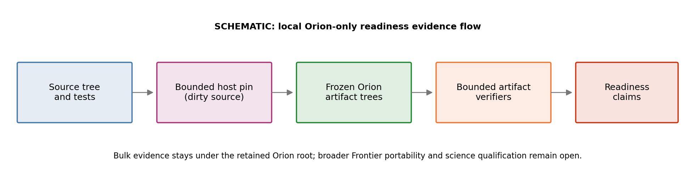

*Figure 1. Schematic of the local evidence flow. The important point is that a passing runtime is not promoted directly into a release claim: it is pinned, frozen under the user-selected retained Orion root, and interpreted by a bounded artifact verifier. Q006 and Q007 add exact-schema checks; Q008 and Q011 use narrower retained-snapshot or payload-audit contracts. Broader Frontier portability and science-qualification gates remain separate.*

The retained Q023 Bell source-local smoke provides a limited physical picture. It contains a coupled paper-mode Bell carrier with actual MHD field snapshots: the initialized right-polarized perturbation and a one-cycle restart continuation. It does not contain a serialized particle VTK or phase-space output. That absence matters. The figure below is useful for seeing the MHD carrier and for making the missing same-run PIC view explicit, but it is not Bell growth, turbulence, saturation or Section 5.2 reproduction evidence.

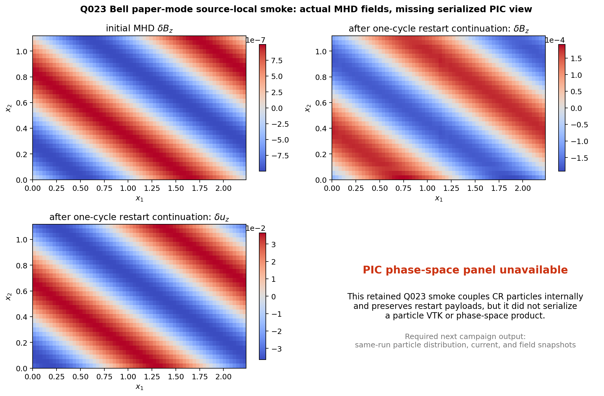

*Figure 2. Actual Q023 2D source-local Bell-smoke MHD outputs. The upper-left panel shows the initialized transverse magnetic perturbation $\delta B_z$ at cycle zero. The upper-right and lower-left panels show $\delta B_z$ and $\delta u_z$ after the retained one-cycle restart continuation at $t=0.0015625$. Each quantitative panel has its own labeled color scale. The lower-right panel records the missing same-run particle-space product: CR particles were coupled internally and restart payloads were retained, but no particle VTK or phase-space snapshot was serialized. This is bounded preparation evidence, not instability-growth qualification.*

The clearest positive scientific-software result in this tranche is the expanding-box circularly polarized Alfvén wave successor, Q008. Its 22 retained cases span expanding, compressing, static, solver, dimensional-axis and resolution checks. For the four literal-profile convergence families, both amplitude and phase residuals fall as the resolution increases from $N_x=32$ to $64$ to $128$. This is an observed three-resolution trend, not an asymptotic-order proof.

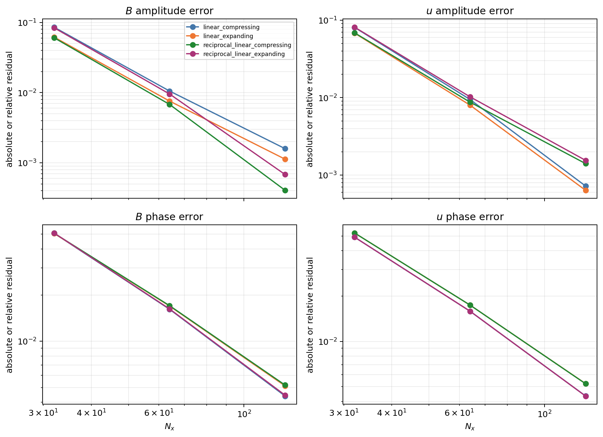

*Figure 3. Q008 literal-profile endpoint errors across three resolutions. Amplitude and phase errors decrease for all four expanding or compressing profile families. This is useful bounded self-consistency preparation evidence against internal oracles, not independent physical-model validation or production-scale Frontier qualification.*

The other retained successors answer narrower questions. Q006 exercises low-speed exact-isothermal multispecies mechanics across uniform, SMR, audited-AMR and restart carriers. Its uniform case closes almost exactly, while SMR and AMR residuals are visibly larger and the audited-AMR restart residual is largest; that is an actionable stress target, not a hidden caveat. It is not a relativistic-stress or energy-feedback qualification. Q007 verifies that the source-local delta-f launch starts with the expected $10^{-6}/m$ branch spectrum and that its CRSI carrier survives a two-cycle replay. Q011 adds a descriptive shock-injection check: 309 particles are distributed over all octants with directional moments near the isotropic expectation, without statistical-qualification credit.

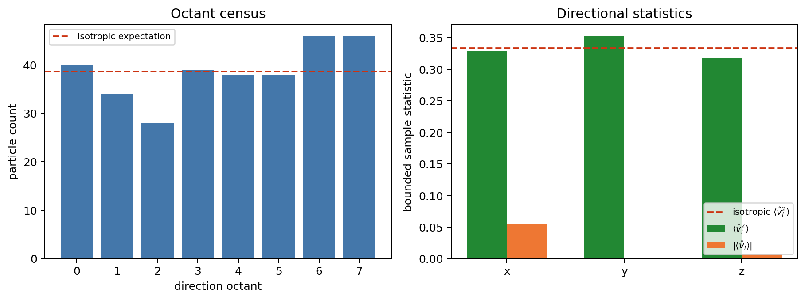

*Figure 4. Q011 octant counts and directional statistics for the retained 309-particle injection sample. The plotted v4 payload was replayed by the hardened analyzer after immutable runtime-tree and executable-tree verification. The sample is visibly finite but broadly consistent with isotropic full-sphere loading. This matters as a deterministic bounded diagnostic; it is not a statistical shock-physics qualification.*

The main change relative to the prior state is therefore not “the entire plan is done.” It is that several previously weak local preparations now have frozen, inspectable, fail-closed evidence bundles and explicit claim boundaries. The readiness status is deliberately mixed:

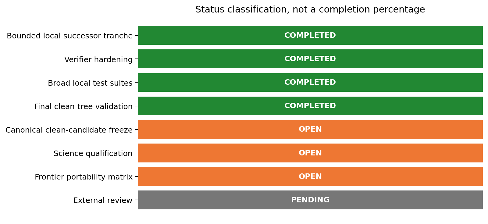

*Figure 5. Status classification for the current tranche. The bounded local successor tranche, verifier hardening, broad local test suites and final clean-tree validation matrix are complete. The canonical schema-v4 clean-candidate freeze, science qualification and the broader Frontier portability matrix remain open; external review remains pending. The bars are categorical labels, not completion percentages.*

The strongest statements we can make are local ones: the bounded successors ran, their retained outputs were inventoried, and Q008 shows monotonic three-resolution residual reduction within the tested matrix. The final local test tranches also passed during this work session and are bound by the nonqualifying exact-boundary receipt `tst/publication/readiness/phase0_exact_boundary_validation_receipt_2026-05-31.json`. The report generator itself re-validates the retained trees and mirrored accounting state, re-reads the frozen JSON products, and regenerates the figures.

The largest remaining uncertainty is not a single bug. It is the unclosed transition from bounded local engineering evidence to physical and operational qualification: long-horizon paper campaigns, calibrated extension comparisons, MPI/GPU and multi-node checks, restart and filesystem failure drills on Frontier, scaling and memory measurements, Orion-retention disposition, and named external review.

Source curation was committed through tested code-and-control boundary `d0ad350562799e609b4d22f45ce9ca314b38da82`. Independent audits first found a same-account substitution risk in the copied-snapshot handoff, then a topology-map race at the stable handoff boundary, and then two deeper fail-open paths: unknown post-handoff files could fall back into the writable topology-only staging tree, and ordinary inodes could be rewritten in place between hashing and semantic inspection. A final schema-alias audit found release-sensitive Python equality checks that could accept boolean, floating-point, or string aliases where exact integer schema versions were required. The committed repair keeps verified topology in memory, compares the handed-off topology map back to the verified tree, rejects unknown active-snapshot members, exposes consumed regular files lazily through sealed Linux `memfd` descriptors, copies mutation-checked ordinary validator bytes into sealed descriptors before multi-pass archive, dependency-archive or ELF inspection, and applies exact-integer guards at the profile, receipt, provenance, invocation, recovery, reservation and promotion boundaries. Q006, Q007 and Q011 retained-artifact replays reproduce their archived results through those sealed members. The report generator applies the same anchored sealed-member rule to frozen JSON inputs and the legacy Q023 Bell payloads. The source-side transition policy now clears inherited schema-v3 science registrations and marks the schema-v4 clean-candidate freeze pending. The expanded clean-tree validation matrix passed, but the canonical schema-v4 source bundle and HIP/MPI executable freeze have not yet been created. The sensible next step is to complete the stable-boundary rereview, install the paired successor control-plane generation, build the canonical HIP/MPI Release executable, and freeze the clean candidate before registering another Frontier slice. The Q006 residual pattern makes AMR/restart parity a priority after that freeze: bind its acceptance threshold before submission and use the slice to test whether decomposition or device execution changes the bounded carrier result. Large paper or extension campaigns should not begin until their campaign-specific registrations, tolerances and independent comparison inputs are frozen.

# Tier 1: How the analysis works

## 1.1 Objective and evidence boundary

The software objective was to advance the production-readiness plan while preserving its release-gate semantics. A useful local regression is evidence for a bounded claim, not an automatic claim of paper reproduction or production readiness. The local tranche therefore uses separate artifact roles and keeps `qualifying_evidence: false` where the retained successor is diagnostic or preparatory.

The current evidence flow is:

1. Bind the retained bounded host executable and record its SHA-256. This historical pin came from a clean build directory over a dirty source worktree; it is not the canonical clean-source release executable.
2. Materialize a narrowly scoped runtime or source-local successor.
3. Write all bulk output below `/lustre/orion/ast207/proj-shared/dfielding/PIC`.
4. Freeze the artifact tree and compute an inventory hash.
5. Analyze the retained tree with the applicable bounded verifier. Q006 and Q007 use exact-schema checks; Q008 and Q011 use narrower retained-snapshot or payload-audit contracts.
6. Record what the successor proves and what it explicitly does not prove.
7. Keep Frontier scheduler accounting in the append-only ledger and do not treat accounting-only imports as scientific evidence.

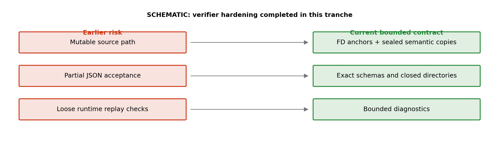

*Figure 6. Schematic summary of verifier hardening. Mutable payload paths, partial-schema acceptance and loose replay checks were replaced by anchored verification, sealed descriptor-backed regular members, immutable topology maps, unknown-member rejection, sealed semantic copies for multi-pass ordinary-file validators, pinned hashes, exact schemas, directory closure and bounded diagnostics. This matters because a verifier should reject ambiguous evidence rather than silently reinterpret it.*

## 1.2 Frozen inputs

| Artifact | Retained role | Inventory SHA-256 | Retained files | Qualification effect |
| --- | --- | --- | ---: | --- |
| Dirty-worktree bounded host pin from a clean build directory | Shared historical executable and source-binding anchor | `223dcb07d453572ea407f65dc9f7020afa3d6370b9d3c3cf4a06ceb4ca0e852c` | 35 | Binding anchor only; never reuse as the canonical clean-source release executable |
| Q006 | Exact-isothermal multispecies mechanics successor | `2ec81b018a085a1471c479260b17282499f7e8e559a8b8ad45bafa67707f20f7` | 329 | Bounded local mechanics only |
| Q007 | Delta-f source-local runtime replay | `772d67effde79fa978283ca7e8425e00734a8c89ccdb124fa215737c80191842` | 38 | Two-cycle replay only |
| Q008 | Self-contained CPAW history extension snapshot | `9cd5a4e8f04bdb4c6666f13c5904bd291e04e894d83fb84fb3300d8ee65e23de` | 786 | Bounded serial-host preparation only |
| Q011 | Injection-distribution runtime audit | `b50e1c1082e8bfbafce67aed09c1b92cfbae74b696e409aa29c3b6e12987457d` | 13 | Deterministic bounded diagnostic only |
| Q011 hardened replay | Separate successor audit after runtime-tree and executable-tree verification | `a8343749f7cbe49af25a1c07e77645de1d39a8093d0cbf0b9d98cc272129e93c` | 5 | Hardened analyzer replay only |
| Q023 Bell smoke | Legacy retained read-only Bell source-local tree | `29a0a14bbbd0e879e2cb6fb321758904a8fe8d5783612992f0de2585dca842d5` | 61 | Bounded source-local preparation smoke only |

The bounded historical executable is `/lustre/orion/ast207/proj-shared/dfielding/PIC/local-readiness/integrated-serial-host-binary-clean-20260531T034317Z/bin/athena` with SHA-256 `dadfbb19bd4453ea00c0caee93f85b7664f875621b1582f50cdd26d372422d18`. Its build directory was clean, but its archived `source/worktree_status.txt` records a dirty source checkout. Preserve it as local evidence only; do not reuse it as the canonical clean-source release executable.

## 1.3 Core definitions

Q006 measures how closely the combined fluid-particle carrier closes momentum and kinetic energy. For the plotted kinetic-energy metric,

$$
\epsilon_K
=
\frac{\left| K_{\rm total}/V - 0.06 \right|}{0.06}.
$$

The momentum panel uses the retained maximum absolute total-momentum component,

$$
\left\| \mathbf{p}_{\rm total} \right\|_\infty
=
\max_i \left| p_{{\rm total},i} \right|.
$$

Q007 seeds four direction-polarization branches. The expected startup power for mode index $m$ is

$$
P_{\rm expected}(m) = \frac{10^{-6}}{m}.
$$

The two-cycle replay plot compares the retained initial and final branch powers. It is intentionally not a growth-rate fit.

Q008 compares measured maximum residuals against coarse preparation guardrails. For the selected-metric heatmap, each cell is

$$
r_{\rm guardrail}
=
\frac{\text{measured residual}}{\text{configured limit}}.
$$

A value below $1$ is within the displayed coarse preparation guardrail. The plotted rows are a selected reporting view, not the full retained Q008 pass predicate or frozen publication thresholds. For the resolution sequences, the reported apparent order is

$$
p_{N \rightarrow 2N}
=
\log_2 \left( \frac{e_N}{e_{2N}} \right).
$$

Q011 checks a finite full-sphere sample using octant counts, mean directions and second moments:

$$
\left\langle \hat{v}_i \right\rangle,
\qquad
\left\langle \hat{v}_i^2 \right\rangle.
$$

For an ideal isotropic distribution, $\left\langle \hat{v}_i \right\rangle = 0$ and $\left\langle \hat{v}_i^2 \right\rangle = 1/3$.

## 1.4 Main retained results

### Q023: qualitative Bell MHD smoke and PIC-output gap

Figure 2 adds the missing physical field view. The retained 2D source-local Bell carrier starts with maximum $|\delta B_z| = 9.97 \times 10^{-7}$. Its one-cycle restart continuation reaches $t=0.0015625$, with maximum $|\delta B_z| = 1.91 \times 10^{-4}$ and maximum $|\delta u_z| = 3.64 \times 10^{-2}$. These are direct observations from retained MHD snapshots. The time span is one cycle, the preparation uses a source-local Debug executable, and no same-run particle VTK or phase-space snapshot was serialized. The amplitude change must not be interpreted as a Bell growth fit.

### Q006: multispecies mechanics carriers

| Carrier | Mesh blocks | Particles | $\lVert\mathbf{p}_{\rm total}\rVert_\infty$ | $\epsilon_K$ |
| --- | ---: | ---: | ---: | ---: |
| Uniform evolution | 16 | 131,072 | $1.11 \times 10^{-17}$ | $2.52 \times 10^{-7}$ |
| SMR evolution | 72 | 589,824 | $1.15 \times 10^{-2}$ | $5.65 \times 10^{-5}$ |
| Audited AMR evolution | 44 | 131,072 | $1.13 \times 10^{-2}$ | $5.56 \times 10^{-5}$ |
| Audited AMR restart | 58 | 131,072 | $3.06 \times 10^{-2}$ | $1.53 \times 10^{-4}$ |

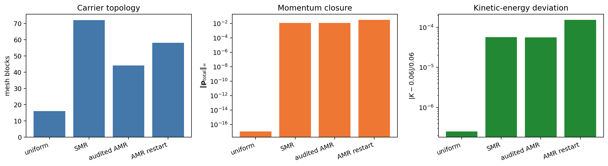

*Figure 7. Q006 topology, total-momentum-component closure and kinetic-energy deviation. Uniform evolution closes nearly exactly; SMR and AMR carriers have finite observed residuals but no frozen mesh-transition acceptance threshold, especially after restart. This identifies the AMR and restart path as an important next qualification target.*

### Q007: source-local delta-f replay

Each startup carrier contains 262,144 particles split evenly over eight momentum-bin species slots of 32,768 particles each. The three initial MHD carriers have maximum absolute MHD residuals between $1.81 \times 10^{-10}$ and $2.17 \times 10^{-10}$. Initial delta-f weights are exactly zero. The retained CRSI replay reaches final time $6.67043 \times 10^{-4}$, and the analyzer explicitly records `two_cycle_serial_replay_only_without_growth_fit_or_qualification_credit`.

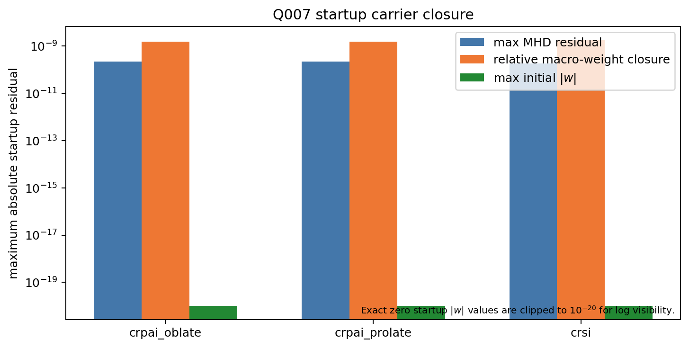

*Figure 8. Q007 heterogeneous startup diagnostics for CRPAI oblate, CRPAI prolate and CRSI carriers. Absolute MHD residuals, relative macro-weight closure and clipped exact-zero delta-f weights share a log axis for compact display but are not directly comparable. This validates source-local initialization, not physical instability growth.*

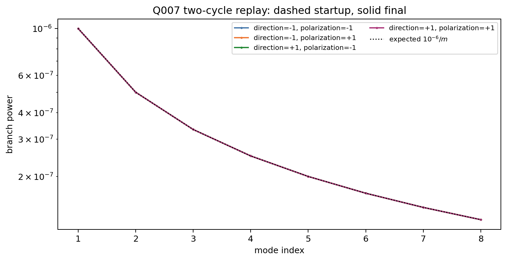

*Figure 9. Q007 CRSI branch powers before and after the bounded replay. All four branches overlap the expected $10^{-6}/m$ startup profile, with only small two-cycle changes. CRPAI is startup-only and remains fail-closed for runtime evolution pending handedness-label review. The time span is too short for a growth-rate claim.*

### Q008: expanding-box CPAW convergence

Q008 retains 22 successful cases plus a fail-closed Roe-solver probe. The unsupported Roe probe exits with return code `1`, observes the expected rejection text, and emits no outputs. The static-mode on/off parity differences are $3.17 \times 10^{-8}$ for `mhd_w_bcc` and $2.50 \times 10^{-16}$ for MHD history.

Across all 22 successful cases, the largest selected coarse-preparation residual-to-guardrail ratio plotted here is $0.612$. The convergence families show amplitude orders of roughly $2.63$ to $4.06$ and phase orders of roughly $1.57$ to $1.88$ over the retained refinement pairs. These are apparent orders from three resolutions, not asymptotic-order proofs. The heatmap omits additional passing density, parallel-field and parallel-magnetic-energy diagnostics and combines the two transverse-energy residuals with a maximum.

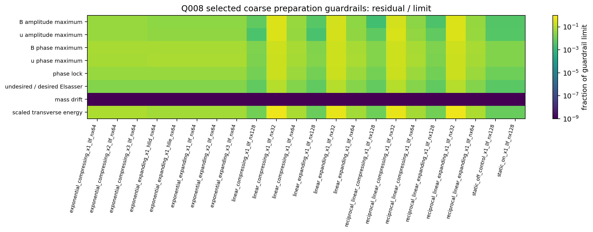

*Figure 10. Selected Q008 coarse-preparation residuals divided by their displayed limits for all 22 successful cases. Every plotted cell remains below $1$; the largest fraction is $0.612$. The figure is a compact selected-metric view, not the full retained oracle inventory.*

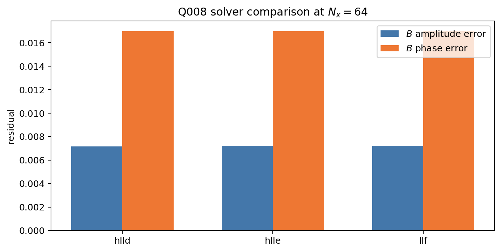

*Figure 11. Q008 solver comparison for the exponential expanding $x_1$ case at $N_x=64$. HLLD, HLLE and LLF produce similar bounded endpoint errors. This is a useful local cross-check, not a performance comparison.*

### Q011: bounded injection audit

Q011 retains 309 particles. Its eight octant counts are `[40, 34, 28, 39, 38, 38, 46, 46]`, versus an isotropic expectation of $309/8 = 38.625$ per octant. Its second moments are `[0.3283, 0.3532, 0.3185]`, near $1/3$, and its maximum absolute relative-speed residual is $4.82 \times 10^{-6}$ in code units. The analyzer labels the result `deterministic_bounded_statistics_not_exact_rng_replay`.

## 1.5 Validation strategy

The current pre-freeze local validation tranche combined broad test suites, focused regressions, static checks, documentation checks, retained-runtime analysis and visual inspection of the generated figures. The counts below are bound by the nonqualifying exact-boundary receipt for `d0ad350562799e609b4d22f45ce9ca314b38da82`. Figure 12 remains a visual summary rather than a qualifying scientific artifact.

| Validation class | Actual result | Interpretation |
| --- | --- | --- |
| Publication Python suite | 727 tests passed; 2 skipped | Combined broad local publication and nested control-plane discovery passed |
| Frontier control-plane suite | 364 tests passed | Registered-lifecycle and accounting controls passed locally |
| Focused hardening suite | 102 tests passed | Qualification fixtures, immutable snapshots, schema-alias rejection, analyzer substitution rejection and successor-policy registry checks passed |
| Sphinx warning-as-error build | Passed | Documentation renders without warning regressions |
| Readiness JSON parse sweep | 168 tracked report-scope JSON files parsed | Readiness, policy and generated figure-metric sidecars are syntactically valid |
| Python AST sweep | 88 publication Python files parsed | Publication Python sources are syntactically valid |
| `git diff --check` | Passed | No whitespace-error regression in the worktree diff |
| Touched C++ lint | Passed | Changed-file wrapper passed; the new Q006 C++ source also passed direct lint |
| Repository-wide C++ style baseline | Open inherited debt | Fresh wrapper-equivalent read-only scan reported 1,454 findings; retained Q042 sidecar records 1,456; earlier unretained scan reported 1,462. No single retained final receipt closes the baseline. |

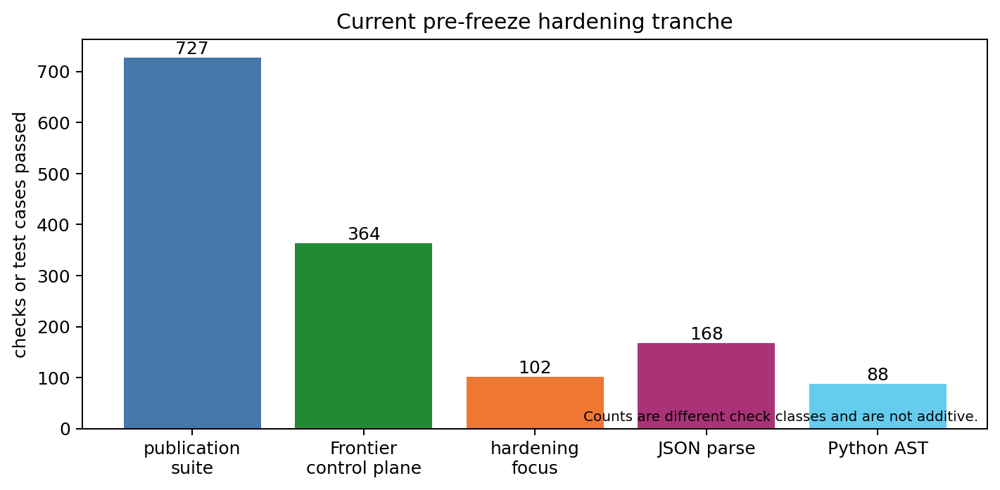

*Figure 12. Manually curated summary of passed local check classes in the current pre-freeze hardening tranche. Counts represent different classes and are not additive; parsed-file counts are not test counts. The final clean-tree rerun passed before the canonical freeze. The inherited repository-wide style baseline remains separately open.*

## 1.6 Caveats and next-stage plan

The current evidence is strongest for bounded serial-host mechanics and verifier behavior. It is not yet strong enough for physical paper claims or operational production claims. The immediate next-stage sequence is:

1. Complete the stable-boundary rereview, install the paired reviewed successor control-plane generation and freeze the canonical clean candidate.
2. Close prerequisite-complete registered Frontier MPI/HIP slices one at a time under the existing ledger policy after the freeze.
3. Add runtime, memory, sorting, deposition, coupling, communication and load-balance telemetry before scaling studies.
4. Freeze external-reference mappings and tolerances before physical comparison campaigns.
5. Obtain named external review, including disposition of Orion-only retention risk.

# Tier 2: Detailed methods, implementation, and validation

## 2.1 Problem definition

The governing software task is to make AthenaK's MHD-PIC implementation suitable for a bounded `paper_mhd_pic` release profile and for three selected `extended_mhd_pic` capabilities:

1. Hall Bell.
2. Ion-neutral-damped CRSI.
3. Adaptive-delta-f physical-damping CRPAI.

The governing scientific task is broader than local correctness. It includes reproducible Sun & Bai (2023) paper experiments, calibrated extension comparisons, nonlinear interpretation, statistical qualification and independent review. The current tranche does not complete that scientific task.

This report covers the bounded local-readiness work curated into the current commit series:

- dirty-worktree bounded host pinning from a clean build directory and immutable Orion-tree verification;
- Q023 Bell source-local MHD initialization and one-cycle restart-continuation visualization;
- Q006 exact-isothermal multispecies mechanics successors;
- Q007 source-local delta-f launch and replay hardening;
- Q008 self-contained CPAW expanding-box history snapshot;
- Q011 deterministic shock-injection audit;
- readiness-plan clarification and sidecar updates;
- broad local regression, static and documentation checks.

Intentionally deferred work includes production-scale Frontier campaigns, broad MPI/GPU and multi-node matrices, long-horizon growth or saturation fits, independent cross-code or literature comparisons, memory scaling, runtime scaling, and final external sign-off.

## 2.2 Data model and assumptions

### Retained layout

| Path | Content | Notes |
| --- | --- | --- |
| `/lustre/orion/ast207/proj-shared/dfielding/PIC/local-readiness/integrated-serial-host-binary-clean-20260531T034317Z` | Dirty-worktree bounded host pin produced from a clean build directory | Shared local binding anchor only; not the canonical clean-source release executable |
| `/lustre/orion/ast207/proj-shared/dfielding/PIC/q006-exact-isothermal-runtime-local-20260531-v4` | Q006 runtime tree and `reports/probe_summary.json` | 329 files |
| `/lustre/orion/ast207/proj-shared/dfielding/PIC/local-readiness/q007-paper-deltaf-runtime-replay-20260531-v4` | Q007 runtime tree | 38 files |
| `/lustre/orion/ast207/proj-shared/dfielding/PIC/local-readiness/q007-paper-deltaf-runtime-replay-20260531-v4-analysis.json` | Q007 adjacent exact analysis JSON | SHA-256 `bd1eb4dc58773b088ad3e97e8cf50bcd5fbda2aee61907767f52c10c34351113` |
| `/lustre/orion/ast207/proj-shared/dfielding/PIC/q008-cpaw-history-extension-20260531-v5` | Self-contained Q008 execution snapshot and `results.json` | 786 files including inventory |
| `/lustre/orion/ast207/proj-shared/dfielding/PIC/local-readiness/q011-injection-distribution-runtime-local-20260531-v4` | Q011 runtime and `runtime_audit_report.json` | 13 files |
| `/lustre/orion/ast207/proj-shared/dfielding/PIC/local-readiness/q011-injection-distribution-runtime-local-successor-audit-20260531-v1` | Q011 hardened replay after runtime-tree and executable-tree verification | 5 files |
| `/lustre/orion/ast207/proj-shared/dfielding/PIC/local-readiness/q023-bell-combined-observable-smoke-20260530` | Legacy retained read-only Q023 Bell source-local smoke | 61 files; aggregate SHA-256 `29a0a14b...` |
| `/lustre/orion/ast207/proj-shared/dfielding/PIC/ledger/node_hours.jsonl` | Append-only Frontier accounting ledger | 56 records |

### Array and record shapes

| Successor | Retained structure | Important shape or count |
| --- | --- | --- |
| Q006 | Snapshot dictionary | Uniform, SMR, audited-AMR evolution and audited-AMR restart summaries; 131,072 to 589,824 particles |
| Q007 | Branch-spectrum records and startup summaries | 32 branch records = 4 direction-polarization branches $\times$ 8 modes; 262,144 startup particles per carrier |
| Q008 | Keyed case dictionary plus convergence observations | 22 successful cases; 4 literal profiles $\times$ 3 resolutions for convergence |
| Q011 | Injection runtime audit | 309 particles; 8 octant counts; 3 direction means; 3 second moments |
| Q023 Bell smoke | Athena binary MHD snapshots plus restart payloads | 2D cycle-zero and one-cycle continuation MHD fields; no serialized particle VTK or phase-space output |
| Ledger | JSON-lines event chain | 56 total records; 23 reconciled accounting rows |

### Units and coordinate conventions

The retained local analyzers report dimensionless or AthenaK code-unit quantities. This report preserves those conventions rather than assigning physical units that were not reconstructed. Q008's tested waves propagate along selected `x1`, `x2` or `x3` carrier axes. Q011 places injected particles at the clamped $x_1$ shock surface, with a retained maximum absolute placement residual of $3.20 \times 10^{-20}$.

The Q006, Q007, Q008 and Q011 successors and the Q023 Bell smoke are bounded local carriers. Their sampling assumptions are deliberately narrow. They do not establish long-time statistical stationarity, physical calibration, GPU parity or decomposition invariance unless explicitly stated. Q023 is additionally limited by the absence of a serialized same-run particle-space product.

## 2.3 Mathematical definitions

### Q006 mechanics

Q006 computes fluid and particle momenta separately and stores the total:

$$
\mathbf{p}_{\rm total}
=
\mathbf{p}_{\rm fluid}
+
\mathbf{p}_{\rm particles}.
$$

The plotted endpoint closure is the retained component infinity norm

$$
\left\| \mathbf{p}_{\rm total} \right\|_\infty
=
\max_i \left| p_{{\rm total},i} \right|.
$$

The total kinetic-energy-density deviation is

$$
\epsilon_K
=
\frac{\left| K_{\rm total}/V - K_{\rm expected}/V \right|}
{K_{\rm expected}/V},
\qquad
\frac{K_{\rm expected}}{V} = 0.06.
$$

These are short-horizon endpoint engineering diagnostics for the exact-isothermal local carriers. Uniform, SMR and audited-AMR evolution are sampled at $t=0.02$; the audited-AMR restart point is sampled at $t=0.03$. They are not a general AMR convergence norm, and the worktree does not freeze an accepted carrier-to-carrier mesh-transition tolerance. The anchor $K_{\rm expected}/V = 0.06$ is the analyzer's exact-isothermal prepared-carrier target; this report does not derive it as a general physical normalization.

The retained Q006 deck is a low-speed Newtonian-coordinate characterization with initialized speed $0.1$, code-light-speed parameter $c=1000$, momentum feedback enabled and energy feedback disabled. It therefore exercises local carrier mechanics but does not qualify relativistic stress or energy-feedback behavior.

### Q007 branch initialization

For direction $d \in \{-1, +1\}$, signed polarization $s \in \{-1, +1\}$ and mode $m \in \{1,\ldots,8\}$, Q007 stores

$$
P_{d,s}(m).
$$

The source-local launch target is

$$
P_{d,s}(m) \approx \frac{10^{-6}}{m}.
$$

Each retained spectrum has 32 records: four direction-polarization branches times eight modes. Three startup spectra are retained, but the final two-cycle spectrum is CRSI-only. CRPAI runtime evolution remains fail-closed pending handedness-label review. The finite-bin quadrature, angular sampler, wave seed and discrete carrier-mode set are explicit source-local conventions because the manuscript does not freeze those choices.

The plotted CRSI initial-final comparison is descriptive. A growth estimator would require a preregistered time window, sufficient temporal baseline, mode selection, uncertainty model and independent recomputation. Those conditions are not met by a two-cycle replay. The retained startup payload also records serialization diagnostics with different meanings: for example, CRSI `vtk_inferred_shell_center_max_abs_error` is `164.90074008512602`, while `vtk_serialized_velocity_max_abs_error` is zero. The analyzer does not treat the inferred shell-center diagnostic as a failing direct serialization residual.

### Q008 residuals and convergence

Q008 stores endpoint and maximum amplitude or phase residuals, maximum phase-lock residuals, undesired-to-desired Elsasser ratios and history diagnostics. The selected coarse-preparation heatmap displays

$$
r_{j,c}
=
\frac{e_{j,c}}{L_j},
$$

where $e_{j,c}$ is residual $j$ for case $c$ and $L_j$ is its configured local limit. The displayed limits are:

| Metric | Limit |
| --- | ---: |
| Magnetic amplitude maximum relative error | $0.25$ |
| Velocity amplitude maximum relative error | $0.25$ |
| Magnetic phase maximum absolute error | $0.25$ |
| Velocity phase maximum absolute error | $0.25$ |
| Velocity-magnetic phase-lock absolute error | $0.01$ |
| Undesired-to-desired Elsasser ratio | $0.01$ |
| Mass relative drift | $10^{-6}$ |
| Scaled transverse-energy relative error | $0.25$ |

The plotted rows are a selected reporting view, not the full Q008 pass predicate. They omit additional passing density, parallel-field and parallel-magnetic-energy checks and collapse the two transverse-energy checks with a maximum. The report generator duplicates the retained sidecar's coarse preparation limits explicitly; these are not frozen publication thresholds.

For each literal profile and endpoint residual family, the retained apparent order is

$$
p_{N \rightarrow 2N}
=
\log_2 \left( \frac{e_N}{e_{2N}} \right).
$$

### Q011 injection sampler

Q011 audits one untransported cycle-one serial sample on a reduced $8 \times 16 \times 1$ uniform 2D3V domain. It checks a monoenergetic full-sphere sampler relative to the clamped serialized shock-surface coordinate $x_1 = 8 \times 10^{-12}$, not directly against the ideal model surface at $x_1 = 0$. For normalized direction $\hat{\mathbf{v}}$,

$$
\boldsymbol{\mu}
=
\left\langle \hat{\mathbf{v}} \right\rangle,
\qquad
\mathbf{m}_2
=
\left\langle \hat{\mathbf{v}}^2 \right\rangle.
$$

The retained values are

$$
\boldsymbol{\mu}
=
(0.05589,\,-5.995 \times 10^{-5},\,0.006989),
$$

and

$$
\mathbf{m}_2
=
(0.3283,\,0.3532,\,0.3185).
$$

The pass contract requires every direction-mean component to remain within $0.12$, every second moment to remain within $[0.25, 0.42]$, and every octant to be populated. These are bounded sample statistics, not an exact RNG replay and not a population-level uncertainty estimate. Physical gas-pressure and unit normalization, macro-mass and downstream-PPC calibration, AMR-versus-fine-uniform residual qualification, GPU/HIP/MPI/decomposition/Frontier qualification, independent raw-artifact recomputation and external review remain open.

## 2.4 Algorithm and implementation

### Frozen-tree verifier

`tst/publication/immutable_orion_tree.py` centralizes retained-tree verification. The implemented hardening includes:

- canonical tar member names;
- rejection of source-archive caches;
- ELF and executable-mode validation for retained binaries;
- source-archive dependency hashing;
- rejection of unknown active-snapshot members outside verified directories;
- sealed semantic copies for multi-pass ordinary-file validators;
- mutation-checked text metadata reads;
- serial-host build-evidence validation;
- robust frozen-tree inventory checks.

The design choice is intentionally conservative: evidence consumers read immutable trees and exact sidecars rather than trusting an active source checkout or an ad hoc working-directory layout.

### Q023 Bell qualitative smoke

The report generator reads two hash-bound `mhd_w_bcc` snapshots from `/lustre/orion/ast207/proj-shared/dfielding/PIC/local-readiness/q023-bell-combined-observable-smoke-20260530`. This older source-local tree predates the shared inventory-file convention, so the generator recomputes its sidecar-recorded 61-file aggregate SHA-256 `29a0a14bbbd0e879e2cb6fb321758904a8fe8d5783612992f0de2585dca842d5`, rejects writable entries or symbolic links, and separately binds the plotted initial and continuation file digests.

The plotted `2d` initialization is cycle zero at $t=0$. The plotted `restart2d` continuation is cycle one at $t=0.0015625$. The binary snapshots contain MHD density, internal energy, velocity and cell-centered magnetic-field components. CR particles were coupled internally and restart payloads were retained, but the retained smoke does not serialize a particle VTK or phase-space product. Figure 2 is therefore an honest qualitative MHD visualization and a visible reporting-gap record, not a Bell instability-evolution result.

### Q006

`tst/publication/analyze_q006_paper_multispecies_oscillation_runtime_local.py` analyzes exact-isothermal local carriers. New source-local decks cover uniform, SMR and audited-AMR runtime paths:

- `inputs/tests/pic_q006_paper_multispecies_oscillation_uniform_runtime_local.athinput`
- `inputs/tests/pic_q006_paper_multispecies_oscillation_smr_runtime_local.athinput`
- `inputs/tests/pic_q006_paper_multispecies_oscillation_audited_amr_runtime_local.athinput`

The associated problem generator is `src/pgen/tests/q006_paper_multispecies_oscillation_runtime_local.cpp`.

### Q007

Q007 hardening spans the runtime source and analyzer:

- `src/pgen/tests/q007_paper_deltaf_linear.cpp`
- `src/pgen/tests/q007_paper_deltaf_linear.hpp`
- `tst/publication/analyze_q007_paper_deltaf_linear_preparation.py`

The analyzer now performs exact-schema checks, pinned-executable binding, direct-fallback CLI import, raw array-shape closure, coordinate closure, `MaxLevel` closure and exact directory checks. The retained runtime tree includes a CRSI two-cycle replay, CRPAI-prolate and CRPAI-oblate startup-only carriers, plus a negative CRPAI `nlim=1` rejection case. CRPAI runtime evolution intentionally remains fail-closed pending handedness-label review.

### Q008

Q008 is generated by `tst/scripts/particles/pic_mhd_expanding_box_cpaw_history_preparation.py`. The final retained v5 artifact is a self-contained snapshot execution. It inventories 785 payload files plus the inventory file, freezes execution sidecars and reproduces the v4 numerical `results.json` byte-for-byte with SHA-256 `74dfe1c671e0b462a8c82b76031bac91e7586032b1ddc35f87428a33155319b0`.

The 22 successful cases cover:

- exponential expanding and compressing profiles on $x_1$, $x_2$ and $x_3$;
- HLLD, HLLE and LLF solver comparison for the exponential expanding $x_1$ carrier;
- linear and reciprocal-linear expanding and compressing convergence families at $N_x=32$, $64$, $128$;
- static mode on/off parity;
- a separate fail-closed unsupported Roe probe.

### Q011

`tst/publication/analyze_q011_injection_distribution_runtime_local.py` audits a retained particle VTK artifact from `inputs/tests/pic_q011_injection_distribution_runtime_local.athinput`. It verifies source and deck hashes, provenance, particle count, monoenergetic full-sphere statistics and single-surface placement.

The hardened analyzer also replays the retained v4 payload only after independently verifying its immutable runtime tree and the separately frozen executable tree. That successor replay is archived under `/lustre/orion/ast207/proj-shared/dfielding/PIC/local-readiness/q011-injection-distribution-runtime-local-successor-audit-20260531-v1` with inventory SHA-256 `a8343749f7cbe49af25a1c07e77645de1d39a8093d0cbf0b9d98cc272129e93c`. It strengthens provenance closure without changing Q011's nonqualifying bounded-diagnostic role.

### Memory and parallelism strategy

The report generator `tst/publication/generate_pic_status_update_figures.py` first validates all six frozen-tree inventories, including the separately archived Q011 hardened replay, the legacy read-only Q023 Bell aggregate, recursive read-only state, the adjacent Q007 analysis digest, the active mirrored storage policy, the mirrored ledger chain and receipts, the pinned ledger tail at sequence `55`, and the policy-derived node-hour cap. It then reads summary JSON products and verified inventory trees rather than loading bulk simulation arrays into memory. This is appropriate for a report artifact, but it is not a memory-scaling benchmark.

The Q006, Q007, Q008 and Q011 evidence and the Q023 Bell smoke reported here are bounded serial-host or source-local evidence. Historical registered Frontier jobs exist in the authoritative ledger, but no new scheduler campaign was launched for this report. Runtime scaling, GPU memory scaling, rank scaling and load-balance telemetry remain open.

## 2.5 Validation

### Local software checks

| Test | Purpose | Method | Actual result | Tolerance or pass rule | Status |
| --- | --- | --- | --- | --- | --- |
| Publication suite | Exercise publication analyzers and verifier contracts | Python unit discovery under `tst/publication` with the control-plane import path | 727 passed, 2 skipped | No failures | Pass |
| Frontier control-plane suite | Exercise registered lifecycle, immutable promotion and ledger controls | Python unit discovery under `tst/publication/frontier_control_plane` | 364 passed | No failures | Pass |
| Hardening focus | Stress candidate closure, descriptor snapshots, exact schema types and registry lifecycle | Focused publication tests | 102 passed | No failures | Pass |
| Documentation | Detect warning regressions | Sphinx HTML build with `-W --keep-going -E` | Passed | No Sphinx warnings | Pass |
| Readiness JSON syntax | Detect malformed readiness records | Parse tracked readiness, policy and generated figure-metric JSON files | 168 parsed | No parse errors | Pass |
| Python syntax | Detect malformed publication Python sources | AST parse sweep | 88 parsed | No syntax errors | Pass |
| Diff whitespace | Detect whitespace regressions | `git diff --check` | Clean | No findings | Pass |
| Targeted C++ lint | Check touched C++ files | Changed-file wrapper plus direct lint of the new Q006 source | Passed | No touched-file findings | Pass |
| Repository C++ style baseline | Measure inherited style debt | Repository-wide wrapper-equivalent scan and retained Q042 sidecar | Fresh read-only scan: 1,454; retained sidecar: 1,456 | Zero required for closure | Open inherited debt; no single retained final receipt |

### Q006 validation

Q006's parser-contract suite reports 6 positive and 31 negative parser cases passing. Runtime snapshots include uniform startup, uniform evolution, SMR evolution, audited-AMR evolution and audited-AMR restart. The retained report explicitly keeps long-horizon, true-AMR policy qualification, MPI, GPU, Frontier and external-review items open.

### Q007 validation

Q007 verifies three startup carriers, exact branch-spectrum initialization, retained raw artifact shapes, a CRSI-only final two-cycle replay spectrum and a negative CRPAI `nlim=1` rejection. Startup MHD errors are below $2.18 \times 10^{-10}$ and macro-weight relative closure is below $1.87 \times 10^{-9}$. The analyzer refuses growth-fit credit and keeps CRPAI runtime evolution closed pending handedness-label review.

### Q008 validation

Q008 validates 22 successful cases, static on/off parity, dimensional axes, three supported solvers and a fail-closed unsupported Roe solver. The largest displayed guardrail fraction is $0.612$. The retained v5 result payload is byte-identical to v4 while improving self-contained evidence packaging.

### Q011 validation

Q011 verifies:

- one retained serial-host particle VTK artifact;
- one separately frozen hardened successor replay after immutable runtime-tree and executable-tree verification;
- 309 injected particles;
- serial tags from `0` to `308`;
- one clamped serialized shock-surface coordinate at $x_1 = 8 \times 10^{-12}$;
- maximum placement residual $3.20 \times 10^{-20}$ relative to that clamped coordinate;
- octant census;
- direction means and second moments;
- maximum absolute relative-speed residual $4.82 \times 10^{-6}$.

### Q023 Bell-smoke visualization validation

The report generator recomputes the retained Q023 61-file aggregate SHA-256, enforces recursive read-only state and binds the plotted MHD snapshots directly. The visualization records cycle-zero and one-cycle restart-continuation MHD fields only. It explicitly reports `serialized_pic_phase_space_available: false` in `figure_metrics.json`. No growth fit, turbulence morphology claim, saturation claim or Section 5.2 paper-reproduction credit is assigned.

### Independent review

Earlier implementation work used independent subagents to split Q006, Q007, Q008 and Q011 analysis and to check the resulting implementation. This report also received five separate post-draft reviews: Tier 0 readability, Tier 1 technical readability, Tier 2 expert audit, Tier 3 reproducibility audit and an adversarial whole-report challenge. Their findings were reconciled before delivery and are summarized in Appendix B.

## 2.6 Results

### Robust local conclusions

The following statements are supported by retained local evidence:

1. The dirty-worktree bounded host executable pin and source archive are inventoried and hash-bound. The build directory was clean; the archived source worktree was not.
2. Q006 uniform mechanics closure is near numerical precision, while SMR and AMR restart carriers expose larger observed short-horizon residuals without a frozen mesh-transition acceptance threshold.
3. Q007 source-local initialization produces the intended four-branch $10^{-6}/m$ spectrum and exact zero initial delta-f weights for all three startup carriers.
4. Q008's 22-case bounded serial-host preparation matrix remains inside its coarse preparation guardrails, rejects unsupported Roe use without outputs, and shows decreasing amplitude and phase errors over its retained resolution families.
5. Q011's bounded injection audit is internally consistent with its deterministic full-sphere diagnostic contract.
6. Q023 provides an inspectable qualitative Bell-carrier MHD initialization and one-cycle continuation view while exposing the missing serialized same-run PIC output.
7. Broad local publication, control-plane, rebinding, syntax, documentation and touched-file checks pass.

### Likely but not yet qualified conclusions

The Q008 convergence trends provide useful self-consistency preparation evidence for the bounded expanding-box MHD path against its internal oracles. The Q011 sample is consistent with broadly isotropic loading. The Q006 residual pattern suggests that AMR and restart handling, rather than uniform mechanics, deserve the next deeper mechanics checks.

These statements are interpretations of local diagnostics. They are not release claims.

### Artifact footprint

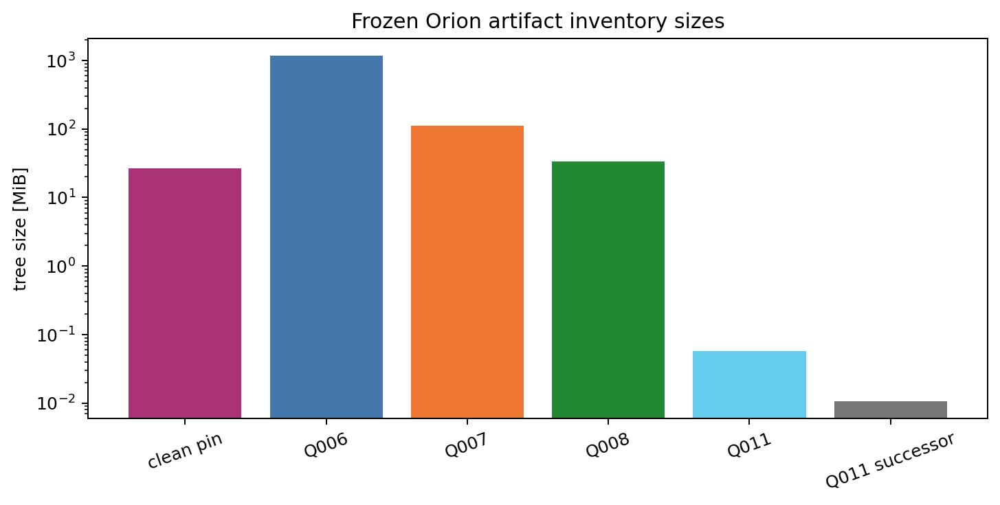

*Figure 13. Frozen Orion artifact-tree sizes computed by the report generator. Q006 is the largest retained local tree at about 1.15 GiB; both Q011 trees are deliberately small. This matters for continuation planning and for the explicit Orion-only durability risk.*

### Frontier accounting

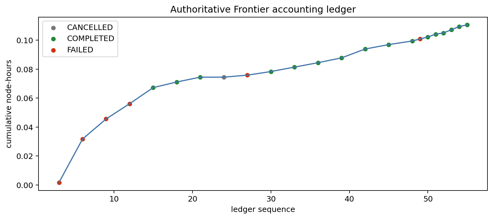

*Figure 14. Cumulative node-hours from the authoritative reconciled Frontier ledger snapshot through sequence `55`, whose tail SHA-256 is `538a5623...`. The final cumulative use is $0.11056$ node-hours under the user-authorized 10,000 node-hour cap. Accounting-only imported direct-`srun` rows remain ineligible for scientific evidence.*

### Diagnostics intentionally not manufactured

This local tranche does not contain a physical parameter scan suitable for a two-dimensional correlation map, fitted physical slope, uncertainty band or matched literature comparison. It also does not contain production runtime-scaling or memory-scaling telemetry. Figure 10 is a selected coarse-preparation guardrail view and Figure 14 is an accounting ledger; neither substitutes for those missing diagnostics. The absent physics and performance plots remain open production-plan work rather than being approximated from insufficient data.

## 2.7 Failures and discarded approaches

The initial implementation review identified four model-level defects that disqualified a production-ready claim:

1. Paper and Hall induction were conflated.
2. Particle velocity state was non-relativistic.
3. Delta-f was quiet-start only.
4. Expanding-box support scaled particles without the corresponding MHD map.

The worktree contains bounded repairs, but the plan correctly keeps physical and Frontier qualification open.

During the current local-readiness tranche, Q008 v4 produced the retained numerical result but was superseded by v5 because the evidence package needed to be self-contained. The v5 execution reproduced the v4 `results.json` byte-for-byte.

An earlier Q008 probe used a stale executable with the wrong history behavior. It is retained as an excluded negative probe rather than promoted into the accepted v5 evidence package.

The retained Frontier chronology also includes rejected operational attempts. Fail-closed retries exposed generated-inventory close/reopen and identity-substitution defects, parser-schema omissions, escaped-output handling defects and queue or policy preflight mismatches before accepted successors were retained. The six failed accounting rows consumed $0.058888888888888886$ node-hours, or $53.3\%$ of the small cumulative total. These are negative engineering results, not scientific evidence and not history to erase.

During report generation, the first adapter pass assumed shared layout conventions across Q006, Q007, Q008, Q011 and the historical ledger. That assumption failed closed: Q007 stores its exact analysis beside the frozen tree, Q008 uses keyed nested oracle records, Q011 names its sampler contract explicitly, and older ledger events do not contain cumulative accounting fields. The generator was corrected to interpret each schema explicitly and to plot reconciled ledger rows only.

The repository-wide C++ style baseline remains open. A fresh wrapper-equivalent scan reported 1,454 inherited findings, the retained Q042 sidecar records 1,456 and an earlier unretained scan observed 1,462. The targeted touched-file lint passed, but no retained final receipt closes the inherited baseline count.

## 2.8 Remaining risks

| Risk | Why it matters | Current status |
| --- | --- | --- |
| Paper reproduction not executed end to end | Local carriers do not establish Sun & Bai (2023) reproduction | Open |
| Hall Bell qualification | Source-local implementation and parser hardening do not establish linear, nonlinear or shock-front agreement | Open |
| Bell same-run PIC visualization | Retained Q023 Bell smoke serializes MHD snapshots and restart payloads but no particle VTK or phase-space product | Open |
| Ion-neutral-damped CRSI qualification | Reduced static-neutral map is narrower than Plotnikov-matched transport validation | Open |
| Adaptive-delta-f physical-damping CRPAI qualification | Bounded launch and restart checks do not establish scattering, saturation or scaling | Open |
| MPI, HIP and multi-node portability | Serial-host evidence cannot establish Frontier correctness | Open |
| Runtime and memory scaling | Production feasibility and capacity remain unmeasured | Open |
| AMR and restart stress | Q006 restart residual is visibly larger and broad lifetime matrices remain incomplete | Open |
| Frontier filesystem and scheduler-pretimeout drills | Local fault injection does not cover all operational failure modes | Open |
| Orion-only retention | Orion is purge-eligible and not an institutional archive | Pending external disposition |
| Candidate freeze pending | Curated commits are not a production baseline until the canonical source bundle and HIP/MPI executable are archived together | Open |
| External review | No pending disposition may be promoted to qualified without a named reviewer | Pending |

## 2.9 Recommended next steps

1. **Immediate:** complete the stable-boundary rereview, install the paired reviewed successor control-plane generation, build the canonical HIP/MPI Release executable and freeze the clean candidate.
2. **Validation:** run the next prerequisite-complete registered Frontier MPI/HIP slice under the serialized scheduler policy and reconcile the ledger immediately.
3. **Production preparation:** add runtime and memory telemetry for pusher, deposition, coupling, communication, sorting, AMR, load balance, output and restart paths.
4. **Scientific qualification:** freeze comparison mappings, extracted reference data, tolerances, fit windows, seeds and uncertainty methods before launching physical Hall Bell, damped-CRSI or adaptive-delta-f CRPAI campaigns. Require same-run particle distribution, current and field snapshots for Bell visualization.
5. **Retention and review:** perform Orion restore drills where required and obtain named external disposition for evidence retention and terminal gates.

# Tier 3: Reproducibility, audit trail, and handoff

## 3.1 Repository state

| Item | Value |
| --- | --- |
| Repository path | `/ccs/home/dfielding/athenak-pic` |
| Resolved path in this environment | `/autofs/nccs-svm1_home2/dfielding/athenak-pic` |
| Branch | `PIC` |
| Tested code-and-control boundary | `d0ad350562799e609b4d22f45ce9ca314b38da82` |
| Boundary validation receipt | `tst/publication/readiness/phase0_exact_boundary_validation_receipt_2026-05-31.json`; this reconciliation follows the schema-alias repair |
| Current HEAD | Resolve with `git rev-parse HEAD` before installation |
| Upstream | `origin/PIC` |
| Ahead/behind | Tested code-and-control boundary: 119 ahead, 0 behind |
| Worktree | Expected clean after this reconciliation; verify with `git status --short --branch` before installation |
| Deleted files | None observed |
| New report | `STATUS_UPDATE.md` |
| New figure generator | `tst/publication/generate_pic_status_update_figures.py` |
| New figure directory | `figures/status_update/` |

The schema-hardened code-and-control boundary is committed. This reconciliation
records the stronger fail-closed boundary, exact clean validation receipt and
deterministic tracked-JSON sweep. Stable-boundary rereview remains required
before installation. Do not
treat the curated commit series as a frozen release baseline until the
canonical clean-candidate operation archives the source bundle and HIP/MPI
executable together. Inspect the current list with:

```bash
git status --short --branch
```

### Phase 0 release boundary

| Boundary | Current value | Status |
| --- | --- | --- |
| Live paired control plane | `6f3458ca5c412b866f579d67dde51d73497b65629f6e7a35e10a3af84d7ecd8b` | Installed historical generation; remains live until paired promotion |
| Successor source control plane | `738d28d97e3ca58c1203651237fd91b1f6c0a418023fe9137fdbd7b344eafc68` | Expanded schema-alias repair source; fresh clean matrix, stable rereview and paired install pending |
| Prepared-artifact inventory | `c640aa93acba6a1537480fb9a7a53e0dab9f49719a4bcee96f25461b1d4d1398` | Regenerated canonical archived-source closure: 87 PIC decks and 12 publication analyzers |
| Canonical schema-v4 freeze | Not yet created | Open Phase 0 gate |

The live installed policy intentionally remains paired at the historical
generation until promotion. The pending source-side transition policy pairs
both controller fields at the successor digest, clears inherited science
registrations and marks the schema-v4 freeze pending. The successor digest is
recorded separately in
`tst/publication/readiness/phase0_curated_candidate_successor_2026-05-31.json`.
This prevents a reviewed source generation from being confused with an
installed or authorized production baseline.

Major implementation paths modified or added in the tranche include:

| Path | Role |
| --- | --- |
| `src/particles/particles.cpp` | Particle runtime integration edits |
| `src/pgen/pgen.cpp`, `src/pgen/pgen.hpp` | Problem-generator registration |
| `src/pgen/tests/q006_paper_multispecies_oscillation_runtime_local.cpp` | Q006 local runtime generator |
| `src/pgen/tests/q007_paper_deltaf_linear.cpp`, `src/pgen/tests/q007_paper_deltaf_linear.hpp` | Q007 local source hardening |
| `tst/publication/immutable_orion_tree.py` | Shared immutable-tree verifier |
| `tst/publication/analyze_q006_paper_multispecies_oscillation_runtime_local.py` | Q006 analyzer |
| `tst/publication/analyze_q007_paper_deltaf_linear_preparation.py` | Q007 analyzer |
| `tst/publication/analyze_q011_injection_distribution_runtime_local.py` | Q011 analyzer |
| `tst/scripts/particles/pic_mhd_expanding_box_cpaw_history_preparation.py` | Q008 retained matrix generator |
| `tst/publication/PIC_PRODUCTION_READINESS_PLAN.md` | Governing plan and handoff updates |

## 3.2 Commands and scripts

### Regenerate report figures

Run from the repository root:

```bash
python3 tst/publication/generate_pic_status_update_figures.py
```

The generator fails closed before writing figures unless all six inventoried retained trees pass recursive read-only verification, including the Q011 hardened successor replay, the legacy Q023 Bell smoke passes its 61-file anchored aggregate check, consumed regular payloads are exposed through sealed descriptor-backed members, the adjacent Q007 analysis digest matches, the mirrored active storage policy validates, the Orion and Project Home ledgers plus receipts validate through pinned sequence `55` and tail SHA-256 `538a5623cd672009bc903d6fc17b20b4dc7b503cae3e560aa362ebe0f3615b95`, and the node-hour cap is read from active policy. It then regenerates:

```text
figures/status_update/
```

and writes machine-readable plotted values to:

```text
figures/status_update/figure_metrics.json
```

### Fail-closed artifact verification

```bash
python3 tst/publication/generate_pic_status_update_figures.py
```

Do not replace that command with a `sha256sum` listing of manifest files. The generator uses `tst/publication/immutable_orion_tree.py` for inventory membership, payload hashes, recursive modes, anchored legacy-Q023 traversal and sealed lazy payload materialization, then imports the paired installed control plane selected by `policy/active_promotion.json` to validate active policy and the mirrored ledger chain. A later legitimate ledger append requires an intentional report-snapshot refresh rather than silent figure drift.

### Local Python validation

Run the broad publication suite with the nested control-plane modules on `PYTHONPATH`:

```bash
PYTHONDONTWRITEBYTECODE=1 \
PYTHONPATH=.:tst/publication/frontier_control_plane \
python3 -B -m unittest discover -s tst/publication -p 'test_*.py' -q
```

Run the control-plane suite independently:

```bash
PYTHONDONTWRITEBYTECODE=1 \
PYTHONPATH=. \
python3 -B -m unittest discover \
  -s tst/publication/frontier_control_plane -p 'test_*.py' -q
```

The focused sealed-snapshot and rebinding rerun is:

```bash
PYTHONDONTWRITEBYTECODE=1 \
PYTHONPATH=. \
python3 -B -m unittest -q \
  tst.publication.test_pic_qualification_manifest \
  tst.publication.test_immutable_orion_tree \
  tst.publication.test_analyze_q011_injection_distribution_runtime_local \
  tst.publication.test_analyze_q006_paper_multispecies_oscillation_runtime_local \
  tst.publication.test_analyze_q007_paper_deltaf_linear_preparation \
  tst.publication.test_pic_readiness_registry.PicReadinessRegistryTests.test_storage_policy_records_authorized_frontier_boundary \
  tst.publication.test_pic_readiness_registry.PicReadinessRegistryTests.test_registered_science_staged_bindings_recompute_from_exact_files
```

### Documentation verification

The verified documentation command used Sphinx `9.0.4` from an isolated temporary environment:

```bash
/tmp/athenak-pic-docs-venv/bin/sphinx-build \
  -b html -W --keep-going -E \
  docs/source \
  /tmp/athenak-pic-sphinx-final
```

Recreate that ephemeral environment after `/tmp` cleanup with the repository requirements:

```bash
python3 -m venv /tmp/athenak-pic-docs-venv
/tmp/athenak-pic-docs-venv/bin/python -m pip install -r docs/requirements.txt
```

`docs/requirements.txt` is the repository dependency declaration, not an exact lockfile. Record `pip freeze` in a future retained validation receipt if exact documentation-environment replay becomes a release requirement.

### Static verification

```bash
git diff --check
```

Parse the exact tracked report JSON scope. This intentionally excludes ignored
runtime residue under `tst/.codex` and `tst/build`:

```bash
python3 - <<'PY'
import json
import subprocess
from pathlib import Path
paths = [
    Path(path)
    for path in subprocess.check_output(["git", "ls-files"], text=True).splitlines()
    if path.endswith(".json")
    and path.startswith(("tst/publication/", "figures/status_update/"))
]
for path in paths:
    json.loads(path.read_text(encoding="utf-8"))
print(len(paths))
PY
```

Parse the publication Python sources:

```bash
python3 - <<'PY'
import ast
from pathlib import Path
paths = sorted(Path("tst/publication").rglob("*.py"))
for path in paths:
    ast.parse(path.read_text(encoding="utf-8"), filename=str(path))
print(len(paths))
PY
```

The touched C++ lint and repository-wide baseline commands are:

```bash
python3 tst/scripts/style/cpplint.py \
  src/pgen/tests/q006_paper_multispecies_oscillation_runtime_local.cpp
bash tst/scripts/style/check_athena_cpp_style.sh
```

The changed-file lint and direct lint of the new Q006 C++ source passed. The repository-wide baseline remains open: a fresh wrapper-equivalent read-only scan reported 1,454 findings while the retained Q042 sidecar records 1,456. No single retained final receipt closes that inherited-debt count.

### Scheduler policy

Do not submit a new Frontier job casually. Read the governing plan first. All Frontier simulations must remain below:

```text
/lustre/orion/ast207/proj-shared/dfielding/PIC
```

Use one AthenaK PIC submission at a time across the allowed QOS classes. Prefer eligible short non-production `debug` work only when policy allows it; otherwise use `normal` on `batch`. The current cap is 10,000 node-hours.

### Random seeds

No new stochastic production campaign was launched for this report. Q011 is a deterministic bounded-statistics diagnostic, not an exact RNG replay. Before a qualifying statistical campaign, use the preregistered seed and exclusion records referenced by the governing plan rather than inventing new seeds.

## 3.3 Compute accounting

| Item | Value |
| --- | ---: |
| Authoritative ledger | `/lustre/orion/ast207/proj-shared/dfielding/PIC/ledger/node_hours.jsonl` |
| Total ledger records | 56 |
| Reconciled accounting rows | 23 |
| Completed rows | 16 |
| Failed rows | 6 |
| Cancelled rows | 1 |
| Failed-row consumed node-hours | $0.058888888888888886$ |
| Failed-row share of cumulative use | $53.3\%$ |
| Cumulative consumed node-hours | $0.11055555555555553$ |
| Pinned ledger tail | Sequence `55`; SHA-256 `538a5623cd672009bc903d6fc17b20b4dc7b503cae3e560aa362ebe0f3615b95` |
| Authorized cap | $10{,}000$ node-hours |
| Remaining budget | $9{,}999.889444444445$ node-hours |
| Active reservations after retained reconciliation | 0 |
| New scheduler submissions for this report | 0 |

Seven imported direct-`srun` rows for jobs `4746332`, `4746335`, `4746336`, `4746337`, `4746341`, `4746342` and `4746343` are accounting-only and explicitly ineligible for scientific evidence.

The next-stage compute cost cannot be estimated defensibly yet because production runtime and memory scaling telemetry remain open. Do not infer a campaign budget from the small consumed total.

## 3.4 Output inventory

| Output path | Description | Status | Approximate size | Required for continuation | Regenerable |
| --- | --- | --- | ---: | --- | --- |
| `STATUS_UPDATE.md` | This multi-tier report | Generated | Markdown text | Yes | Yes, with editorial work |
| `figures/status_update/` | Report figures and plotted metrics | Generated | Small report bundle | Yes | Yes |
| `tst/publication/generate_pic_status_update_figures.py` | Fail-closed figure generator | Tracked hardened source; stable rereview pending | Python source | Yes | Preserve |
| `/lustre/orion/ast207/proj-shared/dfielding/PIC/local-readiness/integrated-serial-host-binary-clean-20260531T034317Z` | Dirty-worktree bounded host pin from clean build directory | Frozen | 26.6 MiB | Yes | Preserve as bounded local evidence; never reuse as canonical release executable |
| `/lustre/orion/ast207/proj-shared/dfielding/PIC/q006-exact-isothermal-runtime-local-20260531-v4` | Q006 mechanics artifacts | Frozen | 1.15 GiB | Yes | Rerunnable, but preserve retained evidence |
| `/lustre/orion/ast207/proj-shared/dfielding/PIC/local-readiness/q007-paper-deltaf-runtime-replay-20260531-v4` | Q007 replay artifacts | Frozen | 112.2 MiB | Yes | Rerunnable, but preserve retained evidence |
| `/lustre/orion/ast207/proj-shared/dfielding/PIC/local-readiness/q007-paper-deltaf-runtime-replay-20260531-v4-analysis.json` | Q007 adjacent exact analysis input for report figures | Read-only adjacent JSON; SHA-256 `bd1eb4dc...` | 53.0 KiB | Yes | Rerunnable, but preserve retained evidence |
| `/lustre/orion/ast207/proj-shared/dfielding/PIC/q008-cpaw-history-extension-20260531-v5` | Q008 self-contained snapshot | Frozen | 33.5 MiB | Yes | Rerunnable, but preserve v5 |
| `/lustre/orion/ast207/proj-shared/dfielding/PIC/local-readiness/q011-injection-distribution-runtime-local-20260531-v4` | Q011 bounded audit | Frozen | 58.6 KiB | Yes | Rerunnable, but preserve retained evidence |
| `/lustre/orion/ast207/proj-shared/dfielding/PIC/local-readiness/q011-injection-distribution-runtime-local-successor-audit-20260531-v1` | Q011 hardened successor replay | Frozen; inventory SHA-256 `a8343749...` | Small JSON audit tree | Yes | Regenerable from retained trees, but preserve this replay |
| `/lustre/orion/ast207/proj-shared/dfielding/PIC/local-readiness/q023-bell-combined-observable-smoke-20260530` | Q023 legacy read-only Bell source-local MHD smoke | Retained read-only; aggregate SHA-256 `29a0a14b...` | 404.3 MiB payload | Yes, for Figure 2 | Preserve; does not contain particle VTK |
| `/lustre/orion/ast207/proj-shared/dfielding/PIC/ledger/node_hours.jsonl` | Authoritative accounting event chain | Append-only | Small JSONL | Yes | No; preserve history |
| `/lustre/orion/ast207/proj-shared/dfielding/PIC/ledger/mirror_receipts.jsonl` | Orion mirror receipts | Append-only | Small JSONL | Yes | No; preserve history |
| `/ccs/proj/ast207/proj-shared/PIC/ledger/node_hours.jsonl` | Project Home operational ledger mirror | Append-only mirror | Small JSONL | Yes | No; preserve history |
| `/lustre/orion/ast207/proj-shared/dfielding/PIC/policy/storage_policy.json` | Active Orion storage and scheduler policy | Read-only active policy | Small JSON | Yes | Promote only through installed control plane |
| `/lustre/orion/ast207/proj-shared/dfielding/PIC/policy/active_promotion.json` | Active policy promotion selecting installed control plane | Read-only active promotion | Small JSON | Yes | Promote only through installed control plane |

## 3.5 Known issues

1. The curated commit series still needs the canonical clean-candidate source-bundle and HIP/MPI executable freeze before it can be used as a production baseline.
2. The full paper reproduction and three selected extension qualifications remain open.
3. Runtime scaling, memory scaling and particle-aware load-balance measurements remain open.
4. Broad Frontier HIP/MPI, decomposition and multi-node matrices remain open.
5. MPI per-rank restart publication, node-loss, scheduler-pretimeout and Frontier-filesystem drills remain open.
6. Orion-only bulk retention is purge-eligible and awaits external disposition.
7. Q006 AMR restart residuals are larger than uniform residuals and need deeper stress coverage.
8. Q007 runtime evidence is only a two-cycle CRSI source-local replay; CRPAI is startup-only and must not be described as runtime evolution or a growth fit.
9. Q011 is a deterministic bounded diagnostic and must not be described as a statistical qualification.
10. Q023 Bell visualization is MHD-only source-local preparation smoke. A qualifying Bell campaign must serialize same-run particle distribution, current and field products.
11. The repository-wide C++ style baseline remains open; a fresh scan and retained Q042 sidecar currently differ by two inherited findings.

## 3.6 Continuation instructions

Read these first:

1. `tst/publication/PIC_PRODUCTION_READINESS_PLAN.md`
2. `STATUS_UPDATE.md`
3. `figures/status_update/figure_metrics.json`
4. `tst/publication/readiness/README.md`
5. `tst/publication/frontier_control_plane/README.md`
6. The Q006, Q007, Q008, Q011 and Q023 readiness sidecars under `tst/publication/readiness/`

Do not rerun the frozen local trees merely to regenerate plots. Use:

```bash
python3 tst/publication/generate_pic_status_update_figures.py
```

The report generator intentionally pins the ledger snapshot. If the append-only ledger has legitimately advanced beyond sequence `55`, review the new rows, refresh the expected tail constant in the generator, regenerate the report figures and record the new snapshot explicitly.

For historical operational-control-plane reads, follow
`tst/publication/frontier_control_plane/README.md`. The active installed runner
selected by the historical policy is:

```text
/lustre/orion/ast207/proj-shared/dfielding/PIC/control_plane/6f3458ca5c412b866f579d67dde51d73497b65629f6e7a35e10a3af84d7ecd8b/run_control_plane.py
```

This historical runner is chronology-only. Do not launch any new Frontier job
through it. Install, pair, promote and freeze the reviewed successor
`738d28d97e3ca58c1203651237fd91b1f6c0a418023fe9137fdbd7b344eafc68`
before registering or launching a new slice.

Do not launch a new Frontier simulation until:

1. the campaign-specific prerequisite gates are closed;
2. the campaign is registered and promoted under the current control-plane policy;
3. the queue and pending markers are checked;
4. the cumulative ledger budget is checked;
5. the output path is below `/lustre/orion/ast207/proj-shared/dfielding/PIC`;
6. the submission remains serialized across QOS classes.

Before scaling up, complete the canonical clean-candidate freeze. The local publication suite, Frontier control-plane suite, focused rebinding suite, documentation build, `git diff --check`, syntax sweeps and touched-file lint should pass again from the frozen source commit.

Human input is required before:

- increasing the 10,000 node-hour cap;
- changing the authorized Frontier root, QOS, partition or account policy;
- treating Orion-only retention as acceptable terminal archival;
- promoting pending dispositions to qualified;
- claiming paper reproduction or production readiness.

# Appendix A: Figure index

| Figure | File | Purpose |
| ---: | --- | --- |
| 1 | `figures/status_update/overview_workflow_schematic.png` | Intuitive evidence-flow schematic |
| 2 | `figures/status_update/q023_bell_mhd_pic_qualitative_gap.png` | Actual Bell-smoke MHD fields and explicit same-run PIC-output gap |
| 3 | `figures/status_update/q008_literal_profile_convergence.png` | Main Q008 convergence result |
| 4 | `figures/status_update/q011_injection_distribution.png` | Representative bounded injection diagnostic |
| 5 | `figures/status_update/readiness_gate_summary.png` | Categorical status summary |
| 6 | `figures/status_update/verifier_hardening_schematic.png` | Before-versus-after verifier schematic |
| 7 | `figures/status_update/q006_carrier_mechanics.png` | Q006 carrier topology and closure |
| 8 | `figures/status_update/q007_startup_residuals.png` | Q007 startup validation |
| 9 | `figures/status_update/q007_branch_spectrum_replay.png` | Q007 bounded replay spectrum |
| 10 | `figures/status_update/q008_case_guardrail_heatmap.png` | Q008 case census |
| 11 | `figures/status_update/q008_solver_comparison.png` | Q008 solver comparison |
| 12 | `figures/status_update/validation_summary.png` | Local validation classes |
| 13 | `figures/status_update/artifact_inventory_sizes.png` | Frozen artifact sizes |
| 14 | `figures/status_update/frontier_compute_ledger.png` | Frontier ledger consumption |

# Appendix B: Review disposition

Five independent post-draft reviews were completed and reconciled before report snapshot commit `897ca86ab61d6393f23122dcb842b1c84360aa18`. Later independent code audits found the same-account copied-snapshot substitution blocker, the topology-map race at the stable handoff boundary, mutable unknown-member fallback, in-place ordinary-inode rewrite windows and Python numeric schema aliases at release boundaries. The repairs and exact-source-contract rebind are committed through tested code-and-control boundary `d0ad350562799e609b4d22f45ce9ca314b38da82`; a fresh stable-boundary rereview remains required before paired installation or freeze.

| Review | Audit focus | Material disposition |
| --- | --- | --- |
| Tier 0 colleague read | Intuitive story, status boundaries and next action | Added the defect-to-repair map, surfaced the Q006 restart stress target, softened Q008 language and clarified that the status bars are categorical |
| Tier 1 technical read | Equations, captions, selected metrics and scope | Clarified the Q006 infinity norm and unfrozen threshold, marked the Q008 heatmap as selected and narrowed Q007 runtime language to CRSI replay |
| Tier 2 expert audit | Definitions, support for claims, validation and caveats | Added Q006 deck scope, Q007 convention caveats, Q008 oracle limitations, Q011 contract limits and manually curated validation-count caveats |
| Tier 3 reproducibility audit | Paths, commands, accounting and handoff | Hardened the generator around verified inventories, active policy, mirrored ledgers, adjacent Q007 digest and the explicitly pinned ledger tail |
| Adversarial whole-report challenge | Overstatement, hidden assumptions, negative results and cross-tier consistency | Narrowed implemented-path claims, preserved rejected operational chronology and the stale Q008 probe, reported failed-node-hour consumption and replaced the draft marker in this appendix |
| Post-snapshot code audit | Same-account substitution and stable-boundary freeze safety | Rejected the copied-path snapshot handoff; committed repair uses anchored topology maps, sealed lazy regular members and context-local Q006/Q007 routing |
| Stable-boundary code audit | Handoff topology races, pathname reopen windows and unrelated sealed descriptors | Rejected an unverified topology capture and multi-pass pathname inspection; committed repair compares handoff topology to the verified tree and rejects unrelated sealed descriptors |
| Adversarial validator audit | Unknown post-handoff members and in-place ordinary-inode rewrite windows | Rejected writable topology-staging fallback and descriptor-only semantic inspection; committed repair rejects unknown active-snapshot members and inspects sealed byte copies |
| Schema-alias audit | Boolean, floating-point and string aliases at release-sensitive schema boundaries | Rejected Python numeric-equality shortcuts; committed repair requires exact integer schema versions and adds adversarial regressions |

The reconciliation deliberately rejected any suggestion that would promote bounded local preparation into physical qualification or Frontier production readiness. A fresh independent review of the committed stable boundary remains mandatory. The remaining open gates are listed in Sections 2.8 and 3.5.
