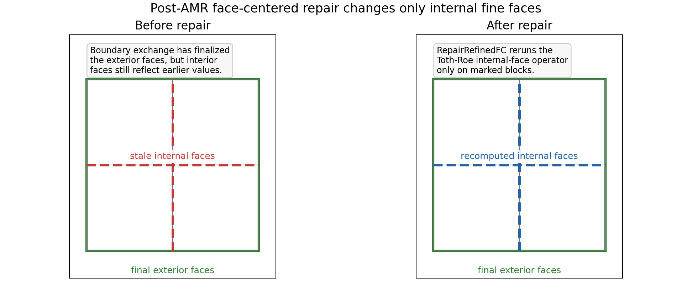
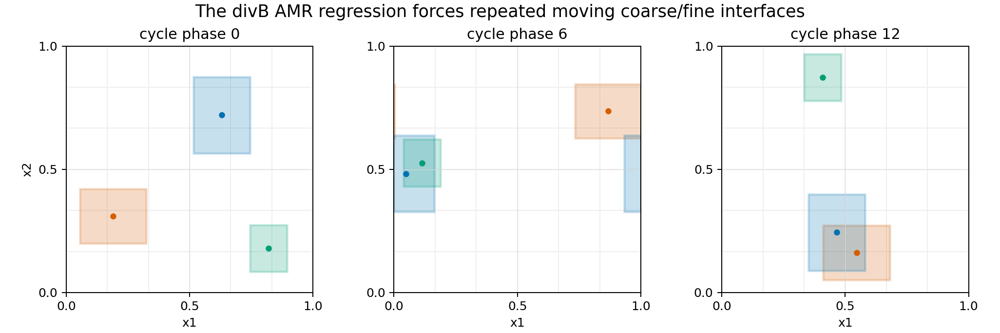
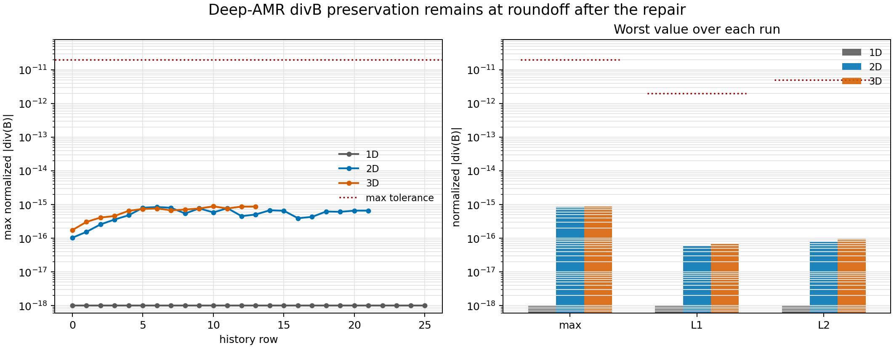
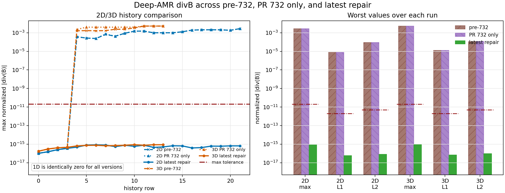

# Deep-AMR Face-Centered div(B) Repair

## Summary

This change fixes a divergence-preservation failure in the MHD AMR mesh-rebuild path.
PR 732 fixed one boundary ownership problem: coarse-neighbor face prolongation must not
overwrite faces owned by same-level or finer neighbors. That was necessary, but not
sufficient for deep 2D/3D AMR.

The remaining failure was temporal ordering. During AMR rebuild,
`MeshRefinement::RefineFC()` computed Toth-Roe internal fine faces before boundary
communication/prolongation finalized the exterior faces of the new MeshBlocks. When those
exterior faces were later corrected by boundary exchange, the internal faces no longer
matched the final exterior face values, so the discrete cell divergence was no longer zero.

The fix is a post-boundary repair pass:

1. Rebuild/refine/restrict mesh data as before.
2. Run normal boundary initialization and primitive refresh.
3. Recompute only the internal face-centered fields on level-changed MHD MeshBlocks.
4. Recompute MHD primitives from the repaired face-centered fields.

No projection, cleaning, or user-facing input change is introduced. The repair reuses the
same Toth-Roe internal-face prolongation already used by AMR refinement, but runs it after
the exterior faces have their final values.



## Code Changes

### Boundary Ownership Fix

`src/bvals/prolongation.cpp` now includes a small neighbor-level query around
`MeshBoundaryValuesFC::ProlongateFC()`.

The new helpers map a neighbor-table index back to its offset and query the maximum
neighbor level at a requested offset. `ProlongateFC()` then shrinks only the
face-normal extent of the prolongation buffer when a same-level or finer neighbor owns
that face. This preserves PR 732's intent without changing the coarse-to-fine
prolongation operator.

The important behavior is:

- If a face belongs to a same-level/finer neighbor, coarse-neighbor prolongation does not
  write it.
- Only the normal face index range is clipped.
- The existing face-centered prolongation kernels remain unchanged.

### AMR Repair Bookkeeping

`src/mesh/mesh_refinement.hpp` adds:

```cpp
DualArray1D<int> fc_amr_repair;
```

The name is deliberately broader than "newly refined". The strict 2D/3D test showed that
repairing only `refine_flag > 0` blocks was insufficient. Blocks created as derefine
replacements also need their internal face fields made consistent with their final
exterior faces. Therefore `RedistAndRefineMeshBlocks()` marks all level-changed
replacement MeshBlocks:

```cpp
fc_amr_repair.h_view(m) = (refine_flag.h_view(newtoold[m]) != 0) ? 1 : 0;
```

This uses the existing global-ID-to-old-global-ID mapping while `newtoold` is still
available, then syncs the mask to device memory for the repair kernel.

### Internal Face Repair

`MeshRefinement::RepairRefinedFC(DvceFaceFld4D<Real> &b)` loops over local MeshBlocks and
active coarse-cell indices. For marked MeshBlocks it recomputes the fine internal faces:

- In 1D, it keeps the existing midpoint average for the internal `x1f` face.
- In 2D/3D, it calls the existing `ProlongFCInternal(...)` Toth-Roe operator.
- It does not touch exterior block faces.
- It does not run on unchanged MeshBlocks.

The loop structure, `DualArray1D` state, `par_for` style, index convention, and comments
match the neighboring `RefineFC()` implementation.

### Call Placement

`MeshRefinement::AdaptiveMeshRefinement()` now calls the repair immediately after:

```cpp
pdriver->InitBoundaryValuesAndPrimitives(pmy_mesh);
```

That placement is the core of the fix. At this point the block exterior faces have gone
through normal boundary communication/prolongation, so the internal Toth-Roe construction
uses final exterior values.

After repairing `pmhd->b0`, the code recomputes primitives:

- Standard MHD: `pmhd->ConToPrim(pdriver, 0)`
- Dynamic GRMHD: convert Z4c to ADM if present, then `pdyngr->ConToPrim(pdriver, 0)`

Hydro, radiation, and Z4c timestep handling remain on the existing path.

### Regression Test Integration

The new regression adds:

- `src/pgen/tests/divb_amr.cpp`
- `inputs/tests/divb_amr_1d.athinput`
- `inputs/tests/divb_amr_2d.athinput`
- `inputs/tests/divb_amr_3d.athinput`
- `tst/scripts/mhd/mhd_divb_amr.py`

The pgen is registered through the existing built-in pgen path in `src/CMakeLists.txt`,
`src/pgen/pgen.hpp`, and `src/pgen/pgen.cpp`.

## Physics Perspective

For face-centered MHD, the discrete divergence in each active cell is

```text
div(B) = (B1(i+1/2)-B1(i-1/2))/dx1
       + (B2(j+1/2)-B2(j-1/2))/dx2
       + (B3(k+1/2)-B3(k-1/2))/dx3 .
```

A constrained-transport update preserves this quantity because the magnetic field is
stored on faces and updated by edge-centered electromotive forces. AMR prolongation must
respect the same discrete topology. The Toth-Roe face-centered prolongation does that by
constructing internal fine faces from the surrounding exterior fine faces so that the fine
cell divergences are consistent with the coarse divergence.

The failure mode was not that the Toth-Roe operator was wrong. It was applied too early
for newly rebuilt AMR topology. Once later boundary exchange changed exterior faces, the
internal faces were still the solution to a different local constraint problem. The repair
pass restores the intended ordering: final exterior faces first, divergence-preserving
internal faces second.

This is why the fix should be understood as preserving the CT/AMR construction, not as
cleaning a divergence error after the fact.

## Regression Design

The new `divb_amr` pgen initializes the magnetic field from a discrete curl of a vector
potential. That makes the initial face-centered divergence zero to roundoff before AMR
stress is applied.

The refinement criterion is not a passive physics threshold. It is a moving periodic box
pattern designed to create many coarse/fine faces, edges, and corners while repeatedly
refining and derefining. The tests use two physical refinement levels because a single
physical AMR level already stayed near roundoff and did not expose the failure.



The history output records direct face-centered diagnostics:

- `max_divb`: maximum absolute discrete divergence.
- `max_ndiv`: maximum normalized divergence, `abs(divB) * dx_min / Bnorm`.
- `sum_ndiv / vol`: volume-weighted L1 normalized divergence.
- `sqrt(sum_n2 / vol)`: volume-weighted L2 normalized divergence.
- `ncell`: active cell count, used to confirm AMR actually refined.

The regression requires all three dimensions to satisfy:

```text
max_ndiv < 2e-11
L1       < 2e-12
L2       < 5e-12
```

## Results

The following results are from fresh local runs of the three inputs with the repaired
code:

| case | history rows | max normalized div(B) | L1 normalized div(B) | L2 normalized div(B) | max active cells |
|---|---:|---:|---:|---:|---:|
| 1D | 26 | 0.00000000000000000e+00 | 0.00000000000000000e+00 | 0.00000000000000000e+00 | 232 |
| 2D | 22 | 8.43551807925976054e-16 | 5.80311372231906515e-17 | 8.04295479196787372e-17 | 17088 |
| 3D | 14 | 8.81647696025859629e-16 | 6.97643866382233230e-17 | 9.47734979868335600e-17 | 491520 |



The result is comfortably below the strict thresholds in 1D, 2D, and 3D. The 2D and 3D
values are roundoff-level despite repeated topology changes and deep AMR.

For comparison, the same test was run on three production-code variants. The first
variant uses the original code before any PR 732 changes. The second keeps the PR 732
boundary ownership change but disables the new post-boundary repair call. The third is
the latest repaired code. The test pgen itself is present in all three variants only so
the same diagnostic can be measured.

| version | case | max normalized div(B) | L1 normalized div(B) | L2 normalized div(B) |
|---|---|---:|---:|---:|
| pre-732 | 1D | 0.00000000000000000e+00 | 0.00000000000000000e+00 | 0.00000000000000000e+00 |
| pre-732 | 2D | 2.77084620233659148e-03 | 7.85868333708505719e-06 | 8.99545248666726256e-05 |
| pre-732 | 3D | 5.27239580322255014e-03 | 1.25168169215007320e-05 | 1.14858249055683172e-04 |
| PR 732 only | 1D | 0.00000000000000000e+00 | 0.00000000000000000e+00 | 0.00000000000000000e+00 |
| PR 732 only | 2D | 2.77007781631372855e-03 | 7.83363121585471903e-06 | 8.97212632851515917e-05 |
| PR 732 only | 3D | 5.22759816390111400e-03 | 1.31159481873248164e-05 | 1.20257440934818684e-04 |
| latest repair | 1D | 0.00000000000000000e+00 | 0.00000000000000000e+00 | 0.00000000000000000e+00 |
| latest repair | 2D | 8.43551807925976054e-16 | 5.80311372231906515e-17 | 8.04295479196787372e-17 |
| latest repair | 3D | 8.81647696025859629e-16 | 6.97643866382233230e-17 | 9.47734979868335600e-17 |



## Verification

The patch was verified with:

```bash
cmake --build build-codex-cgl-lf --target athena -j 8
cd tst && python3 run_tests.py mhd/mhd_divb_amr
git diff --check
python3 -m py_compile tst/scripts/mhd/mhd_divb_amr.py
```

Short existing MHD linear-wave AMR and SMR smoke runs were also executed successfully to
check that the changed AMR path still runs in existing MHD refinement configurations.
