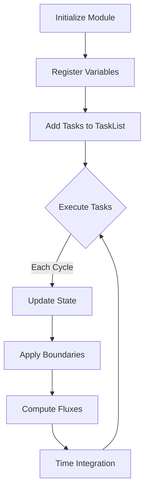

# Module: [MODULE_NAME]

## Overview
[Brief 1-2 sentence description of what this module does in AthenaK]

## Purpose and Scope

[One paragraph explaining the module's role in the simulation framework, what physics/functionality it provides, and when it's used]

## Architecture

### Key Components

| Component | File(s) | Purpose |
|-----------|---------|---------|
| [Class/Struct Name] | `path/to/file.hpp` | [Brief description] |
| [Class/Struct Name] | `path/to/file.cpp` | [Brief description] |

### Data Structures

```cpp
// Key data structure example
class [ModuleName] {
  // Core data members
  DvceArray4D<Real> conserved;  // Conserved variables
  DvceArray4D<Real> primitive;  // Primitive variables
  // ...
};
```

### Memory Layout

[Describe how data is organized in memory, especially for GPU efficiency]

- **Device Arrays**: [List key device arrays and their dimensions]
- **Host Arrays**: [List host-side arrays if any]
- **Layout**: `[LayoutLeft/LayoutRight]` for [reason]

## Runtime Flow



## Task Dependencies

This module adds the following tasks to the execution graph:

| Task Name | Dependencies | Description | Execution Space |
|-----------|--------------|-------------|-----------------|
| `[TaskName]` | `[Dep1, Dep2]` | [What it does] | `DevExeSpace` |

## Key Functions/Kernels

### Core Operations

#### `[FunctionName]`
```cpp
void FunctionName(params...);
```
**Purpose**: [What this function does]  
**Execution**: `[Host/Device/Both]`  
**Called by**: `[Where it's invoked]`

### Kokkos Kernels

#### `[KernelName]`
```cpp
par_for("[KernelTag]", DevExeSpace(), kb.s, kb.e, 
  KOKKOS_LAMBDA(const int b) {
    // Kernel body
  });
```
**Purpose**: [What this kernel computes]  
**Performance Notes**: [Any optimization considerations]

## Configuration Parameters

Parameters read from the input file `<[block_name]>` block:

| Parameter | Type | Default | Description |
|-----------|------|---------|-------------|
| `[param_name]` | `[type]` | `[default]` | [What it controls] |

Example input block:
```
<[block_name]>
param1 = value1
param2 = value2
```

## Extension Points

### Adding New Features
To extend this module:

1. **New Variables**: Add to `[location]` in `[file]`
2. **New Tasks**: Register in `[function]`
3. **New Physics**: Implement in derived class

### Customization Hooks
- `[HookFunction1]`: Override to customize [behavior]
- `[HookFunction2]`: Called during [phase] for user extensions

## Boundary Conditions

Supported boundary condition types:

- **periodic**: Periodic boundaries
- **outflow**: Zero-gradient extrapolation
- **reflecting**: Reflection symmetry
- **user**: User-defined in problem generator

## Performance Considerations

### GPU Optimization
- [Optimization strategy 1]
- [Optimization strategy 2]

### Memory Access Patterns
- [Access pattern description]
- [Cache/coalescing considerations]

### Scalability
- Strong scaling: [Notes]
- Weak scaling: [Notes]
- MPI communication: [Pattern]

## Common Gotchas

⚠️ **Warning**: [Common mistake and how to avoid it]

⚠️ **Device/Host Sync**: [Synchronization requirements]

⚠️ **Index Ordering**: [Important indexing conventions]

## Related Modules

- [`[ModuleName]`](../modules/[module].md): [How they interact]
- [`[ModuleName]`](../modules/[module].md): [Dependencies]

## File Reference

Detailed documentation for each file in this module:

- [`[filename].hpp`](../reference/[path].md): [Brief description]
- [`[filename].cpp`](../reference/[path].md): [Brief description]

## Examples

### Basic Usage
```cpp
// Example code showing typical usage
[code example]
```

### Advanced Features
```cpp
// Example of advanced functionality
[code example]
```

## Testing

Test coverage for this module:

- `tst/[test1]`: [What it tests]
- `tst/[test2]`: [What it tests]

## See Also

- [Runtime Flowchart](../flowcharts/runtime.md)
- [API Reference](../api/[module].rst)
- [Migration Guide](../migration/[relevant_section].md)