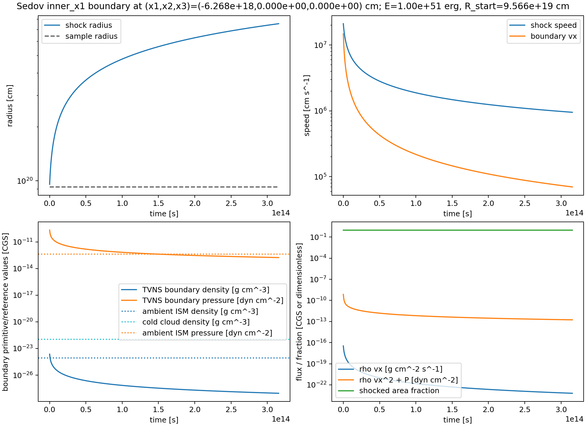
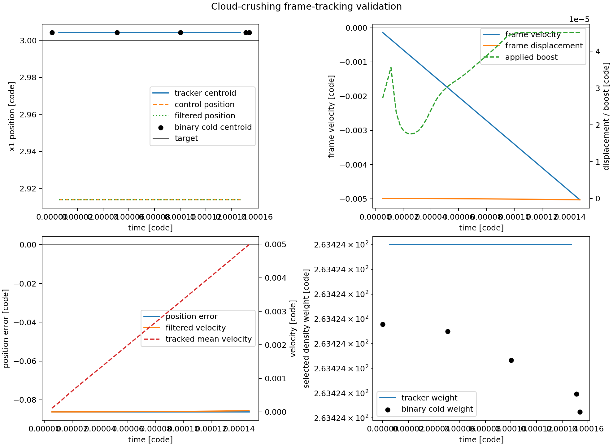
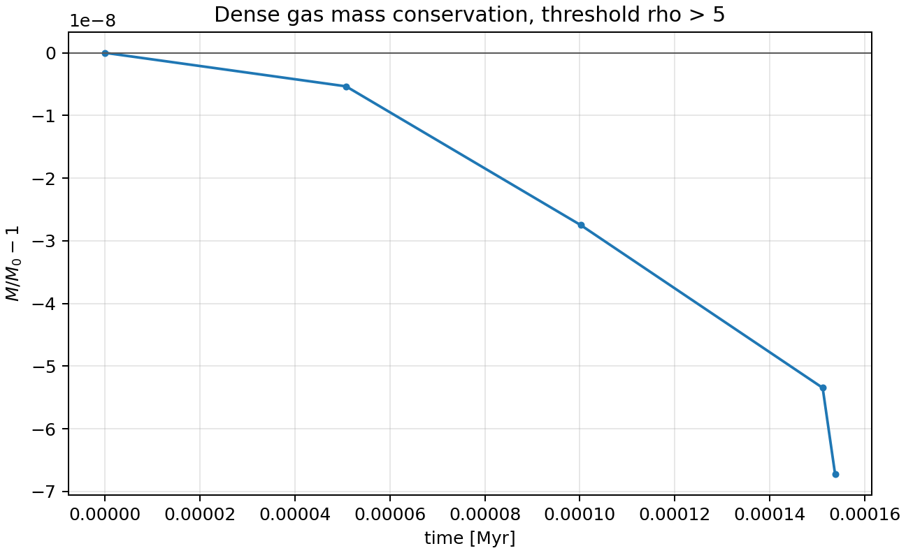
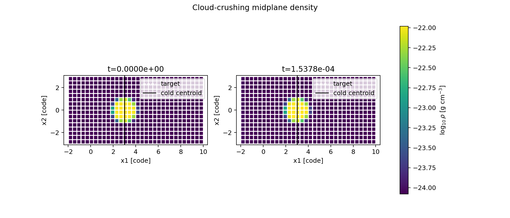
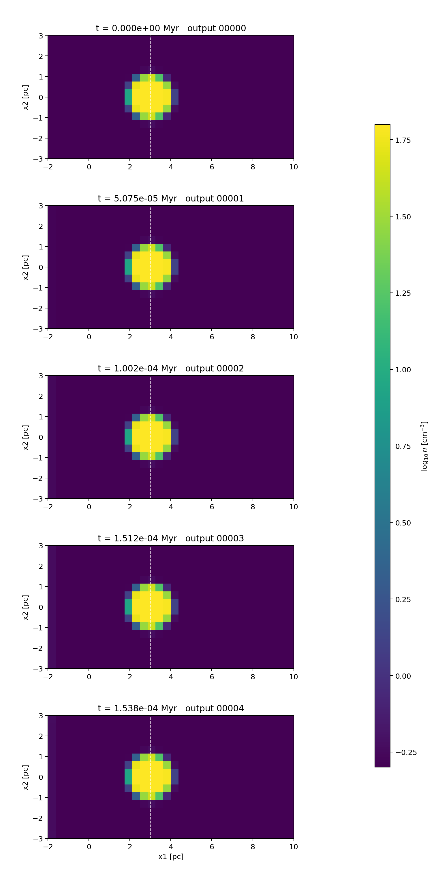

# Sedov Cloud Crushing With Frame Tracking

This example uses `src/pgen/cloud_crushing.cpp` and
`inputs/hydro/cloud_crushing_snr.athinput` to initialize a cold ISM cloud in
pressure balance with a warm ISM, then drives the left boundary with a
Taylor-von Neumann-Sedov blast wave.

The problem is built around three pieces:

- ISM cooling and heating set the cold and warm thermal equilibria at the
  requested `problem/pressure_over_k` and resolved `hydro_srcterms/hrate`.
- The cold cloud starts as a smoothed density sphere embedded in the warm phase.
- The `inner_x1` user boundary samples the full xi-dependent TVNS interior
  profile, not just a constant post-shock state.
- The shipped input enables hydro FOFC with three ghost zones; the strongly
  driven boundary/cloud interaction can otherwise produce negative internal
  energies with the HLLC update.
- The shipped input sets a finite hydro `tfloor` below the cold equilibrium
  temperature. With the default floating-point temperature floor, one
  overcooled mixed cell can collapse the explicit cooling timestep.

## Boundary Modes

The `inner_x1` user boundary is selected with

```ini
<problem>
inner_x1_boundary = sedov  # sedov or constant
```

The default `sedov` mode evaluates the Taylor-von Neumann-Sedov blast profile.
The optional `constant` mode fills the inner `x1` ghost zones with a fixed
grid-frame state. In constant mode the boundary is not transformed by frame
tracking: it does not sample `FrameDisplacement()` and it does not subtract
`FrameVelocity()`.

Constant-mode values are code-unit quantities by default:

```ini
inner_x1_boundary = constant
constant_density  = 1.0
constant_pressure = 1.0e-4
constant_vx       = 1.0
constant_vy       = 0.0
constant_vz       = 0.0
boundary_timestep_factor = 0.15
```

The pgen also accepts cgs aliases when a `<units>` block is present:
`constant_density_cgs`, `constant_pressure_cgs`, and
`constant_vx_cgs`, `constant_vy_cgs`, `constant_vz_cgs`.
`boundary_timestep_factor` multiplies the additional timestep constraint based
on the inner-boundary signal speed. Values below unity are useful for strongly
driven inflows where the active mesh has not yet seen the boundary sound speed.

## Units

The shipped input uses cgs-backed code units:

```ini
<units>
length_cgs  = 3.0856775809623245e18  # 1 pc
time_cgs    = 3.15576e13             # 1 Myr
mass_cgs    = 4.91416144649125e31    # 1 amu cm^-3 * (1 pc)^3
mu          = 1.0
```

With the default cooling/heating choices, the equilibrium phases are

| Quantity | Value |
| --- | ---: |
| Cold temperature | `50.2123 K` |
| Warm temperature | `6296.21 K` |
| Cold number density | `62.9781 cm^-3` |
| Warm number density | `0.502251 cm^-3` |
| Ambient pressure | `4.36599e-13 dyn cm^-2` |
| Ambient mass density | `8.34008e-25 g cm^-3` |
| Cold-cloud mass density | `1.04578e-22 g cm^-3` |

The heating rate can either be supplied directly or scaled automatically with
the requested pressure:

```ini
<hydro>
tfloor      = 0.1

<hydro_srcterms>
hrate_auto  = true
hrate_reference = 2.0e-26
hrate_reference_pressure_over_k = 3.162277660168379e3
cooling_timestep_factor = 0.1
```

With `hrate_auto = true`, the code sets

```text
hrate = hrate_reference
      * problem/pressure_over_k
      / hrate_reference_pressure_over_k
```

and writes the resolved value back into `<hydro_srcterms>`, so source terms and
the problem generator use the same heating rate. This preserves the default
cold/warm equilibrium temperatures while allowing a different ambient
`P/k_B`.

`cooling_timestep_factor` multiplies the source-term cooling/heating timestep
limit. A value below unity is useful in this strongly shocked cloud test because
explicit cooling at the full local cooling time can drive mixed cells into the
energy floor.

## Sedov Boundary Options

The Sedov boundary is controlled from the `<problem>` block:

| Parameter | Meaning |
| --- | --- |
| `sedov_energy_cgs` | Explosion energy in ergs. |
| `sedov_beta` | Dimensionless Sedov similarity constant. |
| `sedov_start_time` | Simulation time at which the blast evolution begins. |
| `sedov_origin_distance` | Default distance from `x1min` to the explosion origin. |
| `sedov_origin_x1`, `sedov_origin_x2`, `sedov_origin_x3` | Optional explicit lab-frame origin. |
| `sedov_radius_at_start` | Shock radius at `sedov_start_time`; together with `E` and ambient density this fixes the Sedov age. |

In Sedov mode, each ghost cell computes

```text
x_lab = x_grid + X_frame
r_lab = |x_lab - x_snr|
xi    = r_lab / R_s(t)
v_grid = v_TVNS,lab(r_lab,t) - V_frame
```

where `X_frame` and `V_frame` come from the shared `FrameTracker` when
`<frame_tracking>` is enabled. This is the key moving-frame contract: the grid
coordinates remain grid-frame coordinates, but user boundary conditions can
recover the lab-frame sample point from the exposed frame displacement.

If the sample point lies outside the blast radius, the boundary fills warm ISM
gas moving at `-V_frame` in grid coordinates. If it lies inside the shock, the
boundary fills the TVNS density, pressure, and radial velocity at that `xi`.

## Frame Tracking

The input tracks the cold cloud by selecting dense gas:

```ini
<frame_tracking>
enabled    = true
tracked_fluid = hydro
start_time = 0.02
axes       = x1
x1_target  = 3.0
target     = density
target_min = 5.0
target_max = 200.0
mode       = pd
max_abs_boost = 50.0
max_boost_change_mode = per_time
max_boost_change_rate = 5.0
```

The tracker applies post-timestep Galilean velocity boosts. The example delays
tracking until `t=0.02` so the cooling startup transient does not drive the
cloud frame before the flow has settled. The tracker also exposes the current
frame velocity and displacement through `FrameVelocity(axis)` and
`FrameDisplacement(axis)`. Restart files store versioned complete controller
state and retain compatibility with older files that contain only
`frame_velocity_x*` and `frame_displacement_x*`.
See the [Frame Tracking module page](../modules/frame_tracking.md) for the full
runtime contract and parameter reference.

The frame velocity is the lab velocity of the grid frame. The boost applied to
the fluid is the opposite cumulative velocity, so problem generators should
transform lab-frame velocities as

```text
v_grid = v_lab - V_frame
```

Frame tracking does not remap mesh coordinates or move AMR blocks. The
displacement is the bookkeeping needed to evaluate lab-frame physics
consistently while the grid-frame fluid variables are Galilean shifted.

## Build And Run

Configure and build the problem:

```bash
cmake -S . -B build_cloud_crushing -DPROBLEM=cloud_crushing
cmake --build build_cloud_crushing -j 4
```

A fast low-resolution validation run is:

```bash
rm -rf run_cloud_crushing_lowres
mkdir run_cloud_crushing_lowres
./build_cloud_crushing/src/athena \
  -i inputs/hydro/cloud_crushing_snr.athinput \
  -d run_cloud_crushing_lowres \
  mesh/nx1=32 mesh/nx2=16 mesh/nx3=16 \
  meshblock/nx1=16 meshblock/nx2=8 meshblock/nx3=8 \
  time/nlim=160 time/tlim=0.004 time/cfl_number=0.01 \
  output1/dt=2.0e-5 output2/file_type=bin output2/dt=5.0e-5 \
  frame_tracking/start_time=0.0 \
  frame_tracking/diagnostic_every=5 \
  frame_tracking/max_abs_boost=50.0 \
  frame_tracking/max_boost_change_mode=per_time \
  frame_tracking/max_boost_change_rate=2.0 \
  2>&1 | tee run_cloud_crushing_lowres/athena.log
```

This run is intentionally low resolution. It is a wiring and consistency test,
not a production cloud-crushing calculation. The shipped input delays tracking
until `t=0.02` for production-style cloud evolution; the validation command
sets `frame_tracking/start_time=0.0` so the short smoke test actually exercises
the frame controller.

## Validation Plots

Plot the analytic boundary state in cgs units through `t = 10` code units:

```bash
python3 scripts/plot_sedov_boundary.py \
  --output docs/source/_static/sedov_boundary_cgs.png \
  --csv-output docs/source/_static/sedov_boundary_cgs.csv \
  --t-max 10
```



Plot the low-resolution run diagnostics:

```bash
python3 scripts/plot_cloud_crushing_validation.py \
  run_cloud_crushing_lowres \
  --output-prefix docs/source/_static/cloud_crushing_lowres
```

The validation script reads structured controller data from
`CloudCrushingSNR.frame_tracker.hst` when present, with stdout-log parsing only
as a compatibility fallback for older archived runs. It reads native binary
`hydro_w` snapshots for an independent cold-cloud centroid check. The run used
for this documentation produced structured frame-tracker rows and 5 binary
snapshots.

| Check | Value |
| --- | ---: |
| Structured history rows | `9` |
| Binary snapshots | `5` |
| Maximum miss streak | `0` |
| Slew-limited rows | `0` |
| Final history time | `1.537763e-4` |
| Final frame velocity | `-4.952569e-3` |
| Final frame displacement | `-3.545292e-7` |
| Final tracker position error | `-8.622328e-2` |
| Binary cold-cloud centroid drift | `2.501526e-7` |
| Final cold-cloud centroid | `3.004256` |
| Dense-mass fractional change | `-4.658305e-8` |
| Final dense mass | `6.510078 Msun` |

These numbers establish that this low-resolution wiring run retains selected
dense material, applies finite unsaturated boosts, and agrees with an
independent binary-output centroid measurement. They are not a convergence or
production-accuracy claim. The same summary is available as
[`cloud_crushing_lowres_summary.csv`](../_static/cloud_crushing_lowres_summary.csv).
The sampled controller time series is available as
[`cloud_crushing_lowres_frame_tracker.csv`](../_static/cloud_crushing_lowres_frame_tracker.csv).



The dense mass selected by the same `target_min` threshold is conserved to
better than one part in `1e7` in this wiring test. The values are also written
to [`cloud_crushing_lowres_dense_mass.csv`](../_static/cloud_crushing_lowres_dense_mass.csv).



The midplane density snapshots show the dense cloud and the shocked inflow
entering from the left boundary in the same run.



The vertical slice montage uses equal-aspect panels and number-density units,
which makes the low-resolution shock/cloud geometry easier to inspect.


