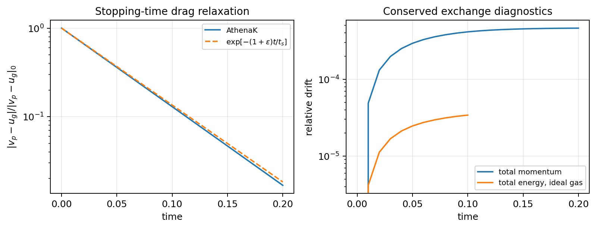
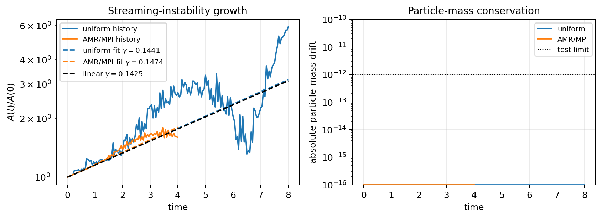
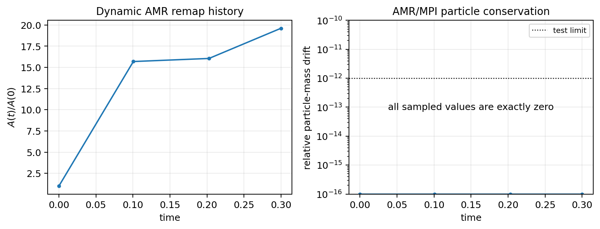
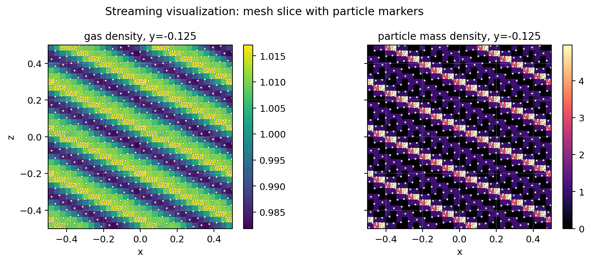

# Streaming Instability with Drag-Coupled Particles

This example exercises the drag-coupled dust particle path:

- massive dust particles with `particle_type = dust`
- stopping-time drag with gas backreaction
- pgen-provided orbital source terms
- Fourier history diagnostics for gas and particle perturbations
- AMR particle remapping and MPI particle migration

All supplied drag-particle inputs use periodic boundaries and
`<particles>/cfl_part = 0.5`.  The core particle timestep limiter keeps each push within
an immediate MeshBlock neighbor, including after refinement changes block widths.

## Equations

The gas is evolved by the hydro module.  Dust particles carry position, velocity, and mass.
The standard drag law is

```{math}
\frac{d\mathbf{v}_p}{dt} =
\frac{\mathbf{u}_g(\mathbf{x}_p)-\mathbf{v}_p}{t_s}.
```

With backreaction, the gas receives the opposite momentum impulse:

```{math}
\Delta(\rho\mathbf{u}) =
-\frac{m_p\,\Delta\mathbf{v}_{p,\mathrm{drag}}}{\Delta V}.
```

For the local streaming setup, the pgen adds orbital terms without using AthenaK's
`<shearing_box>` block, because that module currently rejects AMR:

```{math}
\dot u_x = 2\Omega u_y + a_P,\qquad
\dot u_y = -(2-q)\Omega u_x,
```

```{math}
\dot v_x = 2\Omega v_y,\qquad
\dot v_y = -(2-q)\Omega v_x.
```

The pressure-gradient acceleration is `a_P = 2 eta_vk omega0` by default and can be
overridden with `problem/pressure_accel`.

## NSH Drift State

For dust-to-gas ratio `epsilon`, dimensionless stopping time `tau_s = Omega t_s`, and
headwind speed `eta_vk`, the pgen initializes the Nakagawa-Sekiya-Hayashi drift state:

```{math}
D = (1+\epsilon)^2 + \tau_s^2,
```

```{math}
u_x = \frac{2\epsilon\tau_s}{D}\eta v_K,\qquad
u_y = -\frac{1+\epsilon+\tau_s^2}{D}\eta v_K,
```

```{math}
v_x = -\frac{2\tau_s}{D}\eta v_K,\qquad
v_y = -\frac{1+\epsilon}{D}\eta v_K.
```

A small Fourier perturbation is added with

```{math}
\phi = k_x x + k_z z,\qquad
k_x = \frac{2\pi n_x}{L_x},\qquad
k_z = \frac{2\pi n_z}{L_z}.
```

The default inputs use `problem/perturbation = eigenmode`.  The real and imaginary
eigenvector components are stored as `problem/eigen_*_re` and `problem/eigen_*_im`
values in the input file and are applied as

```{math}
\delta q(x,z) = A\,\Re\left[\hat q\,e^{i(k_x x+k_z z)}\right],
```

where `A = problem/amp`.  Particle density perturbations are represented by the
particle masses, with the unperturbed mass proportional to the host-cell volume.  This
keeps the dust-to-gas ratio uniform on nonuniform AMR hierarchies.

The user history output records additive Fourier components:

| Column | Meaning |
| --- | --- |
| `gmodec`, `gmodes` | gas density cosine and sine components |
| `pmodec`, `pmodes` | particle mass cosine and sine components |
| `gmom*`, `pmom*` | gas and particle momentum sums |
| `gmass`, `pmass` | gas and particle mass sums |

The scalar mode amplitude used by the tests is

```{math}
A(t) =
\sqrt{g_c^2+g_s^2} + \sqrt{p_c^2+p_s^2}.
```

## Inputs

Uniform-grid run:

```bash
build-drag-particles/src/athena \
  -i inputs/particles/streaming_instability.athinput \
  -d run-streaming
```

AMR run:

```bash
build-drag-particles/src/athena \
  -i inputs/particles/streaming_instability_amr.athinput \
  -d run-streaming-amr
```

Dynamic AMR remap smoke test:

```bash
mpirun -np 2 build-drag-particles-mpi/src/athena \
  -i inputs/particles/streaming_instability_amr_dynamic.athinput \
  -d run-streaming-amr-dynamic
```

MPI + AMR run:

```bash
mpirun -np 2 build-drag-particles-mpi/src/athena \
  -i inputs/particles/streaming_instability_amr.athinput \
  -d run-streaming-amr-mpi
```

## Linear-Growth Validation

The linear model used for the default eigenmode is the compressible, axisymmetric
dust-gas system in the same local frame.  With perturbations
`exp(gamma t + i k_x x + i k_z z)`, the gas continuity equation is

```{math}
\gamma\,\delta\rho_g =
-i k_x u_{x0}\delta\rho_g
-i\rho_{g0}(k_x\delta u_x+k_z\delta u_z),
```

and the dust continuity equation is the same with gas quantities replaced by dust
quantities.  The linearized gas momentum equations are

```{math}
\begin{aligned}
\gamma\,\delta u_x &=
-i k_x u_{x0}\delta u_x
-i k_x c_s^2\frac{\delta\rho_g}{\rho_{g0}}
+2\Omega\delta u_y
+\frac{\epsilon}{t_s}(\delta v_x-\delta u_x)
+\frac{\epsilon\Delta v_x}{t_s}
\left(\frac{\delta\rho_p}{\rho_{p0}}-\frac{\delta\rho_g}{\rho_{g0}}\right),\\
\gamma\,\delta u_y &=
-i k_x u_{x0}\delta u_y
-(2-q)\Omega\delta u_x
+\frac{\epsilon}{t_s}(\delta v_y-\delta u_y)
+\frac{\epsilon\Delta v_y}{t_s}
\left(\frac{\delta\rho_p}{\rho_{p0}}-\frac{\delta\rho_g}{\rho_{g0}}\right),\\
\gamma\,\delta u_z &=
-i k_x u_{x0}\delta u_z
-i k_z c_s^2\frac{\delta\rho_g}{\rho_{g0}}
+\frac{\epsilon}{t_s}(\delta v_z-\delta u_z).
\end{aligned}
```

Here `Delta v = v_0 - u_0` is the equilibrium dust-gas drift.  The dust momentum
equations are

```{math}
\begin{aligned}
\gamma\,\delta v_x &=
-i k_x v_{x0}\delta v_x
+2\Omega\delta v_y
+\frac{\delta u_x-\delta v_x}{t_s},\\
\gamma\,\delta v_y &=
-i k_x v_{x0}\delta v_y
-(2-q)\Omega\delta v_x
+\frac{\delta u_y-\delta v_y}{t_s},\\
\gamma\,\delta v_z &=
-i k_x v_{x0}\delta v_z
+\frac{\delta u_z-\delta v_z}{t_s}.
\end{aligned}
```

For the checked-in inputs,
`epsilon = 1`, `tau_s = 0.3`, `eta_vk = 0.5`, `nwx = 2`, and `nwz = 4`.  The
fastest eigenvalue of this matrix is

```{math}
\gamma = 0.1424527496587504,\qquad
\omega = 0.1067230670012035.
```

Regenerate the checked-in eigenvalue and input-file coefficients with:

```bash
python tst/scripts/particles/streaming_eigenmode.py
```

The script prints `problem/expected_*` and `problem/eigen_*` lines that can be pasted into
the streaming inputs.  It is the source for the coefficients checked into
`inputs/particles/streaming_instability.athinput` and
`inputs/particles/streaming_instability_amr.athinput`.

The tests fit the history amplitude while the perturbation is still linear:

```python
import numpy as np
import athena_read

d = athena_read.hst("streaming_instability.user.hst")
amp = np.hypot(d["gmodec"], d["gmodes"]) + np.hypot(d["pmodec"], d["pmodes"])
mask = (d["time"] >= 0.0) & (d["time"] <= 8.0)
gamma = np.polyfit(d["time"][mask], np.log(amp[mask]), 1)[0]
```

The AMR/MPI growth input uses the same eigenmode on an adaptive mesh with a pre-refined
region and two MPI ranks.  The refinement interval is deliberately longer than the
regression window, so the growth comparison tests multilevel AMR evolution and MPI
particle migration without adding a mesh-change transient to the linear fit.

The dynamic AMR input starts from the root grid and lets the location criterion create
refined MeshBlocks during the run.  That regression is a remapping stress test: it checks
particle mass conservation and finite Fourier histories, not the growth rate.

## Local Validation Snapshot

On this branch:

- the uniform-grid run to `t = 8` fits `gamma = 0.144147`, within 2% of the linear
  eigenvalue
- the AMR/MPI run to `t = 4` fits `gamma = 0.147358`, within 4% of the linear eigenvalue
- both runs preserve `pmass` to roundoff in the user history

The CI-friendly tests are:

- `tst/test_suite/particles/test_particles_streaming_growth_cpu.py`
- `tst/test_suite/particles/test_particles_streaming_amr_mpicpu.py`

The second file includes both the AMR/MPI growth fit and dynamic AMR particle-remap smoke
tests, including a higher-particle-count run with smaller MeshBlocks.

## Documentation Figures and Test Results

The GitHub Pages documentation includes checked-in figures generated from actual AthenaK
run products with `tst/scripts/particles/generate_drag_particle_figures.py`.  The script
also writes the machine-readable summary
[`drag_particle_validation_summary.json`](../_static/particles/drag_particle_validation_summary.json).

| Figure | Inputs and tests represented | What to check |
| --- | --- | --- |
| Drag relaxation and conservation | `inputs/tests/particle_drag_relaxation.athinput`; `test_drag_relaxation`; `test_drag_energy_conservation_ideal_gas` | Relative particle-gas velocity follows the stopping-time decay, total momentum stays below the `1e-3` tolerance, and ideal-gas total energy stays below the `1e-4` tolerance. |
| Streaming growth | `inputs/particles/streaming_instability.athinput`; `inputs/particles/streaming_instability_amr.athinput`; uniform and AMR/MPI growth tests | Fitted growth rates follow the linear eigenvalue while particle mass remains conserved to the test floor. |
| Dynamic AMR remap | `inputs/particles/streaming_instability_amr_dynamic.athinput`; dynamic AMR/MPI remap tests, including the higher-particle-count case | Histories remain finite through remap and the total particle mass is unchanged. |
| Streaming slice with particles | `inputs/particles/streaming_instability_visualization.athinput` | Mesh VTK gas and particle-mass-density slices are plotted with PVTK particle positions overlaid. |

Fatal input validation, restart callback re-enrollment, the MHD-host smoke test, the
minimal hello input, and the pgen user-drag-hook example are scalar pass/fail tests rather
than image-producing runs.  They are still part of the particle test suite and are listed
in `tst/test_suite/particles/test_particles_drag_relaxation_cpu.py`.








