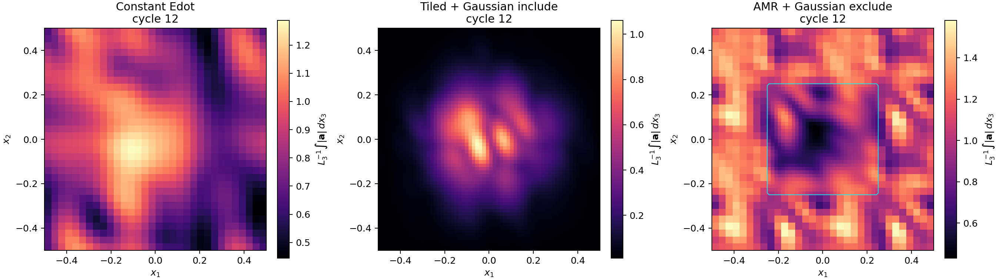

# Example: Localized And AMR Turbulence Driving

These short `turb` problem-generator calculations demonstrate the driver
controls and write the applied acceleration with `variable=turb_force`. They
are validation examples, not statistically converged turbulence experiments.

## Build And Run

From the repository root:

```bash
cmake -S . -B build-turb -DPROBLEM=turb -DCMAKE_BUILD_TYPE=Release
cmake --build build-turb -j

mkdir -p run/turb_edot_fixed run/turb_tiled_include run/turb_amr_exclude
build-turb/src/athena -d run/turb_edot_fixed \
  -i inputs/hydro/turb_driving/constant_edot_fixed_grid.athinput
build-turb/src/athena -d run/turb_tiled_include \
  -i inputs/hydro/turb_driving/tiled_localized_include.athinput
build-turb/src/athena -d run/turb_amr_exclude \
  -i inputs/hydro/turb_driving/amr_localized_exclude.athinput
```

The `-d` option keeps each case's `bin/` and history files in its run
directory.

## Cases

### Constant Energy Injection

`constant_edot_fixed_grid.athinput` uses a \(32^3\) periodic uniform grid and

```text
normalization = edot
dedt          = 0.1
```

It supplies the homogeneous baseline for checking requested energy injection.

### Tiled Included Region

`tiled_localized_include.athinput` uses

```text
normalization = accel_rms
accel_rms     = 0.3
tile_nx       = 2
tile_ny       = 2
localization  = include
sigma_x1      = 0.18
sigma_x2      = 0.18
sigma_x3      = 0.28
```

The same realization repeats over \(2\times2\times1\) tiles and is
concentrated near the origin.

### Adaptive Excluded Region

`amr_localized_exclude.athinput` uses location-based adaptive refinement
around the origin, the same \(2\times2\times1\) tile pattern, and
`localization=exclude`. Its refined central region is suppressed while
driving remains active outside.

## Projected Acceleration

The figure below is generated from cycle-12 `turb_force` dumps. Each panel
shows \(L_3^{-1}\int|\boldsymbol{a}|\,dx_3\); the cyan contour in the AMR
panel marks the level-0/level-1 interface.



Measured checks from the committed inputs are:

| Case | Measured check |
| --- | --- |
| Constant energy injection | Fitted total-energy growth rate after onset: `0.09924` for `dedt=0.1`. |
| Tiled included region | Volume-weighted `a_rms=0.30000000` for `accel_rms=0.3`; central/outer projected-amplitude ratio `13.67`. |
| AMR excluded region | 88 final MeshBlocks at maximum level 1; central/outer projected-amplitude ratio `0.56`. |

The projected-amplitude ratio is the mean within `r < 0.12` divided by the
mean at `r > 0.32`, where \(r=(x_1^2+x_2^2)^{1/2}\). It is used here only as
a compact confirmation of the requested spatial selection.

## Implementation Benchmark

Three Release runs of each input were compared against the initial feature
prototype at commit `a84c7ffd`; the table reports median executable CPU time.
These short total-runtime measurements include integration and output work,
not only driver kernels.

| Case | Prototype CPU time (s) | Modal-state CPU time (s) | Ratio |
| --- | ---: | ---: | ---: |
| Constant energy injection | `0.12035` | `0.11882` | `0.987` |
| Tiled included region | `0.22149` | `0.24983` | `1.128` |
| AMR excluded region | `0.27642` | `0.28859` | `1.044` |

The correctness change removes the prototype's two cell-sized OU scratch
arrays (`force_tmp1` and `force_tmp2`) and replaces them with two modal
innovation arrays. For these inputs, at double precision, the removed cell
storage is `2.93 MiB`, `5.86 MiB`, and `40.50 MiB`, respectively; the new
modal innovations use `1.31 KiB` in all three cases. The measured tiled-case
overhead is retained as evidence for any future kernel-level optimization
rather than hiding it behind unprofiled changes.

Regenerate the figure after running the examples:

```bash
python vis/python/plot_turbulence_driving_projection.py \
  --panel "Constant Edot=run/turb_edot_fixed/bin/turb_edot_fixed.force.00004.bin" \
  --panel "Tiled + Gaussian include=run/turb_tiled_include/bin/turb_tiled_include.force.00004.bin" \
  --panel "AMR + Gaussian exclude=run/turb_amr_exclude/bin/turb_amr_exclude.force.00004.bin" \
  --output docs/source/_static/turbulence_driving_projections.png
```

## Regression Coverage

The turbulence regression tests exercise:

- fixed-RMS normalization with tiling and inclusion localization;
- AMR execution with exclusion localization;
- exact rendered-force continuation across fixed-grid and AMR restarts;
- MPI execution of the AMR/localized case;
- rejection of removed parameter names and singular parabolic spectra.

The driver uses precision-correct MPI reductions. The current upstream source
tree does not build a complete single-precision executable with AppleClang
because unchanged coordinate and tabulated-EOS translation units contain
single-precision type/narrowing errors; those blockers are outside this
feature.

The equations, restart contract, and full canonical parameter reference are
in {doc}`../modules/turbulence_driving`.
