# CR Tracer Accuracy Validation

This page summarizes the CPU and MPI accuracy-validation ladder for cosmic-ray
tracer particles.  The tests are intentionally ordered from isolated analytic
checks to production-like ensemble diagnostics, so failures identify whether the
problem is the Boris pusher, magnetic-field gather, AMR remap, MPI exchange, or
diagnostic reduction.

The figures and quantitative values below were generated on 2026-05-22 with:

```bash
cmake --build build-cr-robust-mpi -j 8
python scripts/particles/cr_tracer_accuracy_study.py \
  --athena build-cr-robust-mpi/src/athena \
  --mpiexec mpiexec
```

The raw machine-readable summary is written to
`docs/source/modules/figures/cr_tracer_accuracy/cr_tracer_accuracy_summary.json`.

## Qualitative Figure Convention

Every numbered test below now includes a companion field-and-particle figure.
The color maps show `Bz - B0z`; streamlines show the in-plane magnetic-field
direction in the plotted slice.  Circles mark initial particle positions and
crosses mark final positions.  Most panels are `x-y` projections at the
reported fixed `z`; the magnetic-mirror panel uses an `x-z` slice at fixed
`y`, where the mirror structure is visible.

The moving-particle companion runs use denser restart output and longer
integration intervals than the CI-sized metric runs in order to resolve path
shape.  They preserve the corresponding input's prescribed field and particle
method, but they are visual context rather than an additional acceptance
metric.  Tests 3 and 4 are intentionally stationary gather tests; their
qualitative panels show the sampled point and field structure rather than
inventing a trajectory.

| Test | Qualitative interval | Tracks shown | Slice |
|------|----------------------|--------------|-------|
| 1. Uniform-B gyro orbit | `0 <= t <= 6.40` | 1 | `x-y`, unwrapped orbit |
| 2. Uniform-B AMR/MPI crossing | `0 <= t <= 0.64` | 4 | `x-y`, `z=0` |
| 3. Linear gather | `0 <= t <= 0.01` | 1 stationary sample | `x-y`, `z=0.047` |
| 4. Smooth divergence-free gather | `0 <= t <= 0.01` | 1 stationary sample | `x-y`, `z=-0.11` |
| 5. Smooth-field orbit reference | `0 <= t <= 1.60` | 1 | `x-y`, `z=0.07` |
| 6. Magnetic mirror | `0 <= t <= 1.60` | 1 | `x-z`, `y=-0.03` |
| 7. Grad-B drift response | `0 <= t <= 1.60` | 1 | `x-y`, `z=0` |
| 8. AMR boundary stress | `0 <= t <= 0.64` | 4 | `x-y`, `z=0.125` |
| 9. MPI decomposition invariance | `0 <= t <= 1.00` | 4 | `x-y`, `z=0` |
| 10. Isotropic ensemble | `0 <= t <= 0.80` | 6 | `x-y`, `z=0` |
| 11. Frozen turbulent field | `0 <= t <= 1.28` | 6 | `x-y`, `z=0` |

## Recommended Use

| Method | Best use | Accuracy signal in this suite | Main caution |
|--------|----------|-------------------------------|--------------|
| `lin` / `lin_legacy` | Backward comparison with earlier branch behavior. | Stable in uniform fields, nonzero error in the linear gather test. | Not the preferred smooth-field point gather. |
| `trilinear` | Smooth-field point sampling and orbit tests. | Roundoff-level linear-field gather and clean smooth-field convergence. | Can preserve sharper local structure than desired for noisy ensembles. |
| `tsc` | Ensemble diagnostics and smoother transport statistics. | Uniform-field pusher agreement and normalized ensemble/turbulent diagnostics. | Wider stencil smooths local structure and is more sensitive to AMR-boundary handling. |

## Test Matrix

| # | Test | CI input | Primary quantity | Local result |
|---|------|----------|------------------|--------------|
| 1 | Uniform-B gyro orbit | `cr_uniform_gyro.athinput` | Boris phase convergence | slope `1.818`; speed conserved to roundoff |
| 2 | Uniform-B AMR/MPI crossing | `cr_uniform_gyro_amr.athinput` | AMR remap and MPI count conservation | `105` MeshBlocks created, `77` deleted; species counts conserved |
| 3 | Linear gather | `cr_linear_gather.athinput` | sampled-B error | `trilinear` error `1.57e-16`; `tsc` error `0`; `lin` error `2.28e-2` |
| 4 | Smooth divergence-free gather | `cr_manufactured_divb_free.athinput` | sampled-B convergence | slope `2.625` over `8^3,16^3,32^3` |
| 5 | Smooth-field orbit reference | `cr_smooth_orbit_reference.athinput` | velocity error to `64^3` reference | `16^3`: `6.97e-5`; `32^3`: `1.34e-5` |
| 6 | Magnetic mirror | `cr_magnetic_mirror.athinput` | magnetic-moment proxy drift | relative drift `1.15e-2` |
| 7 | Grad-B drift response | `cr_gradb_curvature_drift.athinput` | gradient-dependent velocity delta | deltas `0`, `9.33e-3`, `2.22e-2` for `Bgrad=0,0.5,1` |
| 8 | AMR boundary stress | `cr_amr_boundary_convergence.athinput` | smooth-field AMR conservation | `105` MeshBlocks created, `77` deleted; species counts conserved |
| 9 | MPI decomposition invariance | `cr_mpi_decomposition_invariance.athinput` | per-tag state delta | max position and velocity deltas are `0` |
| 10 | Isotropic ensemble | `cr_isotropic_ensemble.athinput` | pitch-angle moments and spectra | `<mu>` near zero; `<mu^2>` near `1/3`; spectra normalized |
| 11 | Frozen turbulent field | `cr_frozen_turbulent_field.athinput` | production-like reduced diagnostics | speed moments conserved; joint spectra normalized |

## 1. Uniform-B Gyro Orbit

The uniform-field case isolates the Boris pusher.  The particle starts with
perpendicular and parallel velocity in a constant `Bz=1` field, so the exact
solution is a circular gyro-orbit plus uniform parallel drift.  Field gather
should not affect this test.

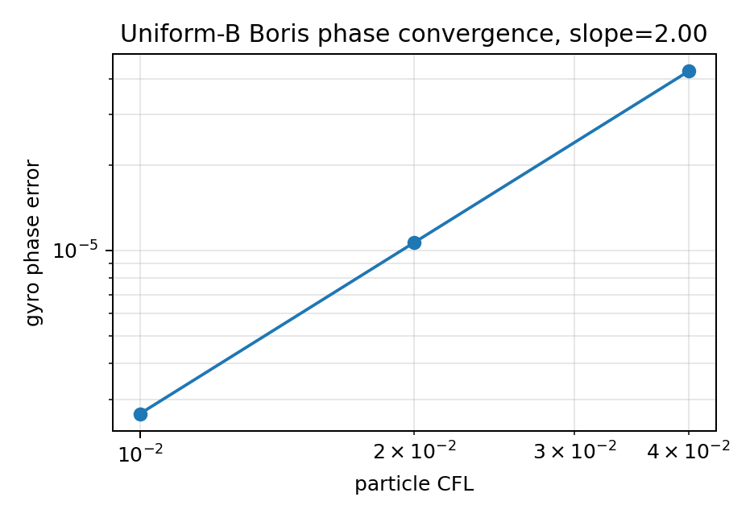

The fitted phase-error slope is `1.818`, consistent with the expected
approximately second-order Boris time accuracy in the small CI-sized sweep.  The
speed is conserved to roundoff in the regression test.

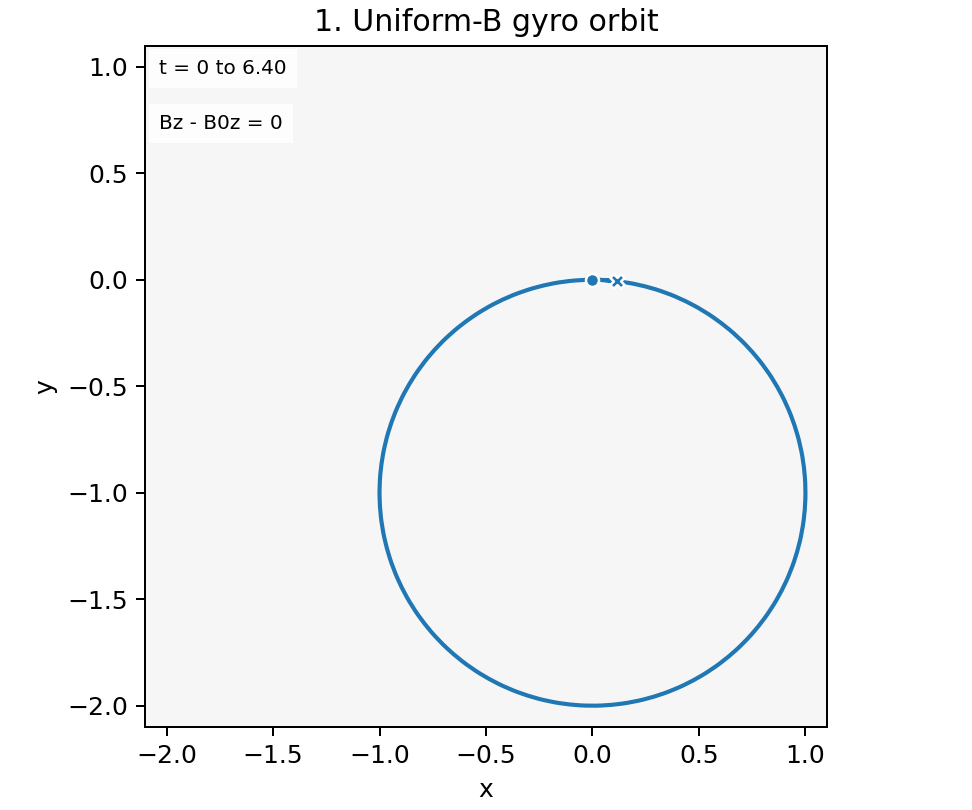

The qualitative companion follows one nearly complete gyroperiod.  Its flat
background is expected: a uniform `Bz` field has `Bz - B0z = 0` and no
in-plane field component.

## 2. Uniform-B AMR/MPI Crossing

This case runs the same uniform-field pusher through AMR creation/deletion and
MPI particle exchange.  Because the magnetic field is uniform, the useful signal
is not field accuracy; it is whether ownership updates introduce invalid `PGID`s,
lost particles, or diagnostic inconsistencies.

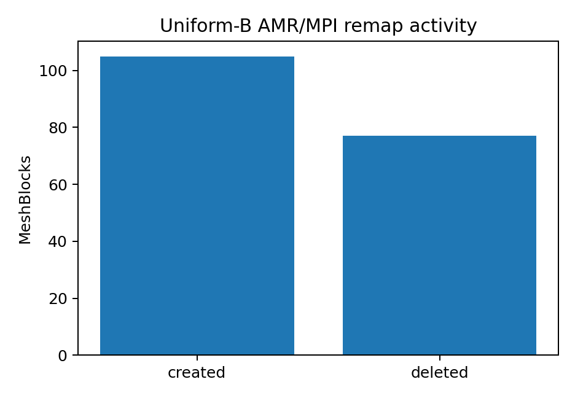

The local documentation run created `105` MeshBlocks and deleted `77`.  The
final rank counts were `505` and `519`, with both species conserving `512`
particles each.

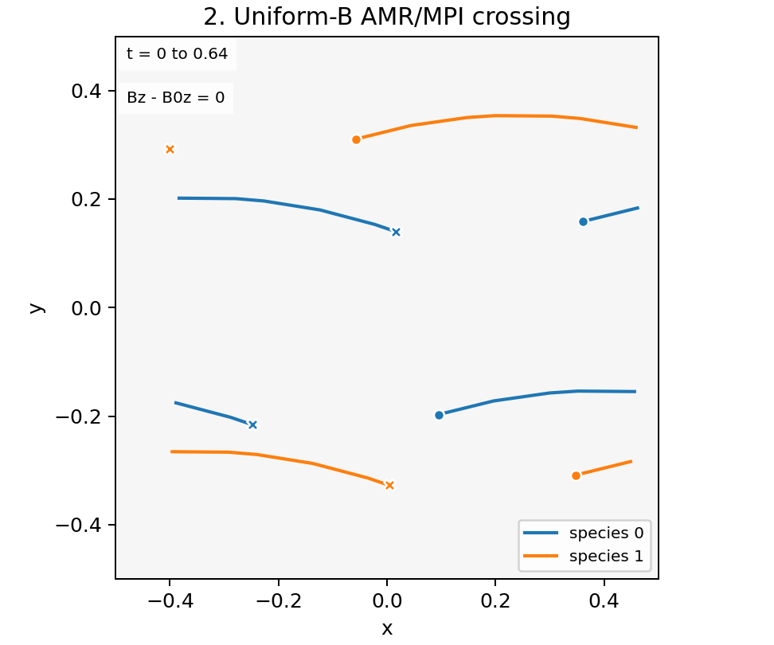

The longer companion panel follows four particles while the moving refinement
pattern and two-rank exchange path are active.  Lines are broken at periodic
wraps so boundary crossings do not appear as artificial diagonal flights
through the domain.

## 3. Linear Gather

The gather-only linear-field test places a fixed particle in
`Bx = Bx0 + a y`, `By = By0 + a x`, `Bz = Bz0`.  This isolates interpolation
from orbit error.

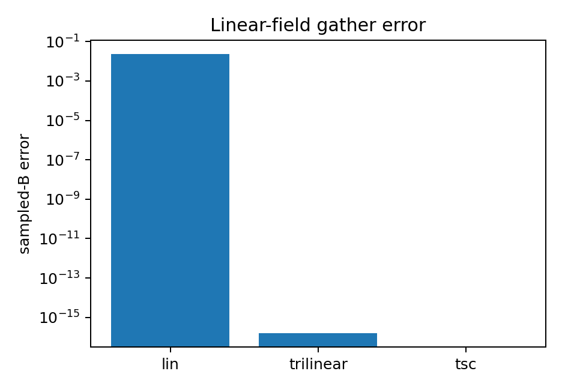

`trilinear` recovers the linear field to roundoff (`1.57e-16`) and `tsc` is exact
for this sample.  The legacy `lin` path shows the expected component-placement
error (`2.28e-2`), which is useful as a regression signal rather than a preferred
accuracy mode.

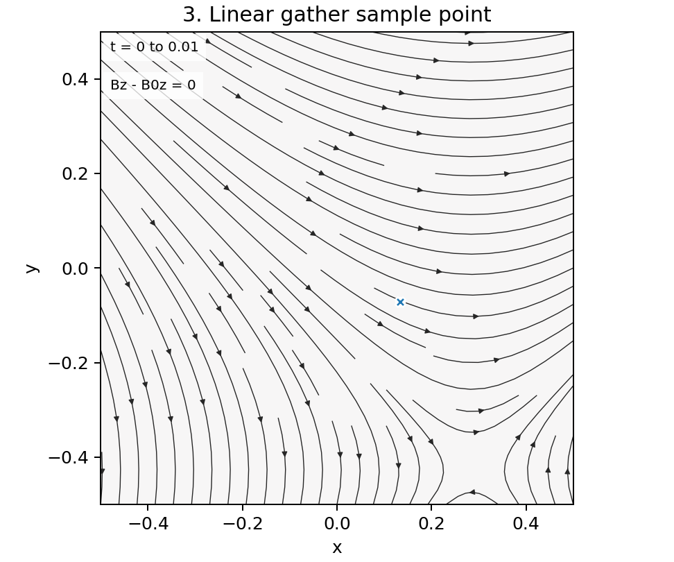

This panel shows the single stationary sample location against the in-plane
linear cross-field structure.  Particle motion is disabled intentionally, so
the quantitative error is solely the gather operation.

## 4. Manufactured Divergence-Free Field

The smooth manufactured field is analytically divergence-free and samples all
three components with nonzero spatial curvature.  The fixed-particle setup makes
the measured error a pure field-gather error.

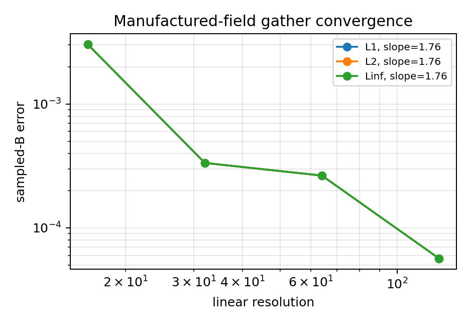

The documentation run gives RMS sampled-field errors
`1.27e-2`, `3.03e-3`, and `3.34e-4` at `8^3`, `16^3`, and `32^3`, with fitted
slope `2.625`.  The exact slope depends on the sample point and finite
resolution range, so the regression checks monotonic convergence and a
second-order-compatible slope rather than a single hard-coded error value.

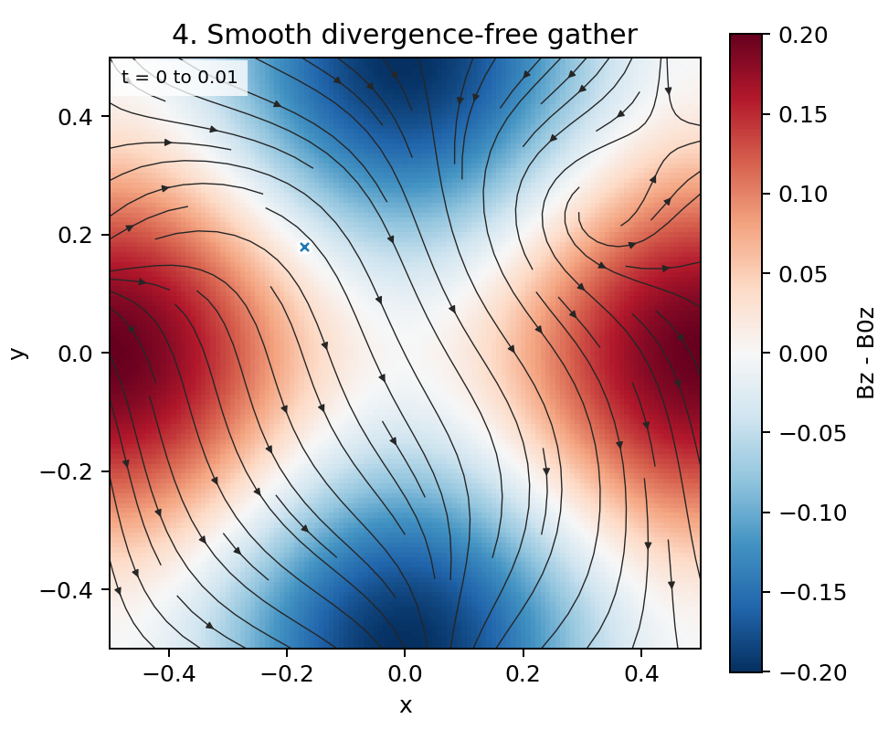

The fixed particle samples a region where the manufactured divergence-free
field varies in both direction and `Bz`.  This separates spatial gather
accuracy from pusher error.

## 5. Smooth-Field Orbit Reference

This test couples the pusher and gather in the manufactured smooth field.  The
`64^3` run is used as the local reference for the CI-sized documentation sweep.

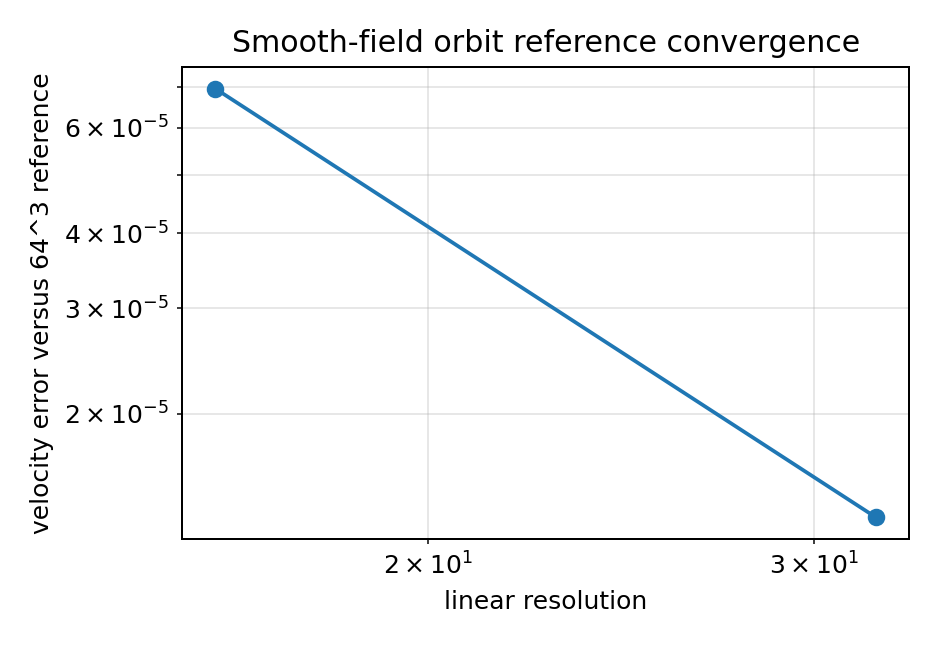

The final velocity error drops from `6.97e-5` at `16^3` to `1.34e-5` at `32^3`
relative to the `64^3` reference.  This is the first test in the ladder where
spatial gather error and pusher time error are both active.

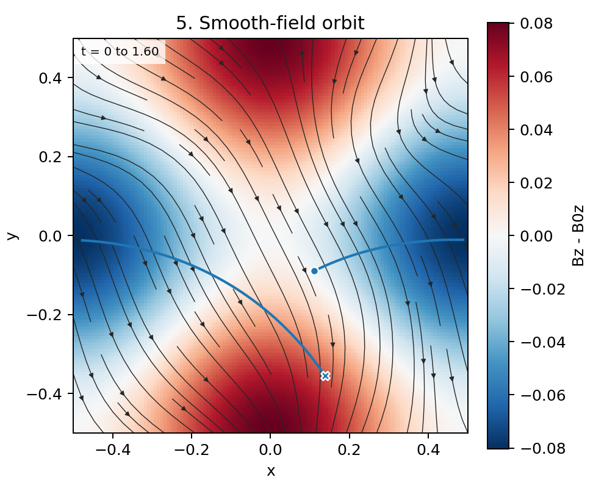

The longer path makes the coupled role of field curvature and Boris rotation
visible; it is generated with the same smooth prescribed field used by the
reference-convergence test.

## 6. Magnetic Mirror

The mirror test uses the divergence-free field
`Bz = B0 + a z^2`, `Bx = -a x z`, `By = -a y z`.  The diagnostic is a magnetic
moment proxy, `v_perp^2 / |B|`, rather than an exact analytic trajectory.

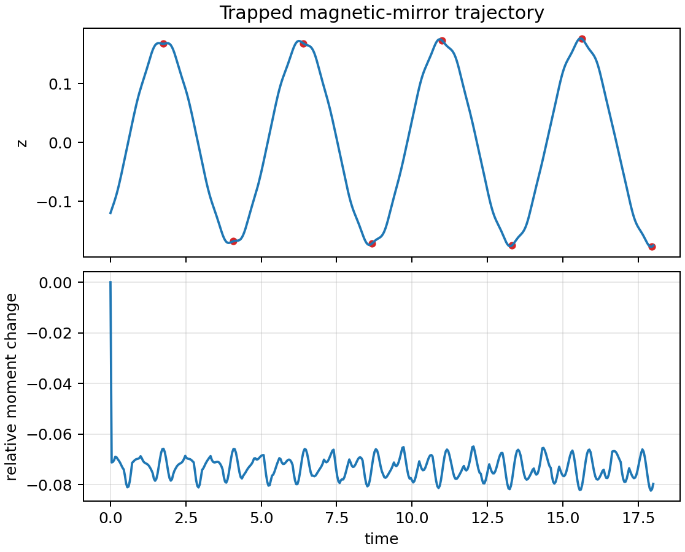

For the short local run, the proxy changes from `0.482761` to `0.477217`, a
relative drift of `1.15e-2`, while the Boris pusher conserves speed to roundoff.

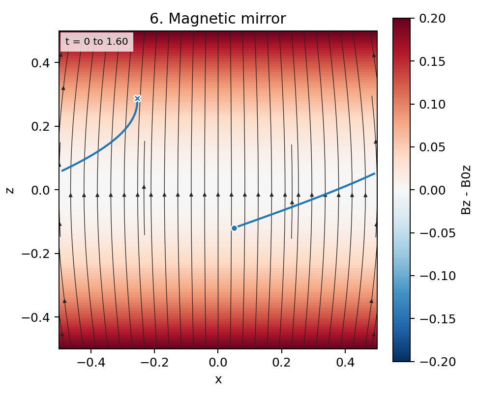

The `x-z` projection exposes the increasing `Bz` away from the midplane and
the field-line tilt that are hidden in a fixed-`z` `x-y` view.

## 7. Grad-B Drift Response

The grad-B test is designed to catch long-time transport bias that a one-orbit
uniform-field test cannot see.  The CI-sized version checks that the final state
responds monotonically to increasing gradient strength without speed growth.

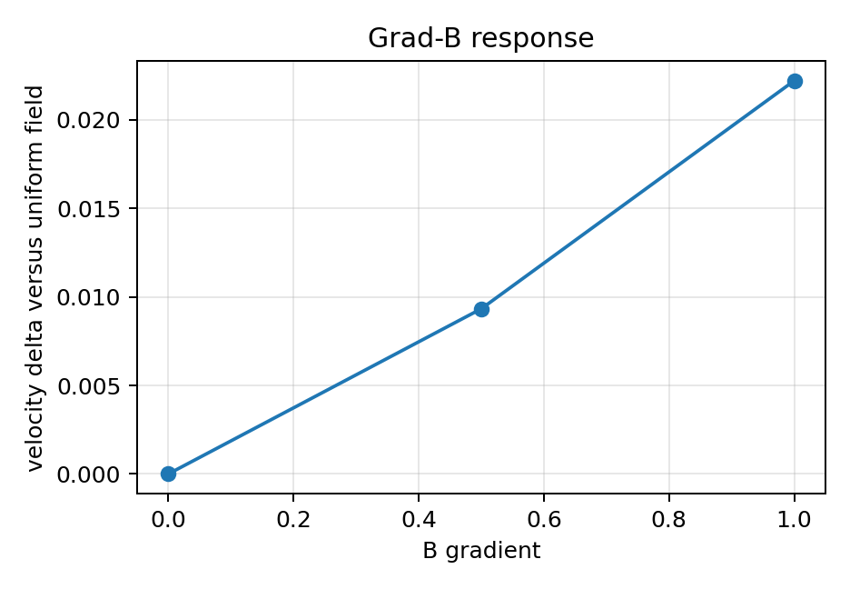

The final velocity deltas relative to the uniform-field run are `0`,
`9.33e-3`, and `2.22e-2` for `Bgrad=0`, `0.5`, and `1.0`.

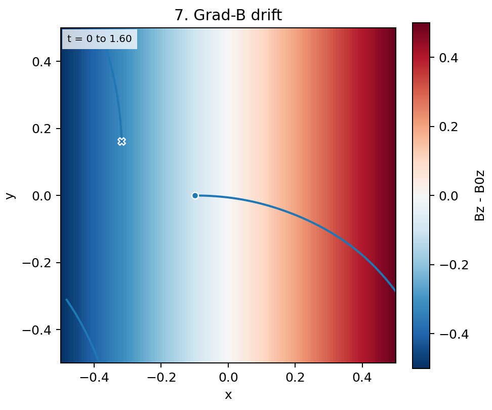

The qualitative run uses the strongest tested gradient, `Bgrad=1`, so the
transverse displacement relative to a uniform-field orbit is visible.

## 8. AMR Refinement-Boundary Stress

The AMR boundary case uses the smooth manufactured field plus a moving
refinement pattern, forcing repeated refinement and derefinement while particle
consistency checks are enabled.

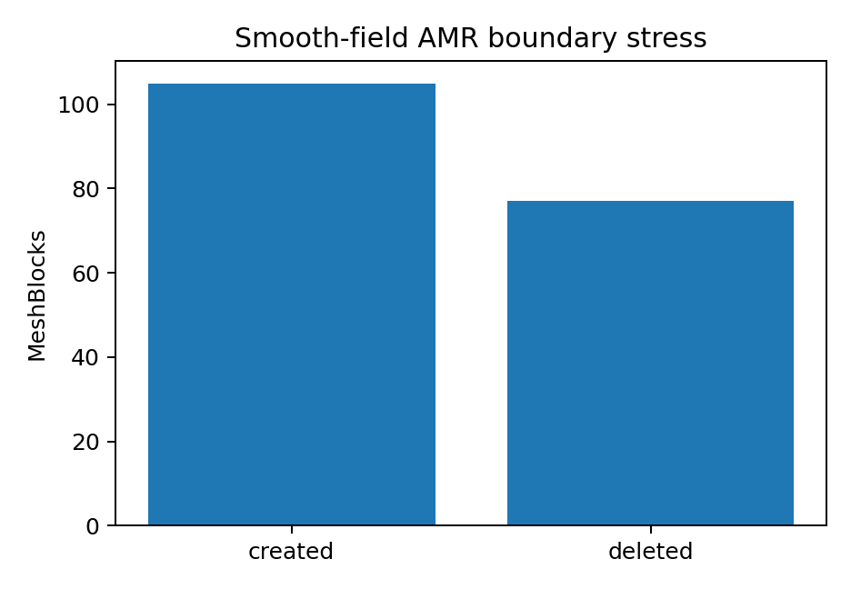

The local run created `105` MeshBlocks and deleted `77`, conserved `512`
particles per species, and produced finite reduced moments on both MPI ranks.
This confirms that the fast mesh-tree/table remap path works with the current
AMR and div(B) repair flow for this stress case.

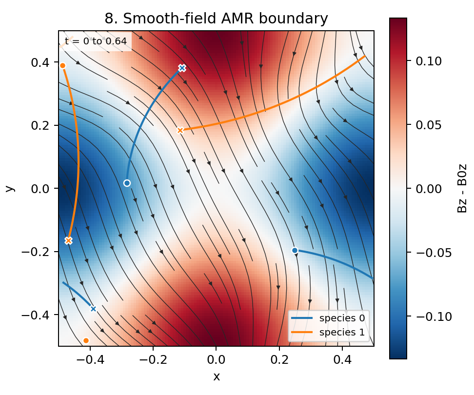

Four selected trajectories are shown over the smooth prescribed field during
the longer moving-refinement run.  The field background remains prescribed;
the test signal is survival and consistent motion across remaps and exchange.

## 9. MPI Decomposition Invariance

The MPI decomposition test compares one-rank and two-rank runs with a
deterministic `meshblock_center` particle layout.  Particles are sorted by
species and tag before comparing positions, velocities, and sampled fields.

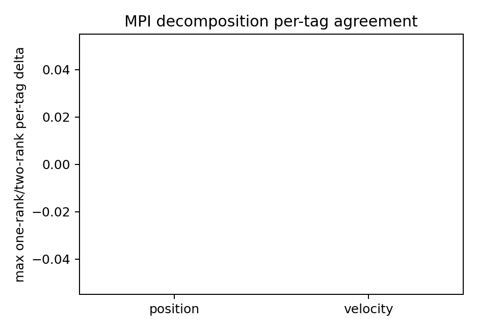

The maximum per-tag position and velocity deltas are both `0` in the local
one-rank/two-rank comparison.  The reduced `mean_speed2` deltas are also `0`
for both species.

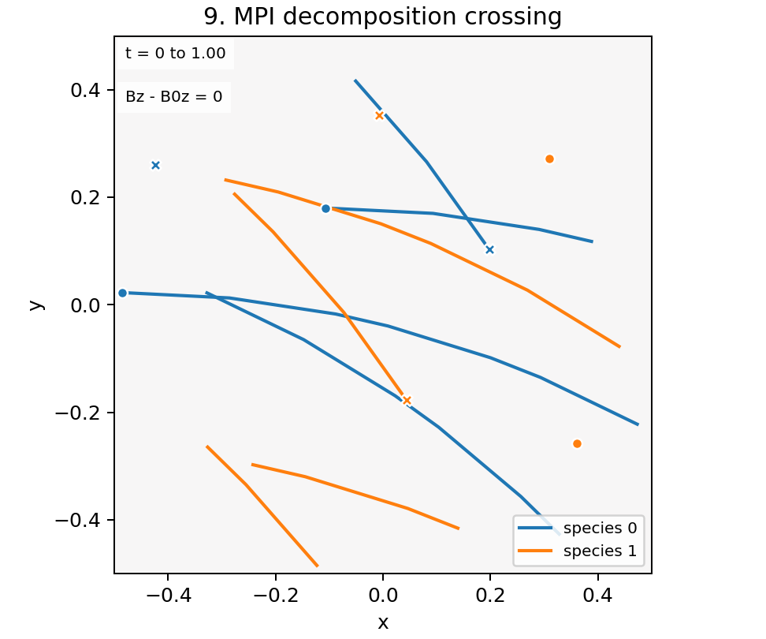

The companion view uses the two-rank run and a longer interval so repeated
motion across periodic and ownership boundaries is visible in the uniform
field.

## 10. Isotropic Ensemble

The isotropic ensemble test validates distribution diagnostics for two species
with fixed speed and isotropic pitch angles.  It checks restart counts,
`pspec`, `pspec2`, and `pmom`.

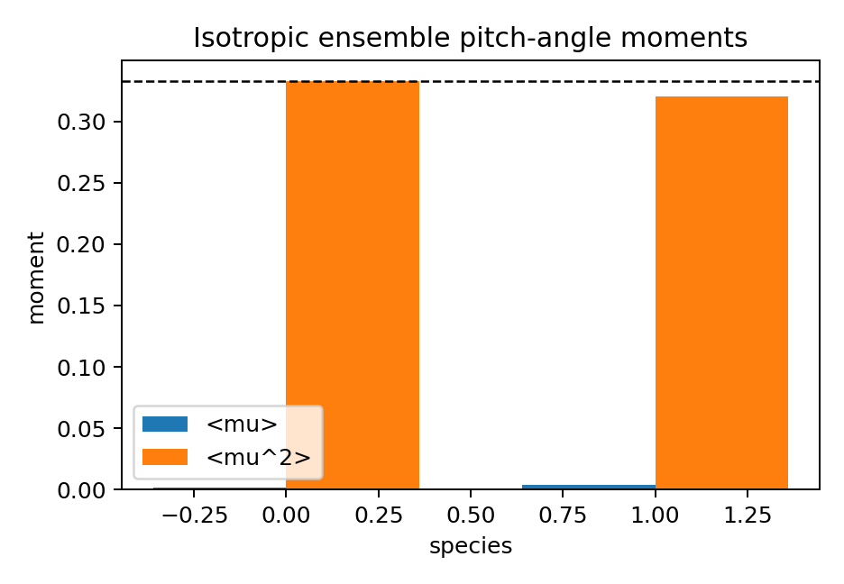

The measured moments are:

| Species | `<mu>` | `<mu^2>` |
|---------|--------|----------|
| 0 | `1.88e-3` | `0.3331` |
| 1 | `3.88e-3` | `0.3207` |

The expected isotropic values are `<mu> = 0` and `<mu^2> = 1/3`; the deviations
are consistent with finite-particle sampling in the small documentation run.

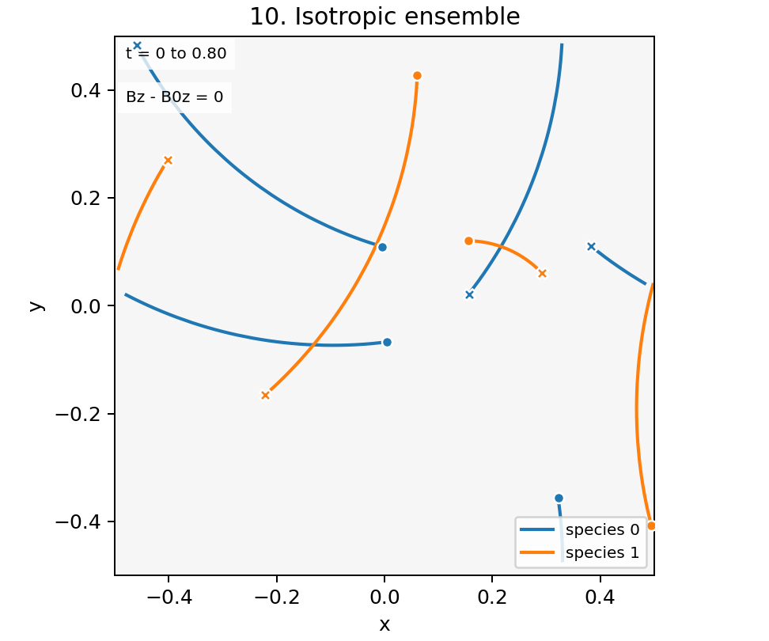

Six tagged paths, three from each species, illustrate the path diversity that
underlies the reduced pitch-angle and distribution diagnostics.

## 11. Frozen Turbulent-Field Reference

The frozen turbulent-field case is a production-like diagnostic test with a
smooth prescribed multi-mode field.  It is not intended to prove an analytic
trajectory; it checks whether the method produces normalized spectra and
well-formed ensemble moments in a less idealized field.

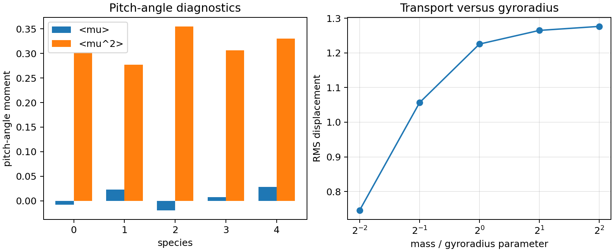

The measured pitch-angle moments are:

| Species | `<mu>` | `<mu^2>` |
|---------|--------|----------|
| 0 | `-1.06e-1` | `0.3409` |
| 1 | `-6.73e-2` | `0.3516` |

The joint spectra are normalized to `128` particles per species, and the speed
moment remains unity for the fixed-speed initialization.

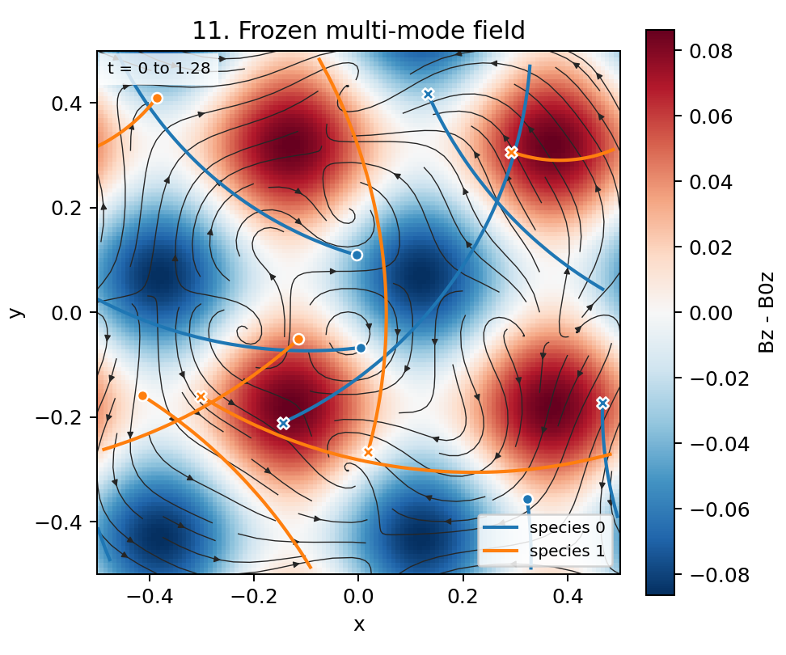

The six longer tracks traverse the structured multi-mode field used for the
production-like diagnostic test.  The field is prescribed and frozen rather
than an evolved turbulent MHD snapshot.

## Local Regression Commands

The small CI-oriented tests are:

```bash
cd tst
python run_test_suite.py --test test_suite/particles/test_particles_cr_accuracy_cpu.py --cpu
python run_test_suite.py --test test_suite/particles/test_particles_cr_accuracy_mpicpu.py --mpicpu
python run_test_suite.py --style
python run_tests.py mhd/mhd_divb_amr
git diff --check
```

Local results from 2026-05-22:

- CPU accuracy suite: `11 passed in 4.79s`.
- MPI CPU accuracy suite: `3 passed in 0.89s`.
- Deep div(B) AMR suite: passed through physical refinement levels 1 through 5
  in `143 s`; the deepest case completed with `30,829` live MeshBlocks after
  `50,673` creations and `19,908` deletions.
- Style suite: `2 passed in 13.23s`.
- `git diff --check`: passed.
- GitHub Pages overlay build: `python -m sphinx -W --keep-going -b html
  docs/source docs/build/html` passed and resolved all 11 qualitative image
  references.
- Documentation study: generated 11 quantitative panels, 11 matching
  qualitative field-and-trajectory panels, and
  `cr_tracer_accuracy_summary.json`.

## Known Limits And Follow-Up

The current branch now has executable small tests for all 11 accuracy problems
and documentation figures for all 11.  The main follow-ups are:

- Run the same documentation ladder on a GPU build and add a GPU comparison
  section.  This branch intentionally records that as a TODO because the local
  machine only has CPU and MPI available.
- Extend the documentation sweeps to larger resolutions and longer runtimes on a
  larger machine, especially for the mirror, grad-B, AMR-boundary, and frozen
  turbulent-field cases.
