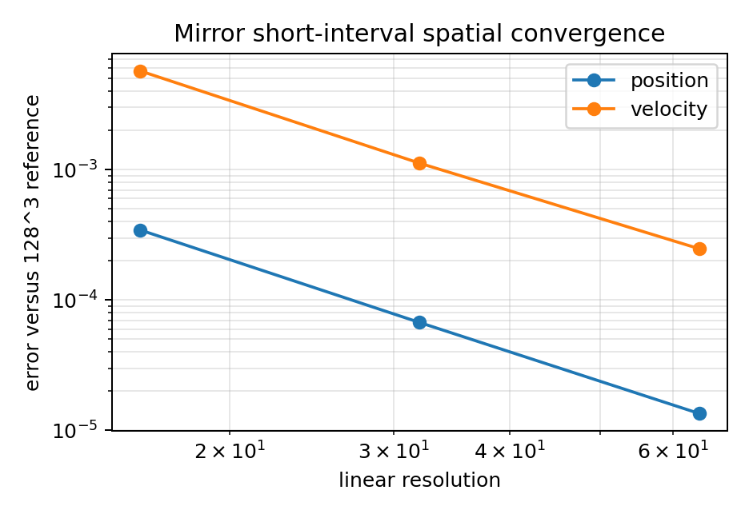
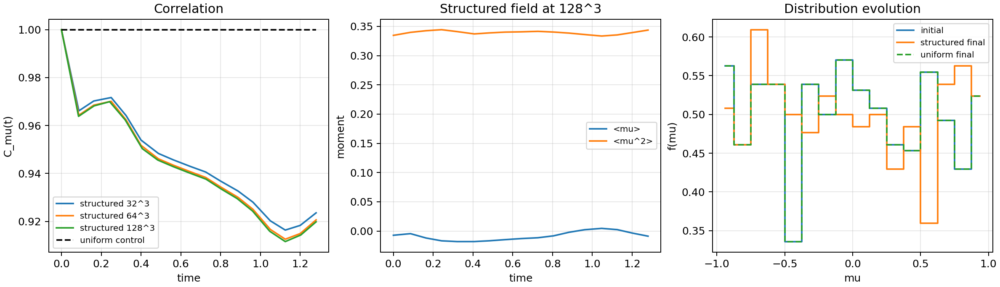
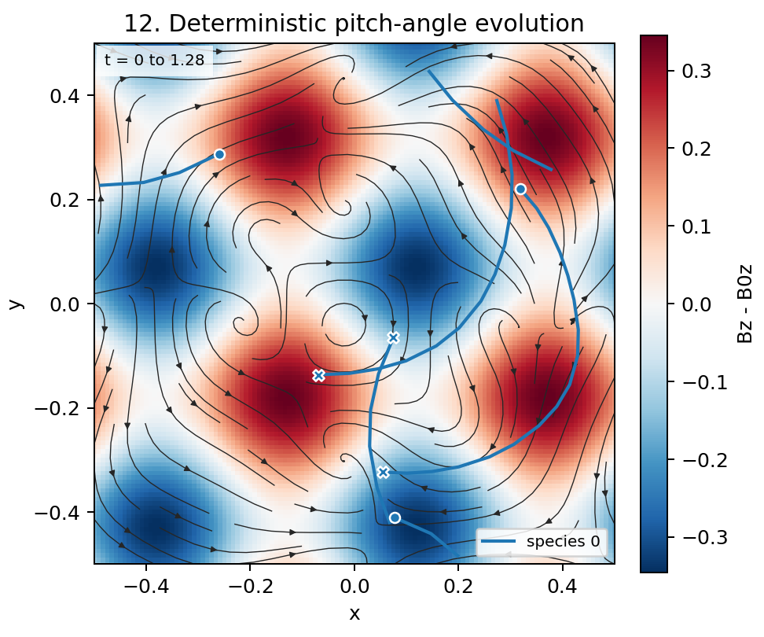

# CR Tracer Accuracy Validation

This page records a twelve-test CPU and MPI validation ladder for cosmic-ray
tracer particles.  It proceeds from analytic Boris and field-gather checks to
AMR remapping, MPI decomposition invariance, and ensemble diagnostics in
structured magnetic fields.  The separate
[CPU/MPI performance page](cr_tracer_cpu_mpi_performance.md) covers timing of
the remap and exchange architecture; this page is about numerical behavior.

All nonuniform fields in this accuracy study are prescribed fields.  The
accuracy inputs use `evolution = kinematic` with `rsolver = advect`, so the
particle is tested against the intended analytic or frozen field rather than
against an MHD field that evolves during the measurement.  Dynamic MHD and
the current AMR div(B) repair are covered separately by the div(B) acceptance
run.

```{important}
Test 10 validates isotropic initialization and output diagnostics; it is not a
pitch-angle scattering test.  Test 12 measures deterministic pitch-angle
evolution in a structured prescribed field.  This branch does not implement a
stochastic or collisional pitch-angle scattering operator.
```

## Reproducing The Figures

The published results and figures below were generated on 2026-05-23 from
revision `8c041244a5c6910fe2f22125ffea1fd7cdd96071` using Open MPI 5.0.9.
Distributed documentation runs used eight MPI ranks.  The evidence generator
records the executable, rank count, run overrides, wall time, and git revision
for every calculation in the machine-readable summary.  Its provenance
records `git_worktree_dirty = true` because figures were generated before the
completed changes were committed.

```bash
cmake --build build-cr-robust-mpi -j 8
python scripts/particles/cr_tracer_accuracy_study.py \
  --profile docs --mpi-ranks 8 \
  --athena build-cr-robust-mpi/src/athena \
  --mpiexec mpiexec \
  --output-dir docs/source/modules/figures/cr_tracer_accuracy
```

The generated numerical record is
`docs/source/modules/figures/cr_tracer_accuracy/cr_tracer_accuracy_summary.json`.
The documentation run executed 54 calculations with `154.530 s` of recorded
subprocess wall time.  Serial runs are retained where a single analytic orbit
or stationary sample is the experiment; MPI is used for the expensive
distributed AMR and ensemble evidence.

## Figure Convention

Each test includes a quantitative panel and a qualitative companion.  In the
qualitative panels, color represents `Bz - B0z`, streamlines show in-plane
magnetic-field direction, circles mark initial particle positions, and crosses
mark final positions.  The two gather-only tests intentionally show stationary
sample points.  Trajectories crossing periodic boundaries are broken rather
than plotted as artificial domain-spanning segments.

| Test | Qualitative interval | Tracks shown | Ranks |
|------|----------------------|-------------:|------:|
| 1. Uniform-B gyro orbit | `0 <= t <= 6.40` | 1 | 1 |
| 2. Uniform-B AMR/MPI crossing | `0 <= t <= 0.64` | 4 | 8 |
| 3. Linear gather | `0 <= t <= 0.01` | 1 stationary sample | 1 |
| 4. Smooth divergence-free gather | `0 <= t <= 0.01` | 1 stationary sample | 1 |
| 5. Smooth-field orbit | `0 <= t <= 1.60` | 1 | 1 |
| 6. Magnetic mirror | `0 <= t <= 18.00` | 1 | 1 |
| 7. Grad-B drift | `0 <= t <= 1.60` | 1 | 1 |
| 8. AMR boundary crossing | `0 <= t <= 0.64` | 4 | 8 |
| 9. MPI decomposition | `0 <= t <= 1.00` | 4 | 8 |
| 10. Isotropic ensemble | `0 <= t <= 0.80` | 6 | 1 |
| 11. Multi-gyroradius frozen field | `0 <= t <= 3.20` | 5 | 8 |
| 12. Deterministic pitch-angle evolution | `0 <= t <= 1.28` | 3 | 8 |

## Method Selection

| Interpolation | Appropriate use | Result in this suite | Limitation |
|---------------|-----------------|----------------------|------------|
| `lin` / `lin_legacy` | Reproduce legacy results. | Linear gather error is `2.2770e-2`. | Not recommended for new smooth-field accuracy studies. |
| `trilinear` | Smooth prescribed fields and single-orbit comparisons. | Linear gather is accurate to `1.57e-16`; smooth cases converge through `128^3`. | Retains more local field structure than a wider stencil. |
| `tsc` | Ensemble transport and smoother diagnostic sampling. | Linear sample is exact; Tests 10-12 remain normalized and finite. | Wider support makes AMR-boundary validation essential. |

## 1. Uniform-B Gyro Orbit

This test isolates the Boris pusher in a constant `Bz = 1` field.  With no
spatial field variation, a particle follows an analytic helix: circular
perpendicular motion and constant parallel drift.  Any phase error is due to
the particle time integration rather than interpolation or AMR ownership.

For a perfect Boris solution at decreasing particle timestep, speed is
constant and gyro phase error approaches zero at second order.  The measured
phase errors are `4.2656e-5`, `1.0666e-5`, and `2.6666e-6` for particle CFL
values `0.04`, `0.02`, and `0.01`, giving a fitted slope of `1.99984`.


## 2. Uniform-B AMR/MPI Crossing

This test places uniform-field Boris particles in an adaptive mesh with a
moving refinement pattern and MPI exchange.  Since the physical field is
uniform, it isolates the ownership and conservation consequences of AMR
creation, derefinement, remapping, and distributed migration.

In the ideal limit, AMR and MPI change storage ownership without changing the
orbit, particle count, or speed.  The eight-rank documentation run created
`147` MeshBlocks and deleted `126`, retained `1024` particles, and reported
`<v^2> = 1.1299999999999983` for both species.  The imbalanced final rank
counts are expected from particle motion and do not affect the globally
conserved result.


## 3. Linear Gather

This stationary-particle test samples the manufactured field
`Bx = Bx0 + a y`, `By = By0 + a x`, and constant `Bz`.  It isolates the field
gather operation from integration error and provides a direct discriminator
among the implemented interpolation modes.

A linear-consistent gather must reproduce this field to roundoff at any
resolution.  The measured sampled-field errors are `2.2770e-2` for legacy
`lin`, `1.5701e-16` for `trilinear`, and `0` for `tsc`.  This is why the new
smooth-field single-orbit studies use `trilinear`, while ensemble studies may
use `tsc`.


## 4. Smooth Divergence-Free Gather

This gather-only problem samples a spatially curved analytic
divergence-free magnetic field.  Unlike the linear problem, it tests how the
interpolation stencil converges when all three field components vary smoothly
over a cell.

At infinite resolution, the sampled field equals the analytic field and all
error norms vanish.  The `trilinear` documentation sweep reaches
`16^3, 32^3, 64^3, 128^3` with measured `L2` errors `3.0290e-3`,
`3.3448e-4`, `2.6453e-4`, and `5.6696e-5`; the fitted slope is `1.75568`.
The mid-sweep reduction is not perfectly asymptotic, but the endpoint decrease
and near-second-order fitted behavior are consistent with smooth gather
convergence.


## 5. Smooth-Field Orbit

This test advances one particle through the same smooth prescribed field,
coupling interpolation to Boris rotation.  It reports final position,
velocity, pitch-angle, and magnetic-moment-proxy differences, and includes a
fixed-resolution particle-timestep sweep to separate spatial from temporal
effects.

For a perfect method, all state differences vanish as spatial resolution and
particle timestep increase in accuracy.  Against the local `128^3` reference,
position error decreases from `1.7381e-6` at `16^3` to `8.5023e-8` at
`64^3`, and velocity error decreases from `6.6134e-5` to `2.3180e-6`.
At fixed `64^3`, reducing particle CFL from `0.0125` to `0.003125` decreases
velocity error from `2.3293e-7` to `1.5871e-8`; pitch-angle and magnetic
moment errors remain near `1.05e-4` and `3.39e-5`, showing that spatial gather
error dominates those observables in this short sweep.  A `256^3` reference
remains pending larger-hardware validation.


## 6. Magnetic Mirror

This test now uses a genuinely trapped configuration:
`min_mass = 0.10`, `Bgrad = 4.0`, and `v0z = 0.15`.  The mirror force should
reverse the particle repeatedly between stronger-field regions, making this a
more discriminating test than the former passing orbit.  A passing control
uses the same field with larger parallel speed.

In the adiabatic, well-resolved limit, a trapped particle repeatedly reaches
two turning regions while approximately conserving magnetic moment.  The
published trajectory runs to `t = 18`, remains in
`-0.17745 <= z <= 0.17716`, exhibits `8` parallel-velocity reversals and mean
bounce period `4.62667`, while the passing control has `0` reversals.
The maximum relative magnetic-moment excursion is `8.2355e-2`.  In the short
spatial sweep, velocity error relative to `128^3` decreases from `5.7288e-3`
at `16^3` to `2.4725e-4` at `64^3`; a `256^3` reference remains pending.
The plotted one-particle bounce trajectory is serial because distributing one
particle is not a meaningful acceleration experiment; the MPI regression
separately advances a deterministic mirror ensemble on eight ranks.





## 7. Grad-B Drift

This test advances a full orbit in a field with a transverse magnetic
gradient.  It is intended to expose systematic transverse displacement that a
uniform-field gyro test cannot measure, while retaining a simple prescribed
field that can be sampled consistently at higher resolution.

In a sufficiently small-gyroradius regime, the drift can also be compared with
a guiding-center formula.  This present discriminating full-orbit setup has
`rho_L/L_B = 0.98765`, so that asymptotic estimate is not a valid oracle.
Instead, the calculation is compared to its resolved full-orbit reference:
the final transverse coordinate is `-0.16748846` at `128^3`, and differences
from the lower-resolution trajectories are below `7.76e-7` in position and
`6.17e-7` in velocity.  A `256^3` full-orbit reference remains pending.


## 8. AMR Refinement-Boundary Crossing

This case combines the smooth prescribed field with moving user-refinement
boxes, forcing particles across refinement and derefinement boundaries while
`check_consistency_mode = full` and the mesh-lookup validation are enabled.
It tests interpolation, tree/table ownership remap, MPI exchange, and the
current AMR infrastructure together.

In the ideal limit, a moving AMR representation agrees with the corresponding
uniform-grid trajectory at its effective finest resolution and never loses or
misassigns particles.  Eight-rank sweeps reach effective finest resolutions
`32^3`, `64^3`, and `128^3`.  The highest case creates `11914` MeshBlocks and
deletes `11340`, conserves both species with `<v^2> = 1`, and differs from its
uniform `128^3` control by at most `6.4128e-5` in position and `1.6381e-4`
in velocity.  Its position difference versus the AMR `128^3` result falls
from `8.4367e-4` at effective `32^3` to `2.3411e-4` at effective `64^3`.


## 9. MPI Decomposition Invariance

This test initializes particles from `(seed, species, tag)` rather than rank
ownership, then compares identical tagged particles run with one, two, four,
and eight MPI ranks.  The trajectory crosses ownership boundaries and
explicitly exercises a valid state where a rank contains zero particles.

With exact decomposition independence, rank count changes only data location;
per-tag positions, velocities, and reduced diagnostics are identical.  All
comparisons with the one-rank baseline produce maximum position and velocity
deltas of `0`, while species speed-moment differences are no larger than
`8.8818e-16`.  This result is also the regression that guards the empty-rank
subcycle and exchange fix.


## 10. Isotropic Ensemble Diagnostics

This test initializes two fixed-speed isotropic particle ensembles in a
uniform magnetic field and validates reduced particle histograms, spectra, and
moments.  It is an output and initialization check: the particles do not
undergo a stochastic scattering process.

For an infinitely sampled isotropic ensemble, `<mu> = 0` and
`<mu^2> = 1/3`.  With `1024` particles per species, the measured values are
`(<mu>, <mu^2>) = (1.8836e-3, 0.333092)` and
`(3.8813e-3, 0.320671)`.  Reduced outputs retain the required counts; the
remaining difference from exact isotropy is finite-ensemble sampling.


## 11. Multi-Gyroradius Frozen Field

This production-like diagnostic problem advances five deterministic species
through a frozen multi-mode field on eight MPI ranks.  Mass parameters
`0.25`, `0.5`, `1`, `2`, and `4` span a factor of sixteen in gyroradius at
fixed initial speed and field, allowing the diagnostic response to be viewed
across magnetization regimes.

A perfect fixed-magnetic-field Boris evolution conserves speed while the
structured field produces mass-dependent trajectories and displacement
statistics.  Every joint spectrum integrates to `128` particles; measured
`<v^2>` differs from unity by at most `2.22e-16`.  RMS displacement increases
across the five masses as `0.74618`, `1.05644`, `1.22544`, `1.26484`, and
`1.27638`, demonstrating a resolved gyroradius dependence in this diagnostic
interval without assigning it a diffusion interpretation.


## 12. Deterministic Pitch-Angle Evolution

This new test advances a tag-defined isotropic ensemble through a stronger
frozen structured field, with an otherwise identical uniform-field negative
control.  It measures deterministic field-induced changes of pitch angle
using `C_mu(t)`, evolving moments, and the binned `f(mu)` distribution.

In the uniform control, perfect Boris motion preserves every particle's pitch
angle, so `C_mu(t) = 1` and `f(mu)` is unchanged.  The eight-rank control gives
final `C_mu = 1.0`; its final moments exactly reproduce the initial
`(<mu>, <mu^2>) = (-7.2702e-3, 0.3346655)`.  In the structured case,
final `C_mu` converges from `0.923578` at `32^3` to `0.919833` at `128^3`,
and the `128^3` final moments become `(-8.8431e-3, 0.3437016)`.  The maximum
speed-squared deviation is `4.8850e-15`.  These are deterministic
decorrelation measurements, not evidence for a stochastic scattering
operator; the requested `256^3` structured reference remains pending.





## Regression And Acceptance Commands

The documentation workload is intentionally larger than the CI-scale
regression.  The final local acceptance sequence for this branch is:

```bash
cd tst
python run_test_suite.py --test test_suite/particles/test_particles_cr_accuracy_cpu.py --cpu
python run_test_suite.py --test test_suite/particles/test_particles_cr_accuracy_mpicpu.py --mpicpu
python run_test_suite.py --style
python run_tests.py mhd/mhd_divb_amr
cd ..
git diff --check
python -m sphinx -W --keep-going -b html docs/source docs/build/html
```

Results from the final local acceptance execution on 2026-05-23:

- CPU accuracy suite: `12 passed in 5.92s`.
- MPI CPU accuracy suite: `5 passed in 1.48s`, including eight-rank
  decomposition with an intentionally empty rank after migration.
- Style suite: `2 passed in 12.33s`.
- Deep div(B) AMR compatibility suite: passed in `134 s`; its deepest
  five-physical-level case ended with `30829` live MeshBlocks after `50673`
  creations and `19908` deletions.
- `git diff --check` and the Sphinx build are included in the final
  pre-commit validation record below.

## Limits And Follow-Up

- Tests 5, 6, 7, and 12 reach `128^3` locally.  Their requested `256^3`
  references remain explicitly pending larger CPU/RAM hardware validation;
  no `128^3` result is mislabeled as a `256^3` reference.
- GPU accuracy and performance validation remain TODO items.  This machine has
  CPU and MPI execution available, and this page makes no accelerator claim.
- Test 12 deliberately validates deterministic field-induced pitch-angle
  evolution only.  Adding stochastic pitch-angle diffusion would be a separate
  physical-method feature with its own analytic and convergence tests.
