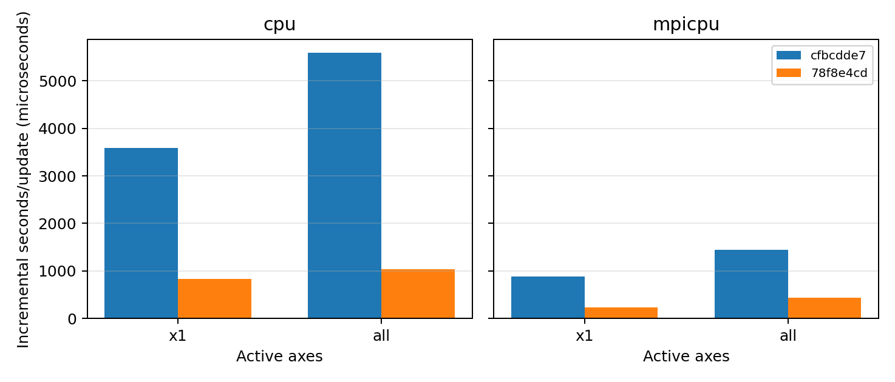

# Frame Tracking Performance Evidence

This page records controller-overhead measurements for the fused multi-axis
sampling implementation. It is performance evidence only; the
medium-resolution cloud/TRML physical-validation matrix remains a separate
production-candidate gate.

## Measurement Protocol

The benchmark uses
`inputs/hydro/frame_tracking_benchmark.athinput` and
`scripts/benchmark_frame_tracking.py`. It evolves a uniform `64 x 64 x 64`
hydro grid split into `16 x 16 x 16` meshblocks for 200 cycles. The target
velocity is exactly zero and `mode=velocity`, so enabled and disabled cases
have identical fluid evolution. The enabled timing measures material
selection, moment calculation, controller update, and reduction overhead
without a physical boost kernel or output I/O.

For each revision and backend, one warm-up run was discarded and seven timed
repeats were recorded for tracking disabled, `axes=x1`, and `axes=all`.
Incremental cost is:

```text
(median(enabled elapsed) - median(disabled elapsed)) / 200
```

The run was performed locally on May 23, 2026 on an Apple M4 Max host
(`Darwin 25.5.0 arm64`) using CMake 4.3.2 Release builds with `/usr/bin/c++`;
the MPI cases used four ranks. GPU timing was not collected.

```bash
python scripts/benchmark_frame_tracking.py \
  --baseline-tree /path/to/cfbcdde7-worktree \
  --candidate-tree /path/to/feature-frame-tracker-worktree \
  --skip-build --warmups 1 --repeats 7 --cycles 200 \
  --mesh 64 --block 16 \
  --output docs/source/_static/frame_tracking_benchmark.csv \
  --plot docs/source/_static/frame_tracking_benchmark.png
```

## Results

| Backend | Axes | `cfbcdde7` baseline | `78f8e4cd` candidate | Change | Criterion | Result |
| --- | --- | ---: | ---: | ---: | --- | --- |
| CPU | `x1` | `3.594 ms/update` | `0.828 ms/update` | `77.0%` lower | No more than 5% regression | Pass |
| CPU | `all` | `5.588 ms/update` | `1.041 ms/update` | `81.4%` lower | At least 25% lower | Pass |
| MPI CPU, 4 ranks | `x1` | `0.887 ms/update` | `0.233 ms/update` | `73.7%` lower | Recorded comparison | Measured |
| MPI CPU, 4 ranks | `all` | `1.443 ms/update` | `0.441 ms/update` | `69.5%` lower | Recorded comparison | Measured |

The candidate combines one fused active-axis sampling pass with suppression of
the fluid boost kernel and timestep refresh when the computed Galilean
increment is exactly zero. Non-zero boost correctness is separately tested by
the MHD invariant regression and restart/MPI tests.



Download the [raw benchmark CSV](../_static/frame_tracking_benchmark.csv).

## Limits

- This benchmark tests steady tracking overhead, not a driven cloud or mixing
  layer evolution.
- CPU results are measured; no GPU conclusion is inferred.
- Scientific recommendations still require the documented
  medium-resolution transformed-frame, restart, MPI, and AMR comparisons.
