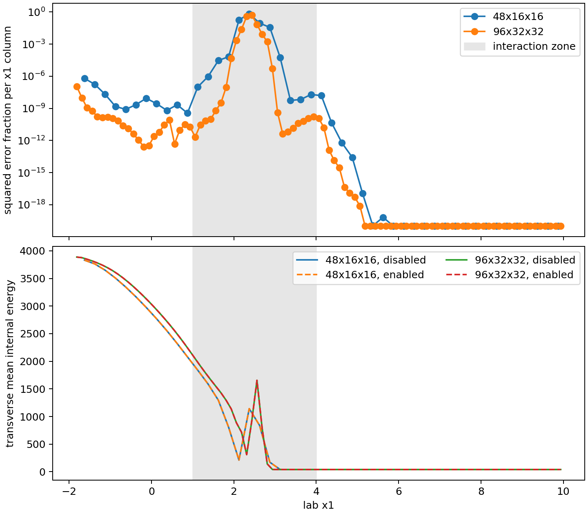

# Frame Tracking Material-Based Serial Validation

This page reports the May 24, 2026 material-based serial validation campaign
and its follow-up correction for the shipped cloud-crushing and TRML
frame-aware examples. Advected tracer mass and tracer-mass centroid are the
material-retention observables. Density-selected cloud mass and
temperature-selected TRML mass remain phase-structure diagnostics.

Production guidance remains withheld. The corrected material recipes pass
tracer-mass, centroid, and controller-health requirements, and TRML satisfies
its field-trend check. The shocked Sedov cloud case still fails the declared
low-to-medium lab-frame conserved-state trend requirement. Therefore no new
production restart, MPI, or AMR campaign was run.

## Corrected Material Recipe

The initial tracer-mass campaign used the default `position_signal=blend`.
That is not an appropriate material-controller recipe: a smoothed scalar can
have numerically small positive tails, and a band midpoint gives those tails
positional influence unrelated to their tracer mass. The maintained material
inputs now set:

```ini
target = scalar0
target_min = 0.0
weight = tracer_mass
position_signal = centroid
```

Additional implementation and validation changes are:

- `inputs/hydro/cloud_crushing_material_tracking.athinput` initializes scalar
  0 as original-cloud mass fraction; both inflow modes assign zero incoming
  original-cloud tracer.
- Constant cloud inflow is now a uniform lab-frame state whose velocity is
  transformed by subtracting the active frame velocity. The Sedov boundary
  already evaluated coordinates and velocities in the lab frame.
- `inputs/hydro/TRML/TRML_frame_tracking_material.athinput` tracks the
  existing cold-fraction scalar and now uses the selected no-limit slew rate
  `max_boost_change_rate=1.00`.
- Optional binary `data_precision=real` supports strict conserved-state
  restart comparisons in double-precision builds.
- Scalar AMR criterion variables such as `hydro_w_s00` are implemented for
  the deferred MPI/AMR production gate.

The comparison script reconstructs hydro conserved quantities in lab
coordinates from primitive snapshots. The aggregate conserved-state norm
remains the declared serial field-trend requirement.

## Corrected Serial Gate Results

| Problem | Resolution | Tracer-mass relative difference | Centroid absolute difference | Tracer-density relative L2 | Conserved-state relative L2 | Health | Result |
| --- | --- | ---: | ---: | ---: | ---: | --- | --- |
| Cloud, Sedov inflow | `48 x 16 x 16` | `7.56e-16` | `1.55e-6` | `2.9779e-5` | `9.0074e-5` | Pass | Low reference |
| Cloud, Sedov inflow | `96 x 32 x 32` | `0.00` | `3.73e-7` | `2.4588e-5` | `3.1725e-4` | Pass | **Fail:** conserved trend increases |
| TRML, material recipe | `16 x 16 x 32` | `6.59e-3` | `3.18e-3` | `6.0174e-3` | `4.9300e-3` | Pass | Low reference |
| TRML, material recipe | `32 x 32 x 64` | `7.60e-3` | `3.70e-3` | `3.1076e-3` | `2.6596e-3` | Pass | Pass |

Health requires finite fields, zero missed samples, zero recovery events,
zero slew-limit events, and zero unexpected skips. A single first-sample skip
used to prime a controller filter is recorded separately as expected
initialization.

The centroid correction is material: in the cloud case it reduces the low
resolution conserved-state discrepancy from `7.9004e-3` to `9.0074e-5`.
It does not clear the production gate, because the corrected medium
conserved-state discrepancy is `3.1725e-4`.

## Sedov Discrepancy Localization

The follow-up diagnostic separates the corrected cloud error by lab-frame
region and by conserved component:

| Diagnostic | `48 x 16 x 16` | `96 x 32 x 32` | Interpretation |
| --- | ---: | ---: | --- |
| Inflow-region fraction of squared aggregate error, `x1 < 0` | `8.38e-7` | `1.22e-7` | Boundary contribution is negligible. |
| Interaction-region fraction of squared aggregate error, `1 <= x1 < 4` | `0.9999991` | `0.9999999` | Failure is localized to the shocked cloud. |
| Interaction-region conserved relative L2 | `9.3609e-5` | `3.2597e-4` | Pointwise shocked-flow discrepancy still increases. |
| Integrated energy relative difference over overlap | `4.51e-7` | `1.05e-9` | Global energy conservation agreement improves strongly. |
| Mean internal-energy gradient peak position difference | `0 cells` | `0 cells` | No grid-cell-scale shock-position offset is detected. |

The boundary/source audit therefore found one constant-inflow transformation
defect and corrected it, but it did not find a Sedov-boundary inconsistency
that explains the remaining field-norm failure. The current blocker is the
field-level response of the shocked cloud to a small controller-driven moving
frame.



Download the localization rows:
[frame_tracking_sedov_cloud_localization.csv](../_static/frame_tracking_sedov_cloud_localization.csv).

## TRML Controller Selection

Switching TRML from a blended band position to its tracer-mass centroid
required a new bounded low-resolution slew-rate sweep:

| `max_boost_change_rate` | Limit events | Selection status |
| ---: | ---: | --- |
| `0.02` | `9` | Rejected |
| `0.05` | `4` | Rejected |
| `0.10` | `2` | Rejected |
| `0.20` | `1` | Rejected |
| `1.00` | `0` | Selected and confirmed at medium resolution |

The temperature-window diagnostic remains available and continues to fail as
a material-retention proxy; it is not used to accept or reject tracer-defined
material conservation.

## Medium Tracer Slices

The panels below show final tracer density for the corrected medium uniform
serial comparisons. Enabled views use lab-frame coordinates reconstructed
from the tracker displacement.


Download the corrected serial result table:
[frame_tracking_material_validation_summary.csv](../_static/frame_tracking_material_validation_summary.csv).

Historical threshold-selected and restart-boundary results remain available:

- [frame_tracking_resolution_sensitivity.csv](../_static/frame_tracking_resolution_sensitivity.csv)
- [frame_tracking_restart_diagnostic.csv](../_static/frame_tracking_restart_diagnostic.csv)

## Reproduction Commands

Material cloud medium tracking-enabled run:

```bash
./build_cloud_crushing/src/athena \
  -i inputs/hydro/cloud_crushing_material_tracking.athinput \
  -d run_cloud_material_medium_on \
  mesh/nx1=96 mesh/nx2=32 mesh/nx3=32 \
  meshblock/nx1=32 meshblock/nx2=16 meshblock/nx3=16 \
  time/tlim=0.04 time/nlim=-1 \
  output1/dt=0.004 output2/dt=0.04 output3/dt=10
```

Material TRML medium tracking-enabled run:

```bash
./build_trml_frame_tracking/src/athena \
  -i inputs/hydro/TRML/TRML_frame_tracking_material.athinput \
  -d run_trml_material_medium_on \
  mesh/nx1=32 mesh/nx2=32 mesh/nx3=64 \
  meshblock/nx1=16 meshblock/nx2=16 meshblock/nx3=32 \
  time/tlim=0.25 time/nlim=-1 \
  output1/dt=0.025 output2/dt=0.25 output3/dt=10
```

Generate the Sedov localization table and figure from the corrected cloud
outputs:

```bash
PYTHONPATH=vis/python:scripts:. python scripts/diagnose_cloud_frame_discrepancy.py \
  --low-reference-dir run_cloud_low_off \
  --low-candidate-dir run_cloud_low_on \
  --medium-reference-dir run_cloud_medium_off \
  --medium-candidate-dir run_cloud_medium_on \
  --output frame_tracking_sedov_cloud_localization.csv \
  --plot-output frame_tracking_sedov_cloud_localization.png
```

## Remaining Gate

The next technical action is to determine why a small centroid-controlled
frame motion produces a nondecreasing pointwise conserved-state discrepancy
inside the shocked cloud while material and integrated-energy diagnostics
improve. Strict medium restart certification and the MPI/AMR production matrix
remain deferred until the corrected cloud serial field-trend gate passes, or
until a revised discontinuous-flow acceptance criterion is justified with new
published evidence. The feature remains suitable for wiring tests and
controlled method development only.
