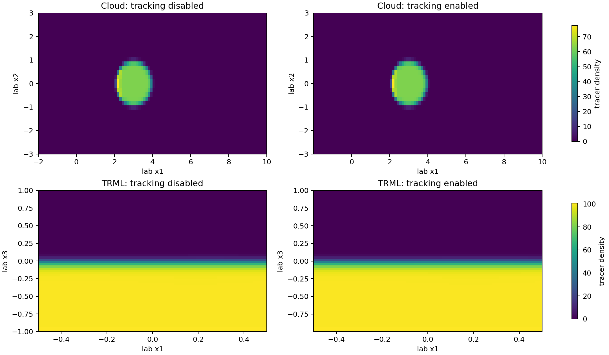

# Frame Tracking Material-Based Serial Validation

This page reports the May 24, 2026 material-based serial validation campaign
for the shipped cloud-crushing and TRML frame-aware examples. The campaign
uses advected tracer mass and tracer-mass centroid as the material-retention
observables. Density-selected cloud mass and temperature-selected TRML mass
remain phase-structure diagnostics.

Production guidance remains withheld. Material observables pass in the two
medium cases, but the shocked Sedov cloud case does not meet the declared
resolution-trend requirement for the aggregate lab-frame conserved state.
Accordingly, no new production restart, MPI, or AMR campaign was run.

## Method Changes

The material-validation implementation adds:

- `weight=tracer_mass`, valid with `target=scalar` or `target=scalarN`, using
  `rho * max(scalar, 0) * dV` for controller moments.
- `inputs/hydro/cloud_crushing_material_tracking.athinput`, whose scalar 0 is
  original-cloud mass fraction and whose boundary inflow tracer is zero.
- `inputs/hydro/TRML/TRML_frame_tracking_material.athinput`, which uses the
  existing cold-fraction scalar and the selected no-limit slew rate
  `max_boost_change_rate=0.05`.
- Optional binary `data_precision=real` for strict conserved-state comparison
  in double-precision builds.
- Scalar AMR criterion variables such as `hydro_w_s00`, reserved for the
  deferred MPI/AMR production gate.

The comparison script reconstructs hydro conserved quantities in lab
coordinates from primitive snapshots for the physical on/off comparison. It
reports each component and the aggregate conserved-state norm. The aggregate
norm is the conserved-fluid resolution-trend acceptance quantity; component
rows remain available for diagnosis.

## Serial Gate Results

| Problem | Resolution | Tracer-mass relative difference | Centroid absolute difference | Tracer-density relative L2 | Conserved-state relative L2 | Health | Result |
| --- | --- | ---: | ---: | ---: | ---: | --- | --- |
| Cloud, Sedov inflow | `48 x 16 x 16` | `7.56e-16` | `9.91e-5` | `2.5402e-3` | `7.9004e-3` | Pass | Low reference |
| Cloud, Sedov inflow | `96 x 32 x 32` | `2.48e-16` | `1.46e-5` | `2.0079e-3` | `7.9025e-3` | Pass | **Fail:** conserved trend is not decreasing |
| TRML, material recipe | `16 x 16 x 32` | `8.45e-4` | `4.07e-4` | `5.5852e-4` | `4.7579e-4` | Pass | Low reference |
| TRML, material recipe | `32 x 32 x 64` | `1.03e-3` | `4.99e-4` | `4.1761e-4` | `3.5137e-4` | Pass | Pass |

Health requires finite fields, zero missed samples, zero recovery events,
zero slew-limit events, and zero unexpected skips. A single first-sample skip
used to prime a controller filter is counted separately as expected
initialization, not as a health failure.

The cloud material gate is no longer blocked by density-threshold selection:
its tracer mass agrees to roundoff and its tracer-density discrepancy improves
with resolution. The remaining failure is the small non-monotone aggregate
conserved-state discrepancy in the time-dependent shocked flow
(`7.9004e-3` to `7.9025e-3`).

## Controlled Diagnostics

| Control | Low result | Medium result | Interpretation |
| --- | --- | --- | --- |
| Cloud constant inflow, tracer-density relative L2 | `3.6475e-4` | `4.8008e-5` | Strong decreasing trend without Sedov forcing. |
| Cloud constant inflow, conserved-state relative L2 | `1.1006e-4` | `2.4125e-5` | Strong decreasing trend; this control has controller limit events and is diagnostic only. |
| TRML cooling disabled, tracer-density relative L2 | `5.5097e-4` | `4.1716e-4` | Decreases similarly to cooling-on material tracking. |
| TRML cooling disabled, conserved-state relative L2 | `4.9289e-4` | `3.5617e-4` | Decreases; cooling is not hiding a material-frame failure. |
| TRML temperature-window selected mass | `4.0290e-2` | `6.0872e-2` | Phase diagnostic fails the old material-retention interpretation, as expected. |

The constant-inflow cloud control indicates that the remaining non-monotone
cloud conserved-state trend is associated with the strongly shocked,
time-dependent Sedov case rather than tracer initialization or basic
frame-aware boundary wiring. It does not establish a corrected production
recipe.

The bounded TRML low-resolution slew-rate sweep selected `0.05`, the lowest
tested rate with no limit events. Rates `0.05`, `0.10`, `0.20`, and `1.00`
produced the same reported material errors at low resolution; `0.02` incurred
one limit event.

## Medium Tracer Slices

The panels below show final tracer density for the medium uniform serial
comparisons. The enabled views use lab-frame coordinates reconstructed from
the tracker displacement.



Download the full serial result table:
[frame_tracking_material_validation_summary.csv](../_static/frame_tracking_material_validation_summary.csv).

Historical threshold-selected and restart-boundary diagnostic results remain
available as:

- [frame_tracking_resolution_sensitivity.csv](../_static/frame_tracking_resolution_sensitivity.csv)
- [frame_tracking_restart_diagnostic.csv](../_static/frame_tracking_restart_diagnostic.csv)

## Reproduction Commands

Material cloud medium tracking-enabled run:

```bash
./build_cloud_crushing/src/athena \
  -i inputs/hydro/cloud_crushing_material_tracking.athinput \
  -d run_cloud_material_medium_on \
  mesh/nx1=96 mesh/nx2=32 mesh/nx3=32 \
  meshblock/nx1=32 meshblock/nx2=16 meshblock/nx3=16 \
  time/tlim=0.04 time/nlim=-1 \
  output1/dt=0.004 output2/dt=0.04 output3/dt=10
```

Material TRML medium tracking-enabled run:

```bash
./build_trml_frame_tracking/src/athena \
  -i inputs/hydro/TRML/TRML_frame_tracking_material.athinput \
  -d run_trml_material_medium_on \
  mesh/nx1=32 mesh/nx2=32 mesh/nx3=64 \
  meshblock/nx1=16 meshblock/nx2=16 meshblock/nx3=32 \
  time/tlim=0.25 time/nlim=-1 \
  output1/dt=0.025 output2/dt=0.25 output3/dt=10
```

Use the same commands with `frame_tracking/enabled=false` for reference runs,
then generate rows and slices with:

```bash
python scripts/compare_frame_tracking_validation.py \
  --reference-dir run_trml_material_medium_off \
  --candidate-dir run_trml_material_medium_on \
  --output frame_tracking_material_validation_summary.csv \
  --problem TRML --resolution 32x32x64 \
  --tracking-mode material_selected_recipe \
  --comparison-reference serial_tracking_disabled \
  --comparison-kind physical --axis x3 --selection scalar \
  --scalar-field s_00 --target-min 0 --target-max 1

python scripts/plot_frame_tracking_material_slices.py \
  --cloud-off run_cloud_material_medium_off \
  --cloud-on run_cloud_material_medium_on \
  --trml-off run_trml_material_medium_off \
  --trml-on run_trml_material_medium_on \
  --output frame_tracking_material_medium_slices.png
```

## Remaining Gate

The next action is to diagnose and reduce the Sedov cloud aggregate
conserved-state frame discrepancy while preserving the now-passing
tracer-defined material observables. Strict medium restart certification and
the MPI/AMR production matrix remain deferred until the corrected serial gate
passes. The feature remains suitable for wiring tests and controlled method
development only.
