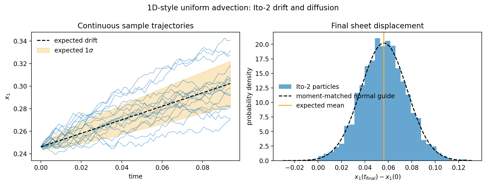
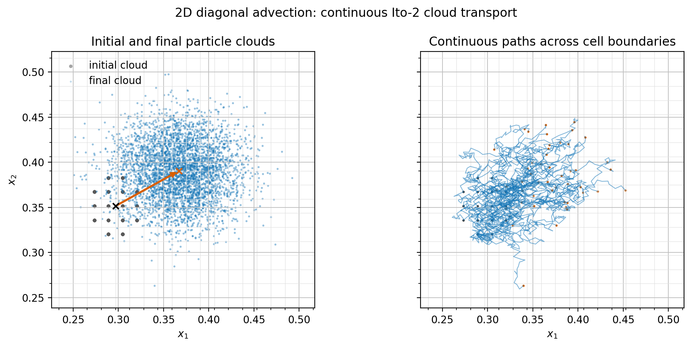
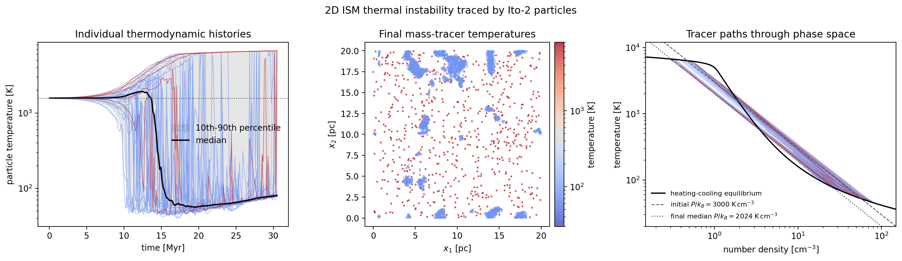

<!--
GitHub Pages integration checklist:
1. Copy this file to docs/source/modules/ito_tracers.md on origin/gh-pages.
2. Add modules/ito_tracers to the Modules toctree in docs/source/index.md.
3. Add a row for this page under Physics Modules in docs/source/modules/index.md.
4. Add a short link from docs/source/modules/particles.md and, optionally,
   docs/source/modules/outputs.md.
5. Copy docs/source/modules/figures/ito_tracers_*.png with this page.
6. Rebuild with: cd docs && make html.
-->

# Module: Second-Moment Itô Mass-Flux Tracers

## Overview

`particle_type = lagrangian_ito` with `pusher = ito2` implements the Itô-2
method described by Moseley, Teyssier, and Abel in
[arXiv:2604.23041v2](https://arxiv.org/abs/2604.23041). It builds on the
Lagrangian Monte-Carlo tracer infrastructure, but replaces discrete cell-center
jumps with continuous Euler-Maruyama trajectories whose first two displacement
moments match the MC jump kernel.

This implementation intentionally does not implement Itô-3, the piecewise-skew-
uniform sampler, or any third-moment matching. Inputs requesting `pusher = ito3`
or `ito_order` other than `2` fail explicitly.

## Algorithm

For each cell and active coordinate direction, AthenaK obtains the outward MC
jump probabilities from the final Runge-Kutta-weighted mass fluxes:

```text
pR = max( F_R dt / (rho h), 0)
pL = max(-F_L dt / (rho h), 0)
C+ = pR + pL
C- = pR - pL
```

The Itô-2 drift and diffusion coefficient are:

```text
u     = h C- / dt
kappa = h^2 (C+ - C-^2) / (2 dt)
```

The cell-centered `u` and `kappa` fields are communicated across MeshBlocks and
coarse/fine interfaces, then independently interpolated to each particle with
cloud-in-cell interpolation. Each active coordinate is advanced once per fluid
timestep with Euler-Maruyama:

```text
X(n+1) = X(n) + u dt + sqrt(2 kappa dt) xi
```

where each `xi` is an independent bounded uniform draw on
`[-sqrt(3), +sqrt(3)]`, giving zero mean and unit variance. The random draw is
deterministic for a fixed tracer tag, cycle, seed, and coordinate direction.

The stored mass flux is accumulated with the weights that contribute to the
final `rk1`, `rk2`, or `rk3` state, after AMR flux correction. This differs from
a simple arithmetic average of stage fluxes and is required for the Itô moments
to match the final finite-volume update.

## Behavior in 1D and 2D Tests

The particle module requires a 2D or 3D mesh, so the 1D-style sheet test uses a
`128 x 4` mesh with fluid velocity and stochastic transport confined to `x1`.
It seeds 4096 tracers in one `x1` cell and follows them for 64 RK2 steps. The
individual trajectories are continuous, while their ensemble mean and variance
follow the first two moments of the underlying MC jump process. The measured
final mean displacement is `0.05616`, compared with the expected `0.05625`.



The 2D cloud test seeds 4096 tracers in a compact circular region on a `64 x 64`
mesh and advects them diagonally with `(v1, v2) = (0.45, 0.25)` for 48 RK2
steps. The left panel shows the initial cell-centered cloud and its continuous,
diffused final state. The right panel resolves sample paths against the mesh
lines; unlike MC tracers, the Itô-2 particles do not remain restricted to cell
centers or make discrete cell-to-cell jumps.



The figures are generated from `inputs/particles/ito_tracers_1d_sheet.athinput`
and `inputs/particles/ito_tracers_2d_cloud.athinput`:

```bash
./build/src/athena -i inputs/particles/ito_tracers_1d_sheet.athinput -d run_ito_1d
./build/src/athena -i inputs/particles/ito_tracers_2d_cloud.athinput -d run_ito_2d

python scripts/plot_ito_tracer_figures.py \
  --one-d run_ito_1d/prtcl_thermo_history/ito_tracers_1d_sheet.prtcl_thermo_history.thp \
  --two-d run_ito_2d/prtcl_thermo_history/ito_tracers_2d_cloud.prtcl_thermo_history.thp
```

## Thermodynamic Tracing of 2D Thermal Instability

Here is the simple picture. The gas starts in exact heating-cooling balance,
but on the unstable middle branch of the ISM equilibrium curve. The imposed
`1%` density fluctuations leave its initial temperature uniform. Slightly
denser patches then cool faster because radiative cooling scales as `n^2`
while the constant per-particle heating scales as `n`; they lose pressure and
condense. Slightly underdense patches net heat and expand. Ito-2 particles act
as mass-weighted observers that move with the resolved mass flux and record
the temperature history of the phase they occupy.

`inputs/particles/ito_tracers_thermal_instability_2d.athinput` is a worked
integration problem combining Ito-2 tracers, standalone ISM cooling, and the
initial-perturbation module. It uses the uniform `cooling_test` problem
generator rather than embedding a custom perturbation in a new problem
generator. Density-only perturbations were chosen over temperature or pressure
noise because they provide a clean causal trigger while preserving a uniform
initial temperature.

The `20 pc x 20 pc`, `128 x 128` periodic Hydro problem starts at

```text
P/k_B = 3000 K cm^-3
n0    = 1.9071755 cm^-3
T0    = 1573.0068 K
```

The constant per-particle heating rate is exactly balanced against `ISMCoolFn`
at that state. At the initial pressure, the equilibrium curve has stable roots
near `52 K` and `6353 K`, with the initialized `1573 K` state between them on
the unstable branch. A density-only Fourier perturbation with `1%` RMS seeds
the instability. The run seeds 4096 mass-weighted Ito-2 tracers and records
their density, pressure, temperature, and velocity histories.

After `100` code time units (`30.47 Myr`), the evolved mass-weighted median
pressure is `P/k_B = 2024 K cm^-3`. At that pressure the cooling curve's stable
equilibria are `79.5 K` and `6720 K`, separated by an unstable root at `589 K`.
The measured median tracer temperatures are `79.5 K` in the cold phase and
`6673 K` in the warm phase. The final particle fractions are `81.8%` below
`300 K`, `15.5%` above `5000 K`, and `2.7%` between those thresholds. Because
the tracers are mass-weighted, these are estimates of mass fractions, not
volume fractions.



**What to look for.** The left panel follows individual particles and the
ensemble percentiles as the initially single-temperature population separates.
Sharp changes in an individual history occur when its stochastic Ito trajectory
crosses a thin cold/warm interface: thermodynamic-history output samples the
fluid cell containing the particle. The middle panel shows the final
mass-tracer temperatures. The right panel follows the same sample tracers
through density-temperature phase space; the dashed and dotted isobars show the
initial and evolved median pressures, respectively. The convergence of the
cold and warm paths toward the two stable intersections is the main evidence
that the histories are tracing the expected thermal phases.

Run and reproduce the figure with:

```bash
./build/src/athena \
  -i inputs/particles/ito_tracers_thermal_instability_2d.athinput \
  -d run_ito_ti_2d

python scripts/plot_ito_thermal_instability.py \
  run_ito_ti_2d/prtcl_thermo_history/ito_tracers_thermal_instability_2d.prtcl_thermo_history.thp
```

This experiment establishes that the cooling, perturbation, Ito-2 transport,
and thermodynamic-history paths work together and recover the expected
two-phase thermal evolution. It does not establish a converged fragmentation
solution. Thermal conduction is intentionally omitted, so the Field length is
unresolved and the interfaces and smallest condensations are resolution
dependent. The reported phase fractions are also specific to this resolution,
domain, perturbation seed, and runtime. The final particle map samples the
mass distribution; it is not a complete volume-filling gas-temperature map.

## Quick Start

```ini
<time>
evolution  = dynamic
integrator = rk2

<particles>
particle_type   = lagrangian_ito
pusher          = ito2
ito_order       = 2
tracer_kick_pdf = uniform
random_seed     = 12345
track_variables = density, pressure, temperature, v1

<tracer_seed1>
id              = 1
start_time      = 0.0
end_time        = 0.0
cadence         = -1.0
count_per_event = 4096
weight          = mass
region          = all
seed            = 24680
```

Run the uniform-flow example:

```bash
./build/src/athena -i inputs/particles/ito_tracers.athinput -d run_ito2
```

## Supported Configuration

| Capability | Support |
| --- | --- |
| Fluid systems | Non-relativistic Cartesian Hydro and MHD |
| Equation of state | Ideal gas and isothermal |
| Dimensions | 2D and 3D particle configurations |
| Time integrators | Dynamic `rk1`, `rk2`, and `rk3` |
| Mesh | Uniform and AMR |
| Parallelism | Serial and MPI; Kokkos device kernels |
| Boundaries | Periodic in every active dimension |
| Persistence | Restart, particle VTK, and thermodynamic history output |
| Seeding | Shared MC tracer seed schedules and field masks |

The tracer uses one particle step per fluid timestep. To remain compatible with
the existing particle migration path, a realized displacement that spans more
than one MeshBlock in any direction is rejected.

## Validation and Fail-Closed Checks

AthenaK exits with a fatal error when:

- the final mass-flux probabilities are non-finite, have negative variance, or
  have total outward probability greater than one;
- interpolated drift, diffusion, or displacement is invalid;
- a particle would move farther than the existing one-neighbor MeshBlock
  migration path can represent;
- an unsupported integrator, boundary condition, relativistic coordinate
  system, kick distribution, or Itô order is requested.

The regression suite checks:

- the drift and variance of uniform advection against the analytical MC moments;
- both RK2 and RK3 final-stage flux weighting;
- isothermal Hydro and ideal-gas MHD;
- serial restart and explicit Itô-3 rejection;
- MPI migration and restart, AMR coefficient exchange, and preservation of
  continuous subcell positions.

## Validation

Validation on June 5, 2026 passed serial and MPI release builds, the repository
style gate, the thermodynamic-history reader test, the two CPU Itô regression
tests, and the two-rank MPI/AMR regression test. Additional smoke runs passed for
serial and MPI AMR restart, ideal-gas MHD, 3D RK3 transport, explicit Itô-3
rejection, and the pre-existing MC tracer Hydro and MPI/AMR inputs.

## Source Location

| Path | Role |
| --- | --- |
| `src/particles/particles_lagrangian_ito.cpp` | Itô-2 coefficients, AMR communication, CIC interpolation, and Euler-Maruyama push. |
| `src/particles/particles_lagrangian_mc.cpp` | Shared seeding, restart, and post-AMR remapping. |
| `src/hydro/hydro_fluxes.cpp`, `src/mhd/mhd_fluxes.cpp` | Final-RK-weighted mass-flux accumulation. |
| `inputs/particles/ito_tracers*.athinput` | Uniform-flow, AMR, and 2D thermal-instability inputs. |
| `scripts/plot_ito_tracer_figures.py` | Reproducible 1D-style and 2D behavior figures. |
| `scripts/plot_ito_thermal_instability.py` | Reproducible thermodynamic-history and phase-space figure. |
| `tst/test_suite/particles/test_particles_ito_*.py` | CPU and MPI regression coverage. |
