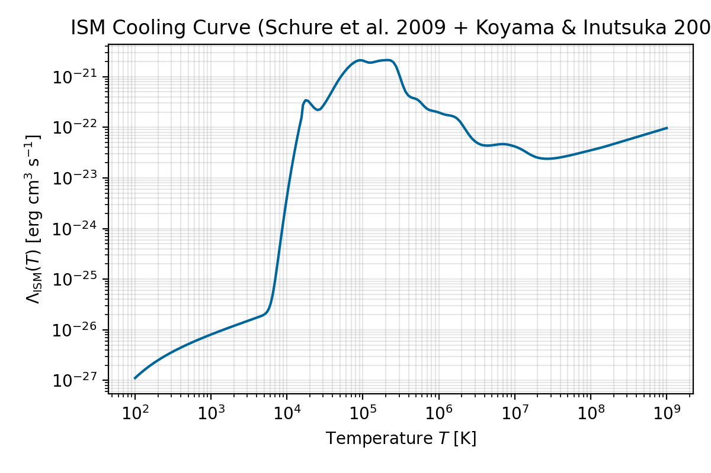
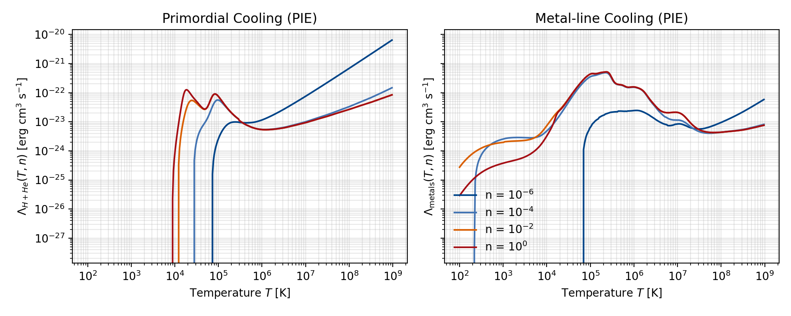

# Module: Source Terms

## Role in AthenaK
The source terms module wires all non-conservative physics into the hydro, MHD, ion-neutral, and radiation solvers. Runtime source updates flow through two cooperating classes:

- `SourceTerms` (`src/srcterms/srcterms.{hpp,cpp}`) owns cooling, gravity, rotation, and beam contributions. Instances are constructed by the hydro/MHD constructors and run inside the standard source-term task slots of each integrator stage.
- `TurbulenceDriver` (`src/srcterms/turb_driver.{hpp,cpp}`) synthesises random acceleration fields used to stir turbulence. It is managed by `MeshBlockPack`, scheduled as its own set of tasks, and can operate on Hydro, MHD, or two-fluid (ion-neutral) states.

`SourceTerms::NewTimeStep` also supplies cooling-based timestep limits that feed into the global CFL reduction.

## File Layout

| File | Purpose |
|------|---------|
| `srcterms.hpp/cpp` | Implements `SourceTerms` and the run-time selection logic for the physics terms enabled in the input file. |
| `srcterms_newdt.cpp` | Computes timestep constraints contributed by cooling processes. |
| `turb_driver.hpp/cpp` | Implements the Ornstein–Uhlenbeck turbulence driver and its AMR-aware basis management. |
| `cooling_tables.hpp`, `ismcooling.hpp` | Tabulated and analytic cooling coefficients used by the CGM and ISM coolers. |

## Runtime Wiring
1. `Hydro`, `MHD`, and `Radiation` constructors create one `SourceTerms` object per pack. Only the features whose flags appear in the corresponding block are activated.
2. `MeshBlockPack::AddPhysics` instantiates a `TurbulenceDriver` when a `<turb_driving>` block is present. The driver registers two task chains:
   - `before_timeintegrator`: `EnsureBasisSize → InitializeModes → UpdateForcing`
   - `stagen`: inserts `AddForcing` between each solver’s reconstruction update and source-term application.
3. On AMR updates the driver reruns `EnsureBasisSize`, which resizes device arrays, rebuilds basis functions, and preserves the accumulated OU state.

## Source Term Families

### Constant Acceleration (`<hydro>` or `<mhd>`)
| Parameter | Type | Notes |
|-----------|------|-------|
| `const_accel` | bool | Enables uniform acceleration. |
| `const_accel_val` | real | Acceleration magnitude (code units). |
| `const_accel_dir` | int | Component index (1, 2, or 3). |

The term acts on momentum and, for ideal gases, adds the corresponding kinetic work to energy.

### ISM Cooling (`<hydro>`)
| Parameter | Type | Notes |
|-----------|------|-------|
| `ism_cooling` | bool | Enables optically thin ISM cooling. |
| `hrate` | real | Uniform heating rate used to offset cooling. |
| `cooling_dt_factor` | real | Scales the cooling timestep limit (`dtnew *= factor`) before the global CFL multiplier. |
| `t_start_ism_cooling` | real | Simulation time (code units) when ISM cooling begins; before that, ISM cooling is skipped. |

The cooling coefficient `Λ(T)` stitches together three regimes:

- A Koyama & Inutsuka (2002) analytic fit below \(10^{4.2}\,\mathrm{K}\)
- The Schure et al. (2009) SPEX table between \(10^{4.12}\) and \(10^{8.15}\,\mathrm{K}\) (stored in `lhd[102]`)
- A CGOLS-inspired power-law tail above \(10^{8.15}\,\mathrm{K}\)

`SourceTerms::NewTimeStep` limits the timestep using \( \Delta t = e / |\rho (\rho \Lambda - \Gamma)| \). The composite curve is illustrated below (generated by `scripts/plot_cooling_curves.py`):



### CGM Cooling (`<hydro>`)
| Parameter | Type | Notes |
|-----------|------|-------|
| `cgm_cooling` | bool | Enables CGM cooling; mutually exclusive with `ism_cooling`. |
| `hrate` | real | Base volumetric heating rate. |
| `cooling_dt_factor` | real | Scales the cooling timestep limit (`dtnew *= factor`) before the global CFL multiplier. |
| `hscale_norm` | real | Density-normalisation factor. |
| `hscale_height` | real | Vertical Gaussian scale height. |
| `hscale_radius` | real | Radial exponential scale radius. |
| `hscale_alpha` | real | Coupling between radius and vertical scale. |
| `T_max` | real | Temperature ceiling in cgs units. |

The routine blends multiple ingredients:

- **Photo-ionisation equilibrium (PIE)** tables (`H_He_Cooling_ARR` and `Metal_Cooling_ARR`) indexed by log-temperature (`Tbins_ARR`) and log-density (`nHbins_ARR`)
- **Collisional ionisation equilibrium (CIE)** tables for \(T \gtrsim 10^{4}\,\mathrm{K}\)
- The same low-temperature analytic fit used by `ISMCoolFn`
- A density- and height-dependent heating profile governed by the `hscale_*` parameters
- Line-of-sight shielding derived from the local neutral fraction and cell-centred path length

Passive scalar zero is interpreted as metallicity; when absent, a default of \(Z = \tfrac{1}{3} Z_\odot\) is assumed. The figure summarises the tabulated PIE components for representative densities:



*Left: primordial (H+He) cooling. Right: metal-line cooling. Curves are reconstructed directly from `src/srcterms/cooling_tables.hpp` for \(n_H = 10^{-6}, 10^{-4}, 10^{-2}, 10^{0}\,\mathrm{cm^{-3}}\).*

### Relativistic Cooling (`<hydro>` or `<mhd>`)
| Parameter | Type | Notes |
|-----------|------|-------|
| `rel_cooling` | bool | Enables relativistic cooling source. |
| `crate_rel` | real | Cooling coefficient. |
| `cpower_rel` | real | Power-law index applied to temperature. |

Momentum and energy losses scale with the fluid four-velocity to remain consistent with SR dynamics.

### Radiation Beam Source (`<radiation>`)
| Parameter | Type | Notes |
|-----------|------|-------|
| `beam_source` | bool | Adds beam intensity along pre-masked rays. |
| `dii_dt` | real | Photon injection rate. |

The beam source multiplies the radiation mask stored on the pack and respects any excision regions.

### Shearing Box Terms (`<shearing_box>`)
If a `<shearing_box>` block exists, the module initialises Coriolis and tidal source terms using `qshear` and `omega0`. Separate hydro and MHD variants update momenta (and energy for ideal EOS). In 2-D runs, `ShearingBoxBoundary` can request the `r-φ` version via `SourceTerms::shearing_box_r_phi`.

## Turbulence Driver

### Task Flow
1. **EnsureBasisSize** detects changes in the mesh pack (AMR splits/merges or root-grid edits), resizes `force`, `force_tmp{1,2}`, and basis caches, and recomputes trigonometric basis functions per MeshBlock. Existing OU coefficients `mode_amp_real/mode_amp_imag` are preserved.
2. **InitializeModes** builds the mode catalogue for the selected wavenumber ranges, computes spectral weights, and generates random amplitudes using the configured seed (`rseed >= 0`). Negative seeds fall back to the built-in Numerical Recipes sequence (equivalent to seeding with `1`).
3. **UpdateForcing** copies the OU state into the working force array, applies optional Gaussian weighting (`*_scale_height` and `*_center`), removes net momentum, and rescales the field to match the requested energy injection `dedt`.
4. **AddForcing** applies accelerations during each integrator stage. The kernel supports hydro-only, MHD, and two-fluid ion-neutral configurations. For relativistic runs it converts to/from conserved variables with the appropriate SR transformations.

### Ornstein–Uhlenbeck Update
- `dt_turb_update` controls how often the OU process is advanced. The OU coefficients are \( f_{\text{corr}} = \exp(-\Delta t/t_{\text{corr}}) \) and \( g_{\text{corr}} = \sqrt{1 - f_{\text{corr}}^2} \); in the white-noise limit (`tcorr <= 1e-6`) the new sample is used directly.
- `turb_flag = 1` drives for a finite duration (`tdriv_duration`, default `tcorr`); `turb_flag = 2` drives continuously. Driving begins once `time >= tdriv_start`.
- `constant_edot = true` (default) scales the field so the volumetric energy injection equals `dedt`. When `false`, the scaling instead keeps the instantaneous acceleration magnitude fixed.
- Net linear momentum is removed every update and the solver guards against degenerate volume sums.

### Tiling and Spatial Weighting
- `tile_driving` repeats the forcing pattern over `tile_nx × tile_ny × tile_nz` tiles. Each tile must evenly divide the corresponding root-grid dimension; 1-D or 2-D meshes force unused tile counts to 1.
- Optional Gaussian envelopes in each coordinate (`x/y/z_turb_scale_height` with associated `_center`) weight the forcing amplitude during `UpdateForcing`.
- `sol_fraction` blends solenoidal and compressive components when projecting the random field in Fourier space.

### Configuration Reference (`<turb_driving>`)

| Parameter | Default | Description |
|-----------|---------|-------------|
| `turb_flag` | `2` | 0=off, 1=drive for `tdriv_duration`, 2=continuous. |
| `dedt` | `0.0` | Target energy injection rate (code units). |
| `tcorr` | `0.0` | OU correlation time. |
| `dt_turb_update` | `0.01` | Minimum cadence between OU refreshes. |
| `driving_type` | `0` | 0=3-D isotropic, 1=planar driving. |
| `nlow`, `nhigh` | `1`, `3` | Inclusive wavenumber bounds. |
| `npeak` / `kpeak` | `kpeak=4π` | Spectrum peak, either as a mode index or explicit wavenumber. |
| `spect_form` | `1` | 1=parabolic, 2=power-law weighting. |
| `expo`, `exp_prp`, `exp_prl` | `5/3`, `5/3`, `0` | Spectral slopes (isotropic / perpendicular / parallel). |
| `min_k*`, `max_k*` | `0` / `nhigh` | Cartesian mode limits per axis. |
| `sol_fraction` | `1.0` | Amplitude-space blend between solenoidal (divergence-free) and compressive components of each mode’s Fourier amplitudes (`1.0` = purely solenoidal, `0.0` = purely compressive). |
| `rseed` | `-1` | RNG seed for the OU process. Non-negative values give reproducible sequences; negative values fall back to the internal default (seed = 1). |
| `constant_edot` | `true` | Switch between fixed `dedt` and fixed acceleration. |
| `tile_driving` | `false` | Enable spatial tiling. |
| `tile_factor` / `tile_nx,ny,nz` | `1` | Tile replication counts. |
| `x/y/z_turb_scale_height` | `-1.0` | Gaussian half-widths; negative disables weighting. |
| `x/y/z_turb_center` | `0.0` | Gaussian centres (code units). |
| `tdriv_start` | `0.0` | Simulation time when driving begins. |
| `tdriv_duration` | `tcorr` | Duration when `turb_flag=1`. |

### Compatibility Notes
- When both hydro and MHD modules are active (ion-neutral mode), the forcing is applied to each fluid with shared accelerations.
- Relativistic integrations invoke the SR conservative-to-primitive and primitive-to-conservative transforms after applying forces.
- `EnsureBasisSize` is idempotent and inexpensive when no mesh change is detected.
- Planar driving (`driving_type = 1`) is less heavily exercised than the default isotropic mode and currently reuses the full 3-component force assembly; it should be treated as experimental.

#### Initial Turbulence Kick (`<initial_turb>`)
- Optional block that applies a single impulsive Ornstein–Uhlenbeck update immediately after problem setup.
- Uses the same keys as `<turb_driving>`; the block is forced to `turb_flag = 1` and executes once with its own RNG seed.
- The kick is applied before the first timestep, after which the temporary driver is destroyed and does not participate in restarts.
- `dt_turb_update` (or `tdriv_duration` when provided) controls the effective impulse duration used to scale the kick.
- Executed only on brand-new runs (not restarts). The kick honours `tdriv_start` when it is less than or equal to the initial simulation time; otherwise the start time is clamped to the current time, so prefer `tdriv_start = 0` for pure initial-condition kicks.
- Because the impulse operates through the same forcing kernels as the sustained driver, set `dedt`, spectra, and `sol_fraction` just as you would for a continuous run. Use a unique `rseed` when you need deterministic reproducibility distinct from the main driver.

##### Example: Initial Kick + Sustained OU Driving

```ini
[initial_turb]
dedt            = 5.0e-3   # one-off energy injection
dt_turb_update  = 0.02     # width of the impulse
kmin            = 1
kmax            = 3
sol_fraction    = 1.0
rseed           = 314159

[turb_driving]
dedt            = 1.0e-4   # continuous driving level
tcorr           = 0.5
dt_turb_update  = 0.02
kmin            = 1
kmax            = 3
sol_fraction    = 0.7
rseed           = 271828
tdriv_start     = 0.0
turb_flag       = 2        # leave continuous forcing enabled
```

With this configuration the mesh receives a single kick before the first timestep, after which the steady OU driver takes over using its own seed and parameters. Restart files only preserve the continuous driver state, so rerunning from a checkpoint will not repeat the initial impulse.

## Cooling Timestep Constraint
`SourceTerms::NewTimeStep` scans the mesh pack for ISM and CGM cooling cells and stores the minimum stable timestep in `dtnew`. The driver reduces the global timestep against this value before advancing.

## Operational Tips
- Monitor the scalar `dt_turb_update` against the hydrodynamic timestep. Large `dt` jumps can cause multiple OU updates in a single call; the driver loops until the elapsed time is caught up.
- When using tiling, double-check that each tile dimension divides the root-grid extent; the constructor exits with a fatal error otherwise.
- For CGM cooling, provide passive scalar metallicity or the code assumes a fixed `Z=1/3 Z⊙`.
- To disable turbulence mid-run, set `turb_flag=0` or advance past `tdriv_start + tdriv_duration` when using burst mode.
- Use `scripts/plot_cooling_curves.py` (one-off helper) to regenerate the cooling visualisations or inspect new tables; outputs are written to `docs/source/_static`.

## Related Modules
- `hydro` and `mhd` task lists (`src/hydro/hydro_tasks.cpp`, `src/mhd/mhd_tasks.cpp`) for where source terms sit within the integrator.
- Shearing box boundary handling in `src/shearing_box/`.
- Ion-neutral coupling in `src/ion-neutral/` when two-fluid forcing is active.
