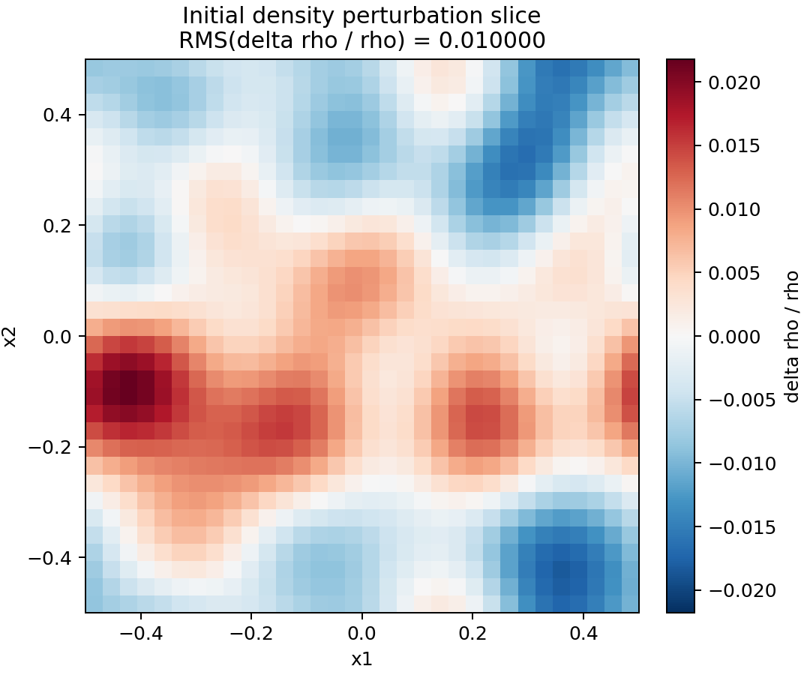
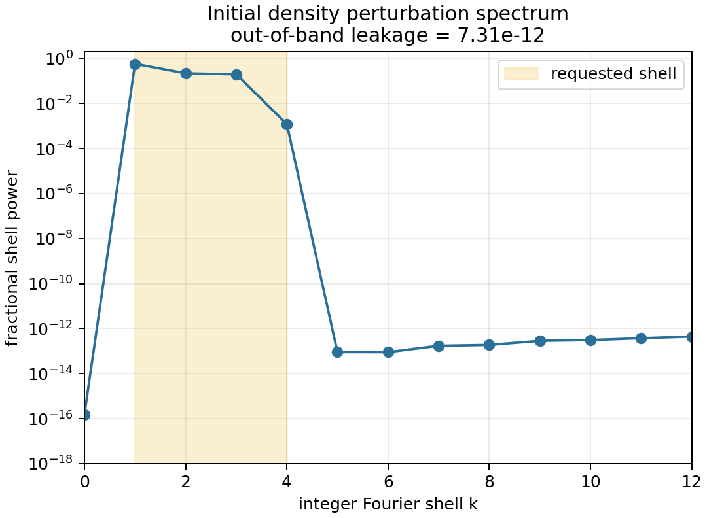
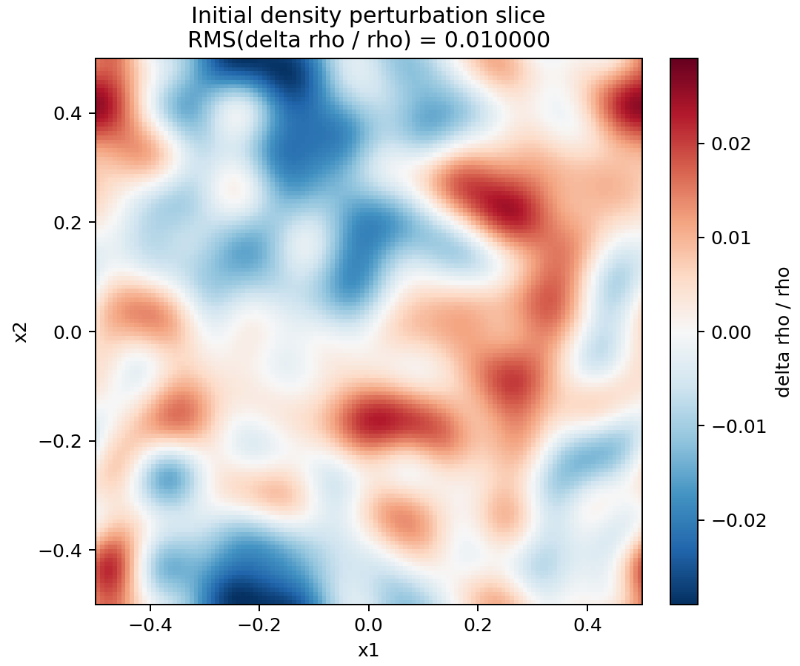
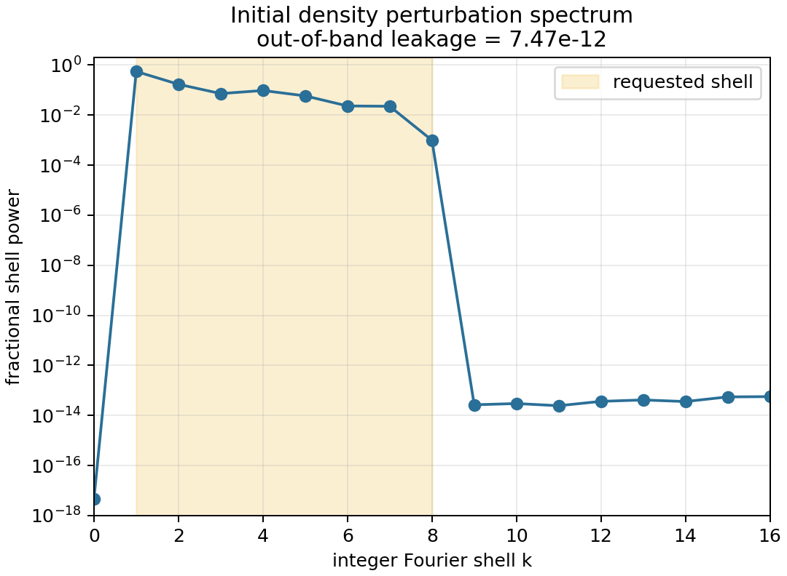
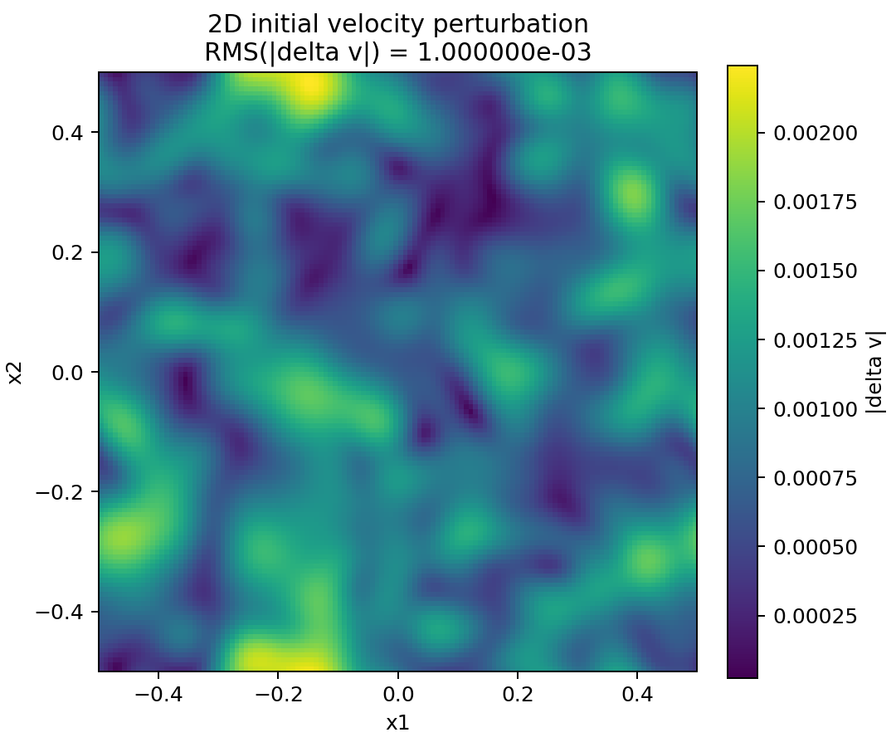
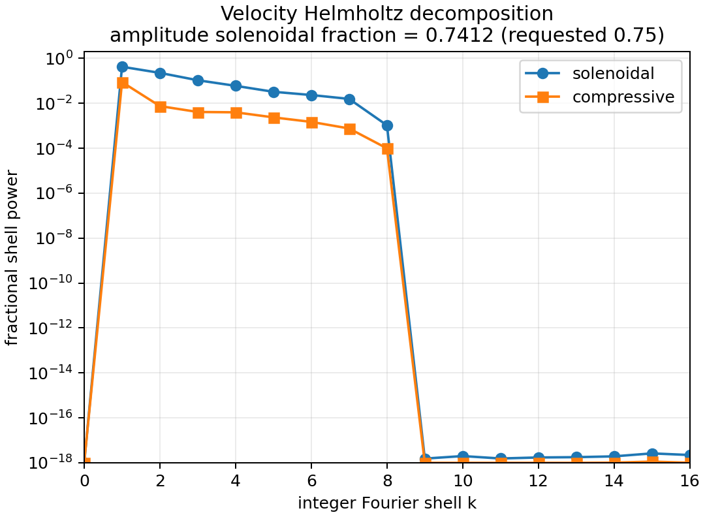
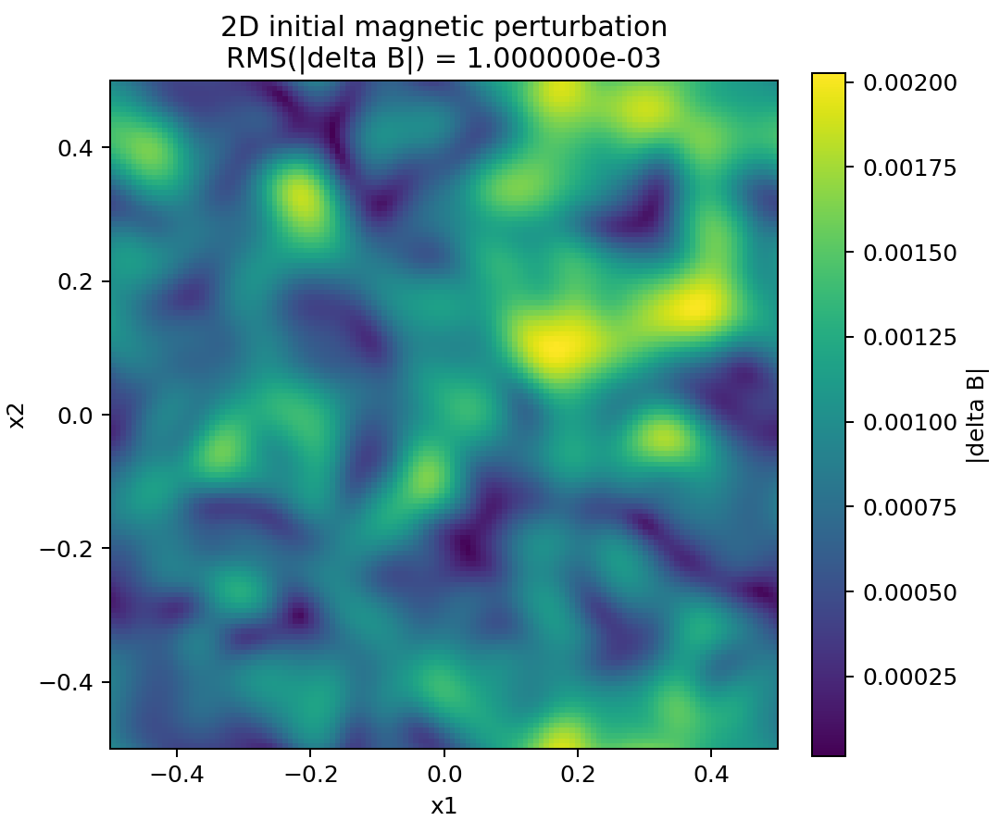
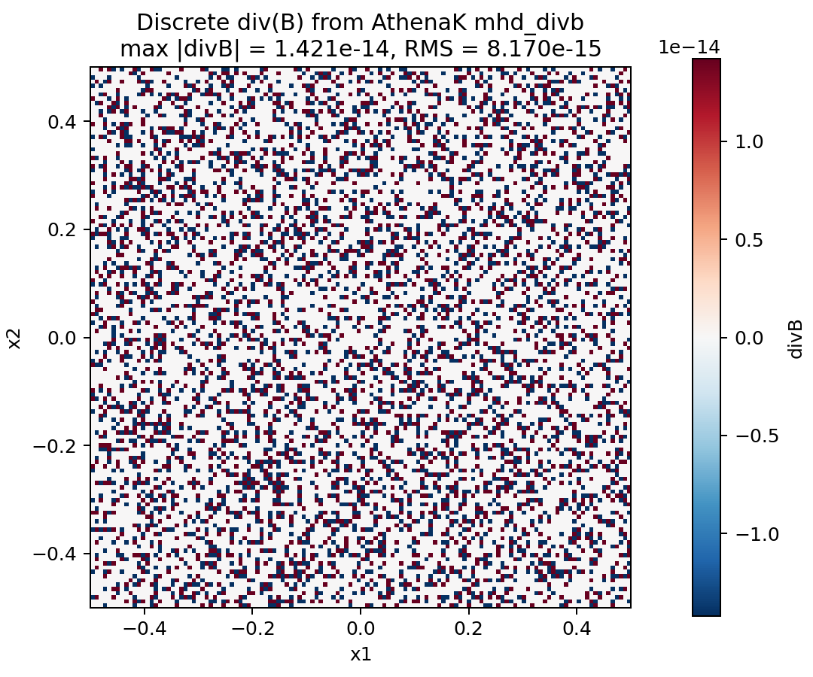

# Module: Source Terms

## Role in AthenaK

The source-terms module contains physics that is applied outside the conservative flux
divergence. Three paths live in this area:

- `SourceTerms` (`src/srcterms/srcterms.{hpp,cpp}`) owns constant acceleration,
  optically thin ISM cooling, relativistic cooling, and radiation beam injection.
- `TurbulenceDriver` (`src/srcterms/turb_driver.{hpp,cpp}`) drives turbulence through
  stochastic acceleration fields that are inserted into the runtime task lists.
- `InitialPerturbations` (`src/srcterms/initial_perturbations.{hpp,cpp}`) applies
  one-time Fourier perturbations to newly generated initial conditions.

`SourceTerms::NewTimeStep` contributes source-term timestep constraints, currently for
relativistic cooling, to the global timestep reduction.

## File Layout

| File | Purpose |
|------|---------|
| `srcterms.hpp/cpp` | Runtime source-term selection and application for hydro, MHD, and radiation states. |
| `srcterms_newdt.cpp` | Timestep constraints from source terms. |
| `turb_driver.hpp/cpp` | Ornstein-Uhlenbeck-style turbulence forcing machinery. |
| `initial_perturbations.hpp/cpp` | One-time Fourier perturbations applied after problem generation and before driver initialization. |
| `ismcooling.hpp` | Analytic and tabulated cooling coefficients used by ISM cooling. |

## Runtime Wiring

1. `Hydro`, `MHD`, and `Radiation` construct a `SourceTerms` object when their
   corresponding `<hydro_srcterms>`, `<mhd_srcterms>`, or `<rad_srcterms>` block exists.
2. `MeshBlockPack` constructs a `TurbulenceDriver` when `<turb_driving>` exists.
   The driver contributes tasks before the time integrator and during each stage.
3. `main.cpp` calls `ApplyInitialPerturbations` only for brand-new runs, immediately
   after the problem generator constructs the initial state. Restarted runs skip the hook.
4. `Driver::Initialize` then fills ghost zones and recomputes primitive variables, so
   perturbations only need to update active-cell conserved state and face-centered fields.

## Runtime Source Terms

### Constant Acceleration (`<hydro_srcterms>` or `<mhd_srcterms>`)

| Parameter | Type | Notes |
|-----------|------|-------|
| `const_accel` | bool | Enables uniform acceleration. |
| `const_accel_val` | real | Acceleration magnitude in code units. |
| `const_accel_dir` | int | Momentum component index, 1, 2, or 3. |

The term updates momentum and, for ideal equations of state, the corresponding energy.

### ISM Cooling (`<hydro_srcterms>` or `<mhd_srcterms>`)

| Parameter | Type | Notes |
|-----------|------|-------|
| `ism_cooling` | bool | Enables optically thin ISM cooling. |
| `hrate` | real | Uniform heating rate in code units. |

The cooling coefficient is evaluated from `ISMCoolFn(temp)` and applied to the gas energy.

### Relativistic Cooling (`<hydro_srcterms>` or `<mhd_srcterms>`)

| Parameter | Type | Notes |
|-----------|------|-------|
| `rel_cooling` | bool | Enables relativistic cooling. |
| `crate_rel` | real | Cooling coefficient. |
| `cpower_rel` | real | Power-law index; default is `1`. |

Energy and momentum losses are scaled by the fluid four-velocity.

### Radiation Beam Source (`<rad_srcterms>`)

| Parameter | Type | Notes |
|-----------|------|-------|
| `rad_beam` | bool | Enables beam injection into radiation intensities. |
| `dii_dt` | real | Injection rate. |
| `pos_1`, `pos_2`, `pos_3` | real | Beam origin. |
| `dir_1`, `dir_2`, `dir_3` | real | Beam direction. |
| `width` | real | Beam width. |
| `spread` | real | Angular spread in degrees. |

The beam source respects the radiation mask and coordinate metric.

## Initial Fourier Perturbations

`InitialPerturbations` applies a random Fourier field once, after the problem generator and
before the first boundary/primitive initialization. The canonical input block is
`<initial_perturbations>`. A singular `<initial_perturbation>` alias is accepted for
compatibility, but both blocks must not appear in the same input file.

The implementation supports non-relativistic, single-fluid hydro or MHD. Magnetic
perturbations require MHD and are generated from an edge-centered vector potential, then
added as a discrete curl to the face-centered field. This preserves the constrained
transport divergence to roundoff.

### Compatibility

- Restarts do not replay the perturbation.
- Relativistic and ion-neutral packs are rejected at setup.
- A field is active only when it is requested and its RMS amplitude is positive.
- Density and velocity perturbations update conserved variables; magnetic perturbations
  update `b0`, refresh `bcc0`, and add the magnetic energy change for ideal MHD.

### Parameters

| Parameter | Default | Description |
|-----------|---------|-------------|
| `variables` | empty | Comma-, semicolon-, or space-separated list containing `density`, `velocity`, and/or `magnetic`. Aliases include `rho`, `vel`, `v`, `b`, and `magnetic_field`. |
| `perturb_density`, `perturb_velocity`, `perturb_magnetic` | `false` | Boolean alternatives to `variables`. Positive RMS amplitudes also enable the corresponding field. |
| `density_rms` / `rho_rms` / `drho_rms` | `0.0` | Target RMS density perturbation. |
| `density_fractional` / `rho_fractional` | `true` | When true, applies density as `rho_new = rho_old*(1 + delta)`; otherwise applies an absolute density increment. |
| `velocity_rms` / `v_rms` / `vel_rms` | `0.0` | Target RMS velocity perturbation. |
| `magnetic_rms` / `b_rms` / `B_rms` | `0.0` | Target RMS magnetic perturbation, measured from cell-centered averages of the face perturbation. |
| `nlow`, `nhigh` | `1`, `3` | Inclusive integer wavenumber shell. `kmin` and `kmax` are accepted aliases. |
| `min_kx`, `max_kx`, `min_ky`, `max_ky`, `min_kz`, `max_kz` | `-nhigh`, `nhigh` | Optional Cartesian mode bounds. Inactive dimensions are forced to zero; only one representative of each `k`/`-k` pair is kept. |
| `spectral_slope` / `slope` / `expo` | `5/3` | Power-law slope used to weight mode amplitudes. |
| `f_solenoidal` / `sol_fraction` | `1.0` | Velocity amplitude-space blend: `1` is solenoidal and `0` is compressive. |
| `rseed` | `-1` | RNG seed. Positive values choose the seed; nonpositive values use the built-in seed `1`. |
| `localization` | `none` | `include` multiplies by a Gaussian window; `exclude` multiplies by one minus that window. |
| `x1_center`, `x2_center`, `x3_center` | domain center | Gaussian center. Aliases `x/y/z_center` and `x/y/z_turb_center` are accepted. |
| `x1_scale`, `x2_scale`, `x3_scale` | `-1.0` | Gaussian scale length by coordinate. At least one active dimension must have a positive scale when localization is enabled. |
| `remove_density_mean`, `remove_velocity_mean` | `false` | Remove the volume-weighted mean before RMS normalization. |

### Regression Example

```ini
<initial_perturbations>
variables       = density, velocity, magnetic
density_rms     = 1.0e-2
velocity_rms    = 1.0e-3
magnetic_rms    = 1.0e-3
spectral_slope  = 1.0
nlow            = 1
nhigh           = 4
f_solenoidal    = 0.75
rseed           = 24680
localization    = none
```

The committed test problem is `inputs/tests/initial_perturbations.athinput`; the
test-suite copy is `tst/inputs/initial_perturbations.athinput`. It initializes a
uniform MHD `linear_wave` state with zero wave amplitude, applies the one-time
perturbation above, and writes a full-grid `mhd_w_bcc` VTK snapshot at cycle 0.
A companion 2D regression input,
`inputs/tests/initial_perturbations_2d.athinput`, repeats the same density,
velocity, and magnetic checks on a `128 x 128 x 1` mesh.

#### 3D Density Validation

The 3D figures below were generated directly from that snapshot with:

```bash
python scripts/plot_initial_perturbations_example.py \
  build/initial_perturbations_docs/vtk/InitialPerturbations.mhd_w_bcc.00000.vtk \
  --output-dir docs/source/_static --nlow 1 --nhigh 4
```

For the documented run, the measured density contrast had RMS
`1.000000005e-02`, mean `1.236912794e-10`, zero-mode power fraction
`1.529953244e-16`, and out-of-band power fraction `7.307829988e-12`.





#### 2D Density Validation

The 2D figures below were generated directly from the `128 x 128 x 1` test
snapshot with:

```bash
python scripts/plot_initial_perturbations_example.py \
  build/initial_perturbations_2d_smoke/vtk/InitialPerturbations2D.mhd_w_bcc.00000.vtk \
  --output-dir docs/source/_static --basename initial_perturbations_2d_density \
  --nlow 1 --nhigh 8
```

For the 2D run, the measured density contrast had RMS `1.000000032e-02`,
mean `-2.182787284e-11`, zero-mode power fraction `4.764560019e-18`, and
out-of-band power fraction `7.468675940e-12`.





#### 2D Velocity and Magnetic Validation

The same 2D snapshot also validates the vector perturbations. The velocity
field is checked with a spectral Helmholtz decomposition after subtracting the
component means. The configured `f_solenoidal = 0.75` is an amplitude-space
blend, so the amplitude-space solenoidal fraction is the relevant comparison;
the documented realization gives `0.741169917`, with solenoidal energy fraction
`0.891302611`. The magnetic field is checked with AthenaK's `mhd_divb` derived
variable from the same cycle-0 state, giving `max |divB| = 1.421085472e-14`
and RMS `8.169763041e-15`.

Those figures were generated with:

```bash
python scripts/plot_initial_perturbations_example.py \
  build/initial_perturbations_2d_smoke/vtk/InitialPerturbations2D.mhd_w_bcc.00000.vtk \
  --divb-vtk build/initial_perturbations_2d_smoke/vtk/InitialPerturbations2D.mhd_divb.00000.vtk \
  --output-dir docs/source/_static --basename initial_perturbations_2d \
  --fields velocity,magnetic --f-solenoidal 0.75 --nlow 1 --nhigh 8
```









### Performance Notes

Scratch arrays are allocated only for fields with positive requested RMS. The one-time
cost scales with the number of active cells times the selected mode count, so keep
`nhigh` and per-axis bounds tight for large meshes. Magnetic perturbations are the most
memory intensive because they require edge-centered vector potential storage plus a
temporary face-centered perturbation field.

## Turbulence Driver

The turbulence driver is a runtime forcing mechanism, not an initial-condition edit. It
constructs a random acceleration field from Fourier modes, removes net momentum from the
forcing pattern, and applies the force inside time-integration stages.

| Parameter | Default | Description |
|-----------|---------|-------------|
| `nlow`, `nhigh` | `1`, `2` | Inclusive integer wavenumber shell. |
| `driving_type` | `0` | `0` for isotropic driving; `1` for the alternate parallel/perpendicular weighting path. |
| `expo`, `exp_prp`, `exp_prl` | `5/3`, `5/3`, `0` | Spectral weights. |
| `dedt` | `0.0` | Energy injection rate. |
| `tcorr` | `0.0` | Ornstein-Uhlenbeck correlation time; very small values use white-noise updates. |

Use `<turb_driving>` when the forcing should persist during the run. Use
`<initial_perturbations>` when the state should be perturbed once and then evolved normally.

## Operational Tips

- Prefer `<initial_perturbations>` for reusable initial-condition noise instead of adding
  pgen-specific perturbation switches.
- Use `remove_density_mean = true` or `remove_velocity_mean = true` when the zero-mode
  component would be undesirable after localization.
- For magnetic perturbations, keep the vector-potential path intact; direct random
  face-field perturbations would not preserve the constrained-transport divergence.
- Use a positive `rseed` for reproducible production setups.

## Related Modules

- `hydro` and `mhd` task lists control where runtime source terms enter each stage.
- `pgen` constructs the base initial state that `<initial_perturbations>` modifies.
- `outputs/derived_variables.cpp` contains diagnostics such as `divb` for checking magnetic
  perturbation quality.
