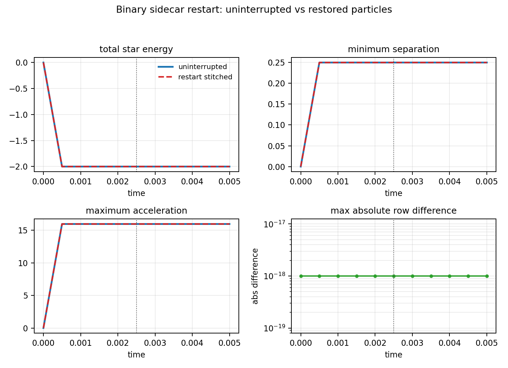
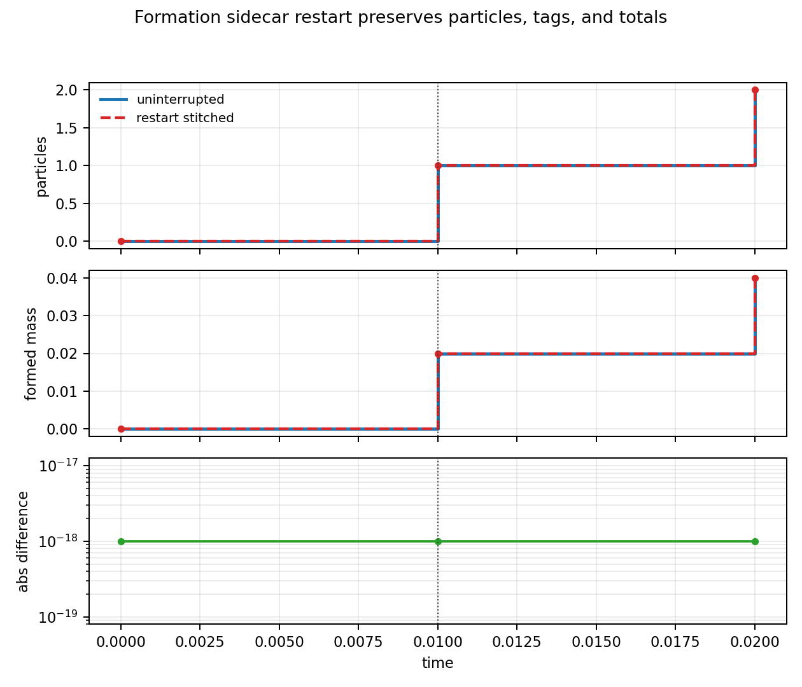
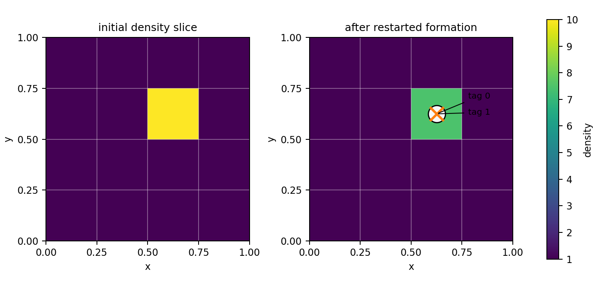

# Star Particle Gravity

Star-particle gravity extends `particle_type = star` with a gravity-aware particle
pusher.  It supports exact direct star-star gravity, built-in external accelerations,
and a user pgen callback for custom external particle accelerations.

Enable it by using `pusher = gravity` in `<particles>` and adding a `<star_gravity>`
block:

```ini
<particles>
particle_type = star
pusher = gravity
dt = 1.0e-3

<star_gravity>
enabled = true
grav_constant = 1.0
self_gravity = true
force_method = direct
integrator = kdk
softening_length = 0.01
timestep_mode = fixed
max_timestep = 1.0e-3
```

`grav_constant` is required and must be positive whenever star gravity is enabled.

## Force Sources

The total acceleration on each star is the sum of the configured external acceleration
and the star-star acceleration.

### Star-Star Gravity

With `self_gravity = true`, each star particle feels softened Newtonian gravity from all
other star particles:

```text
a_i = sum_j G m_j r_ij / (|r_ij|^2 + eps^2)^(3/2)
```

where `eps = softening_length`.  Two force backends are available:

| `force_method` | Meaning |
| --- | --- |
| `direct` | Exact pairwise summation.  This is the correctness reference. |
| `tree` | Replicated Barnes-Hut octree with monopole moments and opening angle `tree_theta`. |

Both backends gather a global particle snapshot on each rank and compute accelerations
only for locally owned particles.  The tree backend reduces the force evaluation cost
for larger particle counts, but it is not yet a fully distributed tree.  Tree leaves
retain a small bucket of stars if multiple particles occupy the same position.

By default, the tree path still computes exact pairwise potential-energy and
minimum-separation diagnostics.  This makes the history columns directly comparable to
the direct backend, but it adds an `O(N^2)` diagnostic pass.  For large particle counts,
set:

```ini
exact_diagnostics = false
```

The tree force evaluation then avoids that pass.  `star-epot` and `star-rmin` are
reported as zero because exact values were not computed.  `timestep_mode = pair_orbit`
requires `exact_diagnostics = true` when the tree backend is selected.

### External Acceleration

Set `external_acceleration` to one of:

| Choice | Parameters | Meaning |
| --- | --- | --- |
| `none` | none | No external acceleration. |
| `constant` | `external_accel_x`, `external_accel_y`, `external_accel_z` | Uniform acceleration. |
| `point_mass` | `external_mass`, `external_x`, `external_y`, `external_z`, `external_softening_length` | Fixed softened point-mass acceleration. |
| `user` | pgen callback | Custom acceleration supplied by the problem generator. |

For a fixed point mass, the particle acceleration is

```text
a = G M_ext (x_ext - x) / (|x_ext - x|^2 + eps_ext^2)^(3/2)
```

`self_gravity = false` can be used for external-only particle orbits or free-fall tests.

### User Pgen Callback

For pgen-specific potentials, set:

```ini
<star_gravity>
external_acceleration = user
```

and have the pgen set `ProblemGenerator::user_star_particle_accel_func`.  The callback
receives local particle acceleration arrays and should add its contribution:

```cpp
void MyParticleAcceleration(Mesh *pm, particles::Particles *ppart, const Real time,
                            const Real *x, const Real *y, const Real *z,
                            Real *ax, Real *ay, Real *az, const int npart) {
  for (int p=0; p<npart; ++p) {
    ax[p] += 0.0;
    ay[p] += -1.0;
    az[p] += 0.0;
  }
}
```

`x`, `y`, and `z` are the positions being evaluated by the integrator.  For RK4, the
callback receives each intermediate stage position and time.  For KDK, it receives the
pre-drift state and the post-drift state at `time + dt`.

The code does not try to infer particle forces from hydro/MHD user source terms.  A pgen
must explicitly provide a particle acceleration callback if the stars should feel the
same custom external potential as the gas.

## Integrators

Two particle integrators are available.

| `integrator` | Behavior |
| --- | --- |
| `kdk` | Kick-drift-kick leapfrog.  This is the default for long-lived collisionless motion. |
| `rk4` | Fourth-order Runge-Kutta.  This is useful for short integrations and cross-checks. |

The KDK path computes accelerations before the drift, migrates particles after the
drift, then applies the final kick after migration.  A particle crossing a rank boundary
therefore receives the second kick on its new owning rank.

## Formation And Accretion

Formation still happens before particle motion.  A star formed from a dense gas cell
participates in gravity during the same particle update.

Accretion can conserve particle momentum:

```ini
<particles>
star_accretion_conserve_momentum = true
```

This is the default.  When gas of mass `dm` and velocity `v_gas` is accreted, the
particle velocity is updated as

```text
v_new = (m_old v_old + dm v_gas) / (m_old + dm)
```

Setting `star_accretion_conserve_momentum = false` preserves the older mass-only
accretion behavior.

The accretion stencil is evaluated from a replicated star snapshot.  Each rank removes
gas only from the active cells that it owns, and the removed mass and momentum are
reduced back to the owning star.  Stars are processed in stable particle-tag order.
Neighboring-cell accretion therefore crosses local MeshBlock boundaries and MPI rank
boundaries without depending on the decomposition.

## Timestep Control

`<particles>/dt` remains the base particle timestep.  Star gravity can further limit
`Particles::dtnew`, which is already included in the global mesh timestep.  Choose the
base value small enough that a particle update crosses at most one MeshBlock in each
direction.  AthenaK reports an explicit error if that migration requirement is violated.

| `timestep_mode` | Meaning |
| --- | --- |
| `fixed` | Uses the particle timestep, capped by `max_timestep` if positive. |
| `acceleration` | Uses `timestep_eta * sqrt(length / max(|a|))`, with the self-gravity softening length, point-mass external softening length, or minimum pair separation as `length`. |
| `pair_orbit` | Also caps the step using the minimum pair orbital time. |

The particle history file records the resulting gravity timestep as `grav-dt`.

## History Output

Runs with particles still write `<basename>.part.hst`.  When star gravity is enabled,
additional columns are appended:

| Column | Meaning |
| --- | --- |
| `grav-dt` | Current gravity timestep estimate. |
| `star-ekin` | Total star kinetic energy. |
| `star-epot` | Direct softened star-star potential energy. |
| `star-etot` | `star-ekin + star-epot`. |
| `star-px`, `star-py`, `star-pz` | Total star momentum. |
| `star-lx`, `star-ly`, `star-lz` | Total star angular momentum about the origin. |
| `star-com-x`, `star-com-y`, `star-com-z` | Star-particle center of mass. |
| `star-amax` | Maximum acceleration magnitude. |
| `star-rmin` | Minimum star-star separation. |

## Boundary And MPI Behavior

The direct backend uses collective MPI calls every gravity evaluation.  Ranks with zero
local particles still participate.  After a KDK drift, the existing particle boundary
path migrates particles before the final kick and diagnostic update.

The gravity and neighboring-cell accretion paths replicate star snapshots on each rank.
The tree reduces force-evaluation work but not snapshot memory.  Sidecar restart loading
also reads the global particle payload on each rank before filtering by current mesh
geometry.  A distributed tree, particle-mesh method, and partitioned restart reader are
future large-count optimizations.

`periodic_mode = minimum_image` applies a simple nearest-image displacement in all mesh
directions for the direct backend.  This is not a true periodic self-gravity solve, and
it is intentionally rejected for `force_method = tree`.

## Restart Support

Star-particle gravity uses a first-class particle sidecar restart file.  Keep the
ordinary mesh restart output and add a matching `rst_prtcl` output:

```ini
<output2>
file_type = rst
dt = 0.1

<output3>
file_type = rst_prtcl
dt = 0.1
```

The output manager always writes `rst_prtcl` before the mesh restart, even if the input
blocks are listed in another order.  The mesh checkpoint therefore stores the advanced
particle-sidecar file counter, so a continued run cannot overwrite an existing sidecar.

The particle sidecar is written to
`rst_prtcl/<basename>.<file_number>.rst_prtcl`.  It is a binary global particle file
with a fixed header containing:

- magic string, format version, header byte size, and byte-order marker;
- `Real` and `int` byte sizes;
- mesh time and cycle;
- total particle count;
- particle real/int array dimensions;
- maximum particle tag;
- cumulative formed and accreted star mass totals;
- output basename token.

Restart by loading the mesh restart and selecting the matching particle sidecar:

```bash
./athena -r rst/my_run.00010.rst \
  particles/star_init=restart \
  particles/particle_restart_file=rst_prtcl/my_run.00010.rst_prtcl
```

The loader validates the sidecar magic/version, scalar sizes, array dimensions, particle
count, file byte count, basename metadata, finite bookkeeping totals, mesh time, and mesh
cycle before restoring any particles.  The particle real and integer arrays are restored
exactly, including positions, velocities, masses, creation times, and tags.  `PGID` is
recomputed from the current mesh geometry during load, so a restart can change MPI rank
count while preserving particle identity.  Restored tags are not reassigned; the code
refreshes the next dynamic star tag from the maximum restored tag before any post-restart
star formation.  Formed/accreted history totals are restored once globally so history
output remains continuous under MPI reductions.

The mesh restart and particle sidecar must be from the same time and cycle.  Loading a
sidecar from a different dump is a fatal error by design.

## Restart Regression Results

The restart tests exercise both exact restore and failure paths:

- binary self-gravity full run versus stop/restart/continue;
- binary sidecar header metadata validation;
- rejected restart when particle time/cycle do not match the mesh restart;
- formation restart that preserves cumulative formed mass and continues tag allocation;
- MPI restart written with two ranks and restored with one rank, forcing `PGID`
  redistribution by geometry.

The quantitative plots below were generated from the same small restart problems used by
the regression suite.  The vertical dotted line marks the restart time.



The binary test stitches the segment before restart to the run continued from the sidecar
and compares it with an uninterrupted run.  The row-wise maximum absolute difference is
zero to plotted precision.



The formation test stops after the first star forms, restores the sidecar, then forms a
second star.  The restarted path preserves `formed = 0.02` across the restart and reaches
the same final `formed = 0.04`, particle count, and diagnostics as the uninterrupted run.



The slice visual shows the dense host cell used by the formation restart test.  After the
restart-continued run, two restored-or-continued star particles occupy the dense cell and
retain unique tags `0` and `1`; the cell density is reduced by the gas mass converted into
the particles.

## Regression Coverage

The regression suite covers:

- constant external acceleration;
- custom RK4 external acceleration evaluated at intermediate positions and times;
- direct self-gravity for a two-star binary;
- the replicated tree backend on the same binary problem;
- tree agreement with direct gravity when multiple stars occupy one position;
- scalable tree mode with exact pairwise history diagnostics disabled;
- formation followed by external acceleration in the same update;
- momentum-conserving accretion;
- neighboring-cell accretion across MeshBlock and MPI-rank boundaries;
- acceleration-based gravity timestep recovery when the force weakens;
- sidecar particle restart equivalence for a self-gravitating binary;
- sidecar header validation, byte-count validation, duplicate-tag rejection, and
  time/cycle mismatch rejection;
- rejected ASCII initialization for non-positive stellar mass;
- restart continuity for dynamic formation counters and tags;
- MPI direct self-gravity with stars on separate ranks;
- MPI gravity collectives with a zero-particle rank;
- MPI formation on only one rank followed by gravity;
- MPI sidecar restart across a rank-count change.

Run the tests with:

```bash
cd tst
python run_test_suite.py --cpu --test test_suite/particles/test_star_gravity_cpu.py
python run_test_suite.py --mpicpu --test test_suite/particles/test_star_gravity_mpicpu.py
```
