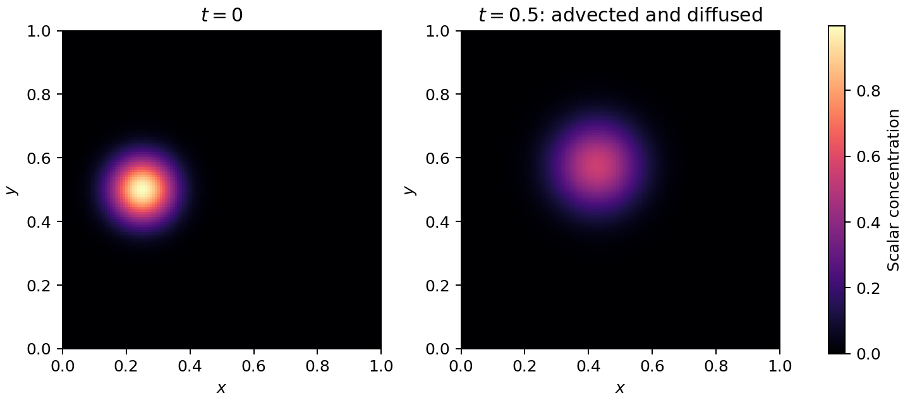
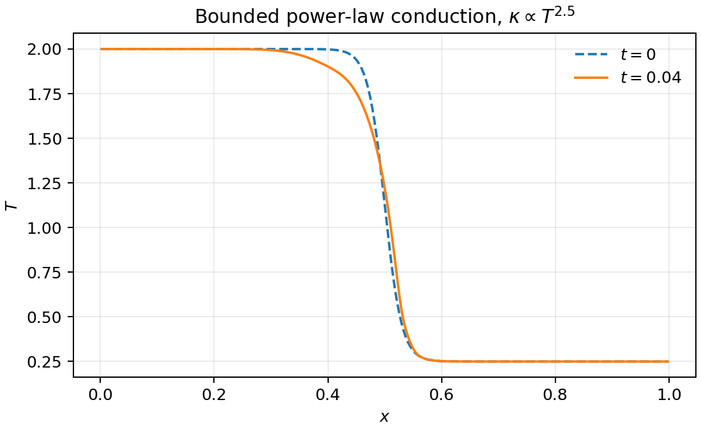
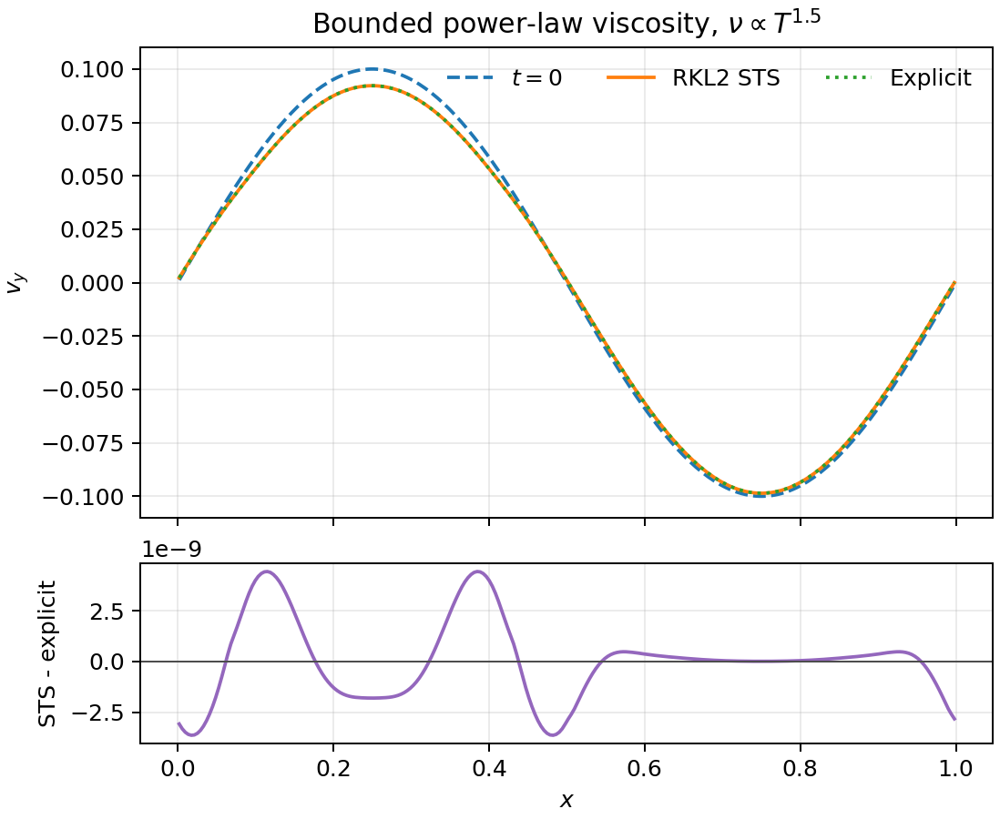
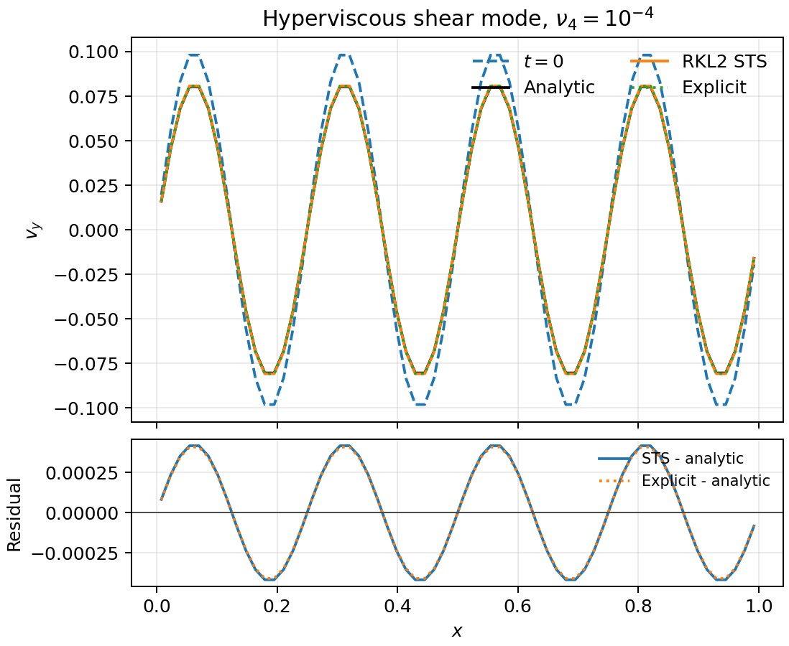
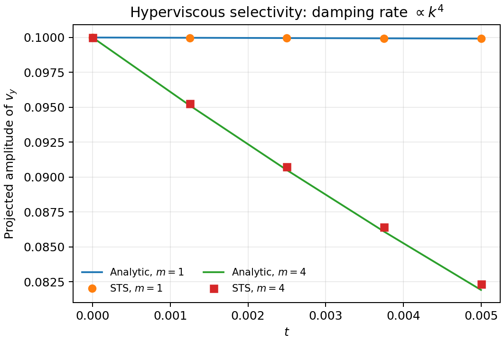
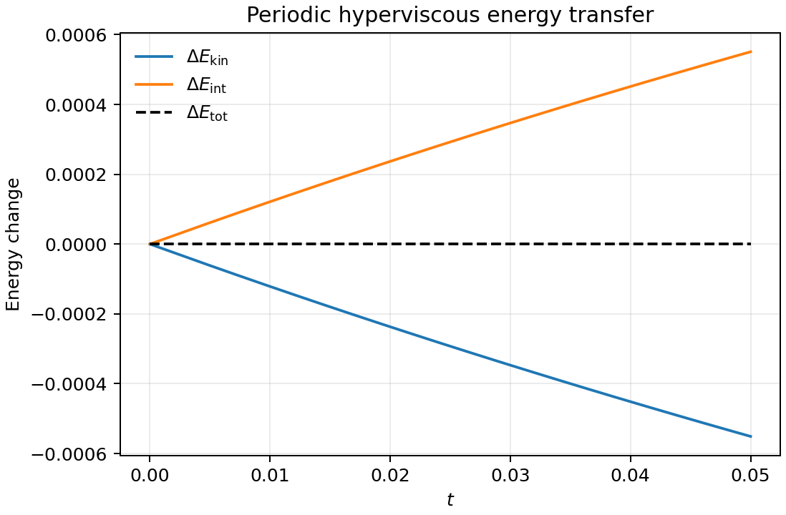
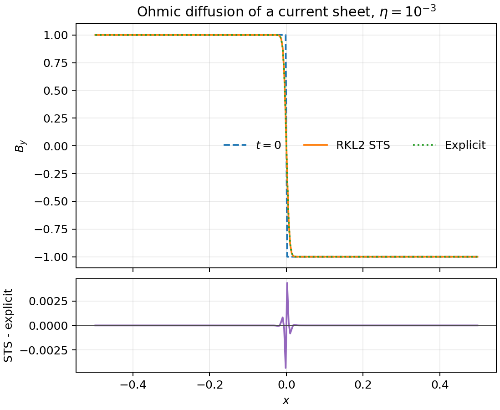
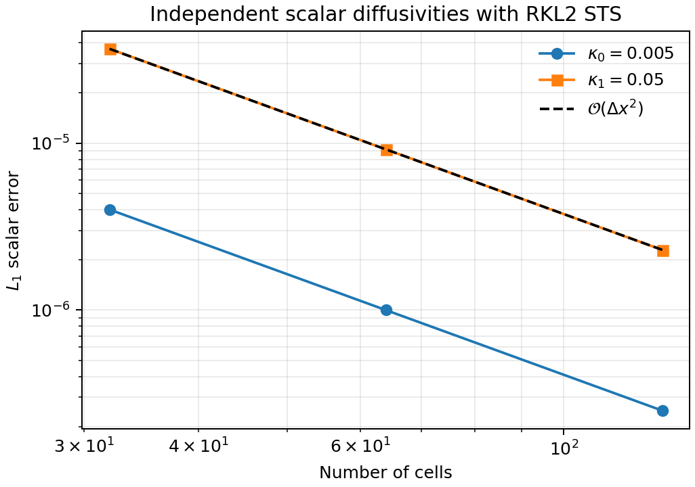
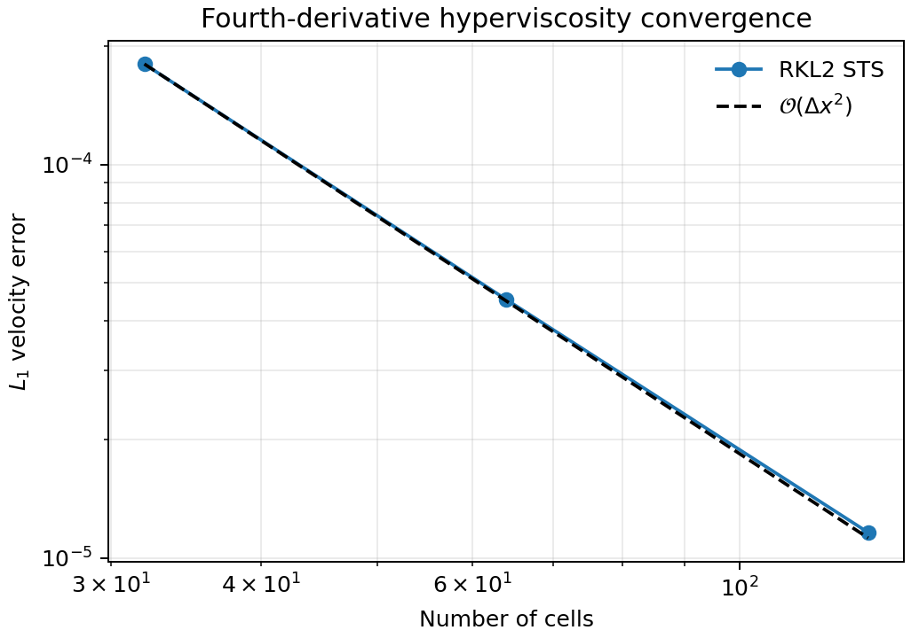

# Super Time Stepping

## Scope

AthenaK can integrate parabolic operators with second-order Runge-Kutta-Legendre
super time stepping (RKL2 STS). STS advances diffusion over a hydro/MHD cycle
without forcing the cycle timestep to equal the smallest explicit parabolic
timestep. The implementation is extensible: operators register metadata and their
explicit stability bound with the driver, while Hydro or MHD supplies the
operator-specific flux or electromotive force.

The currently supported STS operators are:

| Operator | Hydro | MHD | Updated variables | Input selector |
| --- | --- | --- | --- | --- |
| Thermal conduction | Yes | Yes | Energy | `conductivity_integrator` |
| Isotropic viscosity | Yes | Yes | Momentum and energy | `viscosity_integrator` |
| Fourth-derivative hyperviscosity | Yes | Yes | Momentum and ideal-gas energy | `hyperviscosity_integrator` |
| Ohmic resistivity | No | Yes | Face-centered magnetic field | `ohmic_resistivity_integrator` |
| Passive-scalar diffusion | Yes | Yes | Each scalar density | `scalar_diffusivity_integrator` |

Each operator may instead remain on the ordinary explicit update. Runs can
mix explicit and STS operators: only operators selecting `sts` are removed
from the ordinary flux/EMF update and executed in STS sweeps.

## Quick Start

Select the global STS method under `<time>`, then assign one or more active
diffusion processes to STS in the physics block:

```ini
<time>
sts_integrator = rkl2
sts_max_dt_ratio = -1.0

<hydro>
nscalars = 2
scalar_diffusivity = 0.005
scalar_diffusivity_0 = 0.005
scalar_diffusivity_1 = 0.05
scalar_diffusivity_integrator = sts
```

`scalar_diffusivity` is the default for all passive scalars.
`scalar_diffusivity_N` overrides scalar `N`, starting at zero. The timestep
bound uses the maximum configured diffusivity once per update, while device
flux kernels use the coefficient array directly for each scalar. Thus
different scalar diffusivities do not require separate diffusion sweeps.

An input file for this case is provided at
`inputs/tests/sts_scalar_modes.athinput`.

## Integration Algorithm

Let `dt_diff` be the most restrictive explicit parabolic timestep among all
registered STS processes. For a hydro/MHD cycle of duration `dt`, the driver
runs a pre-cycle and post-cycle parabolic sweep, each of duration
`dt_sweep = dt / 2`. This symmetric split keeps the STS contribution
second-order compatible with the normal second-order evolution.

For each sweep, RKL2 chooses an odd stage count:

$$
s = 1 + \left\lfloor
\frac{-1 + \sqrt{9 + 16\,\Delta t_{\rm sweep}/\Delta t_{\rm diff}}}{2}
\right\rfloor ,
$$

with an increment when needed to make `s` odd. The recurrence coefficients
are generated by `src/diffusion/sts_rkl2.cpp` and stored by the driver for
the current stage. The driver invokes:

1. `before_parabolic_stagen` to prepare state and communicate boundaries.
2. `parabolic_stagen` to calculate operator fluxes/EMFs and apply the RKL2 update.
3. `after_parabolic_stagen` to complete the stage and synchronize state.

Cell-centered operators use the Hydro/MHD conserved-state STS arrays.
Ohmic resistivity uses the constrained-transport magnetic-field STS arrays.
MHD does not perform face-field STS communication for viscosity, conduction,
or scalar diffusion unless resistivity is also assigned to STS.

## Process Contract

A parabolic operator participates in STS through
`parabolic::ParabolicProcessDescriptor`, registered on the
`MeshBlockPack`. A descriptor supplies:

| Field | Meaning |
| --- | --- |
| `name` | Diagnostic operator name, such as `hydro/conductivity` |
| `owner` | Hydro or MHD task-list owner |
| `mode` | Ordinary explicit update or STS update |
| `update_shape` | Cell-centered or face-centered update storage |
| `explicit_dt_ptr` | Current explicit stability timestep for the operator |

To add another parabolic operator, such as a new diffusivity:

1. Implement its ordinary face flux or field-centered EMF and explicit
   timestep calculation.
2. Add an input selector ending in `_integrator`, accepting `explicit` and
   `sts`.
3. Register its descriptor when the operator is active.
4. Include the operator in the relevant Hydro or MHD selected-diffusion
   routine so it is executed in ordinary stages only for `explicit` and in
   STS stages only for `sts`.
5. Add a convergence problem and explicit-versus-STS regression test.

The RKL2 controller does not need an operator-specific branch once this
contract is satisfied.

## Timestep Control

`sts_integrator = rkl2` makes registered STS operators contribute to
`dt_parabolic_sts` instead of directly restricting the normal cycle timestep.
All non-STS stability limits continue to restrict the cycle as usual.

| Parameter | Default | Meaning |
| --- | --- | --- |
| `<time>/sts_integrator` | `none` | `none` or `rkl2` global STS controller |
| `<time>/sts_max_dt_ratio` | `-1.0` | Optional positive limit `dt <= ratio * dt_diff`; `-1.0` disables the cap |

The optional ratio cap is useful for validation and for runs where operator
splitting accuracy, rather than explicit stability, should limit large STS
accelerations. A process cannot select `sts` when the global controller is
`none`, and `rkl2` requires at least one process selecting `sts`.

STS currently rejects Hydro/MHD configurations with ion-neutral evolution,
shearing-box updates, or orbital advection. Those task graphs need explicit
ordering and validation before they can use the STS controller.

## Scalar Diffusivity

Passive scalar concentration `s_n` is diffused through the conservative flux

$$
\boldsymbol{F}_{s_n} = -\rho\,\kappa_n\,\boldsymbol{\nabla}s_n .
$$

The feature supports both Hydro and MHD passive scalars:

```ini
<mhd>  # or <hydro>
nscalars = 3
scalar_diffusivity = 0.001
scalar_diffusivity_0 = 0.01
scalar_diffusivity_2 = 0.0025
scalar_diffusivity_integrator = sts
```

In this example scalar 1 uses the default `0.001`. All scalar diffusivities
must be non-negative; a zero coefficient disables diffusion for that scalar.
When every coefficient is zero, no scalar-diffusion timestep is registered.

## Temperature-Dependent Conduction

Conduction remains available with a constant coefficient and with the
existing Spitzer option. A new code-unit power-law model applies

$$
\kappa(T) =
\min\left[\kappa_{\max},
\max\left(\kappa_{\min},
\kappa_{\rm ref}\left(\frac{T}{T_{\rm ref}}\right)^{a}\right)\right].
$$

Configure it in `<hydro>` or `<mhd>`:

```ini
conductivity = 0.01
conductivity_model = power_law
conductivity_tref = 1.0
conductivity_exponent = 2.5
conductivity_floor = 0.0001
conductivity_ceiling = 0.04
conductivity_integrator = sts
```

| Parameter | Default | Meaning |
| --- | --- | --- |
| `conductivity` | `0.0` | `kappa_ref` for `constant` or `power_law` |
| `conductivity_model` | inferred | `constant`, `spitzer`, or `power_law` |
| `conductivity_tref` | `1.0` | Reference temperature for `power_law` |
| `conductivity_exponent` | `0.0` | Power-law exponent `a` |
| `conductivity_floor` | `0.0` | Optional lower coefficient saturation |
| `conductivity_ceiling` | large | Optional upper coefficient saturation |
| `conductivity_integrator` | `explicit` | `explicit` or `sts` |

The coefficient is evaluated locally on the device and face averaged for
the heat flux. Its local maximum also determines the parabolic timestep
bound. Legacy `tdep_conductivity = true` selects the Spitzer model, with
legacy `cond_ceiling` behavior retained.

`sat_hflux = true` is not permitted with STS. Flux-limited saturated heat
transport does not provide the finite linear parabolic stability bound
required by the RKL2 stage-count calculation. For STS, bound the
temperature-dependent coefficient with `conductivity_ceiling`.

## Temperature-Dependent Viscosity

The new variable kinematic-viscosity model applies

$$
\nu(T) =
\min\left[\nu_{\max},
\max\left(\nu_{\min},
\nu_{\rm ref}\left(\frac{T}{T_{\rm ref}}\right)^{b}\right)\right].
$$

```ini
viscosity = 0.02
tdep_viscosity = true
viscosity_tref = 1.0
viscosity_exponent = 1.5
viscosity_floor = 0.002
viscosity_ceiling = 0.04
viscosity_integrator = sts
```

| Parameter | Default | Meaning |
| --- | --- | --- |
| `viscosity` | required when active | `nu_ref`, or constant `nu` |
| `tdep_viscosity` | `false` | Enable bounded power-law viscosity |
| `viscosity_tref` | `1.0` | Reference temperature |
| `viscosity_exponent` | `0.0` | Power-law exponent `b` |
| `viscosity_floor` | `0.0` | Optional lower coefficient saturation |
| `viscosity_ceiling` | large | Optional upper coefficient saturation |
| `viscosity_integrator` | `explicit` | `explicit` or `sts` |

The constant-viscosity path retains its low-overhead host timestep
calculation. Only the variable-coefficient path performs the device
reduction required to find the local diffusive timestep.

## Fourth-Derivative Hyperviscosity

Hyperviscosity is separate from Navier-Stokes viscosity. It is a controlled
numerical damping operator for velocity structure at short wavelengths:

$$
\frac{\partial \boldsymbol{v}}{\partial t}
= -\nu_4\nabla^4\boldsymbol{v}, \qquad [\nu_4]=L^4/T.
$$

The phrase *fourth-derivative* describes the operator, not the convergence
order. AthenaK forms a centered second-order Laplacian
$L_i=\nabla_h^2v_i$ and constructs the face flux

$$
F^{\rm hv}_{\rho v_i,q}
= \rho_f\nu_4\left(\partial_q L_i\right)_f .
$$

The conservative update applies $-\nabla_h\cdot\boldsymbol{F}^{\rm hv}$.
For constant density this is
$-\nu_4(\nabla_h^2)^2\boldsymbol{v}$ and is second-order convergent in
space. For ideal-gas Hydro and MHD, the operator also adds the conservative
energy flux

$$
F^{\rm hv}_{E,q}
= \boldsymbol{v}_f\cdot\boldsymbol{F}^{\rm hv}_{\rho\boldsymbol{v},q},
$$

so periodic damping transfers kinetic energy into internal energy while
preserving total energy. Isothermal runs update momentum only. In MHD,
hyperviscosity does not update magnetic fields and does not enter the
constrained-transport EMF path.

Configure the constant coefficient in `<hydro>` or `<mhd>`:

```ini
hyperviscosity = 1.0e-5
hyperviscosity_integrator = sts
```

| Parameter | Default | Meaning |
| --- | --- | --- |
| `hyperviscosity` | absent | Constant coefficient `nu4`; a positive value enables the operator |
| `hyperviscosity_integrator` | `explicit` | `explicit` or `sts` |

A zero coefficient contributes no flux and no timestep restriction; negative
values are rejected. Ordinary viscosity and hyperviscosity can be active at
the same time and can select explicit or STS integration independently.

On a uniform mesh define

$$
S = \Delta x_1^{-2}
+ \mathbf{1}_{2D}\Delta x_2^{-2}
+ \mathbf{1}_{3D}\Delta x_3^{-2}.
$$

The most negative componentwise discrete eigenvalue is
$-16\nu_4 S^2$, giving the registered explicit limit

$$
\Delta t_{\rm hv} = \frac{1}{8\nu_4 S^2}.
$$

This $\Delta x^4/\nu_4$ restriction is why STS is useful for
hyperviscosity. The implementation caches its three velocity Laplacians once
per diffusion evaluation or RKL2 stage and reuses them to form all face
fluxes. It requires at least two ghost cells and currently supports only
uniform-grid Newtonian Hydro and MHD. Active hyperviscosity is rejected for
SMR/AMR and for SR, GR, or dynamical-GR coordinate modes.

## Resistivity

Ohmic resistivity can be integrated with STS in MHD:

```ini
<mhd>
ohmic_resistivity = 0.001
ohmic_resistivity_integrator = sts
```

Resistive STS evolves the face-centered magnetic field through the
constrained-transport update. Negative resistivity is rejected and zero
resistivity does not impose a timestep bound.

## Verification Suite

Regression coverage is in
`tst/test_suite/diffusion/test_sts_diffusion_cpu.py` and
`tst/test_suite/diffusion/test_hyperviscosity_cpu.py`. Run it from `tst/`:

```bash
python run_test_suite.py --cpu --test test_suite/diffusion/test_sts_diffusion_cpu.py
python run_test_suite.py --cpu --test test_suite/diffusion/test_hyperviscosity_cpu.py
```

The suite performs the following checks:

| Test case | Input | Automated check |
| --- | --- | --- |
| Independent scalar Fourier modes | `sts_scalar_modes.athinput` | Both coefficients converge near second order from 32 to 128 cells; STS and explicit errors agree at 128 cells |
| MHD independent scalar advection | `sts_mhd_scalar_advection.athinput` | MHD STS scalar tasks agree with explicit updates and the larger coefficient damps the scalar mode more strongly |
| Bounded conducting front | `sts_thermal_front.athinput` | STS power-law conduction agrees with explicit integration under a controlled timestep cap |
| Bounded viscous shear wave | `sts_viscous_shear.athinput` | STS power-law viscosity agrees with explicit integration |
| Resistive field diffusion | `sts_resistivity.athinput` | CT-based STS field update is finite and agrees with capped explicit comparison |
| Advected scalar blob | `sts_scalar_blob.athinput` | Two-dimensional output is generated and the diffusing peak decreases |
| Hyperviscous Hydro shear | `sts_hyperviscous_shear.athinput` | Analytic damping converges near second order; capped STS agrees with explicit integration; uncapped STS accelerates a stiff case |
| Hyperviscous MHD shear | `sts_mhd_hyperviscous_shear.athinput` | The cell-centered MHD path follows analytic damping without changing the CT update |
| Viscosity plus hyperviscosity | `sts_viscosity_plus_hyperviscosity.athinput` | Measured decay matches `nu*k^2 + nu4*k^4` |
| Hyperviscous energy transfer | `sts_hyperviscous_shear.athinput` | Periodic ideal-gas total energy is conserved while kinetic energy becomes internal energy |
| Unsupported inputs | `unsupported_hyperviscosity_smr.athinput` and runtime overrides | Negative coefficients, refinement, and relativistic modes fail clearly |

MPI coverage in `test_hyperviscosity_mpicpu.py` compares a decomposed uniform
run with its single-rank reference. The GPU smoke coverage in
`test_hyperviscosity_gpu.py` executes the analytic Hydro shear problem on an
available device build.

Documentation figures can be regenerated after building `build-sts/src/athena`:

```bash
python tst/scripts/hydro/generate_sts_figures.py
```

### Qualitative Results

The scalar blob translates with the prescribed flow while diffusion broadens
the concentration distribution and lowers its peak.



The bounded power-law conduction example smooths a thermal front, with a
larger conductivity on the hot side until the configured ceiling is reached.



### Bounded Viscous Shear Problem

`inputs/tests/sts_viscous_shear.athinput` initializes a pressure-balanced
one-dimensional shear mode with a spatially varying temperature. The
kinematic viscosity follows a bounded power law:

```ini
<hydro>
viscosity = 0.02
tdep_viscosity = true
viscosity_tref = 1.0
viscosity_exponent = 1.5
viscosity_floor = 0.002
viscosity_ceiling = 0.04
viscosity_integrator = sts

<problem>
pgen_name = sts_diffusion
sts_case = viscous_shear
tcold = 0.5
thot = 2.0
amp = 0.1
```

The `v_y` mode is damped by viscosity. The automated test runs an RKL2 STS
solution and an explicit comparison with the same coefficient model, then
requires the final velocity profiles to agree within `1.0e-5` in maximum
absolute difference.



### Hyperviscous Shear Problem

`inputs/tests/sts_hyperviscous_shear.athinput` initializes
$v_y=A\sin(kx)$ at constant density. The exact solution is

$$
v_y(x,t)=A\exp(-\nu_4 k^4t)\sin(kx).
$$

The comparison below uses the same face-flux operator under ordinary explicit
integration and RKL2 STS. A separate MHD input uses zero magnetic field to
isolate the MHD cell-centered diffusion path.



The fourth-derivative operator preferentially damps short wavelength
velocity structure: increasing the Fourier mode number by four increases
the analytic decay rate by a factor of $4^4$.



For ideal-gas runs, the conservative energy flux transfers damped kinetic
energy to internal energy while total energy remains constant to floating
point accuracy.



### Resistive Current-Sheet Problem

`inputs/tests/sts_resistivity.athinput` initializes a one-dimensional MHD
magnetic reversal and evolves the Ohmic EMF through the face-centered
constrained-transport STS update:

```ini
<time>
sts_integrator = rkl2

<mhd>
ohmic_resistivity = 0.001
ohmic_resistivity_integrator = sts

<problem>
pgen_name = shock_tube
byl = 1.0
byr = -1.0
```

The diffusing magnetic discontinuity smooths in `B_y` while remaining on the
constrained-transport field path. The automated comparison applies
`sts_max_dt_ratio = 1.0` to isolate the STS update from large splitting steps
and requires the final STS and explicit profiles to agree within `1.0e-2` in
maximum absolute difference.



### Quantitative Convergence

The two scalar Fourier modes use diffusivities differing by a factor of ten.
Both follow the expected second-order spatial convergence trend.



The hyperviscous shear test likewise converges at second order because the
fourth derivative is formed from centered second-order differences.



## Source Map

| Component | Files |
| --- | --- |
| RKL2 controller and coefficients | `src/driver/driver.cpp`, `src/diffusion/sts_rkl2.cpp` |
| Registered process descriptor | `src/diffusion/parabolic_process.hpp`, `src/mesh/meshblock_pack.hpp` |
| Hydro/MHD STS task implementations | `src/hydro/hydro_sts.cpp`, `src/mhd/mhd_sts.cpp` |
| Physical diffusion operators | `src/diffusion/conduction.cpp`, `src/diffusion/viscosity.cpp`, `src/diffusion/hyperviscosity.cpp`, `src/diffusion/resistivity.cpp`, `src/diffusion/scalar_diffusion.cpp` |
| Verification problem generators | `src/pgen/tests/sts_diffusion.cpp`, `src/pgen/tests/hyperviscous_shear.cpp` |
