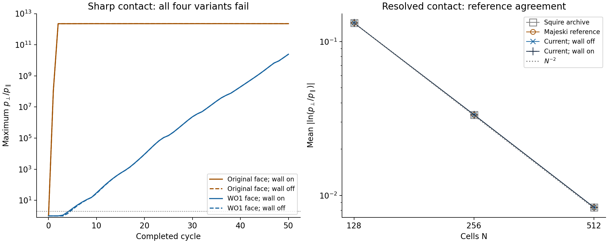
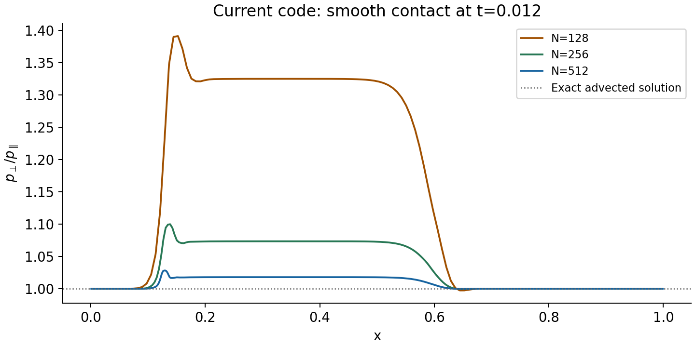

# Project status update: B4 comparison with the A reference implementations

- Date: 2026-10-06
- Exact timestamp: 2026-10-06T18:35:29.381258+00:00
- Project or repository: `/Users/dbf75/.codex/worktrees/bf22/athenak-DF`
- Report profile: standard; controlled numerical experiment and reproducible scientific handoff.
- Status: experiment complete; sharp-contact validation remains failed, accepted as a known limitation on 2026-10-06. Retain A and the current implementation.
- Branch: `c/cgl-lf-wo1`
- Commit: `7b3345fd262a1cf826e9476fb40ca20a28a15881`
- Worktree state at the experiment endpoint: original three modified documentation files and three untracked entries retained; before/after status identical. All 338 protected source/test/input files retained their SHA-256 hashes. Subsequent packaging and decision documentation do not change those historical checks.
- Agent identifier: `/root`, with `/root/b4_discrete_analysis`, `/root/reference_pressure`, and `/root/reference_limiters`.
- Data or simulations analyzed: 68 distinct comparison runs (38 current-code variants, 19 Majeski reference, 11 archived Squire reference), plus instrumentation and fixture-preservation checks.
- Compute environment: Darwin arm64, Apple Clang 21.0.0, CPU serial, double precision, MPI/OpenMP/CUDA off. AthenaK Release with Kokkos `08ceff92bcf3a828844480bc1e6137eb74028517`; Athena++ `-O3 -std=c++11`. Each build used at most two jobs.

> **Decision update, 2026-10-06:** the user accepted the shared unresolved sharp-contact limitation and instructed us to retain conservative A and the current implementation. The strict expected-failure test and its numerical bounds remain unchanged. This limitation no longer blocks WO1 by itself; no further B4 redesign or Q migration is planned. The measurements below remain historical results from `7b3345fd`.

# Tier 0: What happened and why it matters

The goal was to decide whether WO1's new weak-field face treatment or unconditional firehose wall causes B4, while retaining the conservative A formulation used by the reference implementations. Four variants isolate those two choices. They were compared with immutable Majeski AthenaK and archived Squire Athena++ sources, without changing production code or the acceptance test.

All four variants fail the extreme sharp-contact criterion. Turning the firehose wall off leaves the first failure at cycle 5 with the WO1 face rule and nearly the same final large pressure ratio. Restoring the original face rule makes the first failure occur in cycle 1. The reference implementations also fail in cycle 1. Removing either WO1 change therefore does not fix this test.

The entirely magnetized control is decisive: original and WO1 face choices give byte-identical current-code outputs, and both references generate the same first-cycle maximum ratio, about $5.52\times10^9$. Neither a below-floor reset nor the WO1 wall is necessary for the extreme-contact failure.

A smooth, pressure-balanced interface of fixed physical width was then refined from 128 to 512 cells at the same physical time. Both references and current code agree closely, with maximum pressure ratios falling from approximately 1.391 to 1.100 to 1.028. The domain-mean absolute log-ratio error decreases approximately as the grid spacing squared.

The archived Squire source is a development snapshot, not a verified publication revision. Its disabled RMS accumulation leaves its effective magnetic floor at zero; that behavior was preserved. Thus its nominal floor settings are duplicate all-magnetized controls, not independent weak-field-transition tests. Majeski's absolute-floor implementation supplies the directly comparable weak-field reference.

The evidence supports retaining A and does not justify another production patch to solve B4. The user accepted the unresolved extreme sharp contact as a known limitation on 2026-10-06. The existing sharp-contact criterion still fails and remains a strict expected failure; its bounds were not relaxed. Resolved-contact convergence remains supporting evidence, not a replacement acceptance criterion or a turbulence-validation claim.

# Tier 1: How the work was done

The sharp fixture has a unit domain, 128 cells in one block, density 1, uniform velocity $v_x=\pm10$, $B_x=B_z=0$, and a transverse field jumping from $10^{-12}$ to 1. Isotropic gas pressure is $p=1.5-B_y^2/2$, so initial total pressure is constant. Negative-velocity runs reflect the initial condition. All runs use PLM, RK2, CFL 0.4, outflow boundaries, no heat flux, and no optional kinetic limiters or background scattering. AthenaK magnetic floors are $10^{-10}$ and $10^{-14}$. The pressure floor is $10^{-12}$.

Current-code variants change only the full pre-WO1 versus WO1 weak-face policy and the unconditional firehose projection. The face toggle restores two-sided isotropization and floor-based A encoding in HLLE, plus the pre-WO1 CGL-LLF A policy. Wall-off bypasses both the primitive projection and the encoded-A rounding correction. FOFC remains enabled in the current matrix; Majeski FOFC-off is the primary reference because his original fallback uses ordinary MHD LLF. Eight additional Majeski FOFC-on runs expose this difference rather than silently equating the fallback schemes.

Each sharp configuration runs both to 50 completed cycles and independently to $t=0.012$. The cycle endpoints differ slightly because timestep histories differ. All current runs retain full cell/flux/stage snapshots through five cycles and cell snapshots thereafter. The archived Squire runs retain before/after collision/P2C stage states. Reference and current per-cycle outputs include density, field, A, energy, and both pressures.

The exact advected smooth solution has

$$
B_y(x,t)=10^{-12}+(1-10^{-12})\frac{1+\tanh[(x-10t-0.5)/0.04]}2,
\qquad p_\parallel=p_\perp=1.5-\frac{B_y^2}{2}.
$$

This profile uses positive velocity, fixed physical width 0.04, and 128/256/512 cells, all evaluated at $t=0.012$. The mean absolute log-ratio error is $N^{-1}\sum_i|\ln(p_{\perp,i}/p_{\parallel,i})|$. It should approach zero under refinement; passing the loose ratio bound alone is not a convergence demonstration.



The left panel shows the maximum ratio after each complete cycle; the dotted horizontal line is the upper acceptance bound of 2. Wall-on and wall-off curves nearly overlap on this scale. The right panel shows nearly overlapping reference/current smooth-contact errors and a second-order guide. This is measured data, not a schematic.

# Tier 2: Detailed methods, implementation, and validation

## Sharp-contact results

These are the positive-velocity, $B_{\rm floor}=10^{-10}$ current-code runs; negative-velocity extrema agree under reflection. “Through 50” is the largest maximum over all completed-cycle outputs, while “at 50” refers only to the final snapshot.

| Face policy | Firehose wall | First failing cycle | Maximum ratio through 50 | Maximum ratio at 50 | Maximum ratio at t=0.012 |
| --- | --- | ---: | ---: | ---: | ---: |
| original | off | 1 | 2.273001e+12 | 2.264297e+12 | 2.260624e+12 |
| original | on | 1 | 2.273001e+12 | 2.264507e+12 | 2.260748e+12 |
| wo1 | off | 5 | 2.462215e+10 | 2.462215e+10 | 4.544053e+09 |
| wo1 | on | 5 | 2.463040e+10 | 2.463040e+10 | 4.536304e+09 |

With the WO1 face rule, cycle-5 maxima are 3.005220 with the wall and 2.578568 without it. The wall changes early growth but is not necessary for the failure. The minimum completed-cycle ratios remain above 0.5 in both runs. Default-floor WO1 runs activate neither pressure floors nor FOFC; their late pressure ratios must not be dismissed as floor artifacts. At cycle 50 their minimum pressures are about $9.234\times10^{-11}$ and $9.237\times10^{-11}$, below the test's $10^{-10}$ acceptance threshold but above the numerical floor of $10^{-12}$.

Original-face and all-magnetized current runs activate pressure floors and FOFC from cycle 2. Their late plateau near $2\times10^{12}$ is floor limited. Comparing that plateau numerically with a no-FOFC reference is not a clean accuracy test; the matched first-cycle failure precedes those repairs.

Majeski `def0b6c79` gives first-cycle maxima $1.1098016737\times10^8$ for floor $10^{-10}$ and $5.5231936213\times10^9$ for floor $10^{-14}$. FOFC-off 50-cycle maxima are approximately $2.31968\times10^{12}$ and $2.28267\times10^{12}$, respectively. Squire archive `44a29a70`, whose effective floor is zero, gives $5.5231936213\times10^9$ in cycle 1 and $2.28250\times10^{12}$ at cycle 50. Both reference directions agree.

## First divergence and reset attribution

At the first interface flux, the original face policy supplies $F_A=690.7755279$ into cell 64, while the WO1 policy supplies zero. Other first-stage conserved quantities and the field agree there. After that first Euler stage, both have $B_y=0.6590536415$; original A is 23.55174007, while WO1 A is zero. This locates the immediate difference at the face encoding, before the end-of-cycle wall.

After the first completed cycle with the original face policy, the current wall-off run and Majeski reference both have $B_y=0.6788701973$, $A=19.6868380825$, and ratio $1.1098016737\times10^8$ in cell 64. Its parallel pressure is $1.6315\times10^{-8}$, above the pressure floor. The failure therefore precedes pressure-floor repair.

For the current WO1 face policy, wall-off gives cycle-1 A=0.5765111248 and ratio 0.5568469309. The wall raises A to 0.7991008806 and ratio to 0.6956732962. This records the wall's real effect rather than inferring it from late extrema. The failing cell has no EOS repair in its first five cycles; upstream weak cells do reset A under the same repair rule with either wall choice, although the reset amounts later differ as the solutions diverge.

The exact Squire archive already produces ratio $5.38061\times10^{11}$ after the first RK stage, before the collision/P2C call. At both first-cycle stages, P2C changes no cell's A or E. Pressure flooring starts in cycle 2. This rejects a first-failure explanation based solely on Squire's re-encoding calls.

All versions use the nonlinear relation $p_\perp/p_\parallel=(B^3/\rho^2)\exp(A/\rho)$. Numerical mixing of A and B need not preserve isotropy across an unresolved jump. The shared sharp-contact failure and smooth convergence are consistent with that discrete mixing mechanism; they do not establish a universal result for shocks or turbulence.

## Resolved-interface refinement

| Cells | Squire max ratio | Majeski max ratio | Current wall-on max ratio | Current wall-off max ratio | Current wall-on mean absolute log ratio |
| ---: | ---: | ---: | ---: | ---: | ---: |
| 128 | 1.390832294 | 1.390841256 | 1.390832294 | 1.390832294 | 0.13225356 |
| 256 | 1.099768421 | 1.099770598 | 1.099768421 | 1.099768421 | 0.03348009 |
| 512 | 1.028180816 | 1.028181238 | 1.028180816 | 1.028180816 | 0.00837313 |

The measured L1 log-ratio convergence orders are approximately 1.98 and 2.00. Current wall-on magnetic-field L1 errors also fall by approximately four per refinement. Detailed density, velocity, individual pressure, and field errors are in [derived results](figures/derived-results.json). Nonzero error remains: the 128-cell maximum ratio is about 39% above unity. This is finite-resolution agreement and convergence, not exact contact preservation.



The profiles show where the error accumulates and how it decreases. The exact advected ratio is one throughout. This test covers a one-dimensional, positive-velocity, fully magnetized finite-width profile over the stated time, not turbulent statistics.

## Validation

| Purpose | Method | Expected result / tolerance | Actual result | Status | Caveat |
| --- | --- | --- | --- | --- | --- |
| Instrumentation neutrality | Fresh uninstrumented/instrumented comparison, both velocities and floors | Exact output bytes | Four sets of 52 primitive+field tables identical | passed | Serial CPU only |
| Face-toggle isolation above floor | Pair original/WO1 faces for allmag cases | Exact output bytes | Eight pairs identical | passed | Other current safeguards retained |
| Sharp acceptance | Existing ratio [0.5,2] and pressure >1e-10 criteria at each completed cycle | Every output admissible | All sharp configurations fail ratio; original/reference runs reach the numerical floor and WO1/default-floor runs also violate the pressure acceptance threshold by cycle50 | failed | Criterion retained unchanged |
| Wall-cause test | Disable projection and encoded-A correction | Failure disappears if wall is necessary | Cycle-5 failure persists | passed | Establishes non-necessity, not identical dynamics |
| Physical-time comparison | Separate runs ending t=.012 | Endpoint agreement within1e-12 for exact recorded times | Current/Squire exact endpoints verified; AthenaK tables report t=.012 | passed | Cycle histories differ |
| Resolved convergence | Fixed width/time, double N twice | Error decreases systematically | L1 log-ratio approximately second order; close reference agreement | passed | Three resolutions, one smooth profile |
| Sharp energy accounting | Mean E change versus outflow-boundary flux | Residual <1e-12 | WO1/default-floor at most3.86e-15; all sharp current cases at most9.50e-13 | passed | Includes boundary energy flux |
| Production preservation | SHA-256 and Git status before/after | No changes |338 protected files and status identical | passed | Existing dirty documentation retained |
| Turbulence/long-time generalization | MKS24/Squire turbulence statistics | Matching converged statistics | Not performed | not run | No production-validation claim |

## Interpretation and recommendation

The sharp energy check uses $\langle E(t)\rangle=52.125+0.25|v_x|t$, including the net flux through the outflow boundaries. Per-case residuals are retained in [energy-budget.json](energy-budget.json).

Retain A. Removing the wall does not fix B4, and restoring the original weak-face rule makes the sharp test fail earlier. These experiments provide no evidence-based numerical patch that makes the existing sharp acceptance pass while preserving the reference scheme. Do not copy the archived floor bug or remove existing numerical safeguards to force source identity.

The 2026-10-06 decision accepts this shared sharp-contact limitation while preserving the strict expected-failure regression. Retain A and the current production implementation. This resolves B4's merge-blocker status by an explicit accepted exception, not by passing the original criterion. No new resolved-interface acceptance criterion was substituted, and no further B4 redesign or Q migration is planned.

# Tier 3: Reproducibility, audit trail, and handoff

## Source identity and modifications

- Current: `7b3345fd262a1cf826e9476fb40ca20a28a15881`; export plus scratch-only mode guards, diagnostics, and optional smooth fixture. No production changes.
- Majeski: `def0b6c79b84243324de3d033dca95aedb2c2ead`; no modified tracked source files, one added fixture. Adding its optional smooth profile preserved all 1,720 sharp output tables byte-for-byte.
- Squire: `44a29a70f2869b44e97d725393d4b9a020a60adf`; archived physics unchanged, added fixture and two non-mutating stage-dump calls. Its archived `if (CGL_EOS && false)` disables the RMS accumulation, keeping both effective floor cutoffs zero. The newer local modified Athena++ source restores RMS accumulation but was not run. Neither snapshot's publication identity has been established.

At the experiment endpoint, the production checkout retained its pre-existing modifications to `docs/validation/wo1/ARCHIVE.md`, `SHA256SUMS.json`, and `review/weak-field/README.md`; untracked WO1/WO2 work orders and the previous transition archive also remain. See [before](provenance-before.json) and [after](provenance-after.json) checks.

## Reproduction and outputs

The three scratch roots are `/tmp/cgl-b4-compare-20261006/{current,majeski,squire}`. Source exports and binaries remain there. This compact repository package stores inputs, commands, scripts, combined patches, logs, summaries, figures, and the 12 final smooth-state tables needed to regenerate the plots. Full raw run archives remain in the original local bundle; see [package contents](README.md) and [full-bundle manifest](FULL_BUNDLE_SHA256SUMS.json). Existing family manifests identify original scratch binaries and source files; the package SHA256SUMS.json identifies files actually preserved here.

| Output | Purpose | Status |
| --- | --- | --- |
| [Current evidence](evidence/current/REPRODUCTION.txt) | Build/replay instructions and caveats | passed |
| [Compressed current summary](evidence/current/summary.json.gz), [verification](evidence/current/verification.json) |38 cases and exact-neutrality/isolation checks | passed |
| [Majeski summary](evidence/majeski/summary.json), [source verification](evidence/majeski/source-verification.json) |19 cases and immutable source check | passed |
| [Squire summary](evidence/squire/summary.json), [provenance](evidence/squire/PROVENANCE.md) |11 cases and effective-floor qualification | passed |
| [Final smooth-state subset](final-smooth-states.tar.gz) |12 final cell tables for figure reproduction | passed |
| [Full-bundle manifest](FULL_BUNDLE_SHA256SUMS.json) | Hashes of original local bundle, including omitted raw run archives | passed |
| [Analysis script](analyze_comparison.py) | Exact-advection norms and figures | passed |
| `figures/` |PNG/PDF figures and numeric derived results | passed |

For source replay, export the pinned commit to a new directory, supply the pinned Kokkos tree for AthenaK, apply the family's saved patch, and follow its saved configure/build/run commands. All mode switches are presence-based environment variables: unset means off; assigning the string `0` still turns a switch on. Each current case records its exact environment and invocation in `command.json` inside the raw archive. Scripts contain the original scratch paths; adjust only copies when replaying elsewhere.

To regenerate the figures from this compact package, decompress the current summary and extract its final-state subset into `evidence/`, then run:

```sh
gzip -dc evidence/current/summary.json.gz > evidence/current/summary.json
tar -xzf final-smooth-states.tar.gz -C evidence
python3 analyze_comparison.py --runs-root evidence --output figures
```

The analysis asserts positive finite smooth pressures and exact common-time endpoints before computing errors. A [fresh replay from this compact package](package-verification.json) regenerated the figures and reproduced the derived-results and energy-budget JSON values exactly using only the saved summaries and 12 final-state tables. Full source rebuilding was performed during the original experiment; a second rebuild from the packaged evidence was not performed.

Compute used one local machine, no scheduler, GPU, or MPI allocation. The comparisons are tiny serial 1D runs; source compilation dominated elapsed work. Per-run timings are recorded where available, but aggregate CPU-hours were not measured. No performance claim is made.

An independent agent audited the mode guards, default arithmetic, fixture matching, and byte-equality evidence. A final report/data audit is recorded in `review.txt`; its two wording findings about upstream reset amounts and the distinct pressure acceptance threshold were corrected in this report. During the experiment, no commits, pushes, PR edits, source patches, or acceptance changes were made in production. Subsequent decision documentation records the accepted limitation while preserving the failed criterion.
