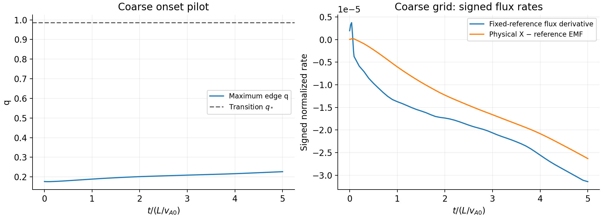
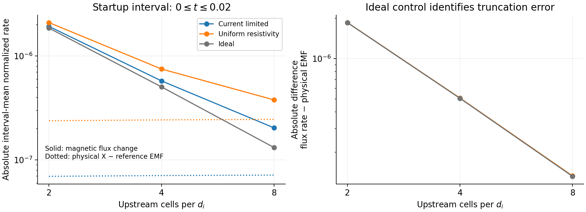

# Project status update: local current-limited Harris validation

- Date: 2026-09-26
- Exact timestamp: 2026-09-26T19:23:28Z
- Project or repository: AthenaK, `dfielding14/athenak`
- Report profile: standard
- Status: pilot complete; scientific acceptance pending
- Branch: `fast_reconnection`
- Commit: tested source `4591691d5`; implementation `8306d78e2`; STS base `b6035d254`
- Worktree state: source checkpointed; this report and derived artifacts added afterward
- Agent identifier: Codex `/root`, with independent diagnostic, analysis, and execution reviews
- Data or simulations analyzed: local fixed-$B_{\rm rec}$ Harris pilot and short resolution/control campaign
- Compute environment: Apple M4 Max, macOS, MPI with Kokkos Serial, Release build; three simulation ranks and at most one analysis CPU

# Tier 0: What happened and why it matters

The purpose of this local phase is to check the implemented closure, measure its
cost, and establish reliable diagnostics before longer GPU simulations. A fast
reconnection rate is an outcome to test, not a value imposed by this model.

The implementation was checkpointed, rebuilt in Release mode, and passed 102
diffusion tests. Two comparisons against the saved Debug executable were
deliberately excluded from the Release run; those comparisons had already passed
with matching Debug builds. The new tests verify the nonzero boundary electric
field and its agreement between one and two MPI ranks.

The open Harris sheet initially has a central X point and no O point. Measuring
the electric field only at X would count uniform sheet diffusion as flux
transfer. Histories now also measure the electric field at the positive-x
boundary. The independent magnetic-flux diagnostic subtracts that reference
field and checks whether the fixed central candidate remains a magnetic saddle.

The matched early runs stayed far below the closure's high-current transition.
The flux-change discrepancy decreases by about fourfold per grid doubling,
and the ideal control reproduces nearly the same discrepancy. This identifies
spatial truncation as the dominant contamination of the raw startup rate.
On the finest grid, subtracting the ideal control leaves a signal within 0.54%
of the reconstructed physical resistive EMF. That subtraction is a useful
diagnostic of weak resistivity, not a general correction for nonlinear
reconnection runs.

All ten short runs completed. Halving the finest-grid timestep changes the
interval-mean flux rate by only 0.0066%, supporting the conclusion that spatial
error dominates this particular diagnostic.

The coarse run also completed the supplied $t=5$ horizon. Its peak $q=0.2266$
never approaches the high-current branch, and its final sheet has only 1.43
cells per local ion length. This is an onset pilot; it cannot establish that
a resolved run will never reach that branch. No steady-rate claim is supported.



*Figure 1. The $400\times200$ pilot thins slowly and remains well below $q_*$.
Its signed fixed-reference flux derivative differs from the physical EMF and
continues to change. The boundary reference is not an O point, and this coarse
grid does not establish a resolved, steady reconnection rate.*

The local phase is complete. The next step is GPU parity testing followed by
longer fine-grid evolution with these unchanged physical parameters. GPU
execution has not been performed. The open-boundary energy estimate still
needs tighter validation before a scientific conservation claim.

# Tier 1: How the work was done

All runs use the single open Harris sheet, fixed $B_{\rm rec}=B_0=1$, upstream
density one, ion interpretation, $L=1$, $d_i=0.005$, sheet width $w=0.02$, and
Gaussian flux seed $10^{-4}$ of width $0.1$. Upstream pressure is $0.1$; the
sheet density enhancement is one. The physical $d_i$ remains fixed across grids.

| Setting | Value |
| --- | --- |
| Grids at 2, 4, 8 upstream cells per $d_i$ | $400\times200$, $800\times400$, $1600\times800$ |
| Meshblocks and ghosts | $40\times40$, two ghost cells |
| Fluid update | RK2, PLM, HLLD, CFL 0.4 |
| Current-limited model | $\eta_0=10^{-6}$, $\eta_{\max}=0.005$, fixed $B_{\rm rec}=1$ |
| Diffusion update | RKL2, `sts_max_dt_ratio=32` |
| Constant control | $\eta=5\times10^{-6}$, explicit, $S=2\times10^5$ |
| Ideal control | Zero explicit resistivity, no STS |
| Matched comparison interval | $0\le t\le0.02\,L/v_{A0}$ |
| Short-run output / history cadence | $0.002$ / $0.001$ |
| Timestep comparison | Finest current-limited grid with CFL 0.2 |
| Extended pilot | Two-cell grid through the shipped $t=5$ horizon, checkpointed in segments |

The initial local skin depth at the dense sheet is smaller than its upstream
value: these grids provide approximately 1.4, 2.8, and 5.7 cells per local
$d_i(\rho_X)$. Only the finest initially meets the brief's 4--5 local-cell target.
The two-cell continuation is an onset and cost pilot, not a resolved acceptance run.

The launcher creates a new output directory, saves the exact input and binary
hash, limits each MPI rank to one thread, and retains native restart files.
Runs are sequential. Analysis uses the remaining CPU; the combined budget is
at most four CPUs. No GPU or remote execution was used.

# Tier 2: Detailed methods, implementation, and validation

## 2.1 Flux, topology, and activation

For the fixed central candidate and positive-x boundary reference,

$$
\psi=A_z(x_{\rm ref},0)-A_z(0,0)
     =-\int_0^{x_{\rm ref}} B_y(x,0)\,dx,
\qquad
\dot\psi=E_z(0,0)-E_z(x_{\rm ref},0).
$$

Electric fields are normalized by $B_0v_{A0}=1$. The history EMFs reconstruct
$-\mathbf v\times\mathbf B+\eta\mathbf J$ on native edges; they are not
time-integrated numerical constrained-transport EMFs. Flux comes independently
from cell-centered magnetic dumps, with linear half-cell extrapolation to the
physical boundary. Finite spatial quadrature and output cadence therefore enter
the comparison. Binary header times are rounded to six significant digits;
the analyzer matches them to history times only within that rounding interval.

The analyzer verifies a central in-plane null and negative determinant of the
flux Hessian, using a $10^{-6}B_0$ null tolerance. It counts additional midplane
null/O candidates but does not search the full plane or follow moving points.
The boundary is never called an O point. Fixed-reference flux remains distinct
from a principal X--O reconnection measurement when islands develop.

The high-current branch begins at $q_*=1-\sqrt{\eta_0/\eta_{\max}}\simeq0.98586$.
Resistivity also increases continuously below this transition: at $q=0.17678$,
$\eta/\eta_0\simeq1.215$. Thus zero high-current occupancy does not mean that
the model is inactive or identical to uniform $\eta_0$. Maximum $q$ is measured
on actual edges; occupancy and heating fractions are cell-centered proxies.
`frac_qstar` and `heat_frac` in constant/ideal controls do not use the nonlinear
model's threshold and must not be compared as activation fractions.

## 2.2 Energy, geometry, and divergence

The analyzer separates conserved total, cell-centered magnetic, kinetic, and
inferred internal energies. It records $\int\eta J^2\,dV$ as a heating proxy.
Open boundaries exchange energy, so total energy need not remain constant.
An approximate surface integral of

$$
\mathbf F_E=(E+p+B^2/2)\mathbf v
 -(\mathbf v\cdot\mathbf B)\mathbf B+\eta\mathbf J\times\mathbf B
$$

is extrapolated from cell centers and integrated over output times. The reported
residual $E(t)-E(t_0)+\int F_{E,\rm out}\,dt$ is a diagnostic of this quadrature,
not an exact discrete RK/STS conservation ledger. Restart segments may start
their dump sequence later than the checkpoint; the baseline time is recorded.

Thickness is the slope proxy $\delta=B_0/|\partial_yB_x|$ at the fixed X.
Length is the connected half-maximum $|J_z|$ half-length. A sheet that reaches
the boundary before falling below half maximum has unmeasured length/aspect,
reported as `nan`. `mhd_divb` is the actual face-field CT divergence.

## 2.3 Validation and interpretation

| Check | Status | Evidence / limit |
| --- | --- | --- |
| Release compilation | passed | MPI enabled, Kokkos Serial, bounds checks disabled |
| Release diffusion suite | passed | 102 passed, 2 baseline comparisons deselected, 35.47 s |
| Boundary-reference analytic/MPI histories | passed | Included above; guide fields 0 and 1, one and two ranks |
| Saved-baseline bitwise comparison | passed | Earlier matching Debug builds; not a Release-vs-Debug claim |
| Local runner and restart provenance | passed | Native output, restart, cycle/time termination, hash and thread settings retained |
| Analysis regression | passed | Four checks, including two existing tests; flux/energy signs, history cadence, rounding and field restriction |
| Nonlinear force-free decay at STS cap 32 | passed | Two additional cases; 1D and diagonal 2D, crossing from $q>1$ below $q_*$ |
| Nine matched resolution/control cases | passed | All reached $t=0.02$; finite positive states and a verified central X at every dump |
| Halved-CFL finest-grid comparison | passed | Both reach $t=0.02$; mean flux rate changes by 0.0066% |
| Coarse continuation through $t=5$ | passed | Completes with finite positive snapshots and a verified central X |
| High-current / steady reconnection regime | inconclusive | Peak $q=0.2266$ through the coarse horizon; no resolved or steady-rate claim |
| Tight open-boundary energy accounting | inconclusive | Approximate full-interval residual $-7.57\times10^{-5}$; quadrature not converged |
| Exact open-boundary energy ledger | not run | Only reconstructed surface-flux quadrature available |
| GPU build, parity and performance | not run | Next machine-dependent phase |

The earlier implementation checks also include 97 broader Debug regressions and
second-order fixed-field diffusion convergence. Jump-estimator tests found
first-order temporal behavior when its cache is frozen per cycle. That
experimental option is not used in this campaign.

There are 106 distinct passing Release checks across the initial suite and the
focused follow-ups (the four analysis checks include two reruns). The cap-32
force-free cases use the suite's $\eta_0=0.1$, $\eta_{\max}=1$, and $q_0=3$.
At cap 32,
force-free amplitude errors decrease from $8.0875\times10^{-4}$ to
$1.8507\times10^{-4}$ in 1D and from $6.2765\times10^{-3}$ to
$1.2231\times10^{-3}$ in diagonal 2D when the grid is doubled. These cases also
pass the existing $2\times10^{-12}$ total-energy tolerance, magnetic-decay,
internal-heating, and converging-kinetic-residual assertions. They test the
larger cap in an activated nonlinear problem; the short Harris campaign alone
would not do so.

## 2.4 Short-run results

For the current-limited cases, compare the magnetic-flux change over the entire
$0\le t\le0.02$ interval with the trapezoidal integral of the full, more frequent
physical-EMF history. All values below are normalized by $B_0v_{A0}$.

| Upstream cells per $d_i$ | Mean flux rate | Mean physical X minus reference EMF | Difference | Ideal-control flux rate |
| --- | ---: | ---: | ---: | ---: |
| 2 | $1.92744\times10^{-6}$ | $6.96457\times10^{-8}$ | $1.85779\times10^{-6}$ | $1.85685\times10^{-6}$ |
| 4 | $5.76716\times10^{-7}$ | $7.08717\times10^{-8}$ | $5.05845\times10^{-7}$ | $5.05156\times10^{-7}$ |
| 8 | $2.03924\times10^{-7}$ | $7.16229\times10^{-8}$ | $1.32301\times10^{-7}$ | $1.31918\times10^{-7}$ |

The discrepancies drop by factors 3.67 and 3.82 under grid doubling. The ideal
physical EMF is effectively zero; its nonzero flux change directly exposes the
numerical contribution. Even at eight upstream cells per $d_i$, the raw
current-limited rate is 2.85 times the physical rate. This does **not** pass a
10% raw-rate convergence/physical-dominance criterion. The control-subtracted
signal, $7.20058\times10^{-8}$, should not be advertised as a measured steady
reconnection rate.

Here $\psi$ initially is negative and its short-time derivative is positive:
the seed's flux magnitude is relaxing. The sign changes later in the coarse
run. A positive startup value in this table does not mean that reconnected
flux is growing.



*Figure 2. Interval-mean flux rates and physical EMFs for the three models (left)
and their absolute differences (right). The almost coincident discrepancy
curves identify a common numerical contribution. Magnitudes are shown here;
the signed values and relaxation interpretation are given above.*

After volume restriction of the finer field, current-limited $B_x$ mean absolute
differences fall from $6.401\times10^{-5}$ (2 versus 4 cells) to
$1.320\times10^{-5}$ (4 versus 8); $B_y$ differences fall from
$8.356\times10^{-9}$ to $2.102\times10^{-9}$. These are relative grid
comparisons, not errors against an exact Harris solution. $B_z$ remains zero.

Across the nine runs, peak $q$ is at most 0.17678. The current-limited fractions
above $q_*$ and above one are zero. The finest current-limited CT divergence has maximum
$6.62\times10^{-10}$ in code units, or $4.14\times10^{-13}$ in
$\Delta x\,\nabla\cdot\mathbf B/B_0$ units. The approximate short-interval
energy residual falls from $5.55\times10^{-9}$ to $2.74\times10^{-9}$ to
$1.33\times10^{-9}$ with refinement. These small early residuals do not certify
the longer open-boundary budget.

At the finest grid, the energy changes over the same interval are:

| Model | $\Delta E$ | $\Delta E_B$ | $\Delta E_K$ | $\Delta E_{\rm int}$ | $\int\eta J^2\,dt$ proxy |
| --- | ---: | ---: | ---: | ---: | ---: |
| Current limited | $2.62\times10^{-8}$ | $-6.61\times10^{-7}$ | $2.53\times10^{-9}$ | $6.85\times10^{-7}$ | $1.565\times10^{-6}$ |
| Uniform resistivity | $2.61\times10^{-8}$ | $-5.59\times10^{-6}$ | $2.74\times10^{-9}$ | $5.62\times10^{-6}$ | $6.662\times10^{-6}$ |
| Ideal | $2.62\times10^{-8}$ | $8.56\times10^{-7}$ | $2.49\times10^{-9}$ | $-8.32\times10^{-7}$ | $0$ |

All energies are per unit depth; heating is trapezoidal quadrature at dump
times. Internal-energy change alone does not isolate Joule heating: compression,
boundary transport, and discretization also contribute. In particular the
ideal control has nonzero magnetic/internal-energy exchange. The energy
components and heating proxy must be retained separately in longer runs.

The finest-grid CFL comparison halves the initial global step from
$2.31455\times10^{-4}$ to $1.157275\times10^{-4}$. The mean flux rate changes
from $2.039239815\times10^{-7}$ to $2.039106170\times10^{-7}$ (0.00655%);
the mean physical EMF changes by 0.00375%. The $B_x$ field difference has
mean/max $1.35\times10^{-8}/8.31\times10^{-7}$ in $B_0$ units, versus
$1.32\times10^{-5}/1.49\times10^{-4}$ for the 4-to-8 spatial comparison.
For $B_y$, the corresponding mean/max are
$9.56\times10^{-11}/3.84\times10^{-8}$; its pointwise temporal difference is
smaller than, but not negligible beside, the spatial maximum $1.04\times10^{-7}$.
The half-CFL run remains finite/positive, with a verified central X and no
high-current occupancy. Its maximum CT divergence is $1.13\times10^{-9}$,
or $7.06\times10^{-13}$ in $\Delta x\,\nabla\cdot\mathbf B/B_0$ units.

## 2.5 Coarse continuation through $t=5$

The three checkpointed segments reach 5402 total cycles. Across all retained
history samples, peak $q=0.226584629$, and both high-current occupancy fractions
remain zero. Every recorded state is finite, with density at least 0.999587
and pressure at least 0.0999313; maximum CT divergence is $1.65\times10^{-10}$.

The fixed central point remains an in-plane magnetic saddle. The initial dump
has one midplane null and no O candidate; additional candidates appear by the
first later dump at $t=0.200727$. From $t=0.400611$ through five, the midplane
search reports three nulls including two O candidates. This is not a full-plane
topology search or a principal X--O tracking measurement.

At five, the slope thickness is $\delta=0.0175574$, or 4.9047 local ion lengths;
there are only 1.4319 cells per local ion length. The layer reaches the boundary
before its current falls to half maximum, so length and aspect ratio remain
unmeasured. Its endpoint flux derivative is $-3.14347\times10^{-5}$ versus
physical X-minus-reference EMF $-2.63267\times10^{-5}$, a 19.4% discrepancy.
Neither this endpoint derivative nor a mean across the transient demonstrates
steady reconnection.

Over the full interval, $\Delta\psi=-9.49733\times10^{-5}$, whereas the
time-integrated physical EMF is $-6.84942\times10^{-5}$. Energy changes per
unit depth are $\Delta E=-1.57674\times10^{-4}$,
$\Delta E_B=-6.70943\times10^{-4}$,
$\Delta E_{\rm int}=5.12936\times10^{-4}$, and
$\Delta E_K=3.32667\times10^{-7}$.
The reconstructed Joule proxy integrates to $3.83983\times10^{-4}$.

Stitching the snapshot-based outward surface flux gives an approximate
boundary energy integral $8.20236\times10^{-5}$ and residual
$-7.56509\times10^{-5}$, about $2.26\times10^{-4}$ of initial total energy.
The much smaller residual of the final segment ($1.57270\times10^{-6}$,
baseline $t=1.10088$) does not remove the earlier error. These estimates do
not establish an exact conservation failure or certify a tight energy budget.
Refine the boundary/cadence quadrature, or record the actual numerical boundary
energy flux with the RK/STS stage weights, before interpreting small energy
differences in longer runs.

## 2.6 Compute cost

| Upstream cells per $d_i$ | Current-limited wall time | Constant wall time | Ideal wall time | Cycles per case |
| --- | ---: | ---: | ---: | ---: |
| 2 | 3.23 s | 0.564 s | 0.542 s | 22 |
| 4 | 33.17 s | 3.04 s | 2.86 s | 44 |
| 8 | 338.99 s | 19.38 s | 18.09 s | 87 |

The finest current-limited CFL-0.2 run takes 653.43 s, 173 cycles, and 3110
STS stages; its CFL-0.4 counterpart uses 1558 stages. Linear extrapolation of
the latter startup timing to $t=5$ gives about 23.5 hours on three CPU ranks.
This is a cost estimate, not a prediction of later throughput or reconnection
onset; longer fine-grid evolution belongs on the next GPU machine.

These are single-run wall times including launch and output, on three local MPI
ranks. They compare different physical diffusivity models and do not measure
an STS speedup over an equivalent explicit current-limited calculation. The
conservative timestep bound uses $\eta_{\max}$ even though the weak initial
sheet has $\eta\simeq1.2\times10^{-6}$. The finer run therefore incurs many
STS stages while both explicit controls remain limited by the fluid CFL step.

The coarse $t=1\to5$ continuation takes 615.84 s; its complete three-segment
chain takes 761.21 s. All 13 campaign invocations return zero. The 100-cycle
timing pilot intentionally stops early; the other 12 reach their time limits.
Total simulation wall time is 1834.50 s (30.57 minutes), and allocated
rank-seconds are 5503.49 (1.529 rank-hours). The latter is ranks times wall time,
not measured CPU consumption. Compilation and analysis are excluded from these
simulation totals; compilation used at most three jobs, analysis one thread.

# Tier 3: Reproducibility, audit trail, and handoff

Source entry points are [the launcher](../../benchmarks/reconnection/run_local.py),
[the analyzer](../../benchmarks/reconnection/analyze.py),
[model documentation](../../doc/current_limited_resistivity.md), and
[the Harris deck](../../inputs/mhd/resistive_harris.athinput).
Raw local outputs remain under `build-reconnection-release/campaign/` and are
Git-ignored. They include state/divergence/coefficient dumps, histories,
checkpoints, stdout, inputs, and one `run.json` per invocation.

Small derived artifacts are retained with this report:

| Artifact | Content |
| --- | --- |
| [Comparison data](data/comparison.json) | Interval flux/EMF budgets and restricted field differences |
| [Short-run summaries](data/analysis-short-summary.json) | Positivity, topology, divergence, high-current occupancy, approximate energy residuals |
| [Pilot summaries](data/analysis-pilot-summary.json) | Initial pilot and first continuation diagnostics |
| [Full coarse assessment](data/continuation-summary.json) | Stitched $0\to5$ flux and approximate energy budgets, topology and thickness |
| `data/*.csv` | Per-snapshot diagnostic tables used by the figures |
| `data/inputs/*.athinput` | Exact input files, including the limited overrides used for restart segments |
| [Run manifests](data/runs.json) | Commands, inputs' arguments, binary hash, source revision/state, threads and timings |
| [Environment](data/environment.json) | Compiler, CMake/MPI/Python versions, dependencies and Release settings |
| [Execution totals](data/campaign_execution_summary.json) | All 13 statuses, timings, counters and allocated rank-seconds |
| [Release test XML](data/release-diffusion.xml), [cap-32 test XML](data/sts32-forcefree.xml) | Persisted automated validation results |
| [Short-run commands](data/run_short_cases.sh), [coarse continuation](data/run_coarse_to_t5.sh) | Exact local commands, retaining original absolute paths |

The command records target existing directories and therefore intentionally
refuse to overwrite them. Adapt the repository/interpreter/binary paths and use
new output directories when reproducing them elsewhere. The binary SHA-256 is
`63bf55d8304b7806b20b82644cad7394cf6096ab88c1b573fe535b52112ad934`.

Build with:

```sh
cmake -S . -B build-reconnection-release -DCMAKE_BUILD_TYPE=Release \
  -DAthena_ENABLE_MPI=ON -DAthena_ENABLE_OPENMP=OFF \
  -DKokkos_ENABLE_SERIAL=ON -DKokkos_ENABLE_OPENMP=OFF \
  -DKokkos_ENABLE_DEBUG=OFF -DKokkos_ENABLE_DEBUG_BOUNDS_CHECK=OFF
cmake --build build-reconnection-release -j 3
```

The local Python interpreter is
`/Users/dbf75/.uv/envs/interactive/.venv/bin/python3`.
Set `PYTHONDONTWRITEBYTECODE=1`; the launcher sets OMP, OpenBLAS, MKL, Accelerate,
and NumExpr thread counts to one. A representative fresh run is:

```sh
python benchmarks/reconnection/run_local.py \
  --binary build-reconnection-release/src/athena \
  --output build-reconnection-release/campaign/example-new-directory \
  --cells-per-di 8 --model current_limited --tlim 0.02 --ranks 3 \
  --output-dt 0.002 --history-dt 0.001 --wall-limit 00:20:00
```

Use `--restart /absolute/path/to/checkpoint.rst` in a new output directory to
continue. Restart input changes only run/output controls, preserving checkpoint
mesh and physics. Athena's native wall limit writes a final checkpoint instead
of losing the run to an external timeout.

Regenerate analysis from completed local case directories, then reproduce the
figures from the saved tables:

```sh
PYTHONDONTWRITEBYTECODE=1 python benchmarks/reconnection/analyze.py \
  build-reconnection-release/campaign/*-short \
  --output build-reconnection-release/campaign/analysis-short
PYTHONDONTWRITEBYTECODE=1 python benchmarks/reconnection/compare.py \
  build-reconnection-release/campaign/*-short \
  --analysis build-reconnection-release/campaign/analysis-short
PYTHONDONTWRITEBYTECODE=1 python reports/status-update-2026-09-26/plot_results.py
```

The last command uses the committed tables and needs no raw simulation dumps.
To replace the saved short-run tables with newly analyzed results, copy the
generated CSVs and `comparison.json` into this report's `data/` directory first.
Analyze the three coarse segments with `analyze.py` in the same way and copy
their CSVs. This preserves each segment's recorded energy-baseline time; the
coarse figure differentiates the combined flux series across all segments.

The analysis regression command was
`python -m pytest -q tst/test_suite/diffusion/test_reconnection_flux_cpu.py`
with the listed one-thread environment and `PYTHONDONTWRITEBYTECODE=1`:
four passed initially in 0.15 s and after the restart-history correction in
0.18 s. The latter command and observed result are retained in
[the analysis check record](data/analysis-regression.log), explicitly labeled
as recorded tool output. No XML was created for that focused check.

The GPU handoff should first reproduce a short case and the nonlinear diffusion
checks in the same double precision with the machine's supported Kokkos backend,
then compare CPU/GPU fields,
activation histories, flux diagnostics, and timestep sensitivity. GPU model,
architecture, MPI layout, and build flags must be recorded on that machine.
Longer fine-grid Harris evolution comes before the parameter scans or turbulent
production runs. It must establish an activated, adequately resolved sheet,
verify the relevant X/O topology, and test rate convergence and the open-boundary
energy budget. The current local evidence does not establish those conditions.
