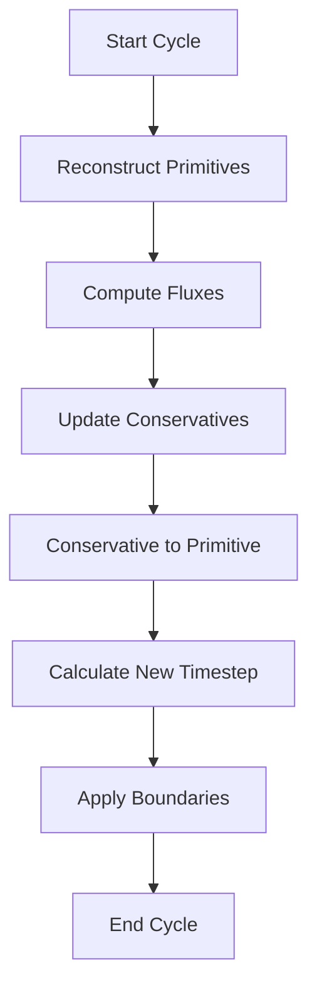

# Module: Hydrodynamics

## Overview
The Hydro module solves the Euler equations for compressible fluid dynamics using high-resolution shock-capturing methods.

## Equations Solved

The module evolves the conservation laws:
```
∂ρ/∂t + ∇·(ρv) = 0
∂(ρv)/∂t + ∇·(ρvv + pI) = 0
∂E/∂t + ∇·((E+p)v) = 0
```

## Architecture

### Key Components

| Component | File(s) | Purpose |
|-----------|---------|---------|
| `Hydro` | `hydro/hydro.hpp/cpp` | Main hydrodynamics class |
| Flux computation | `hydro/hydro_fluxes.cpp` | Godunov flux calculation |
| Time update | `hydro/hydro_update.cpp` | Conservative variable update |
| Timestep | `hydro/hydro_newdt.cpp` | CFL-based dt calculation |
| FOFC | `hydro/hydro_fofc.cpp` | First-order flux correction |

### Variables

```cpp
class Hydro {
  // Conserved variables (ρ, ρv, E)
  DvceArray5D<Real> u;  // (nmb, nvar, nk, nj, ni)
  
  // Primitive variables (ρ, v, p)
  DvceArray5D<Real> w;  // (nmb, nvar, nk, nj, ni)
  
  // Fluxes
  DvceArray5D<Real> flux[3];  // x1, x2, x3 directions
};
```

## Riemann Solvers

Available solvers in `hydro/rsolvers/`:

| Solver | File | Description | Best For |
|--------|------|-------------|----------|
| LLF | `llf_hyd.cpp` | Local Lax-Friedrichs | Robust, diffusive |
| HLLE | `hlle_hyd.cpp` | Harten-Lax-van Leer-Einfeldt | General purpose |
| HLLC | `hllc_hyd.cpp` | HLLE + Contact | Accurate contacts |
| Roe | `roe_hyd.cpp` | Roe's linearization | Sharp features |

## Reconstruction Methods

The module supports various spatial reconstruction schemes:

- **DC**: Donor cell (1st order)
- **PLM**: Piecewise linear (2nd order)
- **PPM**: Piecewise parabolic (3rd order)
- **WENOZ**: WENO-Z (5th order)

## Configuration

Input parameters in `<hydro>` block:

```
<hydro>
eos         = ideal       # Equation of state
reconstruct = plm         # Reconstruction method
rsolver     = hllc        # Riemann solver
gamma       = 1.4         # Adiabatic index
iso_sound_speed = 1.0     # For isothermal EOS
```

## Task Flow



## Performance Notes

### GPU Optimization
- Coalesced memory access with (nmb,nvar,k,j,i) layout
- Fused kernels for reconstruction + flux
- Shared memory for stencil operations

### Typical Performance
- ~10⁷ zone-cycles/sec on V100 GPU
- Strong scaling to 1000s of GPUs
- Weak scaling >90% efficiency

## Common Use Cases

### Shock Tube
```cpp
// Sod shock tube initial conditions
if (x < 0.5) {
  w(m,IDN,k,j,i) = 1.0;   // Left density
  w(m,IPR,k,j,i) = 1.0;   // Left pressure
} else {
  w(m,IDN,k,j,i) = 0.125; // Right density
  w(m,IPR,k,j,i) = 0.1;   // Right pressure
}
```

### Blast Wave
```cpp
// Sedov blast wave
Real r = sqrt(x*x + y*y + z*z);
if (r < r0) {
  w(m,IPR,k,j,i) = p_blast;
} else {
  w(m,IPR,k,j,i) = p_ambient;
}
```

## Validation Tests

Standard test problems in `tst/scripts/hydro/`:
- Linear waves (sound, entropy)
- Shock tubes (Sod, strong shocks)
- Blast waves (Sedov-Taylor)
- Kelvin-Helmholtz instability
- Rayleigh-Taylor instability

## See Also
- [MHD Module](mhd.md) - Magnetohydrodynamics
- [EOS Module](eos.md) - Equations of state
- [Riemann Solvers](riemann.md) - Solver details
- [Test Problems](../examples/hydro_tests.md)