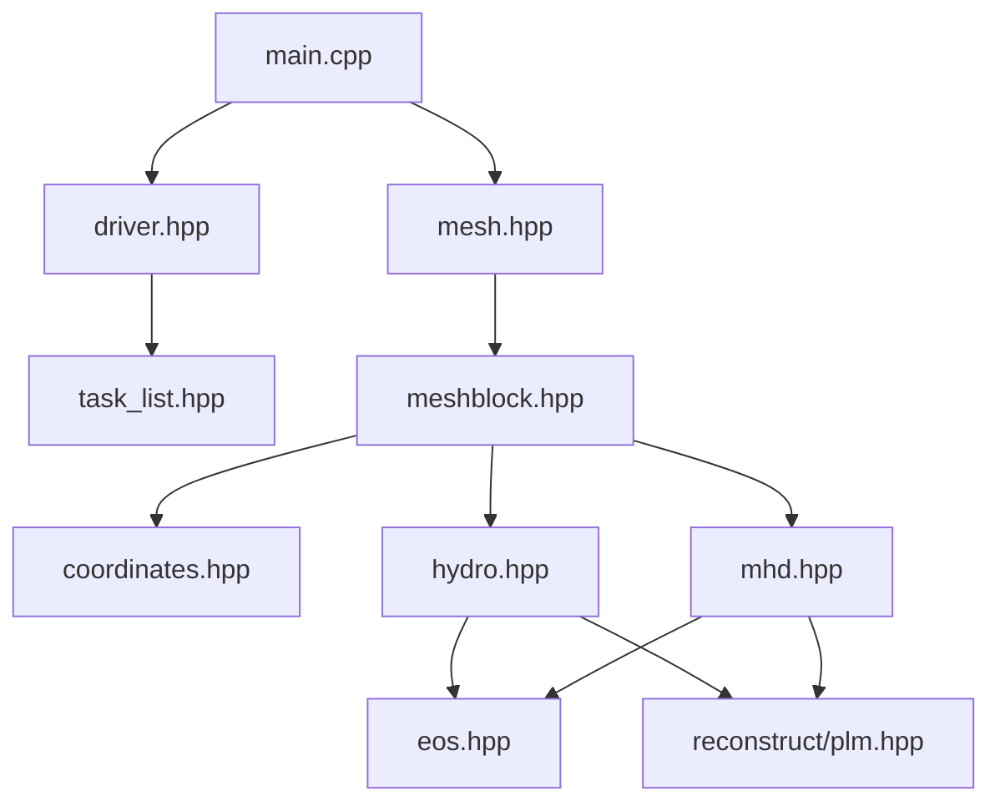

# AthenaK File Reference

Complete file-by-file documentation for the AthenaK codebase, organized by module.

## Quick Navigation

::::{grid} 2
:gutter: 3

:::{grid-item-card} Core Infrastructure
:link: core-files
:link-type: ref

Main program, mesh, driver, and task management
:::

:::{grid-item-card} Physics Modules
:link: physics-files
:link-type: ref

Hydro, MHD, radiation, relativity, particles
:::

:::{grid-item-card} Numerical Methods
:link: numerical-files
:link-type: ref

Reconstruction, Riemann solvers, integrators
:::

:::{grid-item-card} Support Systems
:link: support-files
:link-type: ref

I/O, boundaries, coordinates, EOS
:::

::::

(core-files)=
## Core Infrastructure Files

### Main Entry Point
| File | Purpose | Key Components |
|------|---------|----------------|
| `main.cpp` | Program entry, initialization, execution | `main()`, MPI/Kokkos init |
| `athena.hpp` | Core types and parallel wrappers | `par_for`, array types, enums |
| `globals.hpp/cpp` | Global variables | MPI rank, size |

### Mesh System (`mesh/`)
| File | Purpose | Key Components |
|------|---------|----------------|
| `mesh.hpp/cpp` | Global mesh management | `Mesh` class, AMR control |
| `meshblock.hpp/cpp` | Individual mesh patches | `MeshBlock` class |
| `meshblock_pack.hpp/cpp` | GPU-optimized block groups | `MeshBlockPack` |
| `meshblock_tree.hpp/cpp` | AMR octree structure | Tree operations |
| `mesh_refinement.hpp/cpp` | Refinement/derefinement | Refinement criteria |
| `build_tree.cpp` | Tree construction | Octree algorithms |
| `load_balance.cpp` | MPI load distribution | Space-filling curves |

### Driver (`driver/`)
| File | Purpose | Key Components |
|------|---------|----------------|
| `driver.hpp/cpp` | Time evolution control | `Driver` class, integrators |

### Task System (`tasklist/`)
| File | Purpose | Key Components |
|------|---------|----------------|
| `task_list.hpp` | Task dependency management | `TaskList`, `Task`, `TaskID` |

(physics-files)=
## Physics Module Files

### Hydrodynamics (`hydro/`)
| File | Purpose | Key Components |
|------|---------|----------------|
| `hydro.hpp/cpp` | Main hydro class | `Hydro`, variables |
| `hydro_fluxes.cpp` | Flux computation | Godunov fluxes |
| `hydro_tasks.cpp` | Task definitions | Evolution tasks |
| `hydro_update.cpp` | Conservative update | Time integration |
| `hydro_newdt.cpp` | Timestep calculation | CFL condition |
| `hydro_fofc.cpp` | First-order flux correction | Stability fix |
| `rsolvers/*.cpp` | Riemann solvers | HLLE, HLLC, LLF, Roe |

### MHD (`mhd/`)
| File | Purpose | Key Components |
|------|---------|----------------|
| `mhd.hpp/cpp` | Main MHD class | `MHD`, magnetic fields |
| `mhd_fluxes.cpp` | MHD flux computation | Godunov MHD |
| `mhd_ct.cpp` | Constrained transport | Divergence-free |
| `mhd_corner_e.cpp` | Corner electric fields | CT algorithm |
| `mhd_tasks.cpp` | MHD task definitions | Evolution tasks |
| `rsolvers/*.cpp` | MHD Riemann solvers | HLLD, HLLE, LLF |

### Radiation (`radiation/`)
| File | Purpose | Key Components |
|------|---------|----------------|
| `radiation.hpp/cpp` | Radiation transport | `Radiation` class |
| `radiation_fluxes.cpp` | Radiation flux | Moment equations |
| `radiation_source.cpp` | Matter coupling | Emission/absorption |
| `radiation_tetrad.hpp/cpp` | Curved spacetime | Tetrad formalism |
| `radiation_opacities.hpp` | Opacity models | Absorption coefficients |

### Numerical Relativity (`z4c/`)
| File | Purpose | Key Components |
|------|---------|----------------|
| `z4c.hpp/cpp` | Z4c evolution | Einstein equations |
| `z4c_calcrhs.cpp` | RHS computation | Evolution equations |
| `z4c_adm.cpp` | ADM decomposition | 3+1 split |
| `z4c_gauge.cpp` | Gauge conditions | Lapse, shift |
| `z4c_amr.hpp/cpp` | AMR for spacetime | Refinement criteria |
| `compact_object_tracker.hpp/cpp` | Black hole tracking | Horizon finder |
| `z4c_wave_extr.cpp` | GW extraction | Weyl scalars |

### Particles (`particles/`)
| File | Purpose | Key Components |
|------|---------|----------------|
| `particles.hpp/cpp` | Lagrangian particles | `Particles` class |
| `particles_pushers.cpp` | Integration schemes | Boris, RK4 |
| `particles_tasks.cpp` | Particle tasks | Push, deposit |

(numerical-files)=
## Numerical Methods Files

### Reconstruction (`reconstruct/`)
| File | Purpose | Key Components |
|------|---------|----------------|
| `dc.hpp` | Donor cell (1st order) | Simple average |
| `plm.hpp` | Piecewise linear | Slope limiting |
| `ppm.hpp` | Piecewise parabolic | High-order |
| `wenoz.hpp` | WENO-Z | Very high-order |

### Equation of State (`eos/`)
| File | Purpose | Key Components |
|------|---------|----------------|
| `eos.hpp/cpp` | EOS interface | Base class |
| `ideal_*.cpp` | Ideal gas variants | γ-law EOS |
| `isothermal_*.cpp` | Isothermal variants | Constant temp |
| `primitive-solver/*` | C2P solvers | Newton-Raphson |

(support-files)=
## Support System Files

### Boundary Values (`bvals/`)
| File | Purpose | Key Components |
|------|---------|----------------|
| `bvals.hpp/cpp` | Boundary management | BC application |
| `bvals_cc.cpp` | Cell-centered BCs | Scalar/vector |
| `bvals_fc.cpp` | Face-centered BCs | Magnetic field |
| `bvals_part.cpp` | Particle BCs | Particle exchange |
| `flux_correct_*.cpp` | AMR flux correction | Conservation |

### Coordinates (`coordinates/`)
| File | Purpose | Key Components |
|------|---------|----------------|
| `coordinates.hpp/cpp` | Coordinate systems | Metrics, transforms |
| `adm.hpp/cpp` | ADM decomposition | Spacetime split |
| `cell_locations.hpp` | Cell positions | Grid geometry |
| `excision.cpp` | Black hole masks | Excision regions |

### Outputs (`outputs/`)
| File | Purpose | Key Components |
|------|---------|----------------|
| `outputs.hpp/cpp` | Output management | File scheduling |
| `vtk_mesh.cpp` | VTK format | Visualization |
| `binary.cpp` | Binary format | Native I/O |
| `restart.cpp` | Restart files | Checkpointing |
| `history.cpp` | Time series | Diagnostics |

### Problem Generators (`pgen/`)
| File | Purpose | Key Components |
|------|---------|----------------|
| `pgen.hpp/cpp` | Problem interface | Factory pattern |
| `blast.cpp` | Blast wave test | Sedov explosion |
| `linear_wave.cpp` | Linear wave tests | Mode analysis |
| `turb.cpp` | Turbulence | Driven turbulence |
| `gr_torus.cpp` | Relativistic torus | Accretion disk |

## File Dependencies Graph

## Usage Patterns

### Adding a New Physics Module
1. Create header in appropriate directory
2. Inherit from physics base class
3. Register with MeshBlock
4. Add tasks to TaskList

### Adding a Problem Generator
1. Create file in `pgen/`
2. Implement `ProblemGenerator()` function
3. Build with `-DPROBLEM=name`

### Modifying Numerical Methods
1. Reconstruction: Edit files in `reconstruct/`
2. Riemann solvers: Add to `rsolvers/`
3. Time integration: Modify `driver.cpp`

## See Also
- [Module Documentation](../modules/index.md)
- [API Reference](../api/index.rst)
- [Migration Guide](../migration/index.md)